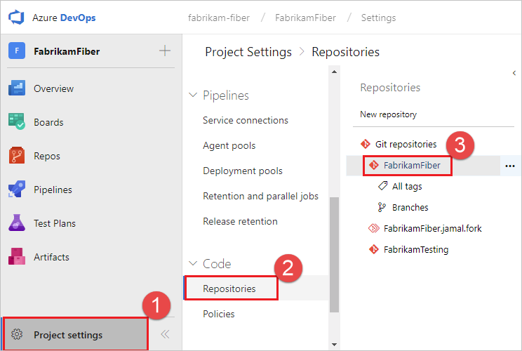
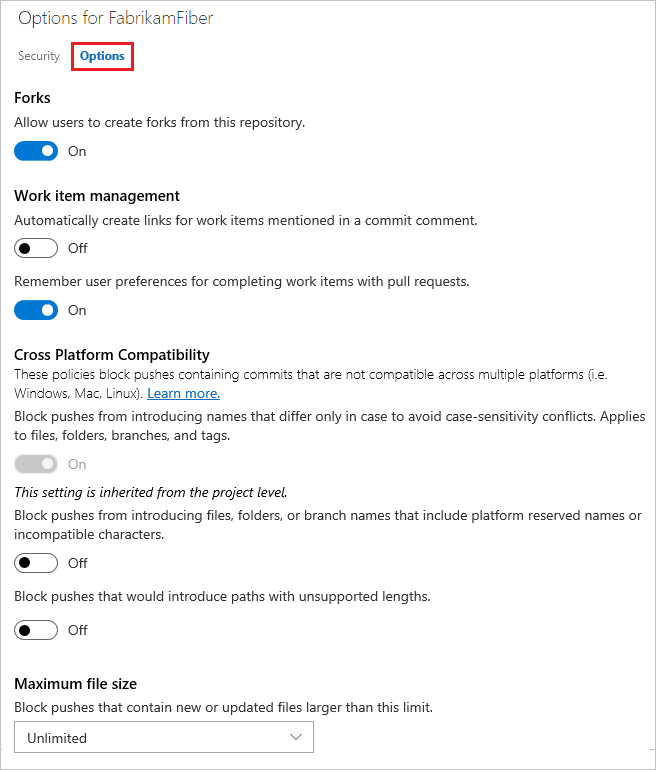
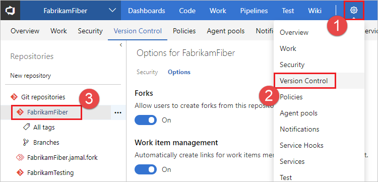
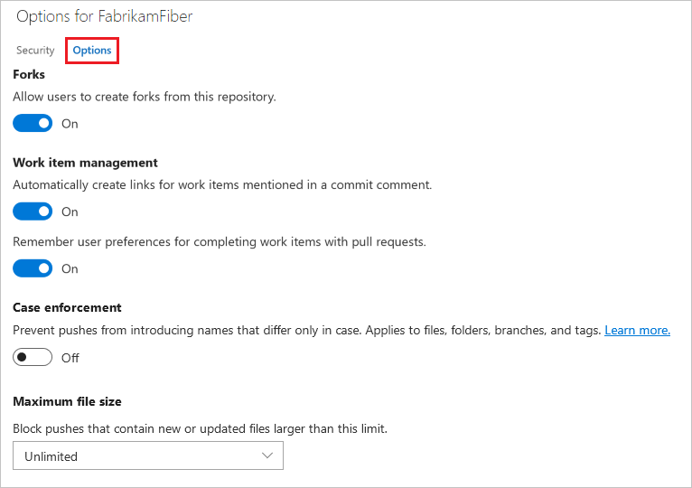

# Repository settings

::: moniker range="azure-devops"

#### Azure Repos

::: moniker-end

::: moniker range="tfs-2018"

#### Azure Repos | TFS 2018 Update 2

::: moniker-end

Git repositories can be customized to a great extent on Azure DevOps Services and Team Foundation Server.
Global options for entire repositories are configured by repository settings.
There are also user-specific and branch-specific controls, covered by [permissions](../../organizations/security/set-git-tfvc-repository-permissions.md#git-repository) and [branch policies](branch-policies.md) respectively.

This topic covers server-side repository settings.
You may also want to learn about client-side [Git preferences](git-config.md).

## View and edit repository settings

::: moniker range=">= azure-devops-2019"

1. From your web browser, open the project for your organization in Azure DevOps and choose **Project settings**, **Repositories**, and select your repository.

  

1. Select **options** to view and configure your repository settings.

  

::: moniker-end

::: moniker range="<= tfs-2017"

1. From your web browser, open the project for your organization in Azure DevOps and choose the gear icon, **Version Control**, and select your repository.

  

1. Select **options** to view and configure your repository settings.

  

::: moniker-end

::: moniker range="tfs-2018"

1. From your web browser, open the project for your organization in Azure DevOps and choose the gear icon, **Version Control**, and select your repository.

  

1. Select **options** to view and configure your repository settings.

  

::: moniker-end

## Forking

Controls whether users are able to create new server-side [forks](forks.md).
Disabling this setting will not alter existing forks.

## Work item management

There are two settings in this category.

### Automatically create links for work items mentioned in a commit comment

When turned on, commit messages containing "#" followed by a valid work item ID will automatically link the commit to the mentioned work item.
You should turn this off when pushing a repository previously contained by a different account or service.
Those repositories may have #mentions that don't match the work item IDs in the current account.
If you [import a repository](import-git-repository.md), we automatically turn this option off.

### Remember user preferences for completing work items with pull requests

By default, the option to complete linked work items during pull request completion will remember each user's last choice.
Some teams may have different approaches to closing work items, such as at a standup meeting, and may want to discourage users from completing work items with their pull requests.
By disabling this setting, users must opt-in to completing work items for each pull request.  

## Cross-platform compatibility settings

>[!NOTE]
>Our recommendation is to configure these settings **either** at the project level or each individual repo, but not both. If set at both levels, we will compute whichever setting is the most restrictive and honor that. Configuring these settings at only one level removes this complexity prevents slow downs in Git performance.

### Case enforcement

Git is case-sensitive, meaning that a file called "Foo.txt" is different from a file called "foo.txt".
Windows and macOS default to case-insensitive file systems, meaning that "Foo.txt" and "foo.txt" are the same name.
This can cause problems for users if someone on a case-insensitive system pushes files, folders, branches, or tags that [only differ by letter case](os-compatibility.md).

If most of your users are on Windows or macOS, we recommend turning on this setting.
It will block the introduction of new files, folders, branches, or tags that would cause such a conflict.
The user will have to rewrite their unpushed history to fix the problem, then try the push again.

This setting will not fix a repository which already contains objects that only differ by case.
We recommend fixing such issues before turning the policy on.
You can rename files and folders or re-create [branches](create-branch.md) and [tags](git-tags.md) using new, non-conflicting names.

::: moniker range="azure-devops"

### Restrict File Names

Not all [files names](os-compatibility.md) are allowed on the three major OS file systems (Windows, macOS, and Linux). Developers can push commits to a shared repository that may contain files or folders with names that are invalid on one or more platforms. If these files or folders are fetched and checked out on a platform where they are invalid then the working directory can become corrupted.

This setting will block pushes to your repository that contain files or folders names that are invalid **on any platform**. [See what names are invalid](os-compatibility.md)

### Restrict Path length

Not all [path lengths](os-compatibility.md) are allowed on the three major OS file systems (Windows, macOS, and Linux). Developers can push commits to a shared repository that may contain files or directories with path lengths that are invalid on one or more platforms. If these files or directories are fetched and checked out on a platform where they are invalid then the working directory can become corrupted.

This setting will block pushes to your repository that contain files or directories with path names that are invalid **on any platform**. [See what path lengths are invalid](os-compatibility.md). When enabled, a default value of `248` is selected because that is the highest max length that is 100% supported across all three major platforms. 

The max path value can be modified. For example, if you only have macOS or Linux developers in your organization, then you may optionally choose to set it to highest value that is 100% supported on both platforms (`1016`). You may also optionally choose to set a lower max path value if you wish to enforce certain directory & naming conventions for your organization.

::: moniker-end

## Maximum file size

Large files checked into Git remain in the repository forever, dragging down clone times and increasing disk usage.
We have suggestions for helping you [manage large files](manage-large-files.md).

This setting gives administrators a way to block files over a certain size from entering the repository.
If a push contains a new or updated file larger than the limit configured in this setting, that push will be blocked.
The user will have to rewrite their unpushed history to remove the large file and try the push again.

## Other ways to manage repositories

For branch-specific settings, you should look at [branch policies](branch-policies.md).
These include options like requiring a pull request, a successful build, or a code review.
For user-specific settings, you probably want [permissions](../../organizations/security/set-git-tfvc-repository-permissions.md#git-repository).
Permissions allow you to control who can read, write, contribute to pull requests, and other specific actions.
