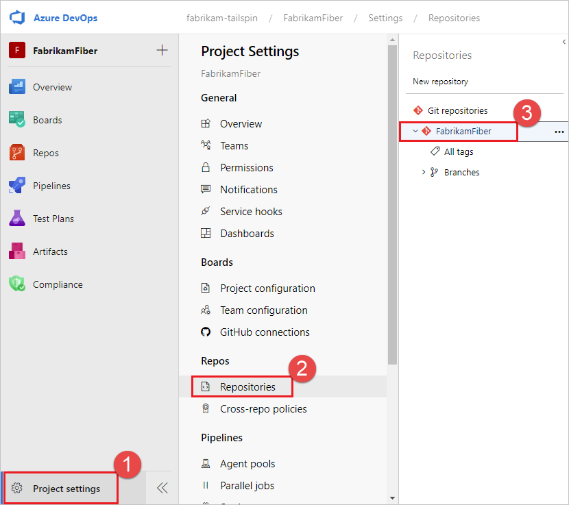
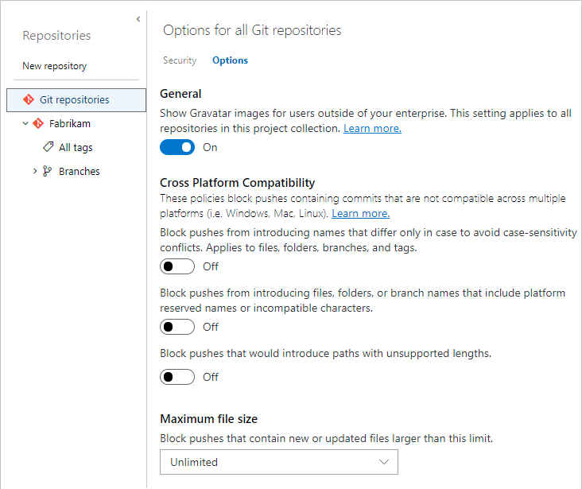
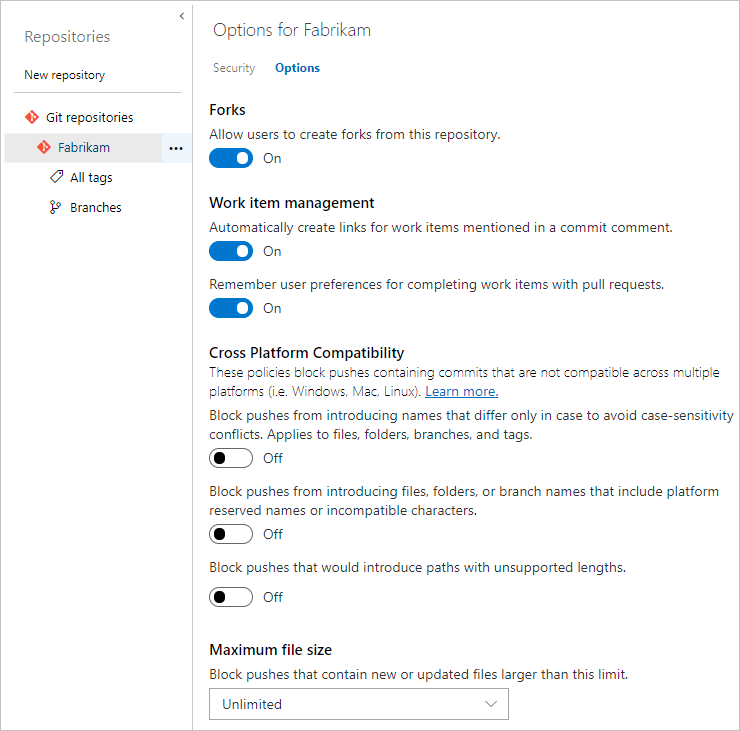
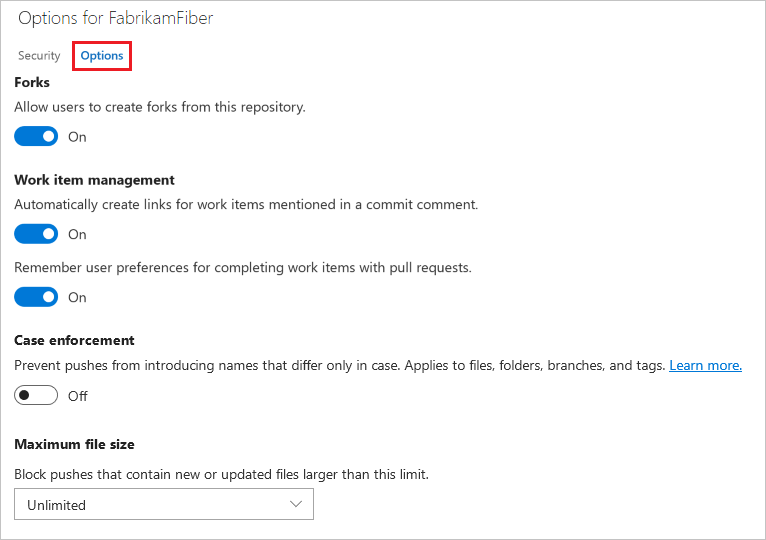

# Set Git repository settings and policies

[!INCLUDE [version-lt-eq-azure-devops](../../includes/version-lt-eq-azure-devops.md)]

There are several ways to customize your Azure Repos Git repositories by using branch and repository settings and policies. This article discusses repository-level settings and policies.

- Repository settings and policies configure global options for all Git repositories for a project or organization, or for individual repositories.

  This article discusses server-side repository settings and policies. To learn about client-side Git preferences, see [Git preferences and settings in Visual Studio](git-config.md).

- Branch policies cover branch-specific controls.

  Branch policies include options like requiring a pull request, a successful build, or a code review before changes can merge into a branch. For more information, see [Branch policies and settings](branch-policies.md).

- Repository and branch security permissions control user assignments.

  These permissions control who can read, write, contribute to pull requests, and take other specific actions. For more information, see [Set permissions for a repository](set-git-repository-permissions.md#git-repository).

[!INCLUDE [note-tfs-2018.2-update](includes/note-tfs-2018.2-update.md)]  

<a id="all-repositories-settings-and-policies"></a>

## Summary of all repository and branch settings and policies

You can configure settings and policies for all repositories in a project, for individual repositories, and for branches of repositories. In the browser, you configure all these settings and policies through **Project settings** > **Repositories**. 

::: moniker range="azure-devops"
> [!NOTE]   
> You can set several branch settings and policies with the Azure CLI using [az repos policy](/cli/azure/repos/policy).
::: moniker-end

The following tables summarize the settings and policies you can enable and configure for Git repositories and branches.

### All Repositories Settings

The following table summarizes the settings you can enable and configure for all new Git repositories in a project or in an organization.

:::row:::
   :::column span="2":::
      **Setting**
   :::column-end:::
   :::column span="1"::: 
      **Default**
   :::column-end:::
   :::column span="3"::: 
      **Description**
   :::column-end:::
:::row-end:::
---
:::row:::
   :::column span="2":::
      [Default branch name for new repositories](#default-branch-name)
   :::column-end:::
   :::column span="1"::: 
       Off  
   :::column-end:::
   :::column span="3"::: 
      Initialize new repositories with the default branch name you specify. You can change the default branch for a particular repository anytime. If you don't enable this feature, repositories initialize with a default branch named `main`.
   :::column-end:::
:::row-end:::
::: moniker range=">= azure-devops-2022"
:::row:::
   :::column span="2":::
      [Allow users to manage permissions for their created branches](#allow-users-to-manage-permissions-for-their-branches)
   :::column-end:::
   :::column span="1"::: 
       On  
   :::column-end:::
   :::column span="3"::: 
      Let users manage permissions for their created branches in all new repositories.
   :::column-end:::
:::row-end:::
::: moniker-end

### Repository settings

The following table summarizes the settings you can enable or configure for each individual Git repository. 


:::row:::
   :::column span="2":::
      **Setting**
   :::column-end:::
   :::column span="1"::: 
      **Default**
   :::column-end:::
   :::column span="3"::: 
      **Description**
   :::column-end:::
:::row-end:::
---
::: moniker range="tfs-2018"
:::row:::
   :::column span="2":::
      [Gravatar images](#gravatar-images)
   :::column-end:::
   :::column span="1"::: 
       On  
   :::column-end:::
   :::column span="3"::: 
      Enables or disables the use of [Gravatar images](https://go.microsoft.com/fwlink/?LinkId=313945) for users outside of your enterprise. This setting applies to all repositories in the project. 
   :::column-end:::
:::row-end:::
::: moniker-end
::: moniker range=">= tfs-2018"
:::row:::
   :::column span="2":::
      [Forks](#forks)
   :::column-end:::
   :::column span="1"::: 
       On  
   :::column-end:::
   :::column span="3"::: 
      Allow users to create forks from the repository.
   :::column-end:::
:::row-end:::
::: moniker-end
::: moniker range=">= tfs-2018"
:::row:::
   :::column span="2":::
      [Commit mention linking](#work-item-linking)
   :::column-end:::
   :::column span="1"::: 
       On  
   :::column-end:::
   :::column span="3"::: 
      Automatically create links for work items mentioned in a commit comment. 
   :::column-end:::
:::row-end:::
::: moniker-end
::: moniker range=">= azure-devops-2020"
:::row:::
   :::column span="2":::
      [Commit mention work item resolution](#work-item-linking)
   :::column-end:::
   :::column span="1"::: 
       On  
   :::column-end:::
   :::column span="3"::: 
      Allow mentions in commit comments to close work items. Requires Azure DevOps Server 2020.1 update or later version. 
   :::column-end:::
:::row-end:::
::: moniker-end
:::row:::
   :::column span="2":::
      [Work item transition preferences](#work-item-linking)
   :::column-end:::
   :::column span="1"::: 
       On  
   :::column-end:::
   :::column span="3"::: 
      Remember user preferences for completing work items with pull requests.
   :::column-end:::
:::row-end:::
::: moniker range=">= azure-devops-2022"
:::row:::
   :::column span="2":::
      [Permissions management](#branch-permission-management)
   :::column-end:::
   :::column span="1"::: 
       On  
   :::column-end:::
   :::column span="3"::: 
      Allow users to manage permissions for the branches they created
   :::column-end:::
:::row-end:::
::: moniker-end
::: moniker range=">= azure-devops-2022"
:::row:::
   :::column span="2":::
      [Strict Vote Mode](#strict-vote-mode-setting)
   :::column-end:::
   :::column span="1"::: 
       On  
   :::column-end:::
   :::column span="3"::: 
      Enable **Strict Vote Mode** for the repository, which requires **Contribute** permission to vote on pull requests.
   :::column-end:::
:::row-end:::
::: moniker-end
::: moniker range=">= azure-devops-2022"
:::row:::
   :::column span="2":::
      [Disable Repository](#disable-repository-setting)
   :::column-end:::
   :::column span="1"::: 
       On  
   :::column-end:::
   :::column span="3"::: 
      Disable access to the repository, including builds and pull requests, but keep the repository discoverable with a warning.
   :::column-end:::
:::row-end:::
::: moniker-end
::: moniker range="azure-devops"
:::row:::
   :::column span="2":::
      [Searchable branches](#searchable-branches-setting)
   :::column-end:::
   :::column span="1"::: 
       On  
   :::column-end:::
   :::column span="3"::: 
      Specify up to five more branches to participate in code search, which by default only applies to the default branch. Requires the [Code Search extension](https://marketplace.visualstudio.com/items?itemName=ms.vss-code-search) installed and enabled.
:::row-end:::
::: moniker-end

::: moniker range=">= azure-devops-2019"

### Repository policies or options

The following table summarizes the policies or options you can set for either all or individual repositories. Policies set for **All Repositories** set the default for individual repositories added at a later date.

::: moniker-end

::: moniker range=">= azure-devops-2019"
:::row:::
   :::column span="2":::
      **Policy** or **Option**
   :::column-end:::
   :::column span="1"::: 
      **Default**
   :::column-end:::
   :::column span="3"::: 
      **Description**
   :::column-end:::
:::row-end:::
---
::: moniker-end
::: moniker range=">= azure-devops-2020"
:::row:::
   :::column span="2":::
      [Commit author email validation](#commit-author-email)
   :::column-end:::
   :::column span="1"::: 
       Off  
   :::column-end:::
   :::column span="3"::: 
      Block pushes with a commit author email that doesn't match the specified patterns. This setting requires Azure DevOps Server 2020.1 or later version. 
   :::column-end:::
:::row-end:::
:::row:::
   :::column span="2":::
      [File path validation](#file-path-validation)
   :::column-end:::
   :::column span="1"::: 
       Off  
   :::column-end:::
   :::column span="3"::: 
      Block pushes from introducing file paths that match the specified patterns. This setting requires Azure DevOps Server 2020.1 or later version. 
   :::column-end:::
:::row-end:::
::: moniker-end
::: moniker range=">= azure-devops-2019"
:::row:::
   :::column span="2":::
      [Case enforcement](#case-enforcement)
   :::column-end:::
   :::column span="1"::: 
       Off  
   :::column-end:::
   :::column span="3"::: 
      Avoid case-sensitivity conflicts by blocking pushes that change name casing on files, folders, branches, and tags. 
   :::column-end:::
:::row-end:::
:::row:::
   :::column span="2":::
      [Reserved names](#reserved-names)
   :::column-end:::
   :::column span="1"::: 
       Off  
   :::column-end:::
   :::column span="3"::: 
      Block pushes that introduce files, folders, or branch names that include platform reserved names or incompatible characters.
   :::column-end:::
:::row-end:::
:::row:::
   :::column span="2":::
      [Maximum path length](#max-path-length)
   :::column-end:::
   :::column span="1"::: 
       Off  
   :::column-end:::
   :::column span="3"::: 
      Block pushes that introduce paths that exceed the specified length.
   :::column-end:::
:::row-end:::
:::row:::
   :::column span="2":::
      [Maximum file size](#maximum-file-size)
   :::column-end:::
   :::column span="1"::: 
       Off  
   :::column-end:::
   :::column span="3"::: 
      Block pushes that contain new or updated files larger than the selected limit.
   :::column-end:::
:::row-end:::
::: moniker-end

### Branch policies

The following table summarizes the policies you can define to customize a branch. For more information on configuring these settings, see [Improve code quality with branch policies](branch-policies.md). When you set any policy on a branch, the following policies are automatically enforced:

- Pull requests are required to update the branch.
- The branch can't be deleted.

> [!NOTE]
> Branch policies are applied to Pull Requests based on the target branch of the Pull Request. Branch policies should not be set on temporary branches that will be deleted after a pull request. Adding branch policies to temporary branches will cause automatic branch deletion to fail.

:::row:::
   :::column span="2":::
      **Policy**
   :::column-end:::
   :::column span="1"::: 
      **Default**
   :::column-end:::
   :::column span="3"::: 
      **Description**
   :::column-end:::
:::row-end:::
---
:::row:::
   :::column span="2":::
      [Require a minimum number of reviewers](branch-policies.md#require_reviewers)
   :::column-end:::
   :::column span="1"::: 
       Off  
   :::column-end:::
   :::column span="3"::: 
      Require approval from a specified number of reviewers on pull requests.
   :::column-end:::
:::row-end:::
:::row:::
   :::column span="2":::
      [Check for linked work items](branch-policies.md#check-linked-wi)
   :::column-end:::
   :::column span="1"::: 
       Off  
   :::column-end:::
   :::column span="3"::: 
      Encourage traceability by checking for linked work items on pull requests.
   :::column-end:::
:::row-end:::
:::row:::
   :::column span="2":::
      [Check for comment resolution](branch-policies.md#check-comment-resolution)
   :::column-end:::
   :::column span="1"::: 
       Off  
   :::column-end:::
   :::column span="3"::: 
      Check to see that all comments have been resolved on pull requests.
   :::column-end:::
:::row-end:::
:::row:::
   :::column span="2":::
      [Limit merge types](branch-policies.md#limit-merge-types) or
      [Enforce a merge strategy](branch-policies.md#limit-merge-types)
   :::column-end:::
   :::column span="1"::: 
       Off  
   :::column-end:::
   :::column span="3"::: 
      Control branch history by limiting the available types of merge when pull requests are completed.
   :::column-end:::
:::row-end:::
::: moniker range=">= azure-devops-2019"
:::row:::
   :::column span="2":::
      [Build Validation](branch-policies.md#build-validation)
   :::column-end:::
   :::column span="1"::: 
       Off  
   :::column-end:::
   :::column span="3"::: 
      Add, enable, or disable one or more policies to validate code by pre-merging and building pull request changes.
   :::column-end:::
:::row-end:::
:::row:::
   :::column span="2":::
      [Status Checks](branch-policies.md#require-approval-from-external-services) or  
      [Require approval from additional or external services](branch-policies.md#require-approval-from-external-services)  
   :::column-end:::
   :::column span="1"::: 
       Off  
   :::column-end:::
   :::column span="3"::: 
      Add, enable, or disable one or more policies to require other services to post successful status to complete pull requests.
   :::column-end:::
:::row-end:::
:::row:::
   :::column span="2":::
      [Automatically included reviewers](branch-policies.md#include-code-reviewers)
   :::column-end:::
   :::column span="1"::: 
       Off  
   :::column-end:::
   :::column span="3"::: 
      Add, enable, or disable one or more policies to designate code reviewers to automatically include when pull requests change certain areas of code.
   :::column-end:::
:::row-end:::
::: moniker-end

## Prerequisites 


::: moniker range=">= azure-devops-2020"
- To configure policies, you must be a member of the Project Administrators security group, or have repository-level **Edit policies** permissions. To learn more, see [Set Git repository permissions](set-git-repository-permissions.md).
- If you want to use **az repos** commands, be sure to follow the steps in [Get started with Azure DevOps CLI](../../cli/index.md).
::: moniker-end
 
::: moniker range="< azure-devops-2020"
- To configure policies, you must be a member of the Project Administrators security group, or have repository-level **Edit policies** permissions. To learn more, see [Set Git repository permissions](set-git-repository-permissions.md).
::: moniker-end


<a name="view-and-edit-repository-settings"></a>

## View and edit settings and policies

You can configure *settings* for all repositories across an organization or project, or for individual repositories. You can configure *policies* for all repositories, for individual repositories, or for specified branches across repositories. For information about setting branch policies, see [Branch policies](branch-policies.md).

> [!NOTE]
> It's best to configure repository settings either at the project level or for individual repositories, but not both. If you configure settings at more than one level, the system honors the most restrictive setting. Configuring settings at only one level reduces confusion and Git performance issues.

#### [Browser](#tab/browser)

::: moniker range="> azure-devops-2019"

To configure repository settings and policies through the web portal, open **Project settings**> **Repositories** from your web browser.

1. To view or modify settings or policies for all Git repositories, open the **All Repositories** page and choose **Settings** or **Policies**.

   :::image type="content" source="media/repository-settings/change-default-branch-name.png" alt-text="Screenshot that shows repository Settings for All Repositories":::

   To configure settings and policies for a specific repository, select the **Repositories** tab, choose the repository, and then choose the **Settings** or **Policies** tab.

   :::image type="content" source="media/repository-settings/repository-settings-2020.png" alt-text="Screenshot that shows repository Settings for the Fabrikam repository.":::

1. The following screenshot shows the **Settings** tab selected. You can define these settings for all Git repositories or for an individual repository.

   :::image type="content" source="media/repository-settings/project-repo-settings-browser-2020.png" alt-text="Screenshot that shows the repo project Settings tab selected.":::

1. The following screenshot shows the **Policies** tab selected. You can define these policies for all Git repositories or for an individual repository.

   :::image type="content" source="media/repository-settings/project-repo-policies-browser-2020.png" alt-text="Screenshot that shows the repo 'Policies' tab selected.":::

::: moniker-end

::: moniker range="azure-devops-2019"

1. From your web browser, open the project and choose **Project settings**, **Repositories**, and select your repository.

   

2. To view and configure repository settings, select **Options** or **Policies**.

   The following screenshot shows **Options** for all repositories:

   

   The following screenshot shows **Options** for the Fabrikam repositories:

   

::: moniker-end

::: moniker range="tfs-2018"

1. From your web browser, open the project and choose the gear icon, **Version Control**, and select your repository.

   

2. Select **Options** to view and configure your repository settings.

   

::: moniker-end


#### [Azure DevOps CLI](#tab/azure-devops-cli/)

::: moniker range="azure-devops" 

You can use Azure DevOps CLI to list respositories or show or update a repository. Also, you can list, show or update policy details for a branch or repository.

[List repositories](#repos-list) &#124; [List repository details](#repos-show) &#124; [Update or rename a repository](#repos-update)  
[List repository policies](#repos-policy-list) &#124; [List policy details](#show-policy) &#124; [Update respository policy](#update-policy)


You can use Azure CLI to list, show, and update policies for a branch or repository, or for all repositories in a project.

<a name="repos-list" />

### List repositories

Use [az repos list](/cli/azure/repos#az-repos-list) to list all repositories for a project. 

```azurecli
az repos list [--detect {false, true}]
              [--org]
              [--project]
              [--subscription]
```

**Parameters**

|Parameter|Description|
|---------|-----------|
|`detect`|Automatically detect organization. Accepted values: `false`, `true`.|
|`org`, `organization`|Azure DevOps organization URL. You can configure the default organization by using `az devops configure -d organization=<ORG_URL>`. **Required** if not configured as default or picked up via git config. Example: `https://dev.azure.com/MyOrganizationName/`.|
|`project`, `p`|Name or ID of the project. You can configure the default project using `az devops configure -d project=<NAME_OR_ID>`. **Required** if not configured as default or picked up via git config.|
|`subscription`|Name or ID of subscription. You can configure the default subscription using `az account set -s <NAME_OR_ID>`.|


**Example**

The following command returns all Git repositories for the default configuration `az devops configure --defaults organization=https://dev.azure.com/fabrikamprime project="Fabrikam Fiber"`.


```azurecli
az repos list --output table
ID                                    Name            Default Branch    Project
------------------------------------  --------------  ----------------  --------------
50a9df8e-5024-49d7-bf63-d3989139627e  Fabrikam Fiber  main              Fabrikam Fiber
ac228555-ea89-4881-9ace-dfa065baf7d3  Test 1-2-3      main              Fabrikam Fiber
0d58f562-4a10-495d-94d7-7ac61a22d7cc  Testing 1 2 3   main              Fabrikam Fiber
30954ce5-417b-4930-b8d2-8b6cac934a34  contosoREPO     main              Fabrikam Fiber
```


<a name="repos-show" />

### List repository details

Use [az repos show](/cli/azure/repos#az-repos-show) to list information about a repository or open it in a web browser. 

```azurecli
az repos show --repository
              [--detect {false, true}]
              [--open]
              [--org]
              [--project]
              [--subscription]
```

**Parameters**

|Parameter|Description|
|---------|-----------|
|`repository`|Name or ID of a repository.  |
|`detect`|Automatically detect organization. Accepted values: `false`, `true`.|
|`open`|Open the repository page in your web browser.|
|`org`, `organization`|Azure DevOps organization URL. You can configure the default organization by using `az devops configure -d organization=<ORG_URL>`. **Required** if not configured as default or picked up via git config. Example: `https://dev.azure.com/MyOrganizationName/`.|
|`project`, `p`|Name or ID of the project. You can configure the default project using `az devops configure -d project=<NAME_OR_ID>`. **Required** if not configured as default or picked up via git config.|
|`subscription`|Name or ID of subscription. You can configure the default subscription using `az account set -s <NAME_OR_ID>`.|


**Example**

The following command lists the details of the *contosoREPO* for the default configuration `az devops configure --defaults organization=https://dev.azure.com/fabrikamprime project="Fabrikam Fiber"`.

```azurecli
az repos show --repository contosoREPO --output table
ID                                    Name         Default Branch    Project
------------------------------------  -----------  ----------------  --------------
30954ce5-417b-4930-b8d2-8b6cac934a34  contosoREPO  main              Fabrikam Fiber
```
For more details, enter the following command: 

```azurecli
az repos show --repository contosoREPO
{
  "defaultBranch": "refs/heads/main",
  "id": "30954ce5-417b-4930-b8d2-8b6cac934a34",
  "isDisabled": false,
  "isFork": null,
  "name": "contosoREPO",
  "parentRepository": null,
  "project": {
    "abbreviation": null,
    "defaultTeamImageUrl": null,
    "description": "Guidance and source control to foster a vibrant ecosystem for Fabrikam Fiber applications and extensions.",
    "id": "56af920d-393b-4236-9a07-24439ccaa85c",
    "lastUpdateTime": "2021-05-24T21:52:14.95Z",
    "name": "Fabrikam Fiber",
    "revision": 438023732,
    "state": "wellFormed",
    "url": "https://dev.azure.com/fabrikamprime/_apis/projects/56af920d-393b-4236-9a07-24439ccaa85c",
    "visibility": "private"
  },
  "remoteUrl": "https://fabrikamprime@dev.azure.com/fabrikamprime/Fabrikam%20Fiber/_git/contosoREPO",
  "size": 1627,
  "sshUrl": "git@ssh.dev.azure.com:v3/fabrikamprime/Fabrikam%20Fiber/contosoREPO",
  "url": "https://dev.azure.com/fabrikamprime/56af920d-393b-4236-9a07-24439ccaa85c/_apis/git/repositories/30954ce5-417b-4930-b8d2-8b6cac934a34",
  "validRemoteUrls": null,
  "webUrl": "https://dev.azure.com/fabrikamprime/Fabrikam%20Fiber/_git/contosoREPO"
}
```

<a name="repos-update" />

### Update a repository  

[!INCLUDE [az-repos-update](./includes/azure-repos-update.md)]

<a name="repos-policy-list"></a>

### List policies

Use [az repos policy list](/cli/azure/repos/policy#az-repos-policy-list) to list all policies for all project repositories and branches. Use the `repository-id` and `branch` parameters to list policies for specific repositories and branches.

```azurecli
az repos policy list [--branch]
                     [--detect {false, true}]
                     [--org]
                     [--project]
                     [--query-examples]
                     [--repository-id]
                     [--subscription]
```

**Parameters**

|Parameter|Description|
|---------|-----------|
|`branch`|Branch name to filter results by exact match. The `--repository-id` parameter is required to use the branch filter. For example: `--branch main`.|
|`detect`|Automatically detect organization. Accepted values: `false`, `true`.|
|`org`, `organization`|Azure DevOps organization URL. You can configure the default organization by using `az devops configure -d organization=<ORG_URL>`. **Required** if not configured as default or picked up via git config. Example: `https://dev.azure.com/MyOrganizationName/`.|
|`project`, `p`|Name or ID of the project. You can configure the default project using `az devops configure -d project=<NAME_OR_ID>`. **Required** if not configured as default or picked up via git config.|
|`query-examples`|Recommended JMESPath string. You can copy one of the queries and paste it after the `--query` parameter in double quotation marks to see the results. You can add one or more positional keywords so suggestions are based on these keywords.|
|`repository-id`|ID of the repository to filter results by exact match. For example, `--repository-id e556f204-53c9-4153-9cd9-ef41a11e3345`.|
|`subscription`|Name or ID of subscription. You can configure the default subscription using `az account set -s <NAME_OR_ID>`.|

**Example**

The following command returns all the policies in effect in the default project. This example uses the default configuration `az devops configure --defaults organization=https://dev.azure.com/fabrikamprime project="Fabrikam Fiber"`.

```azurecli
az repos policy list --output table

ID    Name                         Is Blocking    Is Enabled    Repository Id                         Branch
----  ---------------------------  -------------  ------------  ------------------------------------  ---------------------
1     Git repository settings      True           True          d28cd374-e7f0-4b1f-ad60-f349f155d47c  All Branches
3     Work item linking            True           True          d28cd374-e7f0-4b1f-ad60-f349f155d47c  refs/heads/main
5     Minimum number of reviewers  True           True          d28cd374-e7f0-4b1f-ad60-f349f155d47c  refs/heads/main
6     Comment requirements         False          True          d28cd374-e7f0-4b1f-ad60-f349f155d47c  refs/heads/main
7     Minimum number of reviewers  True           True          d28cd374-e7f0-4b1f-ad60-f349f155d47c  refs/heads/big-branch
8     Work item linking            False          True          d28cd374-e7f0-4b1f-ad60-f349f155d47c  refs/heads/big-branch
9     Required reviewers           True           True          d28cd374-e7f0-4b1f-ad60-f349f155d47c  refs/heads/new
10    Required reviewers           True           True          d28cd374-e7f0-4b1f-ad60-f349f155d47c  refs/heads/new
11    Required reviewers           True           True          d28cd374-e7f0-4b1f-ad60-f349f155d47c  refs/heads/new
12    Required reviewers           True           True          d28cd374-e7f0-4b1f-ad60-f349f155d47c  refs/heads/main
13    Required reviewers           False          True          d28cd374-e7f0-4b1f-ad60-f349f155d47c  refs/heads/main
```

<a name="show-policy"></a>

### Show policy details

To show the details of any policy, use [az repos policy show](/cli/azure/repos/policy#az-repos-policy-show). You can get the policy ID by running `az repos policy list`.

```azurecli
az repos policy show --id
                     [--detect {false, true}]
                     [--org]
                     [--project]
                     [--query-examples]
                     [--subscription]
```
**Parameters**

|Parameter|Description|
|---------|-----------|
|`id`, `policy-id`|ID of the policy. **Required**.|
|`detect`|Automatically detect organization. Accepted values: `false`, `true`.|
|`org`, `organization`|Azure DevOps organization URL. You can configure the default organization by using `az devops configure -d organization=<ORG_URL>`. **Required** if not configured as default or picked up via git config. Example: `https://dev.azure.com/MyOrganizationName/`.|
|`project`, `p`|Name or ID of the project. You can configure the default project using `az devops configure -d project=<NAME_OR_ID>`. **Required** if not configured as default or picked up via git config.|
|`query-examples`|Recommended JMESPath string. You can copy one of the queries and paste it after the `--query` parameter in double quotation marks to see the results. You can add one or more positional keywords so suggestions are based on these keywords.|
|`subscription`|Name or ID of subscription. You can configure the default subscription using `az account set -s <NAME_OR_ID>`.|

**Example**

The following example shows the name and details for policy ID `1` in the default project. This example uses the default configuration `az devops configure --defaults organization=https://dev.azure.com/fabrikamprime project="Fabrikam Fiber".`

```azurecli
az repos policy show --id 1 --output table

ID    Name                     Is Blocking    Is Enabled    Repository Id                         Branch
----  -----------------------  -------------  ------------  ------------------------------------  ------------
1     Git repository settings  True           True          d28cd374-e7f0-4b1f-ad60-f349f155d47c  All Branches

```

<a id="update-policy"/> 


### Update policies

You can use Azure CLI [az repos policy update](/cli/azure/repos/policy#az-repos-policy-update) with a policy configuration file to update policies. A policy configuration file can apply a policy across more than one scope at a time. For more information, see [Configure Git repository policies by using a configuration file](../../cli/policy-configuration-file.md). For examples of policy configuration files, see [Configurations - Create](/rest/api/azure/devops/policy/configurations/create#examples).

```azurecli
az repos policy update --config
                       --id
                       [--detect {false, true}]
                       [--org]
                       [--project]
                       [--subscription]
```

**Parameters**

|Parameter|Description|
|---------|-----------|
|`--config`, `--policy-configuration`|Local file path for the policy configuration file. Use backslash \\ when entering the directory path. **Required**.|
|`id`, `policy-id`|ID of the policy to update. **Required.**|
|`detect`|Automatically detect organization. Accepted values: `false`, `true`.|
|`org`, `organization`|Azure DevOps organization URL. You can configure the default organization by using `az devops configure -d organization=<ORG_URL>`. **Required** if not configured as default or picked up via git config. Example: `https://dev.azure.com/MyOrganizationName/`.|
|`project`, `p`|Name or ID of the project. You can configure the default project using `az devops configure -d project=<NAME_OR_ID>`. **Required** if not configured as default or picked up via git config.|
|`subscription`|Name or ID of subscription. You can configure the default subscription using `az account set -s <NAME_OR_ID>`.|

**Example**

The following *policy.json* file sets the minimum reviewers policy to require three approvals in all `main` branches across all repositories in the default project.

```json
{
  "isEnabled": true,
  "isBlocking": false,
  "type": {
    "id": "fa4e907d-c16b-4a4c-9dfa-4906e5d171dd"
  },
  "settings": {
    "minimumApproverCount": 3,
    "creatorVoteCounts": false,
    "scope": [
      {
        "repositoryId": null,
        "refName": "refs/heads/main",
        "matchKind": "exact"
      }
    ]
  }
}
``` 

The `az repos policy update` command line updates the minimum reviewers policy per the *policy.json* file. You can find the policy ID by using [az repos policy list](/cli/azure/repos/policy#az-repos-policy-list). The example uses the default configuration `az devops configure --defaults organization=https://dev.azure.com/fabrikamprime project="Fabrikam Fiber".`

```azurecli
az repos policy update --config C:\policies\policy.json --id 7 --output table

ID    Name                         Is Blocking    Is Enabled    Branch
----  ---------------------------  -------------  ------------  -----------------
7     Minimum number of reviewers  False          True          refs/heads/main
```


::: moniker-end


[!INCLUDE [temp](../../includes/note-cli-not-supported.md)]


***


::: moniker range=">= azure-devops-2020"

<a id="default-branch-name"></a>

## Default branch name

You can set a default repository branch name at the organization or project level. The organization-level setting takes effect for all new repositories across all projects in the organization. The project-level setting affects all new repositories in a project, and supersedes any name set at the organization level.

You can:
- Choose any legal branch name to use when a repository is initialized.
- Change the default name anytime to affect all future repositories.
- Change the default branch name for any particular repository anytime.

If you don't enable the default branch name feature, repositories initialize with the Azure Repos default branch name `main`.

To set a default branch name at the organization level:

1. On your Azure DevOps organization page, select **Organization settings** at lower left, and then select **Repositories** in the left navigation.
1. On the **All Repositories** page, set **Default branch name for new repositories** to **On**, and then enter a default branch name.

:::image type="content" source="media/repository-settings/organization-settings-change-default-branch-name.png" alt-text="Screenshot that shows the organization-level setting for Default branch name for new repositories.":::

To set a default branch name at the project level:

1. On your Azure DevOps project page, select **Project settings** at lower left, and then select **Repositories** in the left navigation.
1. On the **Settings** tab of the **All Repositories** page, set **Default branch name for new repositories** to **On**, and then enter a default branch name.

:::image type="content" source="media/repository-settings/project-settings-change-default-branch-name.png" alt-text="Screenshot that shows the project-level setting for Default branch name for new repositories.":::
::: moniker-end

::: moniker range="azure-devops-2020"
> [!NOTE]  
> The **Default branch name for new repositories** setting requires Azure DevOps Server 2020.1 or later version. 
::: moniker-end

::: moniker range=">= azure-devops-2022"
<a name="allow-users-to-manage-permissions-for-their-branches"></a>

## Branch permission management

You can control who can manage permissions for repository branches by setting a permission management setting for all Git repositories or for individual repositories. If you enable the **Allow users to manage permissions for their created branches** setting at the **All Repositories** level, all new project repositories are configured to let users manage permissions for their created branches.

To manage this setting:

1. On your Azure DevOps project page, select **Project settings** at lower left, and then select **Repositories** in the left navigation.
1. On the **Settings** tab of the **All Repositories** page, set **Allow users to manage permissions for their created branches** to **On** or **Off**.

:::image type="content" source="media/repository-settings/users-manage-permissions.png" alt-text="Screenshot that shows the project-level Allow users to manage permissions for their created branches setting.":::

To enable or disable this setting for individual repositories:

1. Select **Project Settings** > **Repositories**, and then select a repository.
1. On the **Settings** tab of the **\<Repository name>** page, set **Permissions management** to **On** or **Off**.

:::image type="content" source="media/repository-settings/permissions-management.png" alt-text="Screenshot that shows the Permissions management repository setting.":::

::: moniker-end

## Gravatar images

This setting enables or disables the use of [Gravatar images](https://go.microsoft.com/fwlink/?LinkId=313945) for users outside your enterprise.

::: moniker range="azure-devops"
**Gravatar images** is an organization-level setting.

1. On your Azure DevOps organization page, select **Organization settings** at lower left, and then select **Repositories** in the left navigation.
1. On the **All Repositories** page, set **Gravatar images** to **On** or **Off**.

:::image type="content" source="media/repository-settings/organization-settings-gravatar.png" alt-text="Screenshot that shows the organization-level setting for Gravatar images.":::
::: moniker-end

::: moniker range=">= azure-devops-2020 < azure-devops"
**Gravatar images** is a project-level setting for **All Repositories**.

1. On your Azure DevOps project page, select **Project settings** at lower left, and then select **Repositories** in the left navigation.
1. On the **Settings** tab of the **All Repositories** page, set **Gravatar images** to **On** or **Off**.
::: moniker-end

::: moniker range="azure-devops-2019"
**Gravatar images** is a project-level setting for **All Repositories**.

1. On your Azure DevOps project page, select **Project settings** at lower left, and then select **Repositories** in the left navigation.
1. On the **Settings** tab of the **All Repositories** page, set **Gravatar images** to **On** or **Off**.
::: moniker-end

::: moniker range="tfs-2018"
**Gravatar images** is an individual repository setting.
::: moniker-end

<!--- REPOSITORY SETTINGS  --> 
 
::: moniker range=">=azure-devops-2019"
<a id="forks"></a>
<a id="forks-setting"></a>

## Enable forks

This repository setting controls whether users can create new server-side [forks](forks.md). Disabling this setting doesn't remove existing forks.

1. From **Project Settings**, select **Repositories** in the left navigation.
1. On the **Repositories** tab of the **All Repositories** page, select a repository.
1. On the **Settings** tab of the **\<Repository name>** page, set **Forks** to **On** or **Off**. 

:::image type="content" source="media/repository-settings/forks.png" alt-text="Screenshot that shows the Forks repository setting.":::
::: moniker-end

<a id="work-item-linking"></a>

## Work item linking settings

These repository settings manage work item linking.

1. Select **Project Settings** > **Repositories**, and then select a repository.
1. On the **Settings** tab of the **\<Repository name>** page, turn the settings **On** or **Off**.

:::image type="content" source="media/repository-settings/work-item-linking-repo-settings.png" alt-text="Screenshot that shows the work item linking repository settings.":::

### Commit mention linking

When enabled, commit messages containing `#` followed by a valid work item ID automatically link the commit to that work item. Disable this setting if the repository previously used a different account or service. Those repositories might have commit messages with `#` mentions that don't match the work item IDs in the current account.

::: moniker range=">=azure-devops-2020"

### Commit mention work item resolution

Enable this setting to automatically complete work items when linked pull requests complete. This setting also allows specifying other work item transition states in pull request commit messages. For more information, see [Auto-complete work items with pull requests](../../boards/work-items/auto-complete-work-items-pull-requests.md).

::: moniker-end
::: moniker range=">= tfs-2018 <= azure-devops-2019"

### Commit mention work item resolution

Enable this setting to automatically complete those work items when you successfully complete the PR. To learn more, see [Auto-complete work items with pull requests](../../boards/work-items/auto-complete-work-items-pull-requests.md).
::: moniker-end

### Work item transition preferences

By default, the option to complete linked work items during pull request completion remembers each user's last choice. Teams that want to discourage users from completing work items with their pull requests can disable this setting. Users must then opt in to completing work items each time they complete a pull request.

::: moniker range=">= azure-devops-2022"

## Strict Vote Mode setting

In certain situations, users who aren't contributors to a repository can submit a pull request and cause it to be merged, depending on policies. To prevent this possibility, enable **Strict Vote Mode** to change the required permission to vote on repository pull requests to **Contribute**. Enabling this setting is recommended if you rely on user forks in Azure Repos.

1. Select **Project Settings** > **Repositories**, and then select a repository.
1. On the **Settings** tab of the **\<Repository name>** page, set **Strict Vote Mode** to **On** or **Off**.

:::image type="content" source="media/repository-settings/strict-vote-mode.png" alt-text="Screenshot that shows the Strict Vote Mode repository setting.":::
::: moniker-end

::: moniker range=">= azure-devops-2022"

## Disable repository setting

Enabling this setting disables access to the repository, including builds and pull requests, but keeps the repository discoverable with a warning.

1. Select **Project Settings** > **Repositories**, and then select a repository.
1. On the **Settings** tab of the **\<Repository name>** page, under **Disable Repository**, set **Disable Repository** to **On** or **Off**.

:::image type="content" source="media/repository-settings/disable-repository.png" alt-text="Screenshot that shows the Disable Repository setting.":::
::: moniker-end

::: moniker range="azure-devops-2020"

## Searchable branches setting

By default, code search in files applies only to the default branch. You can add up to five more branches to search.

>[!IMPORTANT]
> To search code in repositories, you must install the Marketplace [Code Search](https://marketplace.visualstudio.com/items?itemName=ms.vss-code-search) extension. If you don't see **Searchable Branches** in the repository **Settings** tab, make sure you have the extension installed.

To add branches for code search:

1. Select **Project Settings** > **Repositories**, and then select a repository.
1. On the **Settings** tab of the **\<Repository name>** page, select the **+** in **Searchable Branches**.
1. Select a branch to include in search, and then select **Add branch**.

:::image type="content" source="media/repository-settings/searchable-branches.png" alt-text="Screenshot that shows the Searchable Branches repository setting.":::

::: moniker-end
<!--- REPOSITORY POLICIES --> 

## Cross-repo branch policies

You can set policies on a specific branch name, or on the default branch, across all repositories in a project. For example, you could require two minimum reviewers for all pull requests in every `main` branch for all project repositories.

To set policies to protect specific or default branch names across a project:

1. From **Project Settings**, select **Repositories** in the left navigation.
1. On the **All Repositories** page, select the **Policies** tab.
1. Select the plus sign **+** in **Branch Policies** at the bottom of the page.
1. On the **Add branch protection** screen, select **Protect the default branch of each repository**, or **Protect current and future branches matching a specified pattern**.

   If you select the second option, enter the branch name to protect. An informational message lets you know how many current branches are affected. The branch doesn't have to exist yet to protect the branch name.

1. Select **Create**.

   :::image type="content" source="media/repository-settings/cross-repo-policies.png" alt-text="Screenshot that shows enabling cross-repo branch policies.":::

1. On the **Cross-Repository policies for \<branch name>** page, set the policies you want for the protected branches. For more information about branch policies, see [Branch policies](branch-policies.md).

   :::image type="content" source="media/repository-settings/cross-repo-policy-setting.png" alt-text="Screenshot that shows cross-repo branch policy settings.":::

<a id="commit-author-email"></a>
<a id="commit-author-email-validation"></a>

## Commit author email validation policy

This policy blocks commits to a repository by commit authors whose email addresses don't match a pattern.

1. Select **Project Settings** > **Repositories**, and select a repository if you want to configure only that repository.
1. On the **Policies** tab of the **All Repositories** or **\<Repository name>** page, under **Repository Policies**, set **Commit author email validation** to **On** or **Off**.
1. If you turn on the policy, specify the email address or addresses to match.

   You can specify exact email addresses or use wildcards. Use `;` as a separator for multiple email patterns. Email patterns prefixed with `!` are excluded. Order is important.

:::image type="content" source="media/repository-settings/add-policy-to-block-commits-email.png" alt-text="Screenshot that shows the Commit author email validation policy setting.":::

<a id="file-path-validation"></a>

## File path validation policy

You can set a policy that prevents commits to a repository from file paths that match a pattern.

1. Select **Project Settings** > **Repositories**, and select a repository if you want to configure only that repository.
1. On the **Policies** tab of the **All Repositories** or **\<Repository name>** page, under **Repository Policies**, set **File path validation** to **On** or **Off**.
1. If you turn on the policy, specify the path or paths to block.

   You can specify exact paths and wildcards. Exact paths begin with `/`. You can also specify multiple paths by using `;` as a separator. Paths prefixed with `!` are excluded. Order is important.

:::image type="content" source="media/repository-settings/add-policy-to-block-files-patterns.png" alt-text="Screenshot that shows the File path validation policy setting.":::


<a id="case-enforcement"></a>

## Case enforcement policy

::: moniker range=">= tfs-2018"
Git is case-sensitive, meaning that a file called *Foo.txt* is different from a file called *foo.txt*. However, Windows and macOS default to case-insensitive file systems, meaning that *Foo.txt* and *foo.txt* are the same name. This discrepancy can cause problems if someone on a case-insensitive system pushes files, folders, branches, or tags that differ only by letter case. For more information, see [Git Cross-Platform Compatibility](os-compatibility.md).

If most of your contributors are on Windows or macOS, it's best to enable the **Case enforcement** policy. Case enforcement switches the server from its default case-sensitive mode, where *File.txt* and *file.txt* are distinct, to a Windows and macOS-friendly mode where *File.txt* and *file.txt* are considered the same file. This setting affects files, folders, branches, and tags.

This setting prevents contributors from introducing case-only differences. The setting avoids case-sensitivity conflicts by blocking pushes that change name casing on files, folders, branches, and tags. The user has to rewrite their unpushed history to fix the problem, then try the push again.

This setting won't fix a repository that already contains objects that differ only by case. It's best to fix such issues before turning on the policy. Rename files and folders or re-create [branches](create-branch.md) and [tags](git-tags.md) to use non-conflicting names.

::: moniker-end

#### [Browser](#tab/browser)

::: moniker range=">= tfs-2018"

To set case enforcement policy:

1. Select **Project Settings** > **Repositories**, and select a repository if you want to configure only that repository.
1. On the **Policies** tab of the **All Repositories** or **\<Repository name>** page, under **Repository Policies**, set **Case enforcement** to **On** or **Off**.

:::image type="content" source="media/repository-settings/case-enforcement.png" alt-text="Screenshot that shows the Case enforcement policy setting.":::

::: moniker-end
::: moniker range="tfs-2018"
> [!NOTE]   
> The **Case enforcement** policy requires TFS 2018.2 or later version.  
::: moniker-end
 
#### [Azure DevOps CLI](#tab/azure-devops-cli/)

::: moniker range="azure-devops" 
 
You can use Azure CLI [az repos policy case-enforcement create](/cli/azure/repos/policy/case-enforcement#az-repos-policy-case-enforcement-create) and [az repos policy case-enforcement update](/cli/azure/repos/policy/case-enforcement?view=azure-cli-latest&preserve-view=true#az-repos-policy-case-enforcement-update) to configure or update case enforcement policy.

### Create case enforcement policy

Use [az repos case-enforcement create](/cli/azure/repos/policy/case-enforcement#az-repos-policy-case-enforcement-create) to create a case enforcement policy.

```azurecli
az repos policy case-enforcement create --blocking {false, true}
                                        --enabled {false, true}
                                        --repository-id
                                        [--detect {false, true}]
                                        [--org]
                                        [--project]
```

**Parameters**

|Parameter|Description|
|---------|-----------|
|`blocking`|Block if the policy isn't met. Accepted values: `false`, `true`. **Required**.|
|`enabled`|Enable the policy. Accepted values: `false`, `true`. **Required**.|
|`repository-id`|ID of the repository on which to apply the policy. **Required**.|
|`detect`|Automatically detect organization. Accepted values: `false`, `true`.|
|`org`|Azure DevOps organization URL. You can configure the default organization by using `az devops configure -d organization=<ORG_URL>`. **Required** if not configured as default or picked up via git config. Example: `https://dev.azure.com/MyOrganizationName/`.|
|`project`, `p`|Name or ID of the project. You can configure the default project using `az devops configure -d project=<NAME_OR_ID>`. **Required** if not configured as default or picked up via git config.|

**Example**

The following example implements a required case enforcement policy in the `Fabrikam` repository. You can get the repository ID by using [az repos list](/cli/azure/repos#az-repos-list). This example uses the default configuration `az devops configure --defaults organization=https://dev.azure.com/fabrikamprime project="Fabrikam Fiber"`.

```azurecli
az repos policy case-enforcement create --blocking true --enabled true --repository-id d28cd374-e7f0-4b1f-ad60-f349f155d47c --output table

ID    Name                     Is Blocking    Is Enabled    Repository Id                         Branch
----  -----------------------  -------------  ------------  ------------------------------------  ------------
40    Git repository settings  True           True          d28cd374-e7f0-4b1f-ad60-f349f155d47c  All Branches
```

### Update case enforcement policy

Use [az repos policy case-enforcement update](/cli/azure/repos/policy/case-enforcement#az-repos-policy-case-enforcement-update) to manage [Case enforcement](#case-enforcement) policy.

```azurecli
az repos policy case-enforcement update --id
                                        [--blocking {false, true}]
                                        [--detect {false, true}]
                                        [--enabled {false, true}]
                                        [--org]
                                        [--project]
                                        [--repository-id]
```

**Parameters**

|Parameter|Description|
|---------|-----------|
|`id`, `policy-id`|ID of the policy to update. **Required.**|
|`blocking`|Block if the policy isn't met. Accepted values: `false`, `true`.|
|`detect`|Automatically detect organization. Accepted values: `false`, `true`.|
|`enabled`|Enable the policy. Accepted values: `false`, `true`.|
|`org`|Azure DevOps organization URL. You can configure the default organization by using `az devops configure -d organization=<ORG_URL>`. **Required** if not configured as default or picked up via git config. Example: `https://dev.azure.com/MyOrganizationName/`.|
|`project`, `p`|Name or ID of the project. You can configure the default project using `az devops configure -d project=<NAME_OR_ID>`. **Required** if not configured as default or picked up via git config.|
|`repository-id`|ID of the repository on which to apply the policy.|
|`subscription`|Name or ID of subscription. You can configure the default subscription using `az account set -s <NAME_OR_ID>`.|

**Example**

The following example updates the case enforcement policy in the `Fabrikam` repository to no longer be enabled or blocking. This example uses the default configuration `az devops configure --defaults organization=https://dev.azure.com/fabrikamprime project="Fabrikam Fiber"`.

```azurecli
az repos policy case-enforcement update --blocking false --enabled false --policy-id 40 --output table

ID    Name                     Is Blocking    Is Enabled    Repository Id                         Branch
----  -----------------------  -------------  ------------  ------------------------------------  ------------
40    Git repository settings  False          False         d28cd374-e7f0-4b1f-ad60-f349f155d47c  All Branches
```

::: moniker-end

[!INCLUDE [temp](../../includes/note-cli-not-supported.md)]

***

<a id="reserved-names"></a>

## Reserved names policy

Not all filenames are allowed on the three major OS file systems: Windows, macOS, and Linux. Commits to a shared repository might contain file or folder names that are invalid on one or more platforms. If invalid files or folders are fetched and checked out on these platforms, working directories can become corrupted. For more information, see [Git Cross-Platform Compatibility](os-compatibility.md).

You can enable or disable policies to place restrictions on file and folder names. The **Reserved names** setting blocks pushes to a repository that contain file or folder names that are invalid on all platforms. To see what names are invalid, see [Git Cross-Platform Compatibility](os-compatibility.md).

To set the reserved names policy:

1. Select **Project Settings** > **Repositories**, and select a repository if you want to configure only that repository.
1. On the **Policies** tab of the **All Repositories** or **\<Repository name>** page, under **Repository Policies**, set **Reserved names** to **On** or **Off**.

:::image type="content" source="media/repository-settings/reserved-names.png" alt-text="Screenshot that shows the Reserved names policy setting.":::

<a id="max-path-length"></a>

## Maximum path length policy

Not all path lengths are allowed on the three major OS file systems: Windows, macOS, and Linux. Commits to a shared repository might contain files or directories with path lengths that are invalid on one or more platforms. If these files or directories are fetched and checked out on a platform where they're invalid, working directories can become corrupted. For more information, see [Git Cross-Platform Compatibility](os-compatibility.md).

The **Maximum path length** setting blocks pushes that contain files or directories with path lengths that are invalid on any platform. To see what path lengths are invalid, see [Git Cross-Platform Compatibility](os-compatibility.md). When you enable this setting, the default maximum value is `248`, because that maximum length is 100% supported across all three major platforms.

You can modify the maximum path value. For example, if you only have macOS or Linux developers in your organization, you might choose to set the maximum length to the value that's supported on both platforms, `1016`. You might also choose to set a lower maximum path value to enforce your organization's directory-naming conventions.

To set the maximum path length policy:

1. Select **Project Settings** > **Repositories**, and select a repository if you want to configure only that repository.
1. On the **Policies** tab of the **All Repositories** or **\<Repository name>** page, under **Repository Policies**, set **Maximum path length** to **On** or **Off**.
1. If you turned on the setting, enter a maximum path length.

:::image type="content" source="media/repository-settings/maximum-path-length.png" alt-text="Screenshot that shows the Maximum path length policy setting.":::


<a id="maximum-file-size"></a>

## Maximum file size policy

Large files checked into Git remain in the repository indefinitely, increasing clone times and disk usage. For guidance on managing large files, see [Manage and store large files in Git](manage-large-files.md).

::: moniker range=">= tfs-2018"
The **Maximum file size** policy setting blocks files over a certain size from entering the repository. If a push contains a new or updated file larger than the limit configured in this setting, the push is blocked. The user must rewrite their unpushed history to remove the large file and try the push again.

::: moniker-end

#### [Browser](#tab/browser)
 
To configure **Maximum file size** policy:

1. Select **Project Settings** > **Repositories**, and select a repository if you want to configure only that repository.
1. On the **Policies** tab of the **All Repositories** or **\<Repository name>** page, under **Repository Policies**, set **Maximum file size** to **On** or **Off**.
1. If you turned on the setting, select a maximum file size.

:::image type="content" source="media/repository-settings/maximum-file-size.png" alt-text="Screenshot that shows the Maximum file size policy setting.":::

::: moniker range="tfs-2018"
> [!NOTE]   
> The **Maximum file size** policy requires TFS 2018.2 or later.
::: moniker-end 

#### [Azure DevOps CLI](#tab/azure-devops-cli/)

::: moniker range="azure-devops"
Use [az repos policy file-size create](/cli/azure/repos/policy/file-size#az-repos-policy-file-size-create) and [az repos policy file-size update](/cli/azure/repos/policy/file-size#az-repos-policy-file-size-update) to manage maximum file size policy.

### Create file size policy

```azurecli
az repos policy file-size create --blocking {false, true}
                                 --enabled {false, true}
                                 --maximum-git-blob-size
                                 --repository-id
                                 --use-uncompressed-size {false, true}
                                 [--detect {false, true}]
                                 [--org]
                                 [--project]
                                 [--subscription]
```

**Parameters**

|Parameter|Description|
|---------|-----------|
|`blocking`|Block if the policy isn't met. Accepted values: `false`, `true`. **Required**.|
|`enabled`|Enable the policy. Accepted values: `false`, `true`. **Required**.|
|`maximum-git-blob-size`|Maximum git blob size in bytes. For example, to specify a 10-byte limit, `--maximum-git-blob-size 10.` **Required**.
|`repository-id`|ID of the repository on which to apply the policy. **Required**.|
|`use-uncompressed-size`|Whether to use uncompressed size. Accepted values: `false`, `true`. **Required**.
|`detect`|Automatically detect organization. Accepted values: `false`, `true`.|
|`org`|Azure DevOps organization URL. You can configure the default organization by using `az devops configure -d organization=<ORG_URL>`. **Required** if not configured as default or picked up via git config. Example: `https://dev.azure.com/MyOrganizationName/`.|
|`project`, `p`|Name or ID of the project. You can configure the default project using `az devops configure -d project=<NAME_OR_ID>`. **Required** if not configured as default or picked up via git config.|
|`subscription`|Name or ID of subscription. You can configure the default subscription using `az account set -s <NAME_OR_ID>`.|

**Example**

The following example creates a 1 GB blocking maximum file size policy in the `Fabrikam` repository. You can get the repository ID by using [az repos list](/cli/azure/repos#az-repos-list). This example uses the default configuration `az devops configure --defaults organization=https://dev.azure.com/fabrikamprime project="Fabrikam Fiber"`.

```azurecli
az repos policy file-size create --blocking true --enabled true --maximum-git-blob-size 10485760 --repository-id d28cd374-e7f0-4b1f-ad60-f349f155d47c --use-uncompressed-size true --output table

ID    Name                   Is Blocking    Is Enabled    Repository Id                         Branch
----  ---------------------  -------------  ------------  ------------------------------------  ------------
45    File size restriction  True           True          d28cd374-e7f0-4b1f-ad60-f349f155d47c  All Branches
```

### Update file size policy

Use [az repos policy file-size update](/cli/azure/repos/policy/file-size#az-repos-policy-file-size-update) to manage maximum file size policy.

```azurecli
az repos policy file-size update --id
                                 [--blocking {false, true}]
                                 [--detect {false, true}]
                                 [--enabled {false, true}]
                                 [--maximum-git-blob-size]
                                 [--org]
                                 [--project]
                                 [--repository-id]
                                 [--subscription]
                                 [--use-uncompressed-size {false, true}]
```

**Parameters**

|Parameter|Description|
|---------|-----------|
|`id`, `policy-id`|ID of the policy to update. **Required.**|
|`blocking`|Block if the policy isn't met. Accepted values: `false`, `true`.|
|`detect`|Automatically detect organization. Accepted values: `false`, `true`.|
|`enabled`|Enable the policy. Accepted values: `false`, `true`.|
|`maximum-git-blob-size`|Maximum git blob size in bytes.
|`org`|Azure DevOps organization URL. You can configure the default organization by using `az devops configure -d organization=<ORG_URL>`. **Required** if not configured as default or picked up via git config. Example: `https://dev.azure.com/MyOrganizationName/`.|
|`project`, `p`|Name or ID of the project. You can configure the default project using `az devops configure -d project=<NAME_OR_ID>`. **Required** if not configured as default or picked up via git config.|
|`repository-id`|ID of the repository on which to apply the policy.|
|`subscription`|Name or ID of subscription. You can configure the default subscription using `az account set -s <NAME_OR_ID>`.|
|`use-uncompressed-size`|Whether to use uncompressed size. Accepted values: `false`, `true`.

**Example**

The following example updates the maximum file size in the `Fabrikam` repository. The example uses the default configuration `az devops configure --defaults organization=https://dev.azure.com/fabrikamprime project="Fabrikam Fiber"`.

```azurecli

az repos policy file-size update --id 45 --maximum-git-blob-size 20971520 --output table

ID    Name                   Is Blocking    Is Enabled    Repository Id                         Branch
----  ---------------------  -------------  ------------  ------------------------------------  ------------
45    File size restriction  True           True          d28cd374-e7f0-4b1f-ad60-f349f155d47c  All Branches
```

::: moniker-end

[!INCLUDE [temp](../../includes/note-cli-not-supported.md)]

***

## Next steps

> [!div class="nextstepaction"]
> [Improve code quality with branch policies](branch-policies.md)

## Related articles

- [Configure Git repository policies using a configuration file](../../cli/policy-configuration-file.md)
- [Default Git permissions (Security)](../../organizations/security/default-git-permissions.md?toc=/azure/devops/repos/toc.json&bc=/azure/devops/repos/breadcrumb/toc.json)
- [Set permissions (Security)](set-git-repository-permissions.md?toc=/azure/devops/repos/toc.json&bc=/azure/devops/repos/breadcrumb/toc.json)
- [Cross-service integration overview](../../cross-service/cross-service-overview.md?toc=/azure/devops/repos/toc.json&bc=/azure/devops/repos/breadcrumb/toc.json)
