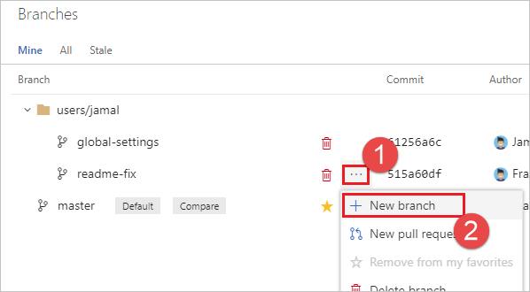

# Require branches to be created in folders

[!INCLUDE [version-lt-eq-azure-devops](../../includes/version-lt-eq-azure-devops.md)]

When you have many people collaborating in a repository, the number and names of branches can quickly get out of control.
Hierarchical branch folders are an effective way to organize the structure.
Azure DevOps and Visual Studio treat `/` as a folder separator and automatically collapse folders by default.
This way, you don't have to review every single branch to find the one you're looking for.
You don't have to rely on everyone to get it right, either.
Azure Repos can enforce the correct use of branch folders.

## Planning

Decide on the folder structure you want to allow.
As an example, we configure our repository to enforce the following rules:

* Only `main` can exist at the repository root.
* All users are allowed to create branches under the `feature/` and `users/` folders.
* Administrators can create branches under the `release/` folder.

>[!NOTE]
>For more examples and information about branch naming strategies, see [Adopt a Git branching strategy](git-branching-guidance.md).

## Prerequisites

Before you begin, ensure you have the following items:

| Requirement | Description |
|-------------|-------------|
| **Team Foundation command-line tools** | You need the Team Foundation version control command (`tf.exe`). |
| **Azure DevOps information** | You need the URL of your Azure DevOps organization, the name of your project, and the name of your repository. For this example: `https://dev.azure.com/fabrikam-fiber`, `FabrikamProject`, and `FabrikamRepo`. |
| **Appropriate permissions** | You need administrative permissions in your Azure DevOps project to modify Git repository permissions. |
| **Authentication** | Ensure you're signed in to Azure DevOps or have cached credentials, which avoids authentication prompts during command execution. |

> [!NOTE]
> The command `tf.exe` is installed by default with Visual Studio.
> You can access it via the [Developer Command Prompt](/dotnet/framework/tools/developer-command-prompt-for-vs).
> For more options, download [Team Explorer](https://visualstudio.microsoft.com/thank-you-downloading-visual-studio/?sku=TeamExplorer).

## Enforce permissions

Run the following commands in the Developer Command Prompt, under **Start** > **Visual Studio** > **Developer Command Prompt**.
Each command includes an explanation of what it's doing. If you don't have a token cached, for example by signing in to the Azure DevOps Services web portal, you're prompted to sign in.

1. Block the Create Branch permission at the repository root for the project's contributors:

```
tf git permission /deny:CreateBranch /group:[FabrikamProject]\Contributors /collection:https://dev.azure.com/fabrikam-fiber/ /teamproject:FabrikamProject /repository:FabrikamRepo
```

2. Allow contributors to create branches under `feature` and `users`:
    a. **Feature:**
    ```
    tf git permission /allow:CreateBranch /group:[FabrikamProject]\Contributors /collection:https://dev.azure.com/fabrikam-fiber/ /teamproject:FabrikamProject /repository:FabrikamRepo /branch:feature
    ```
    b. **Users:**
    ```
    tf git permission /allow:CreateBranch /group:[FabrikamProject]\Contributors /collection:https://dev.azure.com/fabrikam-fiber/ /teamproject:FabrikamProject /repository:FabrikamRepo /branch:users
    ```

3. Allow administrators to create branches under `release`:

```
tf git permission /allow:CreateBranch /group:"[FabrikamProject]\Project Administrators" /collection:https://dev.azure.com/fabrikam-fiber/ /teamproject:FabrikamProject /repository:FabrikamRepo /branch:release
```

4. Allow administrators to create a branch called `main`, in case it ever gets accidentally deleted.

```
tf git permission /allow:CreateBranch /group:"[FabrikamProject]\Project Administrators" /collection:https://dev.azure.com/fabrikam-fiber/ /teamproject:FabrikamProject /repository:FabrikamRepo /branch:main
```

>[!NOTE]
>For more information, see [tf git permission](../../repos/tfvc/git-permission-command.md). You can also access help for these commands from the command line by running `tf git /?` and `tf git permission /?`.

## Rename old branches

#### [Browser](#tab/browser/)
1. Open your repo on the web and [select the **Branches** view](manage-your-branches.md).
2. Locate your existing branch. If you don't see it, you might need to look on the **All** tab.
3. Choose its context menu (the `...` button) and choose **New branch**.

   

4. Type the new name of the branch, for example *users/frank/readme-fix*. Choose **Create branch**.

   

5. Choose the red trashcan icon next to the old branch name to delete it.

   


>[!NOTE] 
> Any custom permissions or branch policies don't migrate.

#### [Command Line](#tab/command-line/)
1. Make sure you have the latest set of branches:

```
cd {your_repo}
git fetch
```

2. Repeat these commands for each branch you want to migrate:

```
git branch -m {old_branch_name} {new_branch_name}
git push origin {new_branch_name}
git push origin --delete {old_branch_name}
```

>[!NOTE]
> You can't migrate any custom permissions or branch policies to the renamed branches.

* * *
