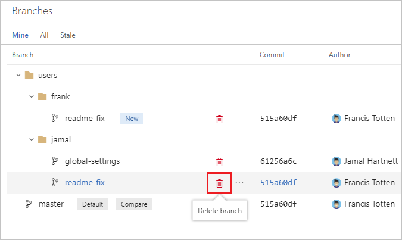

# Require branches to be created in folders

#### Azure Repos | TFS 2018

When you have many people collaborating in a repository, the number and names of branches can quickly get out of control.
Hierarchical branch folders is an effective way to tame the chaos.
Azure DevOps Services, TFS, and Visual Studio treat `/` as a folder separator and will automatically collapse folders by default.
This way, you don't have to wade through every single branch to find the one you're looking for.
You don't have to rely on everyone to get it right, either.
Azure Repos and TFS can enforce the correct use of branch folders.

## Planning

Decide on the folder structure you want to allow.
As an example, we'll set our repository to enforce the following rules:

* Only `master` can exist at the repository root.
* All users will be allowed to create branches under the `features/` and `users/` folders.
* Administrators will be able to create branches under the `releases/` folder.

>[!NOTE]
>For more examples and information about branch naming strategies, see [Adopt a Git branching strategy](git-branching-guidance.md).

## Preparation

* You will need the Team Foundation version control command (`tf.exe`) on your computer.
Run a Visual Studio Developer Command Prompt (in Windows, choose **Start**, choose **Visual Studio**, then choose the **Developer Command Prompt**).
* You will need the URL of your account or collection, the name of the project, and the name of the repository. For this example, we'll use `https://fabrikam-fiber.visualstudio.com`, `FabrikamProject`, and `FabrikamRepo`.

## Enforce permissions

Run the following commands in the Developer Command Prompt.
Each command is preceded with an explanation of what it's doing. If you don't have a personal access token cached (for example by signing in to the Azure DevOps Services web portal) you'll be prompted to login.

First, block the Create Branch permission at the repository root for the project's contributors.

    tf git permission /deny:CreateBranch /group:[FabrikamProject]\Contributors /collection:https://dev.azure.com/fabrikam-fiber/ /teamproject:FabrikamProject /repository:FabrikamRepo

Then, allow contributors to create branches under `features` and `users`.

    tf git permission /allow:CreateBranch /group:[FabrikamProject]\Contributors /collection:https://dev.azure.com/fabrikam-fiber/ /teamproject:FabrikamProject /repository:FabrikamRepo /branch:features

    tf git permission /allow:CreateBranch /group:[FabrikamProject]\Contributors /collection:https://dev.azure.com/fabrikam-fiber/ /teamproject:FabrikamProject /repository:FabrikamRepo /branch:users

Allow administrators to create branches under `releases`.

    tf git permission /allow:CreateBranch /group:"[FabrikamProject]\Project Administrators" /collection:https://dev.azure.com/fabrikam-fiber/ /teamproject:FabrikamProject /repository:FabrikamRepo /branch:releases

Finally, allow administrators to create a branch called `master` (in case it ever gets deleted accidentally.

    tf git permission /allow:CreateBranch /group:"[FabrikamProject]\Project Administrators" /collection:https://dev.azure.com/fabrikam-fiber/ /teamproject:FabrikamProject /repository:FabrikamRepo /branch:master

>[!NOTE]
>For more information, see [tf git permission](../../repos/tfvc/git-permission-command.md). You can also access help for these commands from the command line by running `tf git /?` and `tf git permission /?`.

## Rename old branches

# [Browser](#tab/browser)

0. Open your repo on the web and [select the **Branches** view](manage-your-branches.md).
0. Locate your existing branch. If you don't see it, you may need to look on the **All** tab.
0. Choose its context menu (the `...` button) and choose **New branch**.

  

0. Type the new name of the branch, for example *users/frank/readme-fix*. Choose **Create branch**.

  

0. Choose the red trashcan icon next to the old branch name to delete it.

  

>[!NOTE] 
>Any custom permissions or branch policies you had set up will not be migrated.

# [Command Line](#tab/command-line)

First, make sure you have the latest set of branches:

    cd {your_repo}
    git fetch

Then, repeat these commands for each branch you want to migrate:

    git branch -m {old_branch_name} {new_branch_name}
    git push origin {new_branch_name}
    git push origin --delete {old_branch_name}

>[!NOTE]
>Any custom permissions or branch policies you had set up will not be migrated.

---
