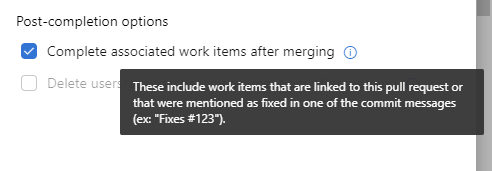
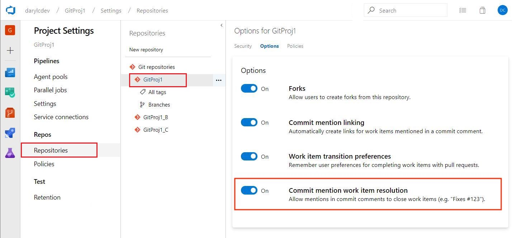

# Resolve work items on commit

#### Azure Repos

Close work items by mentioning keywords in commit messages. When you mention a work item in a commit that makes it to the default branch via one of the supported workflows, we will attempt to resolve that work item. 

## Keywords

The three supported keywords to trigger a resolution mention are `fix`, `fixes`, and `fixed` (case insensitive). Optionally, a colon can follow the keyword. Most forms of punctuation can precede or proceed the resolution mention, excluding another pound sign (#). 

### Examples

```
Fixes #123

This fixed #123!

Change behavior to fix: #123

Fixes #123 and fixes #124
```

> [!NOTE]
> Each work item to be closed must include both a supported keyword and the work item number.
> Comma separated lists such as `fixes #123,124,125` after a keyword will only resolve the 
> first work item. This is done to mitigate the amount of accidental resolution that could occur.

## Close a work item

Use the keywords to mention a work item in the commit message then follow one of two workflows:

- **Push event** - If a commit contains a resolution mention when it is pushed to the default branch of the repository, it will attempt to resolve the work item.
- **Pull request post-completion event** - When a user completes a pull request (excluding squash merge) to the default branch and selects the option to **Complete associated work items after merging**, all commits tied to the pull request will be processed for resolution mentions and will attempt to resolve the associated work items. This is done by selecting the post-completion option for completing associated work items within the completion dialog of a pull request. 

  > [!div class="mx-imgBorder"]
  > 

## Enable commit mention work item resolution

You can use the **Commit mention work item resolution** setting in the repository settings to enable or disable this feature. This setting is configured on a per-repo basis, and is enabled by default.

> [!div class="mx-imgBorder"]
> 