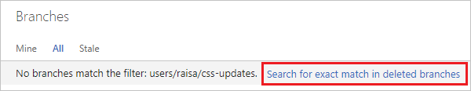
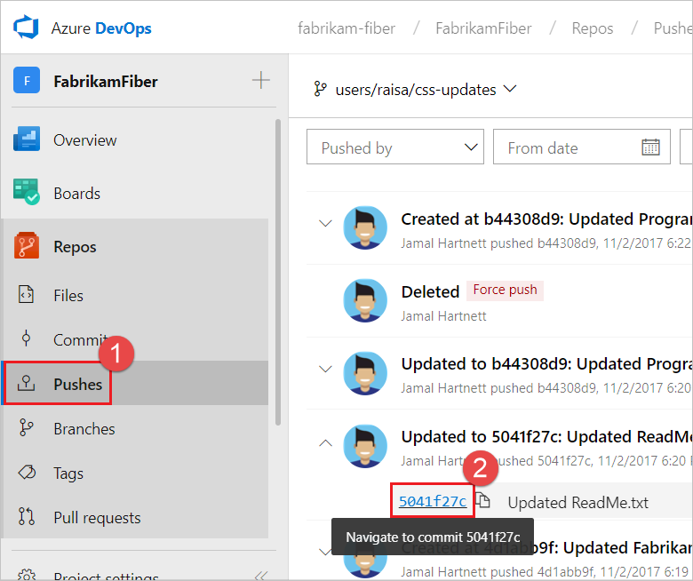
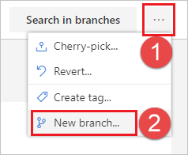

# Restore a deleted Git branch from the web portal

[!INCLUDE [version-lt-eq-azure-devops](../../includes/version-lt-eq-azure-devops.md)]

This article addresses how to restore a deleted Git branch using the web portal in Azure Repos.
If you need to restore a Git branch in your own repo from Visual Studio or the command line,
[push](pushing.md) your branch from your local repo to Azure Repos to restore it.

## Prerequisites

[!INCLUDE [azure-repos-prerequisites](includes/azure-repos-prerequisites.md)]

> [!NOTE]
> There's no retention policy on deleted branches. You can restore a deleted Git branch at any time, regardless of when it was deleted.

## Restore branch

1. Open your repo on the web and [select the **Branches** view](manage-your-branches.md).

2. Search for the exact branch name using the **Search all branches** box in the upper right.

3. Select the link to **Search for exact match in deleted branches**.
   If there's a deleted branch that matches your search, you can find which commit it pointed to when upon deletion, who deleted it, and when.

    

4. To restore the branch, select the **...** icon next to the branch name and then select **Restore branch** from the menu.
   The branch gets recreated at the last commit to which it pointed.
   Branch policies and permissions do **not** get restored.

    

If you reused the same branch name for different commits, you might not see all the commits you're expecting when you restore the deleted branch. In that case, go to the **Pushes** page of the restored branch to see the entire history of the branch.

::: moniker range="<=azure-devops"

You can go to a specific commit, then select **New branch** from the **...** icon.
From there, you can use a pull request, cherry-pick, or merge to get the commits back into the desired branch.

::: moniker-end
