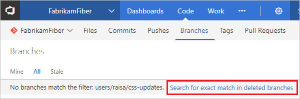
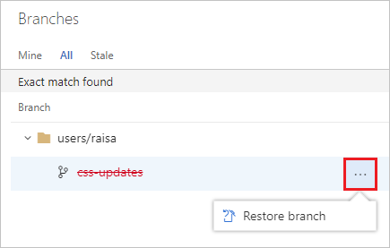
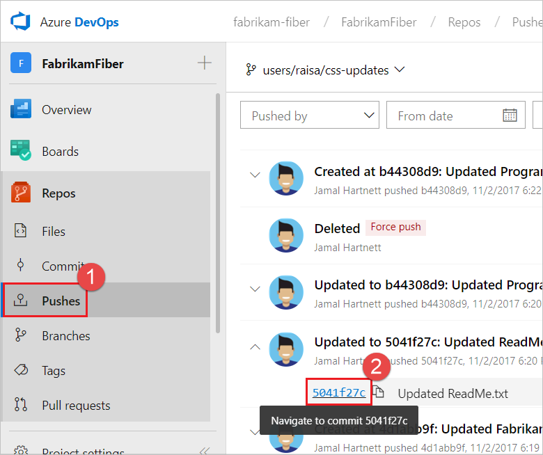

# Restore a deleted Git branch from the web portal

#### Azure Repos | TFS 2018

>[!IMPORTANT]
> This topic covers restoring a deleted Git branch via the web in Azure Repos and TFS 2018.
If you need to restore a Git branch in your own repo from Visual Studio or the command line,
[push](pushing.md) your branch from your local repo to Azure Repos to restore it. 

0. Open your repo on the web and [select the **Branches** view](manage-your-branches.md).

0. Search for the exact branch name using the **Search all branches** box in the upper right.

0. Click the link to **Search for exact match in deleted branches**.
If there is a deleted branch that matches your search, you will be able to see which commit it pointed to when it was deleted,
who deleted it, and when it was deleted.

    

0. To restore the branch, select the **...** icon next to the branch name and then select **Restore branch** from the menu.
The branch will be recreated at the last commit to which it pointed.
Note that branch policies and permissions will **not** be restored.

    

If you've re-used the same branch name for different commits, you may not see all the commits you're expecting when you restore the deleted branch. In that case, navigate to the **Pushes** page of the restored branch to see the entire history of the branch.

::: moniker range=">= azure-devops-2019"

You can navigate to a specific commit, then select **New branch** from the **...** icon.
From there, you can use a pull request, cherry-pick, or merge to get the commits back into the desired branch.

::: moniker-end

::: moniker range="<= tfs-2018"

You can navigate to a specific commit, then select **New branch** from the **...** icon.
From there, you can use a pull request, cherry-pick, or merge to get the commits back into the desired branch.

::: moniker-end

