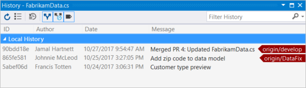
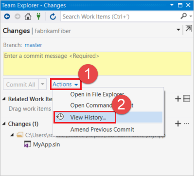
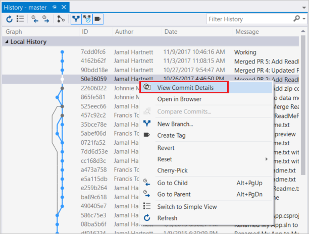
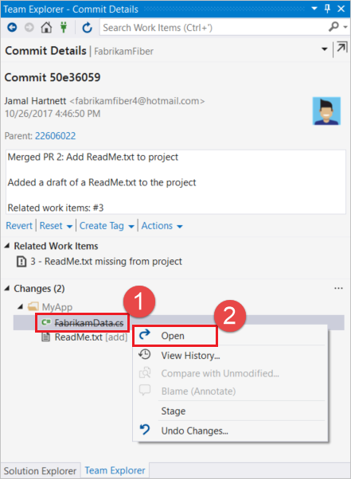
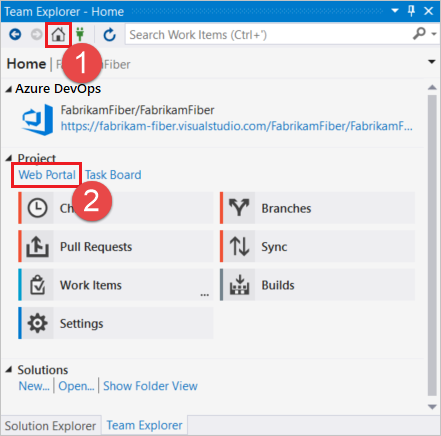
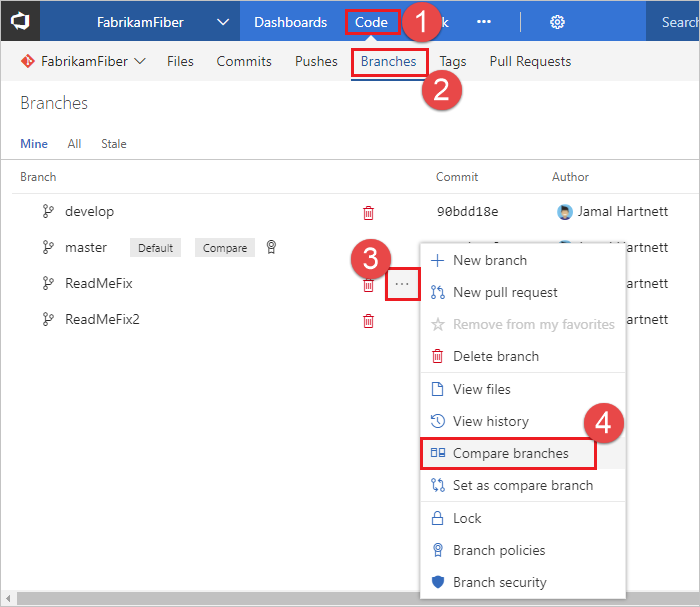
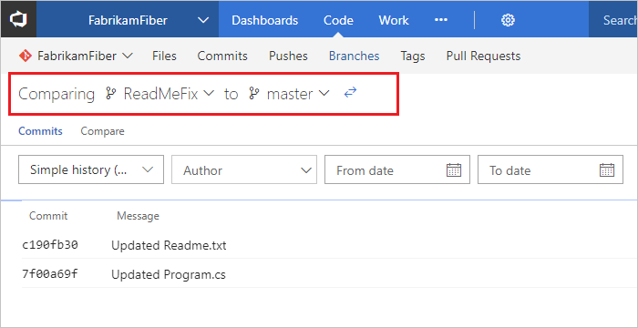

# Review history

**Azure Repos | Azure DevOps Server 2020 | Azure DevOps Server 2019 | TFS 2018 | TFS 2017 | TFS 2015 | VS 2017 | VS 2015**

Git uses the parent reference information stored in each [commit](commits.md) to manage a full history of your development. 
Review this commit history to find out when file changes were made and determine differences between versions of your code.

Git's use of feature [branches](./create-branch.md) and merges through [pull requests](pull-requests.md) mean that the commit history of your development doesn't form a straight, chronological line.
When you use history to compare versions, think in terms of file changes between two commits instead of file changes between two points in time. 
A recent change to a file in the `main` branch may have come from a commit created two weeks ago in a feature branch but was only merged yesterday. 

In this tutorial you learn how to:

> [!div class="checklist"]
> * Compare files
> * Retrieve files
> * Compare branches

## Compare files

Compare the changes between two versions of a file in your Git repo.

#### [Browser](#tab/browser)

1. In your project, click **Repos**, and then click **Files**. 

    :::image type="content" source="media/review-history/repos-files.png" alt-text="Screenshot that shows the Azure DevOps menu with Repos and Files selected.":::
 
2. Select a file, and then click the **Compare** tab. A diff view shows the most recent commit and the *head* commit in a side-by-side view.

    :::image type="content" source="media/review-history/compare-commits-browser.png" alt-text="Screenshot that shows the Compare tab selected and commit diff view.":::

3. Select the the two commits you want to compare.   

    :::image type="content" source="media/review-history/select-commits-for-compare-browser.png" alt-text="Screenshot that shows the selections for the previous commits for comparison.":::

#### [Visual Studio](#tab/visual-studio/)

[!INCLUDE [temp](includes/note-new-git-tool.md)]

1. Right-click the file in Solution Explorer and choose **View History...**. The history window will appear showing the commit ID, author, date, and description of all changes to the file in your local repo across all branches.   

         

2. Find the latest commit for a branch by looking for its name on an arrow to the right of a commit.
3. View changes from the previous version of the file by right-clicking and choosing **Compare with previous...**. View the changes between any two versions by selecting both commits, then right-clicking and select **Compare...**
4. The diff view shows lines removed from the older commit and added in the new one.

    

#### [Command Line](#tab/command-line/)
Use the `git log` command to view the commits that changed a file in your repo for your current branch.

<pre style="color:white;background-color:black;font-family:Consolas,Courier,monospace;padding:10px">
&gt; git log index.html   

commit bbc3b679197b659544a6f8070c79fb535b496613
Date:   Thu Jun 30 13:42:50 2016 -0400

    update landing page

commit e5402fe710c25eca1b96a4e238eee9c01ed41c6a
Date:   Thu Jun 30 13:42:23 2016 -0400

    initial commit

</pre>

Filter the `git log` output based on author, description or date information by using the corresponding options. 
Leave out the filename if you want to see the commits matching all files in your repo.

<pre style="color:white;background-color:black;font-family:Consolas,Courier,monospace;padding:10px">
&gt; git log --author=frank@fabrikam.com index.html
&gt; git log --since="2016-1-1"
&gt; git log --before="2 weeks ago"
&gt; git log --grep="css change"
</pre>

View changes between two commits using `git diff`:

<pre style="color:white;background-color:black;font-family:Consolas,Courier,monospace;padding:10px">
&gt; git diff bbc3b67 e5402fe71 index.html

-    &lt;link rel="stylesheet" href="app.cs"/&gt;   
+    &lt;link rel="stylesheet" href="fabrikam.cs"/&gt;
</pre>

* * *
## Retrieve files

Retrieve a specific version of a file from your history, even if the file was deleted or renamed in the latest version of your code.
Retrieving an older version of the file doesn't make any changes to your current branch. Create a new commit to bring the older version of the file into
your branch.

#### [Browser](#tab/browser)

1. In your project, click **Repos**, and then click **Files**.

    :::image type="content" source="media/review-history/repos-files.png" alt-text="Screenshot that shows the Azure DevOps menu with the Repo menu expanded and Files selected.":::

2. Select a file, and then select the **History** tab.

    :::image type="content" source="media/review-history/select-file-history.png" alt-text="Screenshot that shows a the 'History' tab of a file selected.":::

3. Select a commit from the list.
4. Click the ellipses in the top-right corner, and then select **Revert** from the drop-down.

    :::image type="content" source="media/review-history/select-ellipsis-file-history.png" alt-text="Screenshot that shows the ellipsis and the drop-down with 'Revert' selected."::: 

5. Select your target branch, type a topic branch name if necessary, and click **Revert**.

    :::image type="content" source="media/review-history/revert-commit-dialog-browser.png" alt-text="Screenshot that shows the 'Revert commit' dialog.":::

#### [Visual Studio](#tab/visual-studio/)

[!INCLUDE [temp](includes/note-new-git-tool.md)]

To retrieve a previous version of a file that exists in your Visual Studio project:

1. Right-click the file in Solution Explorer and select **View History**. The Visual Studio **History** view will appear, showing the commits in your repo that updated the file.
   You can filter the commits to find the exact commit with the file version you want to restore. Double click on the version to open it in Visual Studio.

      

To retrieve a previous version of a file that was deleted in a previous commit:

1. Open the **Changes** view in Team Explorer and select **View History** from the **Actions** drop-down. 

    

2. Right-click the commit containing the version of the file you want to restore and select **View Commit Details**. 

    

3. Right click the file to restore in the **Commit Details** in Team Explorer and select **Open**.

   

>[!NOTE]
>The retrieved version of a file is not automatically saved to your project. To save the retrieved version to your project, select **Save As...** from the **File** menu. If you save the file in your current project, either as a new file or overwriting
an existing one, you'll need to commit your changes to add the previous version to your local branch.

#### [Command Line](#tab/command-line/)
Use `git log` to find the version to restore and `git checkout` or `git show` to restore the file from your history.

Find the commit with the version of the file you need to restore using `git log` using the steps from [comparing versions](review-history.md?tabs=command-line#compare-files) above.
Restore the version in its current location using `git checkout`:

<pre style="color:white;background-color:black;font-family:Consolas,Courier,monospace;padding:10px">
&gt; git checkout 85435fac src/app.ts
</pre>

Using `git checkout` this way will rewrite the current version of the file at that path location.

Restore a file to any location by using `git show`. This command prints the file contents to the terminal-you'll want to redirect the output to your desired location.

<pre style="color:white;background-color:black;font-family:Consolas,Courier,monospace;padding:10px">
&gt; git show 85435fac:src/app.ts &gt; /home/frank/oldapp.ts
</pre>

* * *
## Compare branches

Review potential changes from a [merge](merging.md) or [rebase](rebase.md) by comparing branches directly. 
You can compare both local and remote branches, which is useful when checking for potential merge conflicts or to see how the 
changes others have made will affect your work.

# [Browser](#tab/browser)

1. In your project, click **Repos**, and then click **Branches**.

    :::image type="content" source="media/review-history/select-repos-branches.png" alt-text="Screenshot that shows selecting 'Repos' and 'Branches' from the project menu.":::
 
2. On the branch you want to compare, click the ellipses on the right-side, and then select **Compare branches** from the drop-down.

    :::image type="content" source="media/review-history/select-compare-branches-browser.png" alt-text="Screenshot that shows the ellipsis selected and 'Compare branches' selected from the menu.":::

3. Select the other branch you want to compare with. The view displays all changes between the branches.

    :::image type="content" source="media/review-history/select-branch-to-compare.png" alt-text="Screenshot that shows the 'Branch compare' dialog, with the first branch drop-down highlighted and branch 'Test1' selected."::: 

# [Visual Studio](#tab/visual-studio)

[!INCLUDE [temp](includes/note-new-git-tool.md)]

Comparing branches can be done in the web portal, which you can access from the Team Explorer **Home** view in Visual Studio by choosing **Web Portal**. 

 

Select **Branches** from the menu under **Code**. Locate your branch and select the **...** icon to view the branch options. Select **Compare branches**.  

 

Select the branch to compare to from the drop-downs at the top. The view will display all changes between the branches.

 

# [Command Line](#tab/command-line)

Use `git diff` to compare the contents of two branches. You can compare any combination of local and remote branches. 
The output shows the deletions and additions between the two versions of the code.

<pre style="color:white;background-color:black;font-family:Consolas,Courier,monospace;padding:10px">
&gt; git diff users/frank/feature origin/master
</pre>

<pre style="color:white;background-color:black;font-family:Consolas,Courier,monospace;padding:10px">
index 36843b8..03afc4b 100644
--- a/tsapp/index.html
+++ b/tsapp/index.html
@@ -4,7 +4,7 @@
 &lt;head&gt;
     &lt;meta charset="utf-8" /&gt;
     &lt;title>TypeScript HTML App&lt;/title&gt;
-    &lt;link rel="stylesheet" href="fabrikam-test.css" type="text/css" /&gt; +    &lt;link rel="stylesheet" href="fabrikam.css" type="text/css" /&gt;
     &lt;script src="app.js">&lt;/script&gt;
 &lt;/head>
 ...
--- a/tsapp/app.ts
+++ b/tsapp/app.ts
     constructor(element: HTMLElement) {
         this.element = element;
-        this.element.innerHTML += "The time is: "; +        this.element.innerHTML += "The time is now: ";
         this.span = document.createElement('span');
         this.element.appendChild(this.span);
         this.span.innerText = new Date().toUTCString();
 </pre>

This will output the diff for every change between the branches. 
You can narrow down specific file changes by specifying a file after the branch names:

<pre style="color:white;background-color:black;font-family:Consolas,Courier,monospace;padding:10px">
&gt; git diff users/frank/feature origin/master index.html
</pre>

---