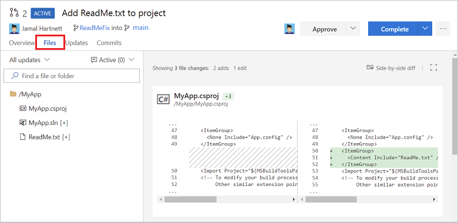
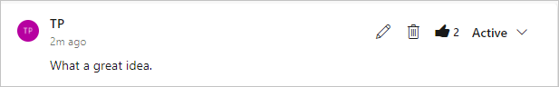
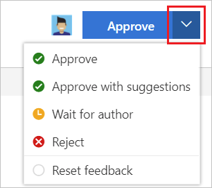
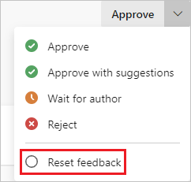
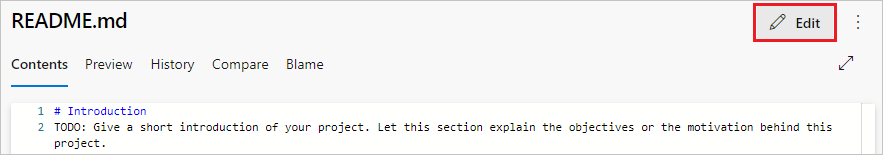
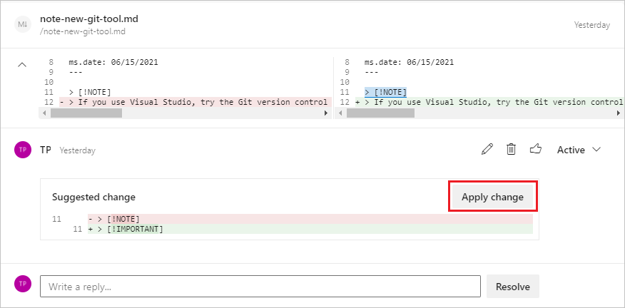

# Review pull requests

[!INCLUDE [version-gt-eq-2015](../../includes/version-gt-eq-2015.md)]
[!INCLUDE [version-vs-gt-2015](../../includes/version-vs-gt-2015.md)]

After you [create a pull request](pull-requests.md) (PR), send the PR for review by stakeholders. You can add required or optional reviewers to your PR. Required reviewers must approve the PR before it can merge.

Teams can also set [branch policies](branch-policies.md) that require a minimum number of reviewers, or certain required or optional reviewers, before certain PRs in protected branches can merge. You can change optional included reviewers to be required or remove them, but you can't remove reviewers that are required by branch policy. To learn more about setting branch policies and reviewers, see [Automatically include code reviewers](branch-policies.md#include-code-reviewers).

High-quality reviews start with high-quality feedback. For guidelines on getting and giving good review feedback, see [Pull request feedback](about-pull-requests.md#pr-feedback).

## Prerequisites

::: moniker range="azure-devops"
- **Repos** must be enabled on your project. If the **Repos** hub and associated pages don't display, see [Turn an Azure DevOps service on or off](../../organizations/settings/set-services.md) to reenable Repos.
 
- To review PRs, you must be a member of the Azure DevOps project the PR is in, with **Basic** access or higher. If you aren't a project member, [get added](../../organizations/accounts/add-organization-users.md).

  > [!NOTE]
  > For public projects, users granted **Stakeholder** access have full access to Azure Repos.
::: moniker-end

::: moniker range=">= azure-devops-2019 < azure-devops"
- **Repos** must be enabled on your project. If the **Repos** hub and associated pages don't display, see [Turn an Azure DevOps service on or off](../../organizations/settings/set-services.md) to reenable Repos.

- To review PRs, you must be a member of the Azure DevOps project with **Basic** access or higher. If you aren't a project member, [get added](../../organizations/security/add-users-team-project.md).
::: moniker-end

::: moniker range="< azure-devops-2019"
- To view or review PRs, you must be a member of the Azure DevOps project with **Basic** access or higher. If you aren't a project member, [get added](../../organizations/security/add-users-team-project.md).

::: moniker-end

- To learn more about permissions and access, see [Default Git repository and branch permissions](../../organizations/security/default-git-permissions.md) and [About access levels](../../organizations/security/access-levels.md).

::: moniker range=">= azure-devops-2020"
- In Azure DevOps Server 2020 and Azure DevOps Services, you can manage PRs and other resources from the [Azure command-line interface (CLI)](/cli/azure/) with the `azure-devops` extension. To learn how to work with the Azure DevOps Services CLI, see [Get started with Azure DevOps CLI](../../cli/index.md). Azure Repos CLI commands for PRs use [az repos pr](/cli/azure/repos/pr).

::: moniker-end

## Browse changes

To give a quick picture of PR status, the PR **Overview** tab summarizes checks, requirements, and branch policies that the PR is passing or failing. In some cases, the summary shows a snippet of the failure message from a status check's log. The overview lists only failed policies, but you can see all the passed and failed policy checks by selecting **View \<n> checks**.

On the PR **Overview** tab, you can review the PR description and comments to understand proposed changes and see issues other reviewers raised.

:::image type="content" source="media/review-pull-requests/pull-request-overview-2020.png" alt-text="Screenshot that shows the PR overview tab.":::

### Review files

::: moniker range="azure-devops"
Select the PR **Files** tab to review the actual changes made in the source branch, **Inline** or **Side-by-side** with the target branch.

You can see how Markdown files will look published by selecting the **View** button on a file, and then selecting **Preview**.
  
:::image type="content" source="media/review-pull-requests/pull-request-browse-changes-2020.png" alt-text="Screenshot that shows a side-by-side diff view of file changes in a P R.":::

>[!NOTE]
>When viewing the difference for a *single selected file*, there's a file size limit of 5 MB. To view and diff files larger than 5 MB, you can download the file and view it using a local diff tool. When viewing the difference for a *collection of files*, the size limit for each file is 0.5 MB, for performance reasons.
::: moniker-end

::: moniker range="<= azure-devops-2020"
Select the PR **Files** tab to view the actual changes made to the source branch next to the target branch of the pull request.



>[!NOTE]
>When viewing the difference for a *single selected file*, there's a file size limit of 5 MB. To view and diff files larger than 5 MB, you can download the file and view it using a local diff tool. When viewing the difference for a *collection of files*, the size limit for each file is 0.5 MB, for performance reasons.
::: moniker-end

### Review updates

::: moniker range="azure-devops"
You can review previous versions of the code from the **All Changes** drop-down list. Every update to the branch adds a new version to the list and on the **Updates** tab of the PR. As you select different updates, the diff view updates to show the differences between the files in each version of the PR.

You can catch up with PR updates after being away from the PR by stepping through changes made since your last review. You can view multiple updates at once by pressing **Shift** while selecting the updates you want to see. 
  
:::image type="content" source="media/review-pull-requests/pull-request-all-changes-dropdown.png" alt-text="Screenshot that shows the All changes drop-down.":::

::: moniker-end

::: moniker range="<= azure-devops-2020"

Review previous versions of the code from the **All updates** drop-down list.


Every update to the branch adds a new version to the list and on the **Updates** tab of the PR. As you select different updates, the diff view updates to show the differences between the files in each version of the PR.

You can catch up with PR updates after being away from the PR by stepping through changes made since your last review.

::: moniker-end

::: moniker range="azure-devops"
Browse a list of changes from the author on the **Updates** tab.


View and select changes made in commits to the branch on the **Commits** tab.


::: moniker-end

::: moniker range="<= azure-devops-2020"
Browse a list of changes from the author on the **Updates** tab.


View and select changes made in commits to the branch on the **Commits** tab.


::: moniker-end

## Make comments

Add comments to a PR to make suggestions, reply to previous comments, and point out problems with the proposed changes.

::: moniker range="azure-devops"
- Comment inline in the **Files** tab of a PR by hovering over the line you want to comment on and selecting the comment button :::image type="icon" source="./media/review-pull-requests/new-comment-icon.png":::.

  
::: moniker-end

::: moniker range="<= azure-devops-2020"
- Comment inline in the **Files** tab of a PR by hovering over the line you want to comment on and selecting the comment button .

  
::: moniker-end

- Give feedback not tied to a specific code line by commenting on the **Overview** tab.

- Address the author or other reviewers directly in your comments by using `@username`, and reference work items by using `#workitemID`. You can also reference other PRs by using `!pullrequestID`.

::: moniker range="azure-devops"

### Suggest changes

To suggest changes directly, select the lightbulb icon in the comment interface, make your suggested changes in the code, and then select **Comment**.


::: moniker-end

::: moniker range=">=azure-devops-2020"
## Edit, delete, or like a comment

To edit or delete a comment you made, hover over the comment and select the pencil icon to edit the comment, or the garbage can icon to delete the comment.

To like your own or someone else's comment, hover over the comment and select the thumbs-up icon. Comments with likes show a filled in icon and the number of likes in the comment list. Hover over the icon to see the list of people who liked the comment.



::: moniker-end

::: moniker range=">=tfs-2018 <=azure-devops-2019"

## Like a comment

To like a comment that you or someone else made, select the heart icon. Hover over the icon in comments to see the list of people who liked the comment.

::: moniker-end

::: moniker range=">=tfs-2018"

## Filter comments

You can select which comments and updates show on the **Overview** page. Hiding some comments and updates gets them out of the way when reviewing code for the first time. You can also show only what's new since the last time you visited the PR.

To filter comments and updates, select the **Show everything (n)** button above the comment list, and select one of the filtering options. The view changes to show only the selected comments and updates. The button label changes to show the filtering criteria and the number of items shown.


::: moniker-end

<a id="set-vote" />


## Vote on changes

# [Browser](#tab/browser)
Use the button at upper right in the PR to vote on the PR changes. The default option is **Approve**, but you can select other options from the dropdown list:



- **Approve**: Approve the proposed changes in the PR.
- **Approve with suggestions**: Approve the PR, but provide optional suggestions for improvement.
- **Wait for author**: Don't approve the changes, and ask the author to review your comments. The author should let you know to review the code again after they address your concerns.
- **Reject**: The changes aren't acceptable. Leave a comment in the PR to explain why.
- **Reset feedback**: Remove your vote.


# [Visual Studio](#tab/visual-studio)

In Visual Studio 2015, 2017, and 2019, you can access PRs from Visual Studio Team Explorer:

1. [Connect to your project from Visual Studio](../../organizations/projects/connect-to-projects.md).

1. Select **View** > **Team Explorer** to open Team Explorer. You can also press **Ctrl**+**\\**, **Ctrl**+**M**.

1. From **Home**, select **Pull Requests** to view lists of PRs opened by you or assigned to you.

1. To open a PR in the web portal, right-click the PR and select **Open in browser**.

To vote on a PR, open the PR in the browser, and on the **Overview** page, use the button at upper right to vote on the changes.

# [Azure DevOps CLI](#tab/azure-devops-cli)

::: moniker range=">= azure-devops-2020"

To vote on whether to approve a PR, use [az repos pr set-vote](/cli/azure/repos/pr#az-repos-pr-set-vote).

```azurecli
az repos pr set-vote --id
                     --vote {approve, approve-with-suggestions, reject, reset, wait-for-author}
                     [--detect {false, true}]
                     [--org]
                     [--subscription]
```

### Parameters

|Parameter|Description|
|---------|-----------|
|`--id`|ID of the pull request. **Required**.|
|`--vote`|New vote value for the pull request. Accepted values: `approve`, `approve-with-suggestions`, `reject`, `reset`, `wait-for-author`. **Required**.|
|`--detect`|Automatically detect organization. Accepted values: `false`, `true`.|
|`--org`<br>`--organization`|Azure DevOps organization URL. You can configure the default organization by using `az devops configure -d organization=<ORG_URL>`. **Required** if not configured as default or picked up via git config. Example: `https://dev.azure.com/MyOrganizationName/`.|
|`--subscription`|Name or ID of Azure subscription. You can configure the default subscription by using `az account set -s <NAME_OR_ID>`.|

### Example

For example, to vote to approve PR #21, and see the command output in a table, use:

```azurecli
az repos pr set-vote --id 21 --vote approve  --output table

Name            Email                ID                                    Vote      Required
--------------  ------------------- -------------------------------------  --------  ----------
Jamal Hartnett  jamalh@fabrikam.com  00000000-0000-0000-0000-000000000000  Approved  False
```

::: moniker-end

::: moniker range="<= azure-devops-2019"
[!INCLUDE [temp](../../includes/note-cli-not-supported.md)]
::: moniker-end


***

<a id="reset-vote" />


## Reset feedback

# [Browser](#tab/browser)

To remove your vote from a PR, select **Reset feedback** from the **Approve** dropdown list at upper right in the PR. 




# [Visual Studio](#tab/visual-studio)

In the 

To remove your vote from a PR, in the **Pull Requests** view in **Team Explorer**, right-click the PR and select **Open in browser**. On the **Overview** page, use the **Approve** button at upper right to select **Reset feedback**.


# [Azure DevOps CLI](#tab/azure-devops-cli)

::: moniker range=">= azure-devops-2020"

To remove your vote from a PR, use `az repos pr set-vote reset`.

### Example

For example, to remove your vote from PR #21, use:

```azurecli
az repos pr set-vote --id 21 --vote reset  --output table

Name            Email                ID                                    Vote      Required
--------------  ------------------- -------------------------------------  --------  ----------
Jamal Hartnett  jamalh@fabrikam.com  00000000-0000-0000-0000-000000000000            False
```

::: moniker-end

::: moniker range="<= azure-devops-2019"
[!INCLUDE [temp](../../includes/note-cli-not-supported.md)]
::: moniker-end


***


<a name="complete-the-pull-request"></a>

## Address comments

::: moniker range="azure-devops"
To make quick updates to your PR in response to comments, select **Edit** on the **Files** page in your branch on the web.



After updating your files, [commit](commits.md) changes and [push](pushing.md) the updates to your PR.

You can also immediately apply reviewers' suggested changes by selecting **Apply change** in the comment on the PR **Overview** page. Once you've applied all the changes you want, select **Commit all changes**.



::: moniker-end

::: moniker range="<= azure-devops-2020"
You can make quick updates to your branch directly from the **Files** tab in **Code** on the web.


::: moniker-end

### Reply and resolve comments

Reply to comments and update comment status to let reviewers know how you're addressing their comments and suggestions. 

- To resolve a comment without replying, select **Resolve** under the comment.
- To reply to the comment, type your response in the **Write a reply** field, and select **Reply**.
- To reply to and resolve the comment, type your response in the **Write a reply** field, and select **Reply & resolve**.
- Reply to specific reviewers by using `@username` in the reply, and reference work items by using `#workitemID`. You can also reference other PRs by using `!pullrequestID`.

New comments start in **Active** status. Select **Resolve** or **Reply & resolve** to update comment status to **Resolved**.


More options are available in the comment resolution dropdown list:


- **Active**: The comment is still under review.
- **Pending**: The issue in this comment will be addressed, but isn't fixed yet.
- **Resolved**: The issue brought up in this comment is fixed.
- **Won't fix**: The suggestion in the comment is noted, but this PR won't address it.
- **Closed**: Discussion for this comment is closed.

:::moniker range=">= azure-devops-2019"

To keep track of files that have already been reviewed, select **More options** next to a file in your PR, and then select **Mark as reviewed**.

:::moniker-end

## Next steps

> [!div class="nextstepaction"]
> [Complete the pull request](complete-pull-requests.md)
 
## Related articles

- [Pull request update notifications](pull-request-notifications.md)
- [About pull requests and permissions](about-pull-requests.md)
