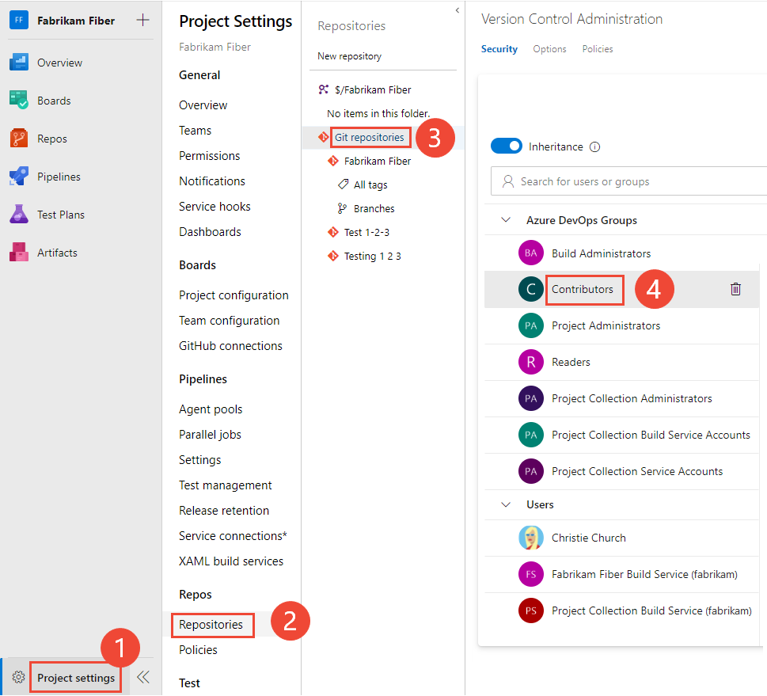

# Set Git repository permissions 

[!INCLUDE [version-all](../../includes/version-all.md)]

By default, members of the project Contributors group have permissions to contribute to a repository. However, to create and manage permissions for a repository, you must be a member of the Project Administrators group.  You can grant or restrict access to a repository by setting the permission state to **Allow** or **Deny** for a single user or a security group. 

## Prerequisites

* You must have a project. If you don't have a project yet, create one in [Azure DevOps](../../user-guide/sign-up-invite-teammates.md) or set one up in an [on-premises Azure DevOps](../../organizations/projects/create-project.md).
* You must be a member of the [Project Administrators Group](../../organizations/security/set-project-collection-level-permissions.md) or have your **Manage permissions** set to **Allow** for Git repositories or the TFVC repository.  

## Default repository permissions  

::: moniker range="azure-devops"

To contribute to the source code, you must be granted **Basic** access level or greater. Users granted **Stakeholder** access for private projects have no access to source code. Users granted **Stakeholder** access for public projects have the same access as Contributors and those granted **Basic** access. To learn more, see [About access levels](../../organizations/security/access-levels.md).

::: moniker-end

::: moniker range="< azure-devops"

To contribute to the source code, you must be granted **Basic** access level or greater. Users granted **Stakeholder** access have no access to source code. To learn more, see [About access levels](../../organizations/security/access-levels.md).
::: moniker-end

For a description of each security group and permission level, see [Permissions and group reference](../../organizations/security/permissions.md).  

::: moniker range=">= tfs-2015"

You can use Git repositories to host and collaborate on your source code. For an overview of code features and functions, see [Git](index.yml).

[!INCLUDE [temp](../../organizations/security/includes/code-git.md)]

::: moniker-end

[!INCLUDE [temp](../../includes/ability-to-find-user-once-added.md)]

::: moniker range="azure-devops"

## Open Security for a repository

You can set the permissions for all Git repositories for a project, or for a single repository. You do both these tasks from **Project Settings>Repositories**. 

1. Open the web portal and choose the project where you want to add users or groups. To choose another project, see [Switch project, repository, team](../../project/navigation/go-to-project-repo.md).

2. Open **Project settings>Repositories**.  

	To set the permissions for all Git repositories, choose **Security**. 

	For example, here we choose (1) **Project settings**, (2) **Repositories**, and then (3) **Security**.

	:::image type="content" source="media/git-permissions/open-repositories-s-185.png" alt-text="Screenshot showing choosing Project settings>Repositories>Security.":::

1.	Otherwise, to set permissions for a specific repository, choose (1)the repository and then choose (2) **Security**.

	:::image type="content" source="media/git-permissions/choose-git-repo-security-callouts.png" alt-text="Screenshot showing choosing Project settings>Choose a repository>Security.":::

::: moniker-end 

::: moniker range="azure-devops-2019 || azure-devops-2020"

## Set permissions for a repository

1. Open the web portal and choose the project where you want to add users or groups. To choose another project, see [Switch project, repository, team](../../project/navigation/go-to-project-repo.md).

2. To set the permissions for all Git repositories for a project, choose **Git Repositories** and then choose the security group whose permissions you want to manage. 

	For example, here we choose (1) **Project Settings**, (2) **Repositories**, (3) **Git repositories**, (4) the **Contributors** group, and then (5) the permission for **Create repository**.

	[!INCLUDE [temp](../../includes/lightbox-image.md)] 

	 

	Otherwise, choose a specific repository and choose the security group whose permissions you want to manage.   

	> [!NOTE]  
	> If you add a user or group, and don't change any permissions for that user or group, then upon refresh of the permissions page, the user or group you added no longer appears.
 
4. When done, choose **Save changes**. 

::: moniker-end

::: moniker range="<= tfs-2018"

## Set permissions for a repository

1. Open the web portal and choose the project where you want to add users or groups. To choose another project, see [Switch project, repository, team](../../project/navigation/go-to-project-repo.md).  

1. Choose the :::image type="icon" source="../../media/icons/gear-icon.png" border="false"::: gear icon to open the administrative context.

	> [!div class="mx-imgBorder"]  
	>   
	
2. Choose **Version Control**.

3. To set the set the permissions for all Git repositories for a project, (1) choose **Git Repositories** and then (2) choose the security group whose permissions you want to manage. 

	Otherwise, choose a specific repository and choose the security group whose permissions you want to manage.   

4. Choose the setting for the permission you want to change. 

	Here we grant permissions to the Contributors group to (3) create repositories. 

	  

5. When done, choose **Save changes**. 

::: moniker-end

::: moniker range="azure-devops"

## Change permissions for a default security group

## Set permissions for a specific user or group

1.  To set permissions for a specific user or group, enter the name of the user or group into the search filter and select from the identities that appear.  

	> [!div class="mx-imgBorder"]  
	>   

	Then make the changes to the permission set. 

	> [!NOTE]  
	> To set permissions for a custom security group, you must have defined that group previously. See [Set permissions at the project- or collection-level](../../organizations/security/set-project-collection-level-permissions.md#project-level)

	If you add a user or group, and don't change any permissions for that user or group, then upon refresh of the permissions page, the user or group you added no longer appears.
 
	The changes are made automatically, no need to save your changes.  

## Enable or disable inheritance for a specific repository

- To enable or disable inheritance for a specific repository, select the repository and then move the **Inheritance** slider to either an on or off position.

	> [!div class="mx-imgBorder"]  
	>   

To learn about inheritance, see [About permissions and groups, Inheritance and security groups](../../organizations/security/about-permissions.md#inheritance). 

::: moniker-end

## Related articles

- [Default permissions and access](../../organizations/security/permissions-access.md) 
- [Permissions and groups reference](../../organizations/security/permissions.md)  
- [Tf git permission command-line tool](../tfvc/git-permission-command.md)  
- [Security REST API commands](/rest/api/azure/devops/security/)
 

<!--- 

1. Open the web portal and choose the project where you want to add users or groups. To choose another project, see [Switch project, repository, team](../../project/navigation/go-to-project-repo.md).

2. Open **Project settings>Repositories**.  

	To set the permissions for all Git repositories, choose **Git Repositories** and then choose the security group whose permissions you want to manage. 

	For example, here we choose (1) **Project settings**, (2) **Repositories**, (3) **Git repositories**, (4) the **Contributors** group, and then (5) the permission for **Bypass policies when pushing**.

	[!INCLUDE [temp](../../includes/lightbox-image.md)] 

	 

--> 