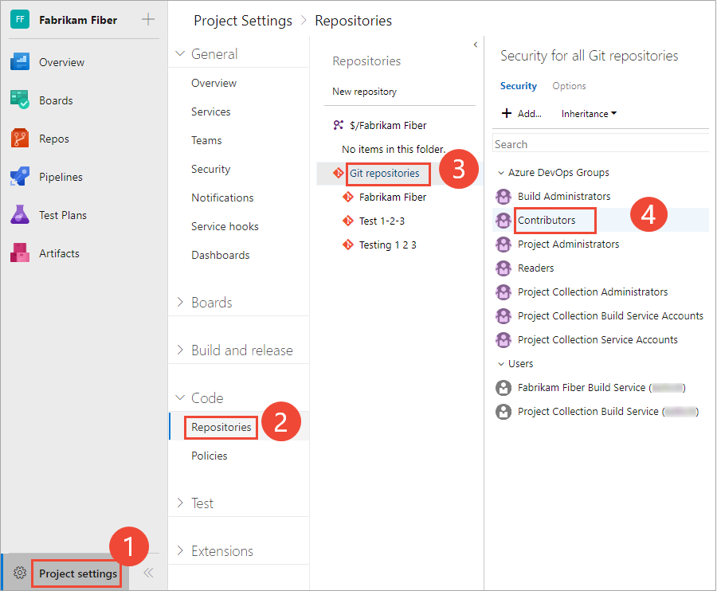
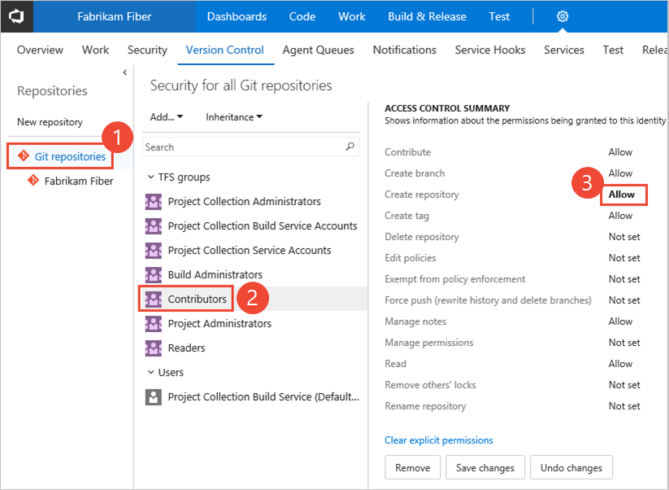
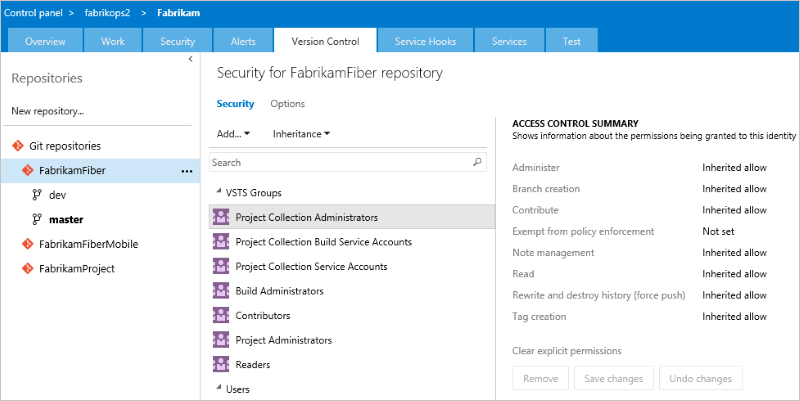
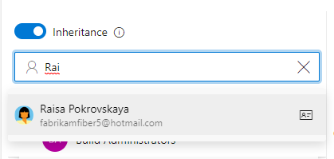
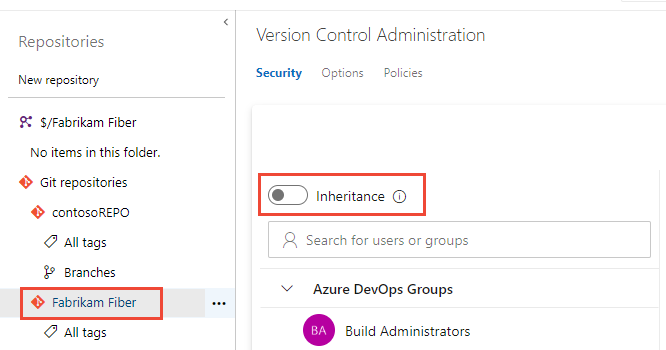

# Set Git repository permissions 

[!INCLUDE [version-all](../../includes/version-all.md)]

You grant or restrict access to repositories to lock down who can contribute to your source code and manage other features.  You can set permissions across all Git repositories by making changes to the top-level **Git repositories** entry. Individual repositories inherit permissions from the top-level **Git Repositories** entry. 

> [!NOTE]   
> Branches inherit a subset of permissions from assignments made at the repository level. For branch permissions and policies, see [Set branch permissions](branch-permissions.md) and [Improve code quality with branch policies](branch-policies.md).
 
For guidance on who to provide greater permission levels, see [Grant or restrict access using permissions](../../organizations/security/restrict-access.md).

## Prerequisites

- You must have a project. If you don't have a project yet, create one in [Azure DevOps](../../user-guide/sign-up-invite-teammates.md) or set one up in an [on-premises Azure DevOps](../../organizations/projects/create-project.md).
- You must be a member of the [Project Administrators Group](../../organizations/security/set-project-collection-level-permissions.md) or have your **Manage permissions** set to **Allow** for Git repositories.  

::: moniker range="azure-devops"

To contribute to the source code, you must be granted **Basic** access level or greater. Users granted **Stakeholder** access for private projects have no access to source code. Users granted **Stakeholder** access for public projects have the same access as Contributors and those granted **Basic** access. To learn more, see [About access levels](../../organizations/security/access-levels.md).

::: moniker-end

::: moniker range="< azure-devops"

To contribute to the source code, you must be granted **Basic** access level or greater. Users granted **Stakeholder** access have no access to source code. To learn more, see [About access levels](../../organizations/security/access-levels.md).
::: moniker-end

## Default repository permissions  

By default, members of the project Contributors group have permissions to contribute to a repository. This includes the ability to create branches, create tags, and manage notes. For a description of each security group and permission level, see [Permissions and group reference](../../organizations/security/permissions.md).  

[!INCLUDE [temp](../../organizations/security/includes/code-git.md)]

::: moniker range="azure-devops"

## Open Security for a repository

You set Git repository permissions from **Project Settings>Repositories**. 

1. Open the web portal and choose the project where you want to add users or groups. To choose another project, see [Switch project, repository, team](../../project/navigation/go-to-project-repo.md).

2. Open **Project settings>Repositories**.  

	To set the permissions for all Git repositories, choose **Security**. 

	For example, here we choose (1) **Project settings**, (2) **Repositories**, and then (3) **Security**.

	:::image type="content" source="media/git-permissions/open-repositories-s-185.png" alt-text="Screenshot showing choosing Project settings>Repositories>Security.":::

1.	Otherwise, to set permissions for a specific repository, choose (1) the repository and then choose (2) **Security**.

	:::image type="content" source="media/git-permissions/choose-git-repo-security-callouts.png" alt-text="Screenshot showing choosing Project settings>Choose a repository>Security.":::

::: moniker-end 

::: moniker range="< azure-devops"

## Set permissions for a repository

You can grant or restrict access to a repository by setting the permission state to **Allow** or **Deny** for a single user or a security group. 

::: moniker-end 

::: moniker range="azure-devops-2019 || azure-devops-2020"

1. Open the web portal and choose the project where you want to add users or groups. To choose another project, see [Switch project, repository, team](../../project/navigation/go-to-project-repo.md).

2. To set the permissions for all Git repositories for a project, choose **Git Repositories** and then choose the security group whose permissions you want to manage. 

	For example, here we choose (1) **Project Settings**, (2) **Repositories**, (3) **Git repositories**, (4) the **Contributors** group, and then (5) the permission for **Create repository**.

	[!INCLUDE [temp](../../includes/lightbox-image.md)] 

	 

	[!INCLUDE [temp](../../includes/ability-to-find-user-once-added.md)]

	Otherwise, choose a specific repository and choose the security group whose permissions you want to manage.   

	> [!NOTE]  
	> If you add a user or group, and don't change any permissions for that user or group, then upon refresh of the permissions page, the user or group you added no longer appears.
 
4. When done, choose **Save changes**. 

::: moniker-end

::: moniker range=">= tfs-2017 <= tfs-2018"

1. Open the web portal and choose the project where you want to add users or groups. To choose another project, see [Switch project, repository, team](../../project/navigation/go-to-project-repo.md).  

1. Choose the :::image type="icon" source="../../media/icons/gear-icon.png" border="false"::: gear icon to open the administrative context.

	> [!div class="mx-imgBorder"]  
	>   
	
2. Choose **Version Control**.

3. To set the set the permissions for all Git repositories for a project, (1) choose **Git Repositories** and then (2) choose the security group whose permissions you want to manage. 

	[!INCLUDE [temp](../../includes/ability-to-find-user-once-added.md)]

	Otherwise, choose a specific repository and choose the security group whose permissions you want to manage.   

4. Choose the setting for the permission you want to change. 

	Here we grant permissions to the Contributors group to (3) **Create repository**. 

	  

5. When done, choose **Save changes**. 

::: moniker-end

::: moniker range="<= tfs-2015"

Individual repositories inherit permissions from the top-level **Git Repository** security settings. Branches inherit permissions from assignments made at the repository level.   
 
1. Open the web portal and choose the project where you want to add users or groups. To choose another project, see [Switch project, repository, team](../../project/navigation/go-to-project-repo.md).  

1. Choose the :::image type="icon" source="../../media/icons/gear-icon.png" border="false"::: gear icon to open the administrative context.

2. Choose **Version Control**.

3. To set the set the permissions for all Git repositories for a project, (1) choose **Git Repositories** and then (2) choose the security group whose permissions you want to manage. 

	Otherwise, choose a specific repository and choose the security group whose permissions you want to manage.   

4. Choose the setting for the permission you want to change. 

	> [!div class="mx-imgBorder"]  
	>   

5. When done, choose **Save changes**. 

::: moniker-end

::: moniker range="azure-devops"

## Change permissions for a security group

To set permissions for a custom security group, you must have defined that group previously. See [Set permissions at the project- or collection-level](../../organizations/security/set-project-collection-level-permissions.md#project-level). 

1. To set permissions for a specific group, choose the group. For example, here we choose the Contributors group.

	:::image type="content" source="media/git-permissions/choose-security-group.png" alt-text="Screenshot showing choosing Contributors group.":::

1. Change one or more permissions. To grant a permissions, change **Not Set** to **Allow**. To restrict permissions, change **Allow** to **Deny**.   

	:::image type="content" source="media/git-permissions/change-permissions.png" alt-text="Screenshot showing three permissions changed for the Contributors group.":::

1. When done, navigate away from the page. The permission changes are automatically saved for the selected group. 

## Set permissions for a specific user

1.  To set permissions for a specific user, enter the name of the user  into the search filter and select from the identities that appear.  

	> [!div class="mx-imgBorder"]  
	>   

	Then make the changes to the permission set. 

	[!INCLUDE [temp](../../includes/ability-to-find-user-once-added.md)]

1. When done, navigate away from the page. The permission changes are automatically saved for the selected group. 

> [!NOTE]   
> If you add a user or group, and don't change any permissions for that user or group, then upon refresh of the permissions page, the user or group you added no longer appears.
  

## Enable or disable inheritance for a specific repository

- To enable or disable inheritance for a specific repository, select the repository and then move the **Inheritance** slider to either an on or off position.

	> [!div class="mx-imgBorder"]  
	>   

	To learn about inheritance, see [About permissions and groups, Inheritance and security groups](../../organizations/security/about-permissions.md#inheritance). 

::: moniker-end

::: moniker range=">= tfs-2017"

## Exempt from policy enforcement and bypass policy permissions

There are many scenarios where you have the occasional need to bypass a branch policy. For example, when reverting a change that caused a build break or applying a hotfix in the middle of the night. Previously, the **Exempt from policy enforcement** permission helped teams manage which users were granted the ability to bypass branch policies when completing a pull request. However, that permission also granted the ability to push directly to the branch, bypassing the PR process entirely. 
 
To improve this experience, we split the **Exempt from policy enforcement** permission to offer more control to teams that are granting bypass permissions. The following two permissions replace the former permission: 
 
- **Bypass policies when completing pull requests.** Users with this permission will be able to use the "Override" experience for pull requests.
- **Bypass policies when pushing.** Users with this permission will be able to push directly to branches that have required policies configured. 

By granting the first permission and denying the second, a user can use the bypass option when necessary, but will still have the protection from accidentally pushing to a branch with policies.
 
> [!NOTE]
> This change does not introduce any behavior changes. Users that were formerly granted **Allow** for **Exempt from policy enforcement** are granted **Allow** for both new permissions, so they'll be able to both override completion on PRs and push directly to branches with policies.

::: moniker-end

## Related articles

- [Grant or restrict access using permissions](../../organizations/security/restrict-access.md)
- [Default permissions and access](../../organizations/security/permissions-access.md) 
- [Permissions and groups reference](../../organizations/security/permissions.md)  
- [Tf git permission command-line tool](../tfvc/git-permission-command.md)  
- [Security REST API commands](/rest/api/azure/devops/security/)
 
 