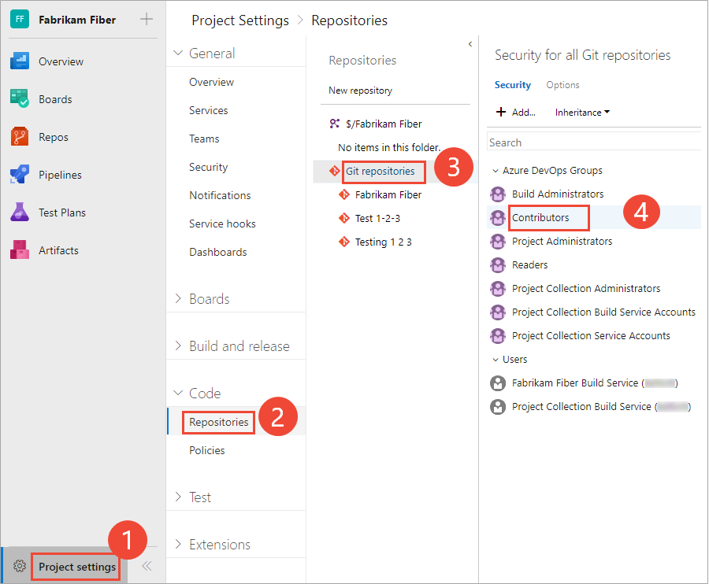
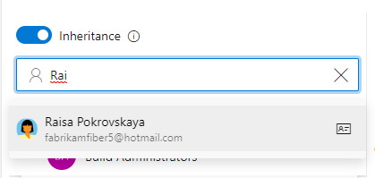
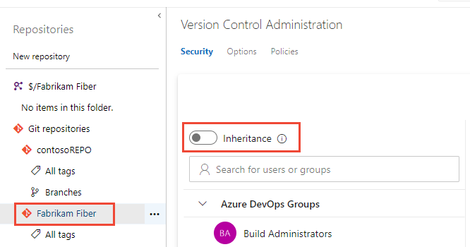

# Set Git repository permissions

[!INCLUDE [version-lt-eq-azure-devops](../../includes/version-lt-eq-azure-devops.md)]

[!INCLUDE [ai-assistance-callout](../../includes/ai-assistance-callout.md)]

Manage access to repositories to lock down who can contribute to your source code and manage other features.  You can set permissions across all Git repositories by making changes to the top-level **Git repositories** entry. Individual repositories inherit permissions from the top-level **Git Repositories** entry. 

> [!NOTE]
> Branches inherit a subset of permissions from assignments made at the repository level. For branch permissions and policies, see [Set branch permissions](branch-permissions.md) and [Improve code quality with branch policies](branch-policies.md).

For guidance on who to provide greater permission levels, see [Manage access by using permissions](../../organizations/security/restrict-access.md).

## Prerequisites

[!INCLUDE [azure-repos-prerequisites](includes/azure-repos-prerequisites.md)]

::: moniker range="azure-devops"

To contribute to the source code, you need **Basic** access level or greater. Users who are granted **Stakeholder** access for private projects don't have access to source code. Users who are granted **Stakeholder** access for public projects have the same access as Contributors and users granted **Basic** access. For more information, see [About access levels](../../organizations/security/access-levels.md).

::: moniker-end

::: moniker range="< azure-devops"

To contribute to the source code, you need **Basic** access level or greater. Users who are granted **Stakeholder** access don't have access to source code. For more information, see [About access levels](../../organizations/security/access-levels.md).
::: moniker-end

## Default repository permissions

By default, members of the project Contributors group have permissions to contribute to a repository. This permission level includes the ability to create branches, create tags, and manage notes. For a description of each security group and permission level, see [Permissions and group reference](../../organizations/security/permissions.md).

[!INCLUDE [temp](../../organizations/security/includes/code-git.md)]

:::moniker range=">= azure-devops-2022"

Beginning with [Azure DevOps sprint 224](/azure/devops/release-notes/2023/sprint-224-update) (Azure DevOps Services and Azure DevOps Server 2022.1 and higher), [Edit policies permission is no longer granted automatically to branch creators](/azure/devops/release-notes/2023/sprint-224-update#removing-edit-policies-permission-to-branch-creator). Previously, when you created a new branch, you were granted permission to edit policies on that branch.

With this update, the default behavior changed. This permission isn't granted even if the **Permission management** setting is switched on for the repository. You must have the **Edit policies** permission granted explicitly (either manually or through REST API) by security permission inheritance or through a group membership.

:::moniker-end

::: moniker range="azure-devops"

## Open security for a repository

You set Git repository permissions from **Project Settings** > **Repositories**.

1. Open the web portal and select the project where you want to add users or groups. To select another project, see [Switch project, repository, team](../../project/navigation/go-to-project-repo.md).

1. Select **Project settings** > **Repositories**.

1. To set the permissions for all Git repositories, select **Security**.

	:::image type="content" source="media/git-permissions/open-repositories-s-185.png" alt-text="Screenshot that shows selecting Project settings > Repositories > Security.":::

1.	To set permissions for a specific repository, select the repository and then select **Security**.

	:::image type="content" source="media/git-permissions/choose-git-repo-security-callouts.png" alt-text="Screenshot that shows selecting the repository and then selecting Security.":::

::: moniker-end 

::: moniker range="< azure-devops"

## Set permissions for a repository

You can manage access to a repository by setting the permission state to **Allow** or **Deny** for a single user or a security group.

::: moniker-end 

::: moniker range="<azure-devops"

1. Open the web portal and select the project where you want to add users or groups. To select another project, see [Switch project, repository, team](../../project/navigation/go-to-project-repo.md).

1. Select **Project settings** > **Repositories**.

1. To set the permissions for all Git repositories for a project, select **Git Repositories** and then select the security group whose permissions you want to manage. For example, select **Contributors**, and then select the permission for **Create repository**.

	[!INCLUDE [temp](../../includes/lightbox-image.md)] 

	 

	[!INCLUDE [temp](../../includes/ability-to-find-user-once-added.md)]

	Otherwise, select a specific repository and select the security group whose permissions you want to manage.

	> [!NOTE]
	> You might add a user or group and not change any permissions for that user or group. After the permissions page refreshes, the user or group no longer appears.

1. Select **Save changes**.

::: moniker-end

::: moniker range="azure-devops"

## Change permissions for a security group

To set permissions for a custom security group, you must previously define that group. For more information, see [Change project-level permissions](../../organizations/security/change-project-level-permissions.md).

1. To set permissions for a specific group, select the group. For example, select **Contributors**.

	:::image type="content" source="media/git-permissions/choose-security-group.png" alt-text="Screenshot that shows selecting the Contributors group.":::

1. Change one or more permissions. To grant permissions, change **Not Set** to **Allow**. To restrict permissions, change **Allow** to **Deny**.

	:::image type="content" source="media/git-permissions/change-permissions.png" alt-text="Screenshot that shows three permissions changed for the Contributors group.":::

The permission changes are automatically saved for the selected group.

## Set permissions for a specific user

1. To set permissions for a specific user, enter the name of the user in the search filter and select from the identities that appear.

	> [!div class="mx-imgBorder"] 
	> 

1. Make the changes to the permission set.

   [!INCLUDE [temp](../../includes/ability-to-find-user-once-added.md)]

   The permission changes are automatically saved for the selected group.

   You might add a user or group and not change any permissions for that user or group. After the permissions page refreshes, the user or group no longer appears.

## Enable or disable inheritance for a specific repository

To enable or disable inheritance for a specific repository, select the repository and then move the **Inheritance** slider to either the on or off position.

[!div class="mx-imgBorder"] 

To learn about inheritance, see [About permissions and groups](../../organizations/security/about-permissions.md#permission-inheritance).

::: moniker-end

## Exempt from policy enforcement and bypass policy permissions

There are many scenarios where you have the occasional need to bypass a branch policy. Some examples are when you revert a change that caused a build break or apply a hotfix in the middle of the night.

Previously, the **Exempt from policy enforcement** permission helped teams manage which users were granted the ability to bypass branch policies when they completed a pull request. However, that permission also granted users the ability to push directly to the branch and bypass the PR process entirely.

The **Exempt from policy enforcement** permission now offers more control to teams that are granting bypass permissions. The following two permissions replace the former permission:

- **Bypass policies when completing pull requests**: Users with this permission can use the override experience for pull requests.
- **Bypass policies when pushing**: Users with this permission can push directly to branches with required policies that are configured.

You can use the bypass option when necessary by granting the first permission and denying the second. You still have protection from accidentally pushing to a branch with policies.

> [!NOTE]
> This change doesn't introduce any behavior changes. Users that were formerly granted **Allow** for **Exempt from policy enforcement** are granted **Allow** for both new permissions. They can both override completion on PRs and push directly to branches with policies.

## Related content

- [Manage access by using permissions](../../organizations/security/restrict-access.md)
- [Default permissions and access](../../organizations/security/permissions-access.md)
- [Permissions and groups reference](../../organizations/security/permissions.md)
- [Git permission command](../tfvc/git-permission-command.md)
- [Security REST API commands](/rest/api/azure/devops/security/)