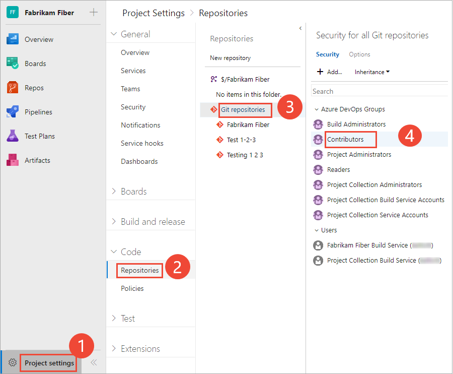
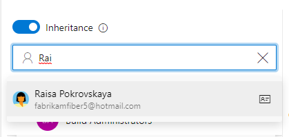
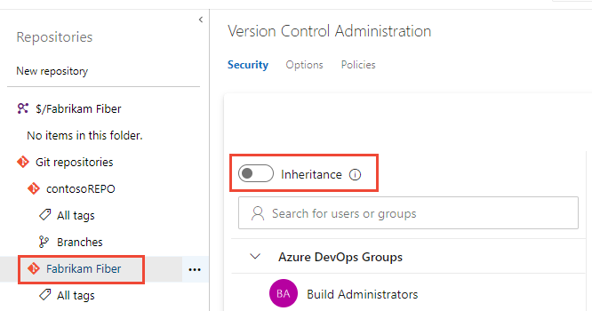

# Set Git repository permissions

[!INCLUDE [version-lt-eq-azure-devops](../../includes/version-lt-eq-azure-devops.md)]

Manage who can access your Git repositories and which actions they can perform. Set permissions at the **All Repositories** level to apply them to every Git repository in a project, or set permissions for an individual repository. Individual repositories inherit permissions from the project-level Git repositories entry.

> [!NOTE]
> Branches inherit a subset of permissions from assignments made at the repository level. For branch permissions and policies, see [Set branch permissions](branch-permissions.md) and [Improve code quality with branch policies](branch-policies.md).

For a comprehensive security guide covering repository permissions, branch policies, commit signing, and real-world implementation scenarios, see [Secure repositories and pull requests](secure-repositories-pull-requests.md).

For guidance on who to provide greater permission levels, see [Manage access by using permissions](../../organizations/security/restrict-access.md).

## Prerequisites

| Category | Requirements |
|----------|--------------|
| **Project access** | Membership in an Azure DevOps project. |
| **Permissions** | **Manage permissions** for the project-level Git repositories entry to manage every repository in the project, or **Manage permissions** for an individual repository to manage that repository. Members of the **Project Administrators** group have this permission by default. For more information, see [Permissions and groups reference](../../organizations/security/permissions.md). |
| **Services** | [Azure Repos enabled](../../organizations/settings/set-services.md). |

## Review default repository permissions

By default, members of the project Contributors group have permissions to contribute to a repository. This permission level includes the ability to create branches, create tags, and manage notes. For a description of each security group and permission level, see [Permissions and group reference](../../organizations/security/permissions.md).

[!INCLUDE [temp](../../organizations/security/includes/code-git.md)]

::: moniker range="azure-devops"

Starting with [Azure DevOps sprint 224](/azure/devops/release-notes/2023/sprint-224-update), branch creators don't automatically get the **Edit policies** permission. This permission isn't granted even if the **Permission management** setting is on for the repository. Grant **Edit policies** explicitly through inheritance, group membership, or a direct assignment.

::: moniker-end

::: moniker range="azure-devops-2022"

In Azure DevOps Server 2022.1 and later, branch creators don't automatically get the **Edit policies** permission. This permission isn't granted even if the **Permission management** setting is on for the repository. Grant **Edit policies** explicitly through inheritance, group membership, or a direct assignment. For more information, see [Azure DevOps Server 2022 Update 1 release notes](/azure/devops/server/release-notes/azuredevops2022u1).

::: moniker-end

## Understand permission states

Before you change a permission, review how Azure DevOps evaluates permission states:

- **Not set** doesn't grant or deny the permission. Permissions assigned through another group or inherited from a parent scope can still apply.
- **Allow** grants the permission unless a more specific or applicable **Deny** overrides it.
- **Deny** generally overrides **Allow**, including permissions inherited or granted through another group. When you deny a permission for a group, the denial affects all members of that group.

Review group membership and inherited permissions before you assign **Deny**. For more information, see [About permissions and groups](../../organizations/security/about-permissions.md).

## Open repository security

::: moniker range="azure-devops"

Set Git repository permissions from **Project settings** > **Repositories**.

1. Open the web portal and select the project where you want to add users or groups. To select another project, see [Switch project, repository, team](../../project/navigation/go-to-project-repo.md).

1. Select **Project settings** > **Repositories**.

1. To set permissions for every Git repository in the project, select **All Repositories** > **Security**.

	:::image type="content" source="media/git-permissions/open-repositories-s-185.png" alt-text="Screenshot that shows opening Security for all repositories in a project.":::

1. To set permissions for a specific repository, select the repository, and then select **Security**.

	:::image type="content" source="media/git-permissions/choose-git-repo-security-callouts.png" alt-text="Screenshot that shows selecting the repository and then selecting Security.":::

::: moniker-end 

::: moniker range="< azure-devops"

Set Git repository permissions from **Project settings** > **Repositories**.

1. Open the web portal and select the project where you want to manage permissions. To select another project, see [Switch project, repository, team](../../project/navigation/go-to-project-repo.md).

1. Select **Project settings** > **Repositories**.

1. To set permissions for every Git repository in the project, select **Git repositories**, and then select the user or security group whose permissions you want to manage.

	[!INCLUDE [temp](../../includes/lightbox-image.md)] 

	 

	Otherwise, select a specific repository, and then select the user or security group whose permissions you want to manage.

1. Change the permissions, and then select **Save changes**.

1. Confirm that each changed permission retains its new state.

::: moniker-end

::: moniker range="azure-devops"

## Change permissions for a group

To set permissions for a custom security group, first define the group. For more information, see [Change project-level permissions](../../organizations/security/change-project-level-permissions.md).

1. Select the group to set permissions. For example, select **Contributors**.

	:::image type="content" source="media/git-permissions/choose-security-group.png" alt-text="Screenshot that shows selecting the Contributors group.":::

1. Change one or more permissions. To grant a permission, select **Allow**. To remove an explicit assignment and use inherited or group permissions, select **Not set**. Select **Deny** only when you need to override an applicable **Allow**.

	:::image type="content" source="media/git-permissions/change-permissions.png" alt-text="Screenshot that shows three permissions changed for the Contributors group.":::

The permission changes are automatically saved. Confirm that each changed permission displays the intended state.

## Change permissions for a user

1. Enter the name of the user in the search filter and select from the identities that appear to set permissions for a specific user.

	> [!div class="mx-imgBorder"] 
	> 

1. Change one or more permissions for the selected user.

   [!INCLUDE [temp](../../includes/ability-to-find-user-once-added.md)]

	The permission changes are automatically saved for the selected user. Confirm that each changed permission displays the intended state.

   You might add a user or group and not change any permissions for that user or group. After the permissions page refreshes, the user or group no longer appears.

## Configure inheritance for a repository

Before you change inheritance, record the current setting and review the repository's explicit and inherited permissions. When you turn off inheritance, permissions from the project-level Git repositories entry no longer flow to the repository. Verify that the remaining assignments provide the intended access before you continue.

To enable or disable inheritance for a specific repository, select the repository, and then set **Inheritance** to **On** or **Off**.

> [!div class="mx-imgBorder"]
> 

After you change inheritance, verify the repository's permission assignments with a representative affected user. If the result is incorrect, restore the previous setting and permission states. To learn about inheritance, see [About permissions and groups](../../organizations/security/about-permissions.md#permission-inheritance).

::: moniker-end

## Configure policy bypass permissions

There are many scenarios where you have the occasional need to bypass a branch policy. Some examples are when you revert a change that caused a build break or apply a hotfix in the middle of the night.

Previously, the **Exempt from policy enforcement** permission helped teams manage which users were granted the ability to bypass branch policies when they completed a pull request. However, that permission also granted users the ability to push directly to the branch and bypass the PR process entirely.

The following two permissions replace **Exempt from policy enforcement** and provide more granular control:

- **Bypass policies when completing pull requests**: Users with this permission can use the override experience for pull requests.
- **Bypass policies when pushing**: Users with this permission can push directly to branches with required policies that are configured.

To let a user bypass policies only when completing pull requests, set **Bypass policies when completing pull requests** to **Allow**. Leave **Bypass policies when pushing** as **Not set** if the user doesn't receive **Allow** through another assignment. Set it to **Deny** only when you need to override an applicable **Allow**.

> [!NOTE]
> Users who previously had **Exempt from policy enforcement** set to **Allow** received **Allow** for both replacement permissions. Review these assignments and set **Bypass policies when pushing** to **Not set** when users don't need to push directly to protected branches and no other assignment grants the permission.

## Troubleshoot permission changes

Use the following guidance when a permission change doesn't have the expected result:

| Issue | Resolution |
|-------|------------|
| You can't change a permission | Verify that you have **Manage permissions** at the project-level Git repositories entry or the selected repository. |
| A user or group doesn't appear in search | Add the identity to the project through a team or security group. Identity changes can take time to appear in search. |
| An **Allow** doesn't grant access | Check the user's group memberships and more specific scopes for an applicable **Deny**. |
| A permission affects the wrong repositories | Confirm whether you changed **All Repositories** or an individual repository. |
| A permission returns after you select **Not set** | Check whether the permission is inherited or granted through another group. |
| Disabling inheritance removes access | Restore the previous inheritance setting or explicit permission assignments that you recorded before the change. |

After you resolve the issue, have a representative affected user verify the intended repository action.

[!INCLUDE [ai-assistance-callout](../../includes/ai-assistance-callout.md)]

## Related content

- [Manage access by using permissions](../../organizations/security/restrict-access.md)
- [Default permissions and access](../../organizations/security/permissions-access.md)
- [Permissions and groups reference](../../organizations/security/permissions.md)
- [Git permission command](../tfvc/git-permission-command.md)
- [Security REST API commands](/rest/api/azure/devops/security/)
