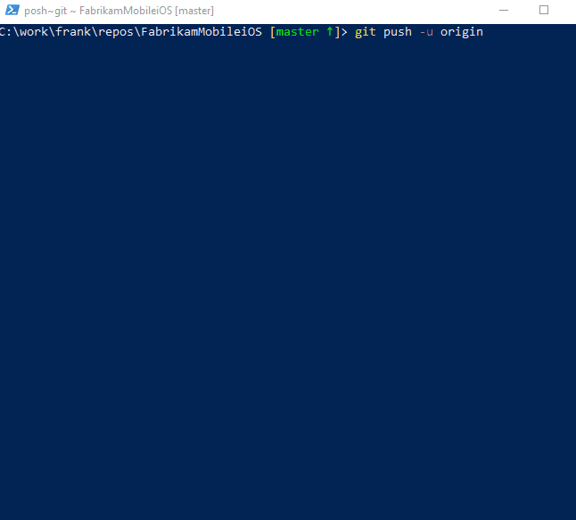

# Use Git Credential Manager to authenticate to Azure Repos

[!INCLUDE [version-lt-eq-azure-devops](../../includes/version-lt-eq-azure-devops.md)]
[!INCLUDE [version-vs-gt-eq-2019](../../includes/version-vs-gt-eq-2019.md)]

Git Credential Manager simplifies authentication with your Azure Repos Git repositories. Credential managers let you use the same credentials that you use for the Azure DevOps Services web portal. Credential managers support multi-factor authentication through Microsoft account or Azure Active Directory (Azure AD).  Besides supporting multi-factor authentication with Azure Repos, credential managers also support [two-factor authentication](https://help.github.com/articles/about-two-factor-authentication/) with GitHub repositories.

Azure Repos provides IDE support for Microsoft account and Azure AD authentication through the following clients:

- [Team Explorer in Visual Studio](../../organizations/projects/connect-to-projects.md)
- [IntelliJ and Android Studio with the Azure Repos Plugin for IntelliJ](/previous-versions/azure/devops/all/java/download-intellij-plug-in) 

If your environment doesn't have an integration available, configure your IDE with a [Personal Access Token](../../organizations/accounts/use-personal-access-tokens-to-authenticate.md) or [SSH](use-ssh-keys-to-authenticate.md) to connect to your repositories.

## Install Git Credential Manager

### Windows

Download and run the latest [Git for Windows installer](https://git-scm.com/download/win), which includes Git Credential Manager. Make sure to enable the Git Credential Manager installation option.

    

### macOS and Linux

You may [use SSH keys](use-ssh-keys-to-authenticate.md) to authenticate to Azure Repos, or you may use [Git Credential Manager](https://github.com/GitCredentialManager/git-credential-manager).

Installation instructions are included in the GitHub repository for GCM.
On Mac, we recommend using [Homebrew](https://github.com/git-ecosystem/git-credential-manager/blob/release/docs/install.md#macos).
On Linux, you can install from a [.deb](https://github.com/GitCredentialManager/git-credential-manager#ubuntudebian-distributions) or a [tarball](https://github.com/GitCredentialManager/git-credential-manager#other-distributions).

## Using the Git Credential Manager

When you connect to a Git repository from your Git client for the first time, the credential manager prompts for credentials. Provide your Microsoft account or Azure AD credentials. If your account has multi-factor authentication enabled, the credential manager prompts you to go through that process as well.

Once authenticated, the credential manager creates and caches a [personal access token](../../organizations/accounts/use-personal-access-tokens-to-authenticate.md) for future connections to the repo. Git commands that connect to this account won't prompt for user credentials until the token expires. A token can be revoked through Azure Repos.

### Getting help

You can open and report issues with Git Credential Manager on the [project GitHub](https://github.com/GitCredentialManager/Git-Credential-Manager/issues).
