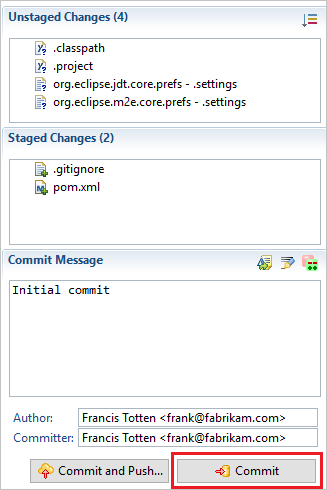

# Share your code in Git using Eclipse
#### Azure Repos | TFS 2018 | TFS 2017 | TFS 2015

Share your Eclipse project with your team in an Azure DevOps Services/TFS Git repo.

## Prerequisites

* An Azure DevOps organization. If you don't have one, you can [sign up](../../organizations/accounts/create-organization.md) for one for free. Each organization includes free, unlimited private Git repositories.
* A local Eclipse project. If your code is already in version control in Azure Repos or TFS and you want to clone it, see [Clone an Azure DevOps Services Git repo using Eclipse](../../java/labs/eclipsegit/index.md).

## Use Team Explorer Everywhere

[Team Explorer Everywhere](https://github.com/Microsoft/team-explorer-everywhere) is an open-source Eclipse plug-in to connect Eclipse to Azure DevOps Services or Team Foundation Server. If you're working with Azure DevOps Services/TFS and Eclipse, use this plugin to connect to your repos, builds, and work items. 

0. [Install the Team Explorer Everywhere plug-in](/azure/devops/java/download-eclipse-plug-in#_install-the-tee-plugin-for-eclipse).

0. Add the Team Explorer Everywhere view in Eclipse. Go to **Window, Show View** and select **Other...** Search for **Team Explorer**, select the **Team Explorer** view, and select **OK**.   

   

## Connect to Azure DevOps Services

0. In the Team Explorer Everywhere view, select **Connect to VSTS or a Team Foundation Server** . 

   
   

0. If you know your Azure DevOps Services or Team Foundation Server account URL, select the **Servers...** button under **Connect to a Team Foundation Server or Azure DevOps organization** to add your TFS server or account to the drop-down list. 
If you don't know your account information for Azure DevOps Services, select **Browse Visual Studio Services** and select **Next**.

   

   Either choice will prompt for your credentials before continuing further. 

0. Select the project where you will share your code from the **Project Selection** dialog and select **Finish**.

## Create a local Git repo for your Eclipse project

Before you can push your project to Azure Repos, you need to add it to a local Git repo.

> [!NOTE]
> If your code is already in a local Git repo, you can skip this step.

0. With your project open in Eclipse, right-click the project name in Project Explorer and select **Team, Share Project...** Select **Git** and select **Next**. 

0. Select **Create...** from the **Configure Git Repository** window and choose a folder for your local Git repo. Select **Finish**.

    

0.  Right-click your project in Project Explorer and select **Team, Commit...**. Stage your changes by dragging your files to the **Staged Changes** field, enter a commit message, then select **Commit**.

    

## Push your project to your Azure DevOps Services/TFS repo

0. In Team Explorer Everywhere, select **Git Repositories**, then right-click the empty repo you want to push your Eclipse project to and select **Copy Clone URL**. If you don't have an empty Git repo created in Azure DevOps Services/TFS yet, you can create one using [these instructions](create-new-repo.md).

    
    
0. In Package Explorer, right-click your project and Select **Team, Push Branch ...** . Paste the clone URL from the clipboard into the **URI** field and select **Next**. Make sure **Configure upstream for push and pull** is selected in the next window and select **Next**.

    
    
0. Review the changes and select **Finish** in the **Push Branch** window.

Your project code is now in your Git repo.

## Troubleshooting

### What if the Git views for commit and push don't show up?

You can [download EGit](http://www.eclipse.org/egit/) to use Git with Eclipse.

## Next steps

> [!div class="nextstepaction"]
> [Learn more about using Git in the Git tutorial](gitworkflow.md)

