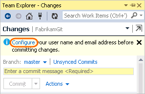
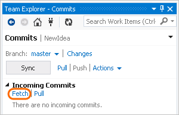
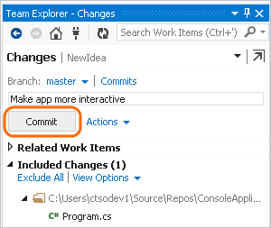

# Share your code with Visual Studio 2013 and Azure Repos Git

> [!div class="op_single_selector"]
> - [Visual Studio 2017](share-your-code-in-git-vs-2017.md)
> - [Visual Studio 2015 Update 2](share-your-code-in-git-vs.md)
> - [Visual Studio 2013](share-your-code-in-git-vs-2013.md)   

#### Azure Repos | TFS 2018 | TFS 2017 | TFS 2015  

Whether your software project is large, small, or brand new, 
in most cases you'll be better off if you use version control 
as early as possible. Here, we'll show you how to get started with 
Git, a distributed system. If you want to work in a centralized system, 
you can instead use [TFVC with Azure Repos](../../repos/tfvc/share-your-code-in-tfvc-vs.md).

[!INCLUDE [temp](_shared/open-team-project-in-vs.md)]

## Clone your repository

0. Clone the repository onto your dev machine.

 

0. Store the repository locally.

 

## Create a new app
If you don't already have an app in the repo, create one.

0. Create a new project.

 

0. Choose a template and add the new code project to version control.

 

## Confirm your settings and add the app

0. On the changes page (Keyboard: Ctrl + 0, G), if you haven't already done it,
confirm your user name and email address.

 

 

0. Add a comment and commit your app to version control.

 

## Snapshot (commit) your code

With your code project stored in a local Git repository on your dev machine, 
you can commit as early and as often as you like.

0. As you write your code, your changes are automatically tracked by Visual Studio. 
You can commit one or more specific changes to your local repository from Solution Explorer
(Keyboard: Ctrl + Alt + L).

 

0. On the Changes page, add a comment and then commit your changes.

 

 These changes are now committed.

 

## Pull changes from your team

Pull changes on a regular basis to ensure your code integrates well with the latest code from the team.

0. From the commits page (Keyboard: Ctrl + 0, O), fetch the commits to see any changes that your team has made.

 

0. When you're ready, pull these commits into your local repository.

 

0. The changes from your team are now integrated in your local repository.

 

## Push your local commits to the server

When the code you've written on your dev machine is ready, you can push your changes from your local Git repository to the project.

0. From the changes page (Keyboard: Ctrl + 0, G), make sure you've committed your changes.

 

0. Go to the commits page (Keyboard: Ctrl + 0, C).

 

0. Push your changes.

 

## Q&A

<!-- BEGINSECTION class="md-qanda" -->

[!INCLUDE [temp](_shared/open-team-project-in-vs-qa.md)]

[!INCLUDE [temp](_shared/qa-vs-launch-fail.md)]

#### Q: How can I see what I've changed?

A: To see what you've changed, compare your changes with the last commit.

 

#### Q: How can I get more information about the commits from my team before I pull them?

A: Sometimes you need to see the details about incoming commits from your team. That way you can understand how a change will integrate with your work.

 

 You can get details on the changes to each file.

 

#### Q: How do I associate my changes with related work items?

A: From the changes page you can run a query, and then drag a work item into the list of related work items.

 

#### Q: Can I use Git command-prompt tools?

A: Yes. See [Use Git from the command prompt](command-prompt.md).

#### Q: Where can I learn more?

A: [Use Visual Studio and Team Foundation Server with Git](overview.md)

<!-- ENDSECTION --> 
