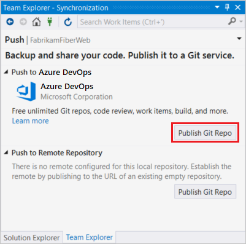
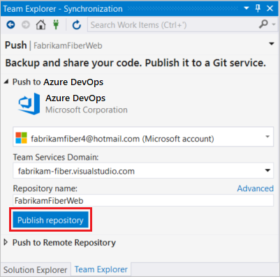
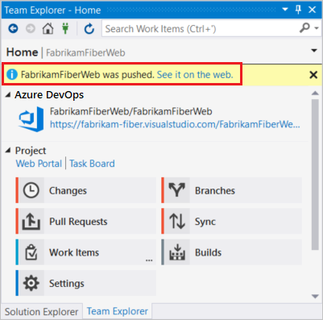

# Share your code with Visual Studio 2017 and Azure Repos Git

> [!div class="op_single_selector"]
> - [Visual Studio 2017](share-your-code-in-git-vs-2017.md)
> - [Visual Studio 2015 Update 2](share-your-code-in-git-vs.md)
> - [Visual Studio 2013](share-your-code-in-git-vs-2013.md)   
   
#### Azure Repos | TFS 2018 | TFS 2017 | TFS 2015 

Share your Visual Studio solution in a new Azure DevOps Services or Team Foundation Server Git repo.

This article walks you through the steps to get a Visual Studio solution on your PC into a Git repo you can share with others. 

If you want to work with a Visual Studio solution hosted in an existing repo, see the [Git tutorial](gitquickstart.md).

## Prerequisites

* An organization in Azure DevOps. If you don't have an organization, you can [sign up](../../organizations/accounts/create-organization.md) for one for free. Each organization includes free, unlimited private Git repositories.

##  Create a local Git repo for your project

Create a new local Git repo for your project by selecting  on the status bar in the lower right hand corner of Visual Studio.
This will create a new repo in the folder the solution is in and commit your code into that repo. You can also right-click your solution in **Solution Explorer** and choose **Add Solution to Source Control**.

Once you have a local repo, select items in the status bar to quickly navigate between Git tasks in Team Explorer.

-  shows the number of unpublished commits in your local branch. Selecting this opens the **Synchronization** view in Team Explorer.
-  shows the number of uncommitted file changes. Selecting this opens the **Changes** view in Team Explorer.
-  shows the current Git repo. Selecting this opens the **Connect** view in Team Explorer.
-  shows your current Git branch. Selecting this displays a branch picker to quickly switch between Git branches or create new branches.   

>[!NOTE]
>If you don't see any icons such as  or , ensure that you have a project open that is part of a Git repo. If your project is brand new or not yet added to a repo, you can add it to one by selecting  on the status bar, or by right-clicking your solution in **Solution Explorer** and choosing **Add Solution to Source Control**.

## Publish your code to Azure Repos

1. Navigate to the **Push** view in Team Explorer by choosing the  icon in the status bar. You can also select **Sync** from the **Home** view in Team Explorer.

2. In the **Push** view in Team Explorer, select the **Publish Git Repo** button under **Push to Visual Studio Team Services**.

 

0. Verify your email and select your account in the **Team Services Domain** drop-down. 

0. Enter your repository name and select **Publish repository**. 

 

   This creates a new project in your account with the same name as the repository. To create the repo in an existing project, click **Advanced** next to **Repository name** and select a project.

0. Your code is now in a Git repo in Azure Repos. You can view your code on the web by selecting **See it on the web** .
  
  
  
## Commit and push updates

0. As you write your code, your changes are automatically tracked by Visual Studio. 
You can [commit](commits.md) changes to your local Git repository by selecting the pending changes icon  from the status bar.

0. On the **Changes** view in Team Explorer, add a message describing your update and commit your changes.

 

0. Select the unpublished changes status bar icon  (or select **Sync** from the **Home** view in Team Explorer). Select **Push** to 
update your code in Azure DevOps Services/TFS.

 

## Get changes from others

Sync your local repo with changes from your team as they make updates.

0. From the **Synchronization** view in Team Explorer, fetch the [commits](commits.md) that your team has made. 
Double-click a commit to view its file changes.

 

0. Select **Sync** to merge the fetched commits into your local repo and then [push](pushing.md) any unpublished changes to Azure Repos.

 

0. The changes from your team are now in your local repo and visible in Visual Studio.
 
## Frequently asked questions

* [I don't see the **Add to Source Control** button in the status bar.](#i-dont-see-the-add-to-source-control-button-in-the-status-bar)
* [How can I see what changes are in a commit before I pull it into my local branch?](#how-can-i-see-what-changes-are-in-a-commit-before-i-pull-it-into-my-local-branch)
* [How do I associate my commits with work items?](#how-do-i-associate-my-commits-with-work-items)
* [Can I use the Git command prompt with Visual Studio?](#can-i-use-the-git-command-prompt-with-visual-studio)

### I don't see the **Add to Source Control** button in the status bar.

The  button in the status bar was added in Visual Studio 2017 (it was **Publish** in Visual Studio 2015 Update 2 and later) and will only appear when you have Git as your source control provider. If your code is already in a Git repo, you won't see the **Add to Source Control** button in the status bar, but the status of the current branch in your local repo instead.

If you are in a previous version of Visual Studio, create a local Git repo for your project by selecting the **Create new Git repository** option in the **New Project** window when you create a new project. 

You can create a local Git repo for an existing solution by right-clicking your project in the **Solution Explorer** and selecting **Add Solution to Source Control**.

### How can I see what changes are in a commit before I pull it into my local branch?

To see what's changed in a commit, go to the **Synchronization** page in Team Explorer and right-click on the commit. Select **View Commit Details**.
You can then right-click on any file modified by the commit and select **Compare with Previous...** to view the changes compared to the previous 
version of the file.

 

### How do I associate my commits with work items?

You can include work items in your commits through **Related Work Items** in the **Changes** page in Team Explorer. 

Work items can be included in commits by adding `#ID` into the commit message. For example, `Fixing bug #23 in the reporting tools` would link work item 23
to the commit. The work item is linked when the commit is pushed to Azure Repos.

### Can I use the Git command prompt with Visual Studio?

Visual Studio's Team Explorer and the Git command line work great together. Changes to your repos made in either tool will be reflected in the other. 
Make sure to install the latest release of [Git for Windows](https://git-scm.com/download/win), which has tools to help you connect to your Azure DevOps Services/TFS repos.

See [the Azure Repos Git tutorial](gitworkflow.md) and the [command reference](command-prompt.md) for additional help using Git from the command line.

## Next steps

> [!div class="nextstepaction"]
> [New to Git repos? Learn more](/azure/devops/learn/git/set-up-a-git-repository)

> [!div class="nextstepaction"]
> [Checkout more steps in the Git workflow](gitquickstart.md)

