# Share your code with Azure Repos and Visual Studio

[!INCLUDE [temp](../includes/version-tfs-2015-cloud.md)]
[!INCLUDE [version-vs-2013-vs-2019](../includes/version-vs-2013-vs-2019.md)]
 
   
This article walks you through the steps to get a Visual Studio solution on your PC into an Azure DevOps Git repo you can share with others. If you want to work with a Visual Studio solution hosted in an existing repo, see the [Git tutorial](gitquickstart.md).

[!INCLUDE [temp](includes/note-new-git-tool.md)]
 

## Prerequisites

::: moniker range="azure-devops"
- **Repos** must be enabled on your project. If the **Repos** hub and associated pages don't display, see [Turn an Azure DevOps service on or off](../../organizations/settings/set-services.md) to reenable Repos.

- To view or contribute to code, you must be a member of an Azure DevOps project with **Basic** access or higher.
  - If you don't have a project, create one or [sign up for free](../../user-guide/sign-up-invite-teammates.md).
  - If you aren't a project member, [get added](../../organizations/accounts/add-organization-users.md).

	> [!NOTE]
	> For public projects, users granted **Stakeholder** access have full access to Azure Repos.
::: moniker-end
::: moniker range=">= azure-devops-2019 < azure-devops"
- **Repos** must be enabled on your project. If the **Repos** hub and associated pages don't display, see [Turn an Azure DevOps service on or off](../../organizations/settings/set-services.md) to reenable Repos.
- To view code, you must be a member of an Azure DevOps project with **Basic** access or higher. If you aren't a project member, [get added](../../organizations/security/add-users-team-project.md).
- To view code, you must be a member of the **Readers** security group or have the corresponding permissions.
- To contribute to code, you must be a member of the **Contributors** security group or have the corresponding permissions.
::: moniker-end

::: moniker range="< azure-devops-2019"
- To view code, you must be a member of an Azure DevOps project with **Basic** access or higher. If you aren't a project member, [get added](../../organizations/security/add-users-team-project.md).
- To view code, you must be a member of the **Readers** security group or have the corresponding permissions.
- To contribute to code, you must be a member of the **Contributors** security group or have the corresponding permissions.
::: moniker-end

##  Create a local Git repo for your project

#### [Visual Studio 2017](#tab/visual-studio-2017)

Create a new local Git repo for your project by selecting  on the status bar in the lower right hand corner of Visual Studio.
This will create a new repo in the folder the solution is in and commit your code into that repo. You can also right-click your solution in **Solution Explorer** and choose **Add Solution to Source Control**.

> [!NOTE]   
> The  button in the status bar was added in Visual Studio 2017 (it was **Publish** in Visual Studio 2015 Update 2 and later) and will only appear when you have Git as your source control provider. If your code is already in a Git repo, you won't see the **Add to Source Control** button in the status bar, but the status of the current branch in your local repo instead.
> 
> If you are in a previous version of Visual Studio, create a local Git repo for your project by selecting the **Create new Git repository** option in the **New Project** window when you create a new project. You can create a local Git repo for an existing solution by right-clicking your project in the **Solution Explorer** and selecting **Add Solution to Source Control**.

Once you have a local repo, select items in the status bar to quickly navigate between Git tasks in Team Explorer.

-  shows the number of unpublished commits in your local branch. Selecting this opens the **Synchronization** view in Team Explorer.
-  shows the number of uncommitted file changes. Selecting this opens the **Changes** view in Team Explorer.
-  shows the current Git repo. Selecting this opens the **Connect** view in Team Explorer.
-  shows your current Git branch. Selecting this displays a branch picker to quickly switch between Git branches or create new branches.   

>[!NOTE]
>If you don't see any icons such as  or , ensure that you have a project open that is part of a Git repo. If your project is brand new or not yet added to a repo, you can add it to one by selecting  on the status bar, or by right-clicking your solution in **Solution Explorer** and choosing **Add Solution to Source Control**.
#### [Visual Studio 2015.2](#tab/visual-studio-2015)

Create a new local Git repo for your project by selecting  on the status bar in the lower right hand corner of Visual Studio.
This will create a new repo in the folder the solution is in and commit your code into that repo.

Once you have a local repo, select items in the status bar to quickly navigate between Git tasks in Team Explorer.

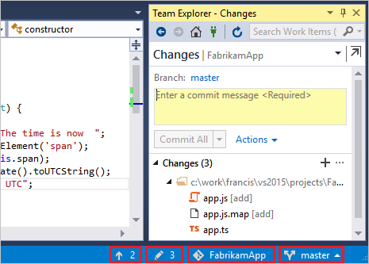

-  shows the number of unpublished commits in your local branch. Selecting this will open the **Sync** view in Team Explorer.
-  shows the number of uncommitted file changes. Selecting this will open the **Changes** view in Team Explorer.
-  shows the current Git repo. Selecting this will open the **Connect** view in Team Explorer.
-  shows your current Git branch. Selecting this displays a branch picker to quickly switch between Git branches or create new branches.   
 

#### [Visual Studio 2013](#tab/visual-studio-2013) 

[!INCLUDE [temp](includes/open-team-project-in-vs.md)]

### Clone your repository

1. Clone the repository onto your dev machine.

   

2. Store the repository locally.

   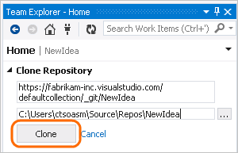

### Create a new app

If you don't already have an app in the repo, create one.

1. Create a new project.

   

2. Choose a template and add the new code project to version control.

   

### Confirm your settings and add the app

1. On the changes page (Keyboard: Ctrl + 0, G), if you haven't already done it,
   confirm your user name and email address.

   

   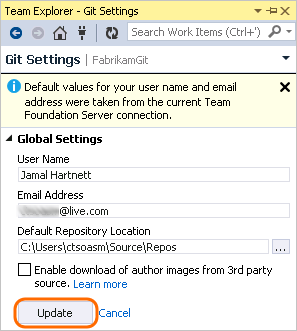

2. Add a comment and commit your app to version control.

   

***

## Publish your code to Azure Repos

#### [Visual Studio 2017](#tab/visual-studio-2017)

1. Navigate to the **Push** view in Team Explorer by choosing the  icon in the status bar. You can also select **Sync** from the **Home** view in Team Explorer.

2. In the **Push** view in Team Explorer, select the **Publish Git Repo** button under **Push to Visual Studio Team Services**.

   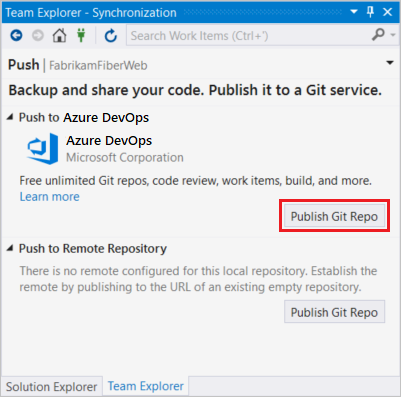

3. Verify your email and select your account in the **Team Services Domain** drop-down. 

4. Enter your repository name and select **Publish repository**. 

   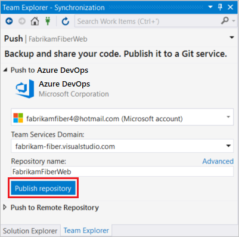

   This creates a new project in your account with the same name as the repository. To create the repo in an existing project, click **Advanced** next to **Repository name** and select a project.

5. Your code is now in a Git repo in Azure Repos. You can view your code on the web by selecting **See it on the web** .
  
   

#### [Visual Studio 2015.2](#tab/visual-studio-2015) 

1. In the **Sync** view in Team Explorer, select the **Publish Git Repo** button under **Publish to Azure Repos**.

   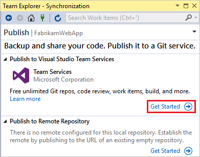

2. Verify your email and select your account in the **Account Url** drop down. 

3. Enter your repository name and select **Publish Repository**. 

   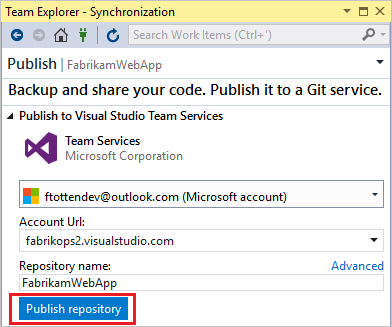

   This creates a new Project in your account with the same name as the repository. To create the repo in an existing Project, click **Advanced** 
   next to **Repository name** and select a project.

	> [!NOTE]
	> The **Publish** link in the status bar (  ) was added in Visual Studio 2015 Update 2 and will only appear when you have Git as your source control provider. If your code is already in a Git repo, you won't see the **Publish** button in the status bar, but the information from your local repo instead.  
	> 
	> If you are in a previous version of Visual Studio, create a local Git repo for your project by selecting the **Create new Git repository** option in the **New Project** window when you create a new project. You can create a local Git repo for an existing solution by right-clicking your project in the Solution Explorer and selecting **Add Solution to Source Control**.
 
4. Your code is now in a Git repo in Azure Repos. You can view your code on the web by selecting **See it on the web**.
  
  

#### [Visual Studio 2013](#tab/visual-studio-2013) 

When the code you've written on your dev machine is ready, you can push your changes from your local Git repository to the project. 

1. From the changes page (Keyboard: Ctrl + 0, G), make sure you've committed your changes.

   

2. Go to the commits page (Keyboard: Ctrl + 0, C).

   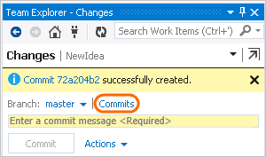

3. Push your changes.

   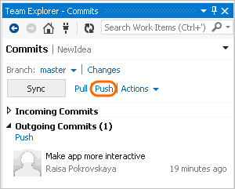

***

## Review commit changes before publishing

#### [Visual Studio 2017](#tab/visual-studio-2017)

- To see what's changed in a commit, go to the **Synchronization** page in Team Explorer and right-click on the commit. Select **View Commit Details**.
You can then right-click on any file modified by the commit and select **Compare with Previous...** to view the changes compared to the previous 
version of the file.

	

#### [Visual Studio 2015.2](#tab/visual-studio-2015)
 
- To see what's changed in a commit, go to the **Synchronization** page in Team Explorer and right-click on the commit. Select **View Commit Details**.
You can then right-click on any file modified by the commit and select **Compare with Previous...** to view the changes compared to the previous 
version of the file.

	

#### [Visual Studio 2013](#tab/visual-studio-2013) 

- To see what you've changed, compare your changes with the last commit.

	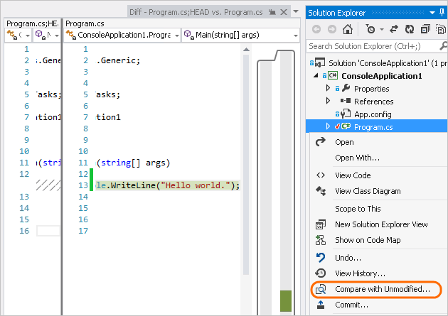

- To review information about the commits from your team before you pull them:

	

- To get details on the changes to each file.

	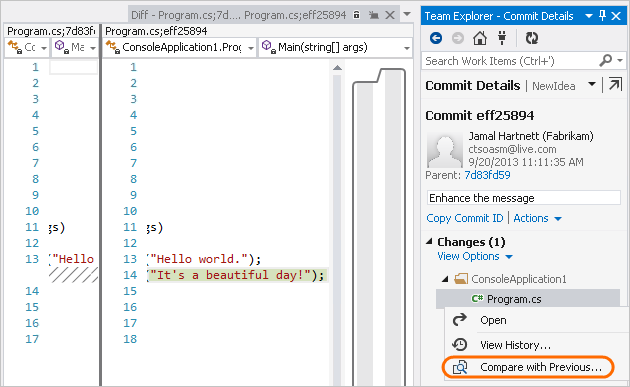

***

<a id="link-work-items" />

## Link work items to your commits

#### [Visual Studio 2017](#tab/visual-studio-2017)

- You can include work items in your commits through **Related Work Items** in the **Changes** page in Team Explorer. 

	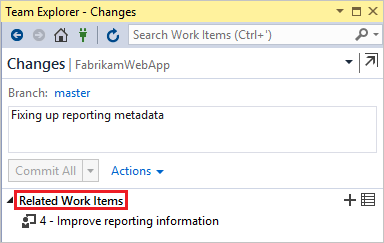

	Also, you can include work items in commits by adding #_ID_ into the commit message. For example, "Fixing bug #23 in the reporting tools" would link work item 23 to the commit. The work item is linked when the commit is pushed to Azure Repos.

#### [Visual Studio 2015.2](#tab/visual-studio-2015)

- You can include work items in your commits through **Related Work Items** in the **Changes** page in Team Explorer. 

	

	Also, you can include work items in commits by adding #_ID_ into the commit message. For example, "Fixing bug #23 in the reporting tools" would link work item 23 to the commit. The work item is linked when the commit is pushed to Azure Repos.

#### [Visual Studio 2013](#tab/visual-studio-2013) 

- From the changes page you can run a query, and then drag a work item into the list of related work items.

	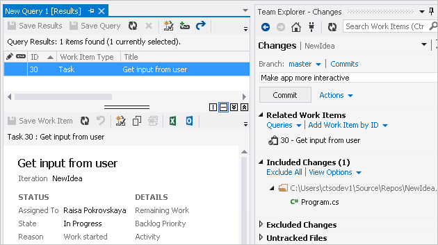

***

## Commit and push updates

#### [Visual Studio 2017](#tab/visual-studio-2017)

1. As you write your code, your changes are automatically tracked by Visual Studio. 
   You can [commit](commits.md) changes to your local Git repository by selecting the pending changes icon  from the status bar.

2. On the **Changes** view in Team Explorer, add a message describing your update and commit your changes.

   

3. Select the unpublished changes status bar icon  (or select **Sync** from the **Home** view in Team Explorer). Select **Push** to 
   update your code in Azure DevOps Services/TFS.

   

#### [Visual Studio 2015.2](#tab/visual-studio-2015)

1. As you write your code, your changes are automatically tracked by Visual Studio. 
   You can [commit](commits.md) changes to your local Git repository by selecting the pending changes icon (  ) from the status bar.

2. On the **Changes** view in Team Explorer, add a message describing your update and commit your changes.

   

3. Select the unpublished changes status bar icon (  ) or the **Sync** view in Team Explorer. Select **Push** to 
   update your code in Azure DevOps Services/TFS.

   

#### [Visual Studio 2013](#tab/visual-studio-2013)

With your code project stored in a local Git repository on your dev machine, 
you can commit as early and as often as you like.

1. As you write your code, your changes are automatically tracked by Visual Studio. 
   You can commit one or more specific changes to your local repository from Solution Explorer
   (Keyboard: Ctrl + Alt + L).

   

2. On the Changes page, add a comment and then commit your changes.

   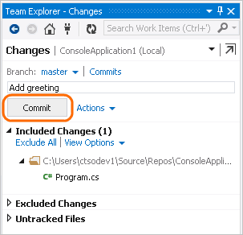

   These changes are now committed.

   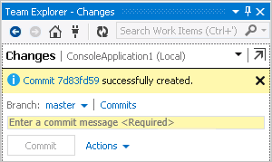

1. When the code you've written on your dev machine is ready, you can push your changes from your local Git repository to the project. From the changes page (Keyboard: Ctrl + 0, G), make sure you've committed your changes.

   

2. Go to the commits page (Keyboard: Ctrl + 0, C).

   

3. Push your changes.

   

***

## Pull changes from your team

#### [Visual Studio 2017](#tab/visual-studio-2017)

Sync your local repo with changes from your team as they make updates.

1. From the **Synchronization** view in Team Explorer, fetch the [commits](commits.md) that your team has made. 
   Double-click a commit to view its file changes.

   

2. Select **Sync** to merge the fetched commits into your local repo and then [push](pushing.md) any unpublished changes to Azure Repos.

   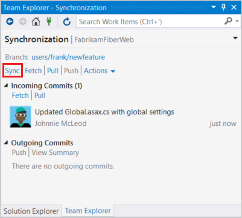

3. The changes from your team are now in your local repo and visible in Visual Studio.
 
#### [Visual Studio 2015.2](#tab/visual-studio-2015)

Sync your local repo with changes from your team as they make updates.

1. From the **Sync** view in Team Explorer, fetch the [commits](commits.md) that your team has made. 
   Double-click a commit to view its file changes.

   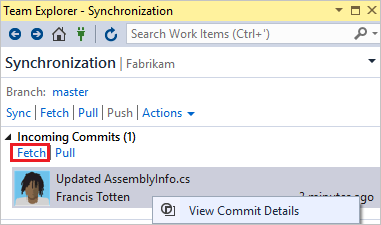

2. Select **Sync** to merge the fetched commits into your local repo and then [push](pushing.md) any unpublished changes to Azure Repos.

   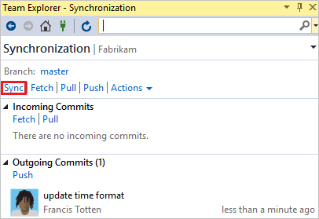

3. The changes from your team are now in your local repo and visible in Visual Studio.

   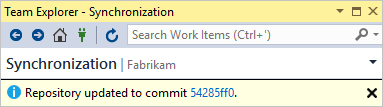

#### [Visual Studio 2013](#tab/visual-studio-2013) 

Pull changes on a regular basis to ensure your code integrates well with the latest code from the team.

1. From the commits page (Keyboard: Ctrl + 0, O), fetch the commits to see any changes that your team has made.

   

2. When you're ready, pull these commits into your local repository.

   

3. The changes from your team are now integrated in your local repository.

   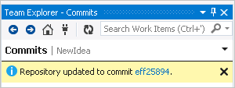

***

## Troubleshooting

<!-- BEGINSECTION class="md-qanda" -->

[!INCLUDE [temp](includes/open-team-project-in-vs-qa.md)]

[!INCLUDE [temp](includes/qa-vs-launch-fail.md)]

### Can I use the Git command prompt with Visual Studio?

**A:** Visual Studio's Team Explorer and the Git command line work great together. Changes to your repos made in either tool will be reflected in the other. 
Make sure to install the latest release of [Git for Windows](https://git-scm.com/download/win), which has tools to help you connect to your Azure DevOps Services/TFS repos.

See [the Azure Repos Git tutorial](gitworkflow.md) and the [command reference](command-prompt.md) for additional help using Git from the command line.

<!-- ENDSECTION -->
 
## Next steps

> [!div class="nextstepaction"]
> [Set up a build](../../pipelines/get-started/what-is-azure-pipelines.md) for your code and learn more about using Git in the [Azure Repos Git tutorial](gitworkflow.md).

## Related articles

- [New to Git repos? Learn more](/devops/develop/git/set-up-a-git-repository)
- [Git workflow](gitquickstart.md)

