# Share your code with Azure Repos and Visual Studio

[!INCLUDE [version-gt-eq-2015](../../includes/version-gt-eq-2015.md)]
[!INCLUDE [version-vs-gt-2013](../../includes/version-vs-gt-2013.md)]

Share your Visual Studio solution with others by hosting your code in an **Azure Repos** Git repository. You can use Visual Studio to manage **Azure Repos** Git repositories or GitHub repositories. This article provides procedures for the following tasks:

> [!div class="checklist"]
> * Add a project or solution to a local Git repository
> * Publish your code to an **Azure Repos** Git repository or GitHub repository
> * Review your code changes before publishing
> * Link work items to your commits
> * Commit and push updates
> * Pull changes from the main branch of your repository

To clone a GitHub repository, get the clone URL as described in [Cloning a repository](https://docs.github.com/repositories/creating-and-managing-repositories/cloning-a-repository).

For an overview of the Git workflow, see [Azure Repos Git tutorial](gitworkflow.md).


## Prerequisites

[!INCLUDE [azure-repos-prerequisites](includes/azure-repos-prerequisites.md)]

To learn more about permissions and access, see [Default Git repository and branch permissions](../../organizations/security/default-git-permissions.md) and [About access levels](../../organizations/security/access-levels.md).

[!INCLUDE [temp](includes/note-new-git-tool.md)]


## Add a project or solution to a new local Git repository

The first step to sharing your Visual Studio solution with others using Git is to create a local Git repo for your code. If it's your first time using Visual Studio to connect to **Azure Repos**, see [Connect to a project from Visual Studio](/azure/devops/organizations/projects/connect-to-projects#connect-from-visual-studio-or-team-explorer) for details.


#### [Visual Studio 2019](#tab/visual-studio-2019)

1. Create a new local Git repo for your Visual Studio solution, by right-clicking the solution name in **Solution Explorer**, and then selecting **Create Git Repository**. Or, choose **Add to Source Control** on the status bar in the lower right-hand corner of Visual Studio, and then select **Git**. If you don't see these options, then your code is already in a Git repo.

   :::image type="content" source="media/share-your-code-in-git-vs/visual-studio-2019/common/create-git-repository-solution-explorer.png" border="true" alt-text="Screenshot of the 'Create Git repository' option in the Solution Explorer context menu in Visual Studio 2019." lightbox="media/share-your-code-in-git-vs/visual-studio-2019/common/create-git-repository-solution-explorer-lrg.png":::

   Or, choose **Git > Create Git Repository** from the menu bar to launch the **Create a Git repository** window. If you don't see this option, then your code is already in a Git repo.

   :::image type="content" source="media/share-your-code-in-git-vs/visual-studio-2019/common/create-git-repository-git-menu.png" border="true" alt-text="Screenshot of the 'Create Git Repository' option in the Git menu from the menu bar of Visual Studio 2019." lightbox="media/share-your-code-in-git-vs/visual-studio-2019/common/create-git-repository-git-menu-lrg.png":::

2. This step only applies to the Visual Studio Git version control experience: in the **Create a Git repository** window, choose **Local only**, verify the local path is correct, and then choose **Create**.

   :::image type="content" source="media/share-your-code-in-git-vs/visual-studio-2019/git-experience/create-git-repository-window.png" border="true" alt-text="Screenshot of the 'Create a Git repository' window with the 'Local only' option selected in Visual Studio 2019." lightbox="media/share-your-code-in-git-vs/visual-studio-2019/git-experience/create-git-repository-window-lrg.png":::

   **Team Explorer** doesn't launch the **Create a Git repository** window, and assumes you want a local Git repo.

You've now created a local Git repo in the Visual Studio solution folder and committed your code into that repo. Your local Git repo contains both your Visual Studio solution and Git resources.

:::image type="content" source="media/share-your-code-in-git-vs/visual-studio-2019/common/file-explorer-git-folder.png" border="true" alt-text="Screenshot of the Git folder, Git ignore file, and Git attributes file in Windows file explorer." lightbox="media/share-your-code-in-git-vs/visual-studio-2019/common/file-explorer-git-folder-lrg.png":::


#### [Visual Studio 2017](#tab/visual-studio-2017)

Create a new local Git repo for your project by selecting  on the status bar in the lower right-hand corner of Visual Studio.
This will create a new repo in the folder the solution is in and commit your code into that repo. You can also right-click your solution in **Solution Explorer** and choose **Add Solution to Source Control**.

> [!NOTE]
> The  button in the status bar was added in Visual Studio 2017 (it was **Publish** in Visual Studio 2015 Update 2 and later) and will only appear when you have Git as your source control provider. If your code is already in a Git repo, you won't see the **Add to Source Control** button in the status bar, but the status of the current branch in your local repo instead.
> 
> If you are in a previous version of Visual Studio, create a local Git repo for your project by selecting the **Create new Git repository** option in the **New Project** window when you create a new project. You can create a local Git repo for an existing solution by right-clicking your project in the **Solution Explorer** and selecting **Add Solution to Source Control**.

Once you have a local repo, select items in the status bar to quickly navigate between Git tasks in Team Explorer.

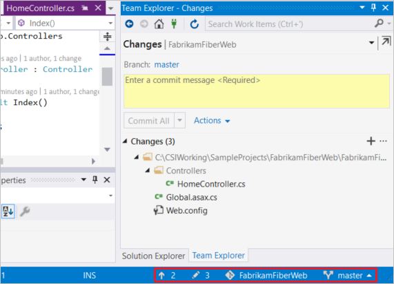

-  shows the number of unpublished commits in your local branch. Selecting this opens the **Synchronization** view in Team Explorer.
-  shows the number of uncommitted file changes. Selecting this opens the **Changes** view in Team Explorer.
-  shows the current Git repo. Selecting this opens the **Connect** view in Team Explorer.
-  shows your current Git branch. Selecting this displays a branch picker to quickly switch between Git branches or create new branches.   

>[!NOTE]
>If you don't see any icons such as  or , ensure that you have a project open that is part of a Git repo. If your project is brand new or not yet added to a repo, you can add it to one by selecting  on the status bar, or by right-clicking your solution in **Solution Explorer** and choosing **Add Solution to Source Control**.
#### [Visual Studio 2015.2](#tab/visual-studio-2015)

Create a new local Git repo for your project by selecting  on the status bar in the lower right-hand corner of Visual Studio.
This will create a new repo in the folder the solution is in and commit your code into that repo.

Once you have a local repo, select items in the status bar to quickly navigate between Git tasks in Team Explorer.

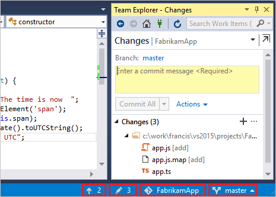

-  shows the number of unpublished commits in your local branch. Selecting this will open the **Sync** view in Team Explorer.
-  shows the number of uncommitted file changes. Selecting this will open the **Changes** view in Team Explorer.
-  shows the current Git repo. Selecting this will open the **Connect** view in Team Explorer.
-  shows your current Git branch. Selecting this displays a branch picker to quickly switch between Git branches or create new branches.   
 

#### [Visual Studio 2013](#tab/visual-studio-2013) 

[!INCLUDE [temp](includes/open-team-project-in-vs.md)]

### Clone your repository

1. Clone the repository onto your dev machine.

   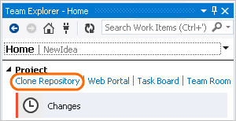

2. Store the repository locally.

   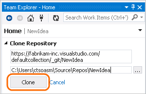

### Create a new app

If you don't already have an app in the repo, create one.

1. Create a new project.

   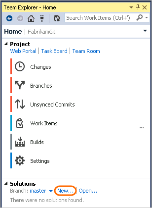

2. Choose a template and add the new code project to version control.

   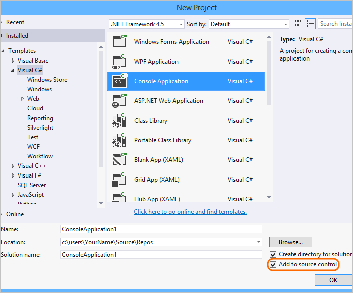

### Confirm your settings and add the app

1. On the changes page (Keyboard: Ctrl + 0, G), if you haven't already done it,
   confirm your user name and email address.

   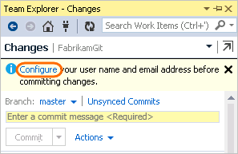

   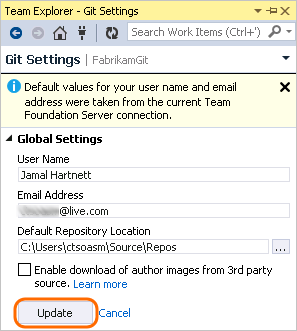

2. Add a comment and commit your app to version control.

   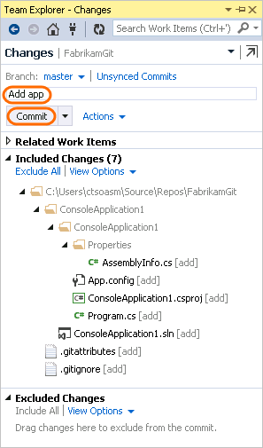


#### [Git Command Line](#tab/command-line)

1. [Download and install Git](http://git-scm.com/download). When prompted during the install, enable [Git Credential Manager](set-up-credential-managers.md).

1. At the command prompt, go to the root folder that contains your Visual Studio solution and run the following commands. These commands create a local Git repo in the Visual Studio solution folder and commit your code into that repo.

    > [!div class="tabbedCodeSnippets"]
    ```Git CLI
    > git init
    > git commit -am "first commit"
    > git branch -m main
    ```

   Your local Git repo now contains both your Visual Studio solution and Git resources.

   :::image type="content" source="media/share-your-code-in-git-vs/git-cli/file-explorer-git-solution-folder.png" border="true" alt-text="Screenshot of the Git folder, Git ignore file, and Git attributes file in Windows file explorer.":::


***


## Publish your code

You can share your work with others by publishing your local Git repo to an **Azure Repos** Git repo.

#### [Visual Studio 2019](#tab/visual-studio-2019)

Visual Studio 2019 version 16.8 and later versions provides a Git version control experience while maintaining the **Team Explorer** Git user interface. To use **Team Explorer**, uncheck **Tools** > **Options** > **Preview Features** > **New Git user experience** from the menu bar. You can exercise Git features from either interface interchangeably. Below, we provide a side-by-side comparison for publishing your code.

> [!NOTE]
> One advantage of connecting to a project through **Team Explorer** is you gain access to the Work Items hub. For an overview of **Team Explorer** features, see [Navigate in Visual Studio Team Explorer](../../user-guide/work-team-explorer.md).

:::row:::
  :::column span="":::

    **Visual Studio Git** <br><br>

    1. Connect to an Azure DevOps repo by right-clicking the solution name in **Solution Explorer**, and then selecting **Push to Git service** to launch the **Create a Git repository** window.

       :::image type="content" source="media/share-your-code-in-git-vs/visual-studio-2019/git-experience/push-to-git-service-solution-explorer.png" border="true" alt-text="Screenshot of the 'Push to Git service' menu option in the Git menu on the menu bar in Visual Studio 2019." lightbox="media/share-your-code-in-git-vs/visual-studio-2019/git-experience/push-to-git-service-solution-explorer-lrg.png":::

       Or, choose **Git > Push to Git service** from the menu bar to launch the **Create a Git repository** window.

       :::image type="content" source="media/share-your-code-in-git-vs/visual-studio-2019/git-experience/push-to-git-service-git-menu.png" border="true" alt-text="Screenshot of the 'Push to Git service' option in the in Visual Studio 2019 context menu." lightbox="media/share-your-code-in-git-vs/visual-studio-2019/git-experience/push-to-git-service-git-menu-lrg.png":::

    2. Open a browser and navigate to your Azure DevOps project by using a URL in the form of `https://dev.azure.com/<OrganizationName>/<ProjectName>`. If you don't have a project yet, [create one](/azure/devops/organizations/projects/create-project).<br>
    
    3. In your Azure DevOps project, [Create](/azure/devops/repos/git/create-new-repo) an empty Git repo without a README file. Copy the clone URL from the **Clone Repository** popup.

       :::image type="content" source="media/share-your-code-in-git-vs/visual-studio-2019/common/clone-repository-popup.png" border="true" alt-text="Screenshot of the 'Clone Repository' popup from the Azure DevOps project site." lightbox="media/share-your-code-in-git-vs/visual-studio-2019/common/clone-repository-popup-lrg.png":::

    4. In the **Create a Git repository** window, choose **Existing remote** and enter the repo clone URL from the previous step, and then choose **Push**. For more information on how to create a new Azure DevOps repo, see [Create a new Git repo in your project](/azure/devops/repos/git/create-new-repo?view=azure-devops&preserve-view=true).

       :::image type="content" source="media/share-your-code-in-git-vs/visual-studio-2019/git-experience/create-git-repository-window-remote.png" border="true" alt-text="Screenshot of the 'Create a Git repository' window, with the URL of an empty Azure repo, in Visual Studio 2019." lightbox="media/share-your-code-in-git-vs/visual-studio-2019/git-experience/create-git-repository-window-remote-lrg.png":::

    5. The **Git Changes** window shows a confirmation message that your code is now in an Azure DevOps repo.

       :::image type="content" source="media/share-your-code-in-git-vs/visual-studio-2019/git-experience/push-to-git-service-git-changes.png" border="true" alt-text="Screenshot of the 'Git Changes' window, with a confirmation message that your code is in 'Azure DevOps' repo, in Visual Studio 2019." lightbox="media/share-your-code-in-git-vs/visual-studio-2019/git-experience/push-to-git-service-git-changes-lrg.png":::

  :::column-end:::
  :::column span="":::

    **Visual Studio Team Explorer** <br><br>

    1. In the **Push to Azure Dev Ops Services** section of the **Synchronization** view in **Team Explorer**, select the **Publish Git Repo** button.

       :::image type="content" source="media/share-your-code-in-git-vs/visual-studio-2019/team-explorer/publish-git-repo-team-explorer.png" border="true" alt-text="Screenshot of the 'Push' view of 'Team Explorer' in Visual Studio 2019." lightbox="media/share-your-code-in-git-vs/visual-studio-2019/team-explorer/publish-git-repo-team-explorer-lrg.png":::

    2. Choose your Azure DevOps account, organization, and repo name, and then select **Publish Repository**.

       :::image type="content" source="media/share-your-code-in-git-vs/visual-studio-2019/team-explorer/publish-git-repo-details-team-explorer.png" border="true" alt-text="Screenshot of the Azure DevOps account, organization, and repo name options and the 'Publish Repository' button in the 'Synchronization' view of 'Team Explorer' in Visual Studio 2019." lightbox="media/share-your-code-in-git-vs/visual-studio-2019/team-explorer/publish-git-repo-details-team-explorer-lrg.png":::

       This step creates a new project in your Azure DevOps account with the same name that you selected for the repo. To create the repo in an existing project, select **Advanced** next to the **Repository name**, and then choose a project.<br><br>

    3. Your code is now in a **Azure Repos** Git repository. You can view your code on the web by selecting **See it on the web**.

       :::image type="content" source="media/share-your-code-in-git-vs/visual-studio-2019/team-explorer/view-git-repo-on-web.png" border="true" alt-text="Screenshot of the 'See it on the web' link in the 'Home' view of 'Team Explorer' in Visual Studio 2019." lightbox="media/share-your-code-in-git-vs/visual-studio-2019/team-explorer/view-git-repo-on-web-lrg.png":::

   :::column-end:::
:::row-end:::
    
[!INCLUDE [project-urls](../../includes/project-urls.md)]


#### [Visual Studio 2017](#tab/visual-studio-2017)

1. Navigate to the **Push** view in Team Explorer by choosing the  icon in the status bar. You can also select **Sync** from the **Home** view in Team Explorer.

2. In the **Push** view in Team Explorer, select the **Publish Git Repo** button under **Push to Visual Studio Team Services**.

   

3. Verify your email and select your account in the **Team Services Domain** drop-down. 

4. Enter your repository name and select **Publish repository**. 

   

   This creates a new project in your account with the same name as the repository. To create the repo in an existing project, click **Advanced** next to **Repository name** and select a project.

5. Your code is now in a Git repo in Azure Repos. You can view your code on the web by selecting **See it on the web** .
  
   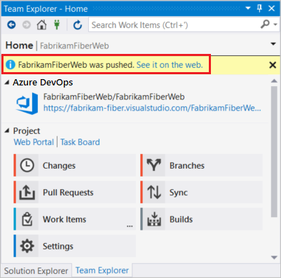

#### [Visual Studio 2015.2](#tab/visual-studio-2015) 

1. In the **Sync** view in Team Explorer, select the **Publish Git Repo** button under **Publish to Azure Repos**.

   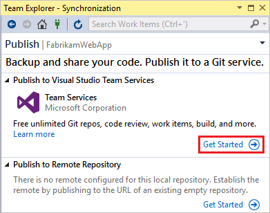

2. Verify your email and select your account in the **Account Url** drop down. 

3. Enter your repository name and select **Publish Repository**. 

   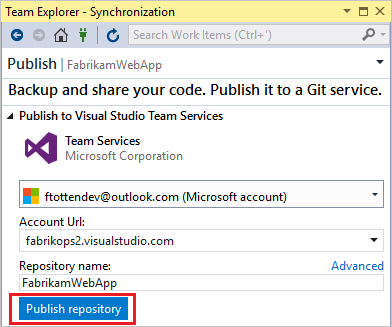

   This creates a new Project in your account with the same name as the repository. To create the repo in an existing Project, click **Advanced** 
   next to **Repository name** and select a project.

	> [!NOTE]
	> The **Publish** link in the status bar (  ) was added in Visual Studio 2015 Update 2 and will only appear when you have Git as your source control provider. If your code is already in a Git repo, you won't see the **Publish** button in the status bar, but the information from your local repo instead.  
	> 
	> If you are in a previous version of Visual Studio, create a local Git repo for your project by selecting the **Create new Git repository** option in the **New Project** window when you create a new project. You can create a local Git repo for an existing solution by right-clicking your project in the Solution Explorer and selecting **Add Solution to Source Control**.
 
4. Your code is now in a Git repo in Azure Repos. You can view your code on the web by selecting **See it on the web**.
  
  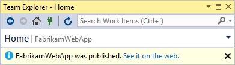


#### [Visual Studio 2013](#tab/visual-studio-2013) 

When the code you've written on your dev machine is ready, you can push your changes from your local Git repository to the project. 

1. From the changes page (Keyboard: Ctrl + 0, G), make sure you've committed your changes.

   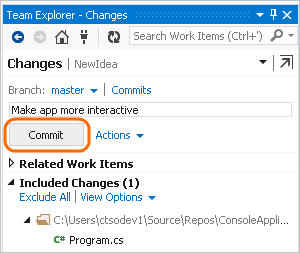

2. Go to the commits page (Keyboard: Ctrl + 0, C).

   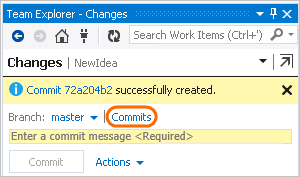

3. Push your changes.

   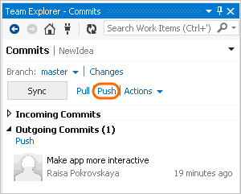


#### [Git Command Line](#tab/command-line)

1. Open a browser and navigate to your Azure DevOps project using a URL in the form of `https://dev.azure.com/<OrganizationName>/<ProjectName>`. If you don't have a project yet, [create one](/azure/devops/organizations/projects/create-project).

1. In your Azure DevOps project, [create](/azure/devops/repos/git/create-new-repo) an empty Git repo without a README file. Copy the clone URL from the **Clone Repository** popup.

    :::image type="content" source="media/share-your-code-in-git-vs/visual-studio-2019/common/clone-repository-popup.png" border="true" alt-text="Screenshot of the 'Clone Repository' popup from the Azure DevOps project site.":::

1. To publish your local commit to **Azure repos**, run the following commands at the command prompt in your local git repo folder, using the clone URL from the previous step.

    > [!div class="tabbedCodeSnippets"]
    ```Git CLI
    > git remote add origin <clone URL>
    > git push -u origin main
    ```

   Your code is now published to the `main` branch of an **Azure Repos** Git repository.
    
[!INCLUDE [project-urls](../../includes/project-urls.md)]


***


## Review commit changes

It's good practice to review the code changes in your commit before publishing. Visual Studio provides a diff view that helps you see all the changes you've made since the previous commit.

#### [Visual Studio 2019](#tab/visual-studio-2019)

:::row:::
  :::column span="":::

    **Visual Studio Git** <br><br>

    1. To see what's changed in a commit, open the **Git Repository** window by choosing **Git > Manage Branches** from the menu bar.

       :::image type="content" source="media/share-your-code-in-git-vs/visual-studio-2019/git-experience/manage-branches-git-menu.png" border="true" alt-text="Screenshot of in Visual Studio 2019." lightbox="media/share-your-code-in-git-vs/visual-studio-2019/git-experience/manage-branches-git-menu-lrg.png":::

    2. In the **Git Repository** window, select your branch, right-click the commit, and then choose **View Commit Details** to open the **Commit** window.

       :::image type="content" source="media/share-your-code-in-git-vs/visual-studio-2019/git-experience/git-repository-window.png" border="true" alt-text="Screenshot of the 'View Commit Details' menu option for a commit in the 'Git Repository' window in Visual Studio 2019." lightbox="media/share-your-code-in-git-vs/visual-studio-2019/git-experience/git-repository-window-lrg.png":::

    3. In the **Commit** window, you can right-click on any file and select **Compare with Previous** to view the file changes made by the commit.

       :::image type="content" source="media/share-your-code-in-git-vs/visual-studio-2019/git-experience/git-details-window.png" border="true" alt-text="Screenshot of the 'Compare with Previous' option in the Commit pane in Visual Studio 2019." lightbox="media/share-your-code-in-git-vs/visual-studio-2019/git-experience/git-details-window-lrg.png":::

  :::column-end:::
  :::column span="":::

    **Visual Studio Team Explorer** <br><br>

    1. To see what's changed in a commit, go to the **Synchronization** page in **Team Explorer**, right-click on any commit, and then choose **View Commit Details** to open the **Git Details** window.

       :::image type="content" source="media/share-your-code-in-git-vs/visual-studio-2019/team-explorer/commit-sync-team-explorer.png" border="true" alt-text="Screenshot of a commit in the Synchronization view of Team Explorer in Visual Studio 2019." lightbox="media/share-your-code-in-git-vs/visual-studio-2019/team-explorer/commit-sync-team-explorer-lrg.png":::

    2. In the **Commit Details** window, you can right-click on any file and select **Compare with Previous** to view the file changes made by the commit.

       :::image type="content" source="media/share-your-code-in-git-vs/visual-studio-2019/team-explorer/git-details-window.png" border="true" alt-text="Screenshot of the 'Compare with Previous' option in the 'Commit Details' window in Visual Studio 2019." lightbox="media/share-your-code-in-git-vs/visual-studio-2019/team-explorer/git-details-window-lrg.png":::

   :::column-end:::
:::row-end:::


#### [Visual Studio 2017](#tab/visual-studio-2017)

- To see what's changed in a commit, go to the **Synchronization** page in Team Explorer and right-click on the commit. Select **View Commit Details**.
You can then right-click on any file modified by the commit and select **Compare with Previous...** to view the changes compared to the previous 
version of the file.

	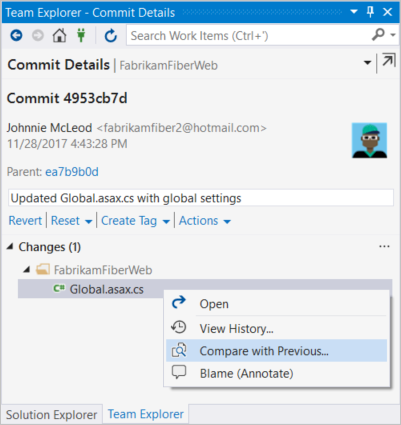


#### [Visual Studio 2015.2](#tab/visual-studio-2015)
 
- To see what's changed in a commit, go to the **Synchronization** page in Team Explorer and right-click on the commit. Select **View Commit Details**.
You can then right-click on any file modified by the commit and select **Compare with Previous...** to view the changes compared to the previous 
version of the file.

	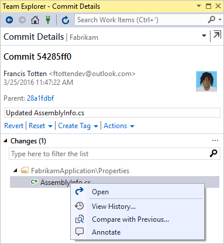


#### [Visual Studio 2013](#tab/visual-studio-2013) 

- To see what you've changed, compare your changes with the last commit.

	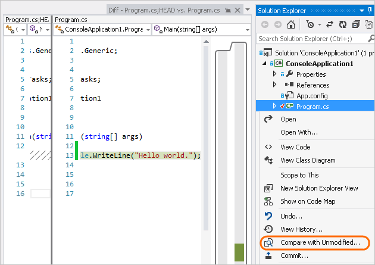

- To review information about the commits from your team before you pull them:

	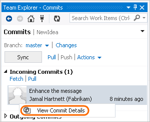

- To get details on the changes to each file.

	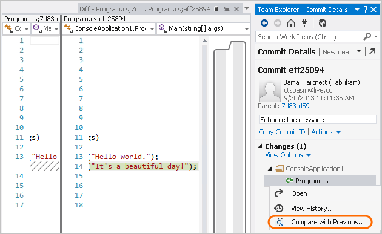


#### [Git Command Line](#tab/command-line)

To show a diff view of the last commit in your current branch, run the following command at the command prompt in your local git repo folder.

> [!div class="tabbedCodeSnippets"]
```Git CLI
> git show
```


***

<a id="link-work-items" />


## Link work items to your commits

As you develop your software, you can capture which commits support the completion of work items like Azure DevOps tasks or bug fixes. The audit trail of work items linked to commits lets your team understand how tasks and bugs were resolved.

> [!NOTE]
> The _#ID_ syntax is supported when you connect to an Azure Repos Git repository. If you connect to a GitHub repository, you can still [link to work items](/azure/devops/boards/github/link-to-from-github), but must use the _#ABID_ syntax, and have previously set up an [Azure Boards-GitHub connection](/azure/devops/boards/github/).


#### [Visual Studio 2019](#tab/visual-studio-2019)

:::row:::
  :::column span="":::

    **Visual Studio Git** <br>

    You can link work items to commits by adding _#ID_ into the commit message. For example, the commit message "*Fix bug #12 in the reporting tools*" would link work item 12 to the commit when the commit is pushed to **Azure Repos**.

      :::image type="content" source="media/share-your-code-in-git-vs/visual-studio-2019/git-experience/add-related-work-item-git.png" border="true" alt-text="Screenshot of a work item linked to a commit in the 'Git Changes' window in Visual Studio 2019." lightbox="media/share-your-code-in-git-vs/visual-studio-2019/git-experience/add-related-work-item-git-lrg.png":::

  :::column-end:::
  :::column span="":::

    **Visual Studio Team Explorer** <br>

    You can include work items in your commits through **Related Work Items** in the **Changes** view of **Team Explorer**.

      :::image type="content" source="media/share-your-code-in-git-vs/visual-studio-2019/team-explorer/add-related-work-item-team-explorer.png" border="true" alt-text="Screenshot of a work item linked to a commit in the Changes view of Team Explorer in Visual Studio 2019." lightbox="media/share-your-code-in-git-vs/visual-studio-2019/team-explorer/add-related-work-item-team-explorer-lrg.png":::

    You can also link work items to commits by adding _#ID_ into the commit message. For example, the commit message "*Fix bug #12 in the reporting tools*" would link work item 12 to the commit when the commit is pushed to **Azure Repos**.

   :::column-end:::
:::row-end:::

#### [Visual Studio 2017](#tab/visual-studio-2017)

- You can include work items in your commits through **Related Work Items** in the **Changes** page in Team Explorer. 

	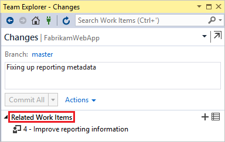

	Also, you can include work items in commits by adding #_ID_ into the commit message. For example, "Fixing bug #23 in the reporting tools" would link work item 23 to the commit. The work item is linked when the commit is pushed to Azure Repos.

#### [Visual Studio 2015.2](#tab/visual-studio-2015)

- You can include work items in your commits through **Related Work Items** in the **Changes** page in Team Explorer. 

	

	Also, you can include work items in commits by adding #_ID_ into the commit message. For example, "Fixing bug #23 in the reporting tools" would link work item 23 to the commit. The work item is linked when the commit is pushed to Azure Repos.

#### [Visual Studio 2013](#tab/visual-studio-2013) 

- From the changes page you can run a query, and then drag a work item into the list of related work items.

	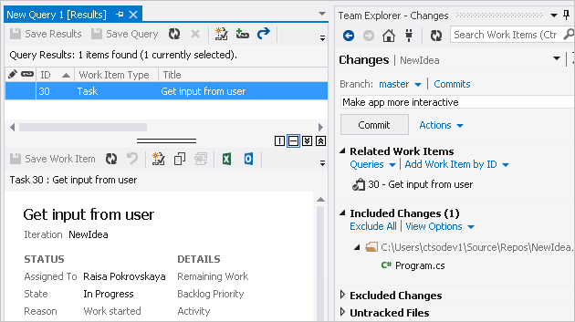


#### [Git Command Line](#tab/command-line)

You can link work items to commits by adding _#ID_ into the commit message. For example, the commit message "*Fix bug #12 in the reporting tools*" would link work item 12 to the commit when the commit is pushed to **Azure Repos**. To test, make some code changes and run the following commands at the command prompt in your local git repo folder.

> [!div class="tabbedCodeSnippets"]
```Git CLI
> git commit -am "Fix bug #<work item ID>"
> git push
```


***


## Push commit changes

#### [Visual Studio 2019](#tab/visual-studio-2019)

As you write your code, your changes are automatically tracked by Visual Studio. When you're satisfied with your changes, you can save them in Git using a commit, and then push your commit to **Azure Repos**.

:::row:::
  :::column span="":::

    **Visual Studio Git** <br><br>

    1. In the **Git Changes** window, enter a message that describes the changes, and then choose **Commit All**. **Commit All** commits unstaged changes and skips the staging area. You can choose to stage all files before committing by selecting the stage all + (plus) button at the top of the Changes section of the **Git Changes** window.

       :::image type="content" source="media/share-your-code-in-git-vs/visual-studio-2019/git-experience/commit-changes.png" border="true" alt-text="Screenshot of the 'Commit All' button in the 'Git Changes' window in Visual Studio 2019." lightbox="media/share-your-code-in-git-vs/visual-studio-2019/git-experience/commit-changes-lrg.png":::

    2. To push your commit to **Azure Repos**, select the up-arrow push button.

       :::image type="content" source="media/share-your-code-in-git-vs/visual-studio-2019/git-experience/push-commit-git-changes-window.png" border="true" alt-text="Screenshot of the up-arrow push button in the 'Git Changes' window of Visual Studio 2019." lightbox="media/share-your-code-in-git-vs/visual-studio-2019/git-experience/push-commit-git-changes-window-lrg.png":::

       Or, you can push your commit from the **Git Repository** window. To open the **Git Repository** window, select the **outgoing / incoming** link in the **Git Changes** window.

       :::image type="content" source="media/share-your-code-in-git-vs/visual-studio-2019/git-experience/push-commit-git-repositories-window.png" border="true" alt-text="Screenshot of the 'outgoing / incoming' link in the 'Git Changes' window, and the Push link in the 'Git Repository' window of Visual Studio 2019." lightbox="media/share-your-code-in-git-vs/visual-studio-2019/git-experience/push-commit-git-repositories-window-lrg.png":::

       Or, you can choose **Git > Push** from the menu bar.

       :::image type="content" source="media/share-your-code-in-git-vs/visual-studio-2019/git-experience/push-commit-git-menu.png" border="true" alt-text="Screenshot of the Push option from the Git menu in Visual Studio 2019." lightbox="media/share-your-code-in-git-vs/visual-studio-2019/git-experience/push-commit-git-menu-lrg.png":::

  :::column-end:::
  :::column span="":::

    **Visual Studio Team Explorer** <br><br>

    1. Open the **Changes** view of **Team Explorer** by selecting the **Home** button and choosing **Changes**. Or, select the pending changes icon  on the status bar.

       :::image type="content" source="media/share-your-code-in-git-vs/visual-studio-2019/team-explorer/changes.png" border="true" alt-text="Screenshot of the Changes option in Team Explorer in Visual Studio 2019." lightbox="media/share-your-code-in-git-vs/visual-studio-2019/team-explorer/changes-lrg.png":::

    2. In the **Git Changes** window, enter a message that describes the changes, and then choose **Commit All**. **Commit All** commits unstaged changes and skips the staging area. You can choose to stage all files before committing by selecting the stage all + (plus) button at the top of the Changes section in the **Git Changes** window.

       :::image type="content" source="media/share-your-code-in-git-vs/visual-studio-2019/team-explorer/commit-changes.png" border="true" alt-text="Screenshot of the 'Screenshot of commit message text and 'Commit All' button in Visual Studio 2019." lightbox="media/share-your-code-in-git-vs/visual-studio-2019/team-explorer/commit-changes-lrg.png":::

    3. To push one or more commits to **Azure Repos**, select **Home** and then choose **Sync** to open the **Synchronization** view in **Team Explorer**. Or, select the unpublished changes status bar icon ( on the status bar.
    
       :::image type="content" source="media/share-your-code-in-git-vs/visual-studio-2019/team-explorer/sync.png" border="true" alt-text="Screenshot of the Sync option in Team Explorer in Visual Studio 2019." lightbox="media/share-your-code-in-git-vs/visual-studio-2019/team-explorer/sync-lrg.png":::
        
    4. In the **Synchronization** view, choose **Push** to upload your commit to the remote repo. If this is your first push to the repo, you'll see the message: `The current branch does not track a remote branch...`, which lets you know that your commit was pushed to a new branch on the remote repo and that future commits pushed from the current branch will be uploaded to that remote branch.
    
       :::image type="content" source="media/share-your-code-in-git-vs/visual-studio-2019/team-explorer/push-commit.png" border="true" alt-text="Screenshot of the Push link in the Synchronization view of Team Explorer in Visual Studio 2019." lightbox="media/share-your-code-in-git-vs/visual-studio-2019/team-explorer/push-commit-lrg.png":::

   :::column-end:::
:::row-end:::


#### [Visual Studio 2017](#tab/visual-studio-2017)


1. As you write your code, your changes are automatically tracked by Visual Studio. 
   You can [commit](commits.md) changes to your local Git repository by selecting the pending changes icon  from the status bar.

2. On the **Changes** view in Team Explorer, add a message describing your update and commit your changes.

   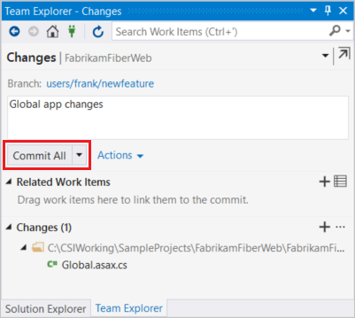

3. Select the unpublished changes status bar icon  (or select **Sync** from the **Home** view in Team Explorer). Select **Push** to 
   update your code in Azure DevOps Services/TFS.

   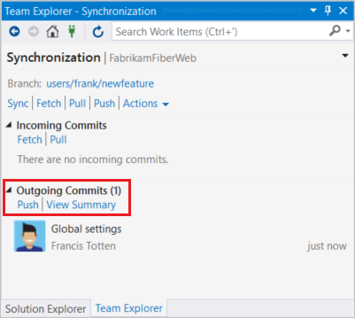

#### [Visual Studio 2015.2](#tab/visual-studio-2015)

1. As you write your code, your changes are automatically tracked by Visual Studio. 
   You can [commit](commits.md) changes to your local Git repository by selecting the pending changes icon (  ) from the status bar.

2. On the **Changes** view in Team Explorer, add a message describing your update and commit your changes.

   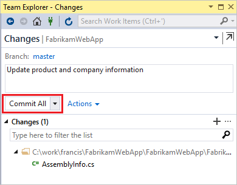

3. Select the unpublished changes status bar icon (  ) or the **Sync** view in Team Explorer. Select **Push** to 
   update your code in Azure DevOps Services/TFS.

   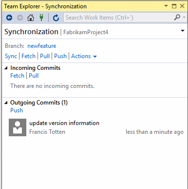


#### [Visual Studio 2013](#tab/visual-studio-2013)

With your code project stored in a local Git repository on your dev machine, 
you can commit as early and as often as you like.

1. As you write your code, your changes are automatically tracked by Visual Studio. 
   You can commit one or more specific changes to your local repository from Solution Explorer
   (Keyboard: Ctrl + Alt + L).

   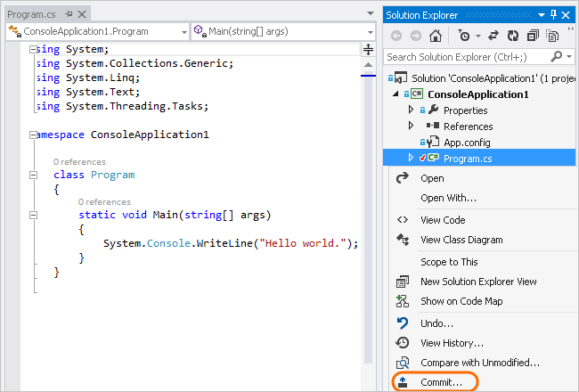

2. On the Changes page, add a comment and then commit your changes.

   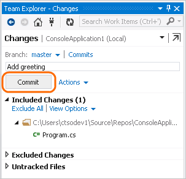

   These changes are now committed.

   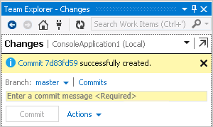

1. When the code you've written on your dev machine is ready, you can push your changes from your local Git repository to the project. From the changes page (Keyboard: Ctrl + 0, G), make sure you've committed your changes.

   

2. Go to the commits page (Keyboard: Ctrl + 0, C).

   

3. Push your changes.

   


#### [Git Command Line](#tab/command-line)

To publish new commits from your current local branch to the corresponding branch in the **Azure Repos** Git repo, run the following command at the command prompt in your local git repo folder.

> [!div class="tabbedCodeSnippets"]
```Git CLI
> git push
```


***


## Pull changes

#### [Visual Studio 2019](#tab/visual-studio-2019)

You can keep your local branches in sync with their remote counterparts by pulling commits created by others. While you're working on your feature branch, it's a good idea to periodically switch to your `main` branch and pull new commits to keep it current with the remote `main` branch.
  
> [!NOTE]
> **Fetch** and **Pull** links can be found in different views and in the Git menu on the menu bar. Those links all do the same thing&mdash;fetch or pull from the remote repo to the current branch of the local repo.

:::row:::
  :::column span="":::

    **Visual Studio Git** <br><br>

    1. In the **Git Changes** window, you can check for the latest commits on the remote branch by using the down-arrow fetch link, then selecting the **outgoing / incoming** link to open the **Git Repository** window. **Fetch** downloads remote commits that aren't in your local branch, but won't merge them into your local branch. Fetched commits show up in the **Incoming Commits** section of the **Git Repository** window. You can double-click a fetched commit to view its file changes.

       :::image type="content" source="media/share-your-code-in-git-vs/visual-studio-2019/git-experience/push-fetch-git-repositories-window.png" border="true" alt-text="Screenshot of the Fetch, Pull, Push and Sync buttons in the 'Git Changes' window of Visual Studio 2019." lightbox="media/share-your-code-in-git-vs/visual-studio-2019/git-experience/push-fetch-git-repositories-window-lrg.png":::
  
    2. Choose **Pull** to merge the fetched remote commits into your local repo. **Pull** performs a fetch and then merges the downloaded commits into your local branch.

  :::column-end:::
  :::column span="":::

    **Visual Studio Team Explorer** <br><br>

    1. In **Team Explorer**, select **Home** and choose **Sync** to open the **Synchronization** view.

       :::image type="content" source="media/share-your-code-in-git-vs/visual-studio-2019/team-explorer/sync.png" border="true" alt-text="Screenshot of the Sync option in 'Team Explorer' in Visual Studio 2019." lightbox="media/share-your-code-in-git-vs/visual-studio-2019/team-explorer/sync-lrg.png":::

    2. In the **Synchronization** view, you can preview the latest changes on the remote branch by using the **Fetch** link. **Fetch** downloads remote commits that aren't in your local branch, but doesn't merge them. Fetched commits show up in the **Incoming Commits** section of the **Synchronization** view. You can double-click a commit to view its file changes.

       :::image type="content" source="media/share-your-code-in-git-vs/visual-studio-2019/team-explorer/incoming-commits.png" border="true" alt-text="Screenshot of the Pull link in the Synchronization view of Team Explorer in Visual Studio 2019." lightbox="media/share-your-code-in-git-vs/visual-studio-2019/team-explorer/incoming-commits-lrg.png":::

     3. Choose **Pull** to merge the fetched remote commits into your local repo. **Pull** performs a fetch and then merges the downloaded commits into your local branch.

   :::column-end:::
:::row-end:::


#### [Visual Studio 2017](#tab/visual-studio-2017)

Sync your local repo with changes from your team as they make updates.

1. From the **Synchronization** view in Team Explorer, fetch the [commits](commits.md) that your team has made. 
   Double-click a commit to view its file changes.

   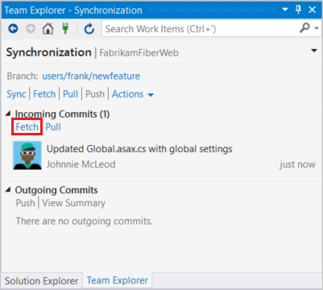

2. Select **Sync** to merge the fetched commits into your local repo and then [push](pushing.md) any unpublished changes to Azure Repos.

   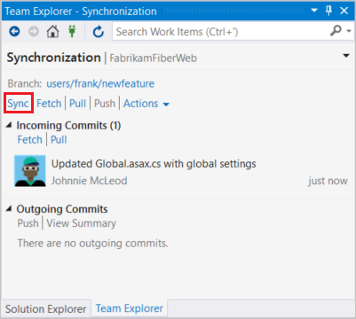

3. The changes from your team are now in your local repo and visible in Visual Studio.
 
#### [Visual Studio 2015.2](#tab/visual-studio-2015)

Sync your local repo with changes from your team as they make updates.

1. From the **Sync** view in Team Explorer, fetch the [commits](commits.md) that your team has made. 
   Double-click a commit to view its file changes.

   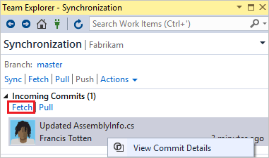

2. Select **Sync** to merge the fetched commits into your local repo and then [push](pushing.md) any unpublished changes to Azure Repos.

   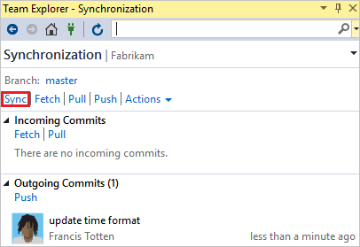

3. The changes from your team are now in your local repo and visible in Visual Studio.

   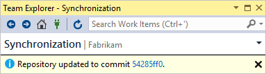

#### [Visual Studio 2013](#tab/visual-studio-2013) 

Pull changes on a regular basis to ensure your code integrates well with the latest code from the team.

1. From the commits page (Keyboard: Ctrl + 0, O), fetch the commits to see any changes that your team has made.

   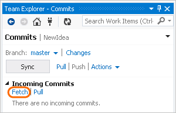

2. When you're ready, pull these commits into your local repository.

   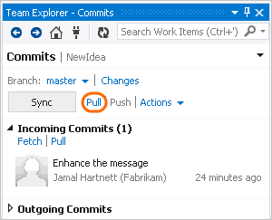

3. The changes from your team are now integrated in your local repository.

   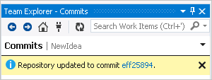


#### [Git Command Line](#tab/command-line)

To download new commits from the **Azure Repos** Git repo without merging them into your local repo, run the following command at the command prompt in your local git repo folder.

> [!div class="tabbedCodeSnippets"]
```Git CLI
> git fetch
```

To download _and_ merge new commits from the **Azure Repos** Git repo into the current branch of your local repo, run the following command.

> [!div class="tabbedCodeSnippets"]
```Git CLI
> git pull
```


***


## FAQs

<!-- BEGINSECTION class="md-qanda" -->


[!INCLUDE [temp](includes/open-team-project-in-vs-qa.md)]


#### Q: Can I use the Git command prompt with Visual Studio?

**A:** Visual Studio's Team Explorer and the Git command-line work great together. Changes to your repos made in either tool will be reflected in the other. 
Make sure to install the latest release of [Git for Windows](https://git-scm.com/download/win), which has tools to help you connect to your Azure DevOps Services/TFS repos.

See [the Azure Repos Git tutorial](gitworkflow.md) and the [command reference](command-prompt.md) for additional help using Git from the command line.

<!-- ENDSECTION -->
 
## Next steps

> [!div class="nextstepaction"]
> [Set up a build](../../pipelines/get-started/what-is-azure-pipelines.md)
> [Azure Repos Git tutorial](gitworkflow.md)

## Related articles

- [New to Git repos? Learn more](/devops/develop/git/set-up-a-git-repository)
