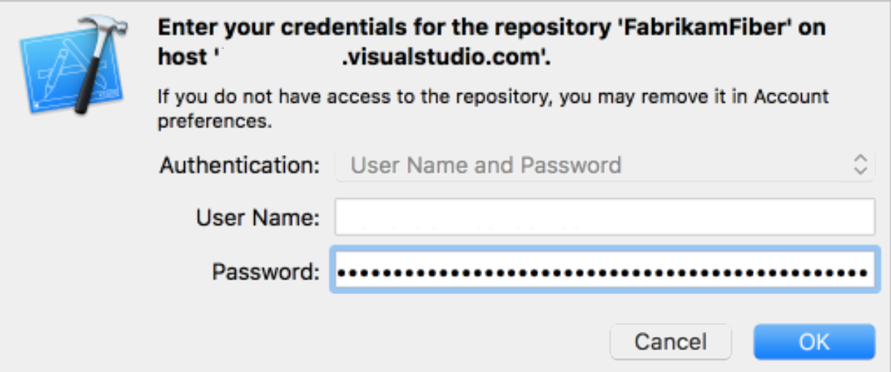

#  Share your code in Git using Xcode

[!INCLUDE [version-lt-eq-azure-devops](../../includes/version-lt-eq-azure-devops.md)]

This guide shows you how to share your Xcode projects using Azure Repos. 

## Prerequisites

[!INCLUDE [azure-repos-prerequisites](includes/azure-repos-prerequisites.md)]

## Authentication methods

Choose the authentication method that best fits your workflow:

| Method | Best for | Setup complexity | Security | 
|--------|----------|------------------|----------|
| **SSH keys** | Individual developers, long-term use | Medium (one-time setup) | High | 
| **Microsoft Entra ID tokens** | Enterprise environments, temporary access | Medium | Very High |
| **Personal Access Tokens** | Specific scenarios, automation | Low | Medium | 

> [!TIP]
> For most developers, **SSH keys** provide the best balance of security and usability with Xcode. Set them up once and they work seamlessly.

## Set up your Xcode project with Git

Create a local Git repo for your code to manage your project in version control.

Choose the option that matches your situation:

* [New projects](#new-projects) - Creating a new Xcode project
* [Existing projects](#existing-projects) - Adding Git to an existing project

> [!NOTE]
> If your project is already in a local Git repo, skip to [Create a new Git repo in Azure Repos](#create-a-new-git-repo-in-azure-repos).

### New projects

Create a local Git repo when you create a new project. Choose **Create Git repository on My Mac** when creating a new project. 


### Existing projects

Create a local Git repo for your existing projects not in version control by going to **Source Control, Create Working Copy...** . Select the projects to add to the local Git repo and select **Create**. Xcode creates a Git repo for your code and adds a [commit](commits.md) with your project files.


## Create a new Git repo in Azure Repos

Create a new Git repo in Azure Repos for your Xcode project.

> [!NOTE]
> If you already created a repo for your Xcode project in Azure DevOps, skip to [Connect and push your project](#connect-and-push-your-project).

1. In your Azure DevOps organization, go to your project and select the dropdown  next to the current Git repo name. Select **New Repository**.

2. Enter a name for your new Git repo and select **Create**. 

3. Copy the clone URL from your new repo. Choose the URL format based on your authentication method:
   - **SSH**: Use the SSH clone URL (if you set up SSH keys)  
   - **HTTPS**: Use the HTTPS clone URL (for tokens)

   > [!TIP]
   > **Choose your authentication method:**
   > - **SSH keys** (recommended for simplicity): Set up once and works seamlessly with Xcode. See [Use SSH keys](use-ssh-keys-to-authenticate.md).
   > - **Microsoft Entra ID tokens** (recommended for enterprise): Modern, secure authentication. See [Microsoft Entra ID authentication](../../integrate/get-started/authentication/entra.md).
   > - **Personal Access Tokens**: Alternative method for specific scenarios. See [Personal Access Tokens](../../organizations/accounts/use-personal-access-tokens-to-authenticate.md).
   > 
   > When using SSH, use the SSH clone URL when configuring your remote.

## Connect and push your project

Now connect your local Xcode project to Azure Repos and push your code.

1. In Xcode, go to **Source Control** and select **[Project name] -- main**, then **Configure**.

   

2. Select **Remotes**, then select the  icon and choose **Add Remote**.

3. In the **Address** field, paste the Git clone URL you copied earlier. Select **Add Remote**, then **Done** to create the `origin` remote.

   

4. Go to **Source Control** > **Push**, enter the branch name on `origin` to push to (usually `main`), and select **Push**.

   

5. If prompted for credentials, choose your authentication method:

   > [!IMPORTANT]
   > We recommend using SSH keys or Microsoft Entra ID tokens for secure authentication. Only use personal access tokens when other methods aren't available.

   ### Option 1: SSH Authentication (Recommended)
   
   If you configured SSH keys, Xcode authenticates automatically. No other credentials needed.
   
   ### Option 2: Microsoft Entra ID Token
   
   For **Username**: Enter your Azure DevOps username.
   For **Password**: Use a Microsoft Entra ID access token.
   
   ```bash
   # Get token using Azure CLI
   az account get-access-token --resource 499b84ac-1321-427f-aa17-267ca6975798 --query "accessToken" --output tsv
   ```
   
   ### Option 3: Personal Access Token (alternative)
   
   For **Username**: Enter your Azure DevOps username.
   For **Password**: Create a [Personal Access Token](../../organizations/accounts/use-personal-access-tokens-to-authenticate.md) with **Code (read and write)** scope.
   
   Select **OK** to complete authentication. 

   

After successful authentication, Xcode [pushes](pushing.md) your project to Azure Repos. Your code is now available for your team to collaborate on.

> [!TIP]
> Once you set up authentication, future pushes and pulls use the same credentials automatically.

## Next step

> [!div class="nextstepaction"]
> [Learn Git workflow fundamentals](gitworkflow.md)
