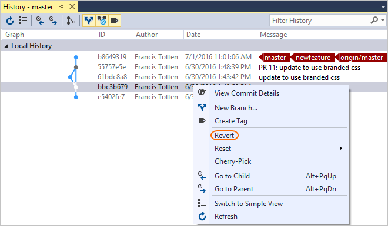
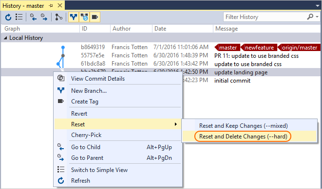

# Undo changes

#### Azure Repos | TFS 2018 | TFS 2017 | TFS 2015 | VS 2017 | VS 2015

When undoing changes in Git, first decide what type of changes you are looking to undo. These changes fall into three categories:

- Discard uncommitted changes to a file, bringing the file back to the version in the last commit.
- Reset your local branch to a previous commit.
- Revert changes pushed to a remote branch and shared with others.

If you just need to make small updates such as to fix a typo or small problem introduced in your last commit, consider [amending your previous commit](commits.md) or fixing the change
in a new commit instead of any of these other steps. 

In this tutorial you learn how to:

> [!div class="checklist"]
> * Discard uncommitted changes to a single file
> * Revert changes in shared commits
> * Reset a branch to a previous state

## Discard uncommitted changes to a single file

Restore file contents back to a known good version, removing unwanted changes.

> [!WARNING]
> These commands will overwrite your existing file changes. If you think you might want these changes later, consider [stashing](howto.md#stash) them instead.

# [Visual Studio](#tab/visual-studio)

Visual Studio 2015 &amp; 2017

0. Open up the **Changes** view in Team Explorer.
0. Under the **Changes** section, find the file that you want to restore to the previous version. If your change is staged, remove it from the **Staged Changes** section by right-clicking and selecting **Unstage**.
0. Right-click that file and select **Undo Changes**.

    

# [Command Line](#tab/command-line)

You can use the `checkout` command and give it the filename(s) to change. Use wildcards for undoing changes to multiple files.

<pre style="color:white;background-color:black;font-family:Consolas,Courier,monospace;padding:10px">
&gt; git checkout approuter.js
</pre>

You can revert the file to the version in a specific commit by providing the commit ID:

<pre style="color:white;background-color:black;font-family:Consolas,Courier,monospace;padding:10px">
&gt; git checkout 38035acd2 approuter.js
</pre>

This differs from the earlier use of the `checkout` command used to swap to a different [branch](branches.md). 
Git will tell you if it is changing a file or swapping between branches in the output, and complain if it's not clear which one you are trying to do.

---

## Revert changes in shared commits

Use `revert` to undo the changes made in your commits pushed to shared branches. The `revert` command creates a new commit that undoes the changes on a previous commit. No history is rewritten
in a `revert`, making it safe to use when working with others.

# [Visual Studio](#tab/visual-studio)

Open up the **Changes** view in Team Explorer. Select **Actions** and choose **View History** from the drop-down. In the history window that appears, right-click the commit to undo and
select **Revert** from the context menu.

# [Command Line](#tab/command-line)

<pre style="color:white;background-color:black;font-family:Consolas,Courier,monospace;padding:10px">
&gt; git revert 8437fbaf
&gt; git commit
</pre>

These commands will undo the changes made in commit 8437fbaf and create a new commit on the branch. The original commit at `commit_id` is still in the Git history.
`Revert` is flexible but it requires a branch history and commit identifiers to use. Review your [history](review-history.md) to find the commits you want to revert. 

---

## Reset a branch to a previous state

Use `reset` to bring a branch in your local repository back to the contents of a previous commit. The most common use of the `reset` command is 
to simply discard all changed files since the last commit and return the files to the state they were in at the most recent commit.

> [!WARNING]
> Don't use `reset` on branches shared with others. Use [revert](undo.md#revert) instead.

# [Visual Studio](#tab/visual-studio)

0. Open up the **Changes** view in Team Explorer. 
0. Select **Actions** and choose **View History** from the drop-down. 
0. In the history window that appears, right-click the commit to reset the repo to and select **Reset** from the context menu. 
0. Choose **Reset and delete changes...**.

    

# [Command Line](#tab/command-line)

<pre style="color:white;background-color:black;font-family:Consolas,Courier,monospace;padding:10px">
&gt; git reset --hard HEAD 
</pre>

The `--hard` part of the command tells Git to reset the files to the state of the previous commit and discard any staged changes. 
The `HEAD` argument tells Git to reset the local repository to the most recent commit. If you want to reset the repo to a different commit, provide the ID instead of HEAD.

---

A `reset` affects all files in the current branch on the repository, not just those in your current directory. `Reset` only discards changes that haven't 
been committed yet.

## Next steps

> [!div class="nextstepaction"]
> [Ignore files](ignore-files.md)

