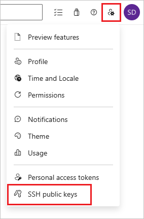
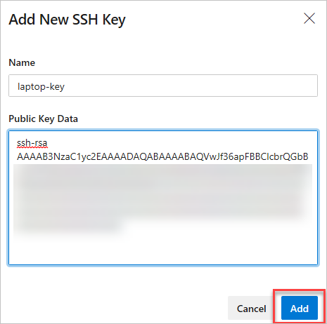
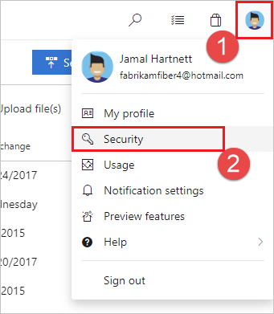
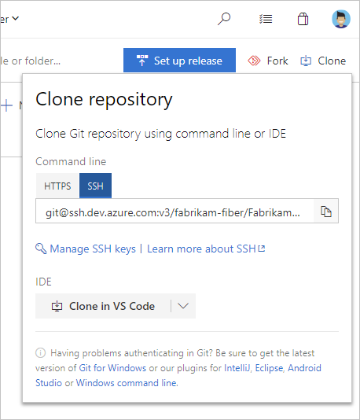

# Use SSH key authentication

[!INCLUDE [version-ts-tfs-2015-2016](../../includes/version-ts-tfs-2015-2016.md)]

Connect to your Git repos through SSH on macOS, Linux, or Windows to securely connect using HTTPS authentication.  On Windows, we recommended the use of [Git Credential Manager Core](set-up-credential-managers.md) or [Personal Access Tokens](../../organizations/accounts/use-personal-access-tokens-to-authenticate.md).

> [!IMPORTANT]
> SSH URLs have changed, but old SSH URLs will continue to work. If you have already set up SSH, you should update your remote URLs to the new format:
> 
> - Verify which remotes are using SSH by running ```git remote -v``` in your Git client. 
> - Visit your repository on the web and select the **Clone** button in the upper right.
> - Select **SSH** and copy the new SSH URL.
> - In your Git client, run: ```git remote set-url <remote name, e.g. origin> <new SSH URL>```. Alternatively, in Visual Studio, go to [Repository Settings](git-config.md#remotes), and edit your remotes.

>[!NOTE]
> As of Visual Studio 2017, SSH can be used to connect to Azure DevOps Git repos.

## How SSH key authentication works

SSH public key authentication works with an asymmetric pair of generated encryption keys. The _public_ key is shared with Azure DevOps and used to verify the initial ssh connection. The _private_ key is kept safe and secure on your system.

## Set up SSH key authentication

The following steps cover configuration of SSH key authentication on the following platforms:

---
- Linux
- macOS running at least Leopard (10.5)
- Windows systems running  [Git for Windows](https://www.git-scm.com/download/win)   

---

Configure SSH using the command line. `bash` is the common shell on Linux and macOS and the Git for Windows installation adds a shortcut to Git Bash in the Start menu.
Other shell environments will work, but are not covered in this article.

### Step 1: Create your SSH keys

>[!NOTE]
> If you have already created SSH keys on your system, skip this step and go to [configuring SSH keys](use-ssh-keys-to-authenticate.md#configuration).   

The commands here will let you create new default SSH keys, overwriting existing default keys. Before continuing, check your 
`~/.ssh` folder (for example, /home/jamal/.ssh or C:\Users\jamal\\.ssh) and look for the following files:

- _id_rsa_
- _id_rsa.pub_

If these files exist, then you have already created SSH keys. You can overwrite the keys with the following commands, or skip this step and go to [configuring SSH keys](use-ssh-keys-to-authenticate.md#configuration) to reuse these keys.

Create your SSH keys with the `ssh-keygen` command from the `bash` prompt. This command will create a 3072-bit RSA key for use with SSH. You can give a passphrase
for your private key when prompted&mdash;this passphrase provides another layer of security for your private key. 
If you give a passphrase, be sure to [configure the SSH agent](use-ssh-keys-to-authenticate.md#rememberpassphrase) to cache your passphrase so you don't have to enter it every time you connect.

```
$ ssh-keygen -C "jamal@fabrikam.com"
Generating public/private rsa key pair.
Enter file in which to save the key (/c/Users/jamal/.ssh/id_rsa):
Enter passphrase (empty for no passphrase):
Enter same passphrase again:
Your identification has been saved in /c/Users/jamal/.ssh/id_rsa.
Your public key has been saved in /c/Users/jamal/.ssh/id_rsa.pub.
The key fingerprint is:
SHA256:******************************************* jamal@fabrikam.com
The key's randomart image is:
+---[RSA 3072]----+
|+.   +yX*o .     |
|... ..E+*=o      |
|  ..o.=E=.o      |
|   . * =.o .     |
|    . S o o..    |
|       + .oo     |
|        S+.  .   |
|        ..+.+    |
|          o*..   |
+----[SHA256]-----+
```

This command produces the two keys needed for SSH authentication: your private key ( _id_rsa_ ) and the public key ( _id_rsa.pub_ ). It is important to never share the contents of your private key. If the private key is
compromised, attackers can use it to trick servers into thinking the connection is coming from you.

<a name="configuration"></a>

::: moniker range=">= azure-devops-2019"

### Step 2:  Add the public key to Azure DevOps Services/TFS

Associate the public key generated in the previous step with your user ID.

1. Open your security settings by browsing to the web portal and selecting your avatar in the upper right of the
   user interface. Select  **SSH public keys** in the menu that appears.
   
   

2. Select **+ New Key**.

    

3. Copy the contents of the public key (for example, id_rsa.pub) that you generated into the **Public Key Data** field. 

   > [!IMPORTANT]
   > Avoid adding whitespace or new lines into the **Key Data** field, as they can cause Azure DevOps Services to use an invalid public key. When pasting in the key, a newline often is added at the end. Be sure to remove this newline if it occurs.

    

4. Give the key a useful description (this description will be displayed on the **SSH public keys** page for your profile) so that you can remember it later. Select **Save** to store the public key.
  Once saved, you cannot change the key. You can delete the key or create a new entry for another key. There are no restrictions on how many keys you can add to your user profile. Also note that SSH keys stored in Azure DevOps expire after five years. If your key expires, you may upload a new key or the same one to continue accessing Azure DevOps via SSH.

5. Test the connection by running the following command: `ssh -T git@ssh.dev.azure.com`.
If everything is working correctly, you'll receive a response which says: `remote: Shell access is not supported.`
If not, see the section on [Questions and troubleshooting](#questions-and-troubleshooting).

<a name="copy-url"></a>

::: moniker-end

::: moniker range="< azure-devops-2019"

### Step 2:  Add the public key to Azure DevOps

Associate the public key generated in the previous step with your user ID.

1. Open your security settings by browsing to the web portal and selecting your avatar in the upper right of the
   user interface. Select **Security** in the menu that appears.

   
   
2. Select **+ New Key**.

   
   
3. Copy the contents of the public key (for example, id_rsa.pub) that you generated into the **Public Key Data** field. 

   >[!IMPORTANT]
   >Avoid adding whitespace or new lines into the **Key Data** field, as they can cause Azure DevOps Services to use an invalid public key. When pasting in the key, a newline often is added at the end. Be sure to remove this newline if it occurs.

    

4. Give the key a useful description (this description will be displayed on the **SSH public keys** page for your profile) so that you can remember it later. Select **Save** to store the public key. Once saved, you cannot change the key. You can delete the key or create a new entry for another key. There are no restrictions on how many keys you can add to your user profile.

5. Test the connection by running the following command: `ssh -T git@ssh.dev.azure.com`.
If everything is working correctly, you'll receive a response which says: `remote: Shell access is not supported.`
If not, see the section on [Questions and troubleshooting](#questions-and-troubleshooting).

<a name="copy-url"></a>

::: moniker-end

### Step 3: Clone the Git repository with SSH

>[!NOTE]
> To connect with SSH from an existing cloned repo, see [updating your remotes to SSH](use-ssh-keys-to-authenticate.md#migrate).

1. Copy the SSH clone URL from the web portal. In this example, the SSL clone URL is for a repo in an organization named **fabrikam-fiber**, as indicated by the first part of the URL after `dev.azure.com`.

   

   [!INCLUDE [project-urls](../../includes/project-urls.md)]
 
2. Run `git clone` from the command prompt. 

   ```
   git clone git@ssh.dev.azure.com:v3/fabrikam-fiber/FabrikamFiber/FabrikamFiber
   ```

SSH may display the server's SSH fingerprint and ask you to verify it.
You should verify that the displayed fingerprint matches one of the fingerprints in the **SSH public keys** page.

SSH displays this fingerprint when it connects to an unknown host to protect you from [man-in-the-middle attacks](/previous-versions/windows/it-pro/windows-2000-server/cc959354(v=technet.10)).
Once you accept the host's fingerprint, SSH will not prompt you again unless the fingerprint changes. 

```
$ git clone git@ssh.dev.azure.com:v3/fabrikam-fiber/FabrikamFiber/FabrikamFiber
Cloning into 'FabrikamFiber'...
The authenticity of host 'ssh.dev.azure.com (65.52.8.37)' can't be established.
RSA key fingerprint is SHA256:********************************************
Are you sure you want to continue connecting (yes/no)? yes
Warning: Permanently added 'ssh.dev.azure.com,65.52.8.37' (RSA) to the list of known hosts.
Enter passphrase for key '/c/Users/jamal/.ssh/id_rsa':
remote: Azure Repos
remote: Found 127 objects to send. (50 ms)
Receiving objects: 100% (127/127), 56.67 KiB | 2.58 MiB/s, done.
Resolving deltas: 100% (15/15), done.
```

When you are asked if you want to continue connecting, type `yes`. Git will clone the repo and set up the `origin` remote to connect with SSH for future Git commands. 

> [!TIP]
> To prevent problems, Windows users should [run a command](use-ssh-keys-to-authenticate.md#rememberpassphrase) to have Git reuse their SSH key passphrase. 

## Questions and troubleshooting

<a name="rememberpassphrase"></a>

### Q: After running `git clone`, I get the following error. What should I do?

```
Host key verification failed. 
fatal: Could not read from remote repository.
```

**A:** Manually record the SSH key by running:
`ssh-keyscan -t rsa domain.com >> ~/.ssh/known_hosts`

### Q: How can I have Git remember the passphrase for my key on Windows?

**A:** Run the following command included in Git for Windows to start up the `ssh-agent` process in PowerShell or the Windows Command Prompt. `ssh-agent` will cache
your passphrase so you don't have to provide it every time you connect to your repo.

```
start-ssh-agent.cmd
```

If you're using the Bash shell (including Git Bash), start ssh-agent with:

```
eval `ssh-agent`
```

### Q: I use [PuTTY](https://www.putty.org/) as my SSH client and generated my keys with PuTTYgen. Can I use these keys with Azure DevOps Services?

**A:** Yes. Load the private key with PuTTYgen, go to **Conversions** menu and select **Export OpenSSH key**. 
Save the private key file and then follow the steps to [set up non-default keys](use-ssh-keys-to-authenticate.md#newkeys).
Copy your public key directly from the PuTTYgen window and paste into the **Key Data** field in your security settings.

### Q: How can I verify that the public key I uploaded is the same key as I have locally?

**A:** You can verify the fingerprint of the public key uploaded with the one displayed in your profile through the following `ssh-keygen` command run against your public key using
  the `bash` command line. You will need to change the path and the public key filename if you are not using the defaults.
  
```
ssh-keygen -l -E md5 -f ~/.ssh/id_rsa.pub
```

You can then compare the MD5 signature to the one in your profile. This check is useful if you have connection problems or have concerns about incorrectly
pasting in the public key into the **Key Data** field when adding the key to Azure DevOps Services.

<a name="migrate"></a>
 
### Q: How can I start using SSH in a repository where I am currently using HTTPS?
 
**A:** You'll need to update the `origin` remote in Git to change over from a HTTPS to SSH URL. Once you have the [SSH clone URL](#step-3-clone-the-git-repository-with-ssh), run the following command:

```
git remote set-url origin git@ssh.dev.azure.com:v3/fabrikam-fiber/FabrikamFiber/FabrikamFiber
```

You can now run any Git command that connects to `origin`.

<a name="newkeys"></a>

### Q: I'm using Git LFS with Azure DevOps Services and I get errors when pulling files tracked by Git LFS.

**A:** Azure DevOps Services currently doesn't support LFS over SSH. Use HTTPS to connect to repos with Git LFS tracked files.
 
### Q: How can I use a non-default key location, i.e. not ~/.ssh/id_rsa and ~/.ssh/id_rsa.pub?

**A:** To use keys created with `ssh-keygen` in a different place than the default, perform these two tasks:

1. The keys must be in a folder that only you can read or edit. If the folder has wider permissions, SSH will not use the keys.
2. You must let SSH know the location of the keys. You make SSH aware of keys through the `ssh-add` command, providing the full path to the private key. 

```
ssh-add /home/jamal/.ssh/id_jamal.rsa
```

On Windows, before running `ssh-add`, you will need to run the following command from included in Git for Windows:

```
start-ssh-agent.cmd
```

This command runs in both PowerShell and the Command Prompt. If you are using Git Bash, the command you need to use is:

```
eval `ssh-agent`
```

You can find `ssh-add` as part of the Git for Windows distribution and also run it in any shell environment on Windows. 

On macOS and Linux you also must have `ssh-agent` running before running `ssh-add`, but the command environment on these platforms usually 
takes care of starting `ssh-agent` for you.

### Q: I have multiple SSH keys.  How do I use different SSH keys for different SSH servers or repos?

**A:** Generally, if you configure multiple keys for an SSH client and connect to an SSH server, the client can try the keys one at a time until the server accepts one.

However, this doesn't work with Azure DevOps for technical reasons related to the SSH protocol and how our Git SSH URLs are structured.  Azure DevOps will blindly accept the first key that the client provides during authentication.  If that key is invalid for the requested repo, the request will fail with the following error:
> ```
> remote: Public key authentication failed.
> fatal: Could not read from remote repository.
> ```

For Azure DevOps, you'll need to configure SSH to explicitly use a specific key file.  One way to do this to edit your `~/.ssh/config` file (for example, `/home/jamal/.ssh` or `C:\Users\jamal\.ssh`) as follows:

::: moniker range="= azure-devops"

```
# The settings in each Host section are applied to any Git SSH remote URL with a
# matching hostname.
# Generally:
# * SSH uses the first matching line for each parameter name, e.g. if there's
#   multiple values for a parameter across multiple matching Host sections
# * "IdentitiesOnly yes" prevents keys cached in ssh-agent from being tried before
#   the IdentityFile values we explicitly set.
# * On Windows, ~/.ssh/your_private_key maps to %USERPROFILE%\.ssh\your_private_key,
#   e.g. C:\Users\<username>\.ssh\your_private_key.

# Most common scenario: to use the same key across all hosted Azure DevOps
# organizations, add a Host entry like this:
Host ssh.dev.azure.com
  IdentityFile ~/.ssh/your_private_key
  IdentitiesOnly yes

# This model will also work if you still use the older SSH URLs with a
# hostname of vs-ssh.visualstudio.com:
Host vs-ssh.visualstudio.com
  IdentityFile ~/.ssh/your_private_key
  IdentitiesOnly yes

# Less common scenario: if you need different keys for different organizations,
# you'll need to use host aliases to create separate Host sections.
# This is because all hosted Azure DevOps URLs have the same hostname
# (ssh.dev.azure.com), so SSH has no way to distinguish them by default.
#
# Imagine that we have the following two SSH URLs:
# * git@ssh.dev.azure.com:v3/Fabrikam/Project1/fab_repo
#   * For this, we want to use `fabrikamkey`, so we'll create `devops_fabrikam` as
#     a Host alias and tell SSH to use `fabrikamkey`.
# * git@ssh.dev.azure.com:v3/Contoso/Project2/con_repo
#   * For this, we want to use `contosokey`, so we'll create `devops_contoso` as
#     a Host alias and tell SSH to use `contosokey`.
#
# To set explicit keys for the two host aliases and to tell SSH to use the correct
# actual hostname, add the next two Host sections:
Host devops_fabrikam
  HostName ssh.dev.azure.com
  IdentityFile ~/.ssh/private_key_for_fabrikam
  IdentitiesOnly yes
Host devops_contoso
  HostName ssh.dev.azure.com
  IdentityFile ~/.ssh/private_key_for_contoso
  IdentitiesOnly yes
#
# Then, instead of using the real URLs, tell Git you want to use these URLs:
# * git@devops_fabrikam:v3/Fabrikam/Project1/fab_repo
# * git@devops_contoso:v3/Contoso/Project2/con_repo
#

# At the end of the file, you can put global defaults for other SSH hosts you
# may connect to.  Note that "*" also matches any hosts that match the sections
# above, and remember that SSH uses the first matching line for each parameter name.
Host *
```

::: moniker-end

::: moniker range="< azure-devops"

```
# The settings in each Host section are applied to any Git SSH remote URL with a
# matching hostname.
# Generally:
# * SSH uses the first matching line for each parameter name, e.g. if there's
#   multiple values for a parameter across multiple matching Host sections
# * "IdentitiesOnly yes" prevents keys cached in ssh-agent from being tried before
#   the IdentityFile values we explicitly set.
# * On Windows, ~/.ssh/your_private_key maps to %USERPROFILE%\.ssh\your_private_key,
#   e.g. C:\Users\<username>\.ssh\your_private_key.

# Say your on-premises Azure DevOps Server instance has SSH URLs like this:
#   ssh://someHost:22/someCollection/some_project/_git/some_repo
# Add the following Host section:
Host someHost
  IdentityFile ~/.ssh/your_private_key
  IdentitiesOnly yes

# At the end of the file, you can put global defaults for other SSH hosts you
# may connect to.  Note that "*" also matches any hosts that match the sections
# above, and remember that SSH uses the first matching line for each parameter name.
Host *
```

::: moniker-end

::: moniker range="<= azure-devops-2019"

### Q: How do I fix errors that mention "no matching key exchange method found"?

**A:** Git for Windows 2.25.1 shipped with a new version of OpenSSH which removed some key exchange protocols by default.
Specifically, `diffie-hellman-group14-sha1` has been identified as problematic for some Azure DevOps Server and TFS customers.
You can work around the problem by adding the following to your SSH configuration (`~/.ssh/config`):

```
Host <your-azure-devops-host>
    KexAlgorithms +diffie-hellman-group14-sha1
```

Replace `<your-azure-devops-host>` with the hostname of your Azure DevOps or TFS server, like `tfs.mycompany.com`.

::: moniker-end

### Q: What notifications may I receive about my SSH keys?

**A:** Whenever you register a new SSH Key with Azure DevOps Services, you will receive an email notification informing you that a new SSH key has been added to your account.


### Q: What do I do if I believe that someone other than me is adding SSH keys on my account?

**A:** If you receive a notification of an SSH key being registered and you did not manually upload it to the service, your credentials may have been compromised. 

The next step would be to investigate whether or not your password has been compromised. Changing your password is always a good first step to defend against this attack vector. If you’re an Azure Active Directory user, talk with your administrator to check if your account was used from an unknown source/location.

### Q: What do I do if I'm still prompted for my password and `GIT_SSH_COMMAND="ssh -v" git fetch` shows `no mutual signature algorithm`?

**A:** Some Linux distributions, such as Fedora Linux, have crypto policies that require stronger SSH signature algorithms than Azure DevOps supports (as of January 2021). There's an open [feature request](https://developercommunity.visualstudio.com/idea/365980/support-non-rsa-keys-for-ssh-authentication.html) to add this support.

You can work around the issue by adding the following code to your SSH configuration (`~/.ssh/config`):

```sshconfig
Host ssh.dev.azure.com
  PubkeyAcceptedKeyTypes=ssh-rsa
```

Replace `ssh.dev.azure.com` with the correct host name if you use Azure DevOps Server.
