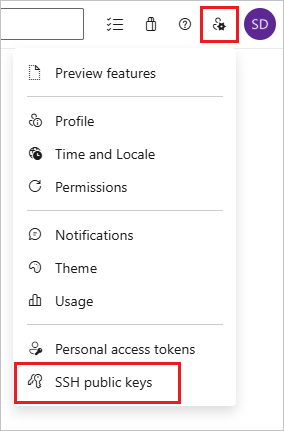
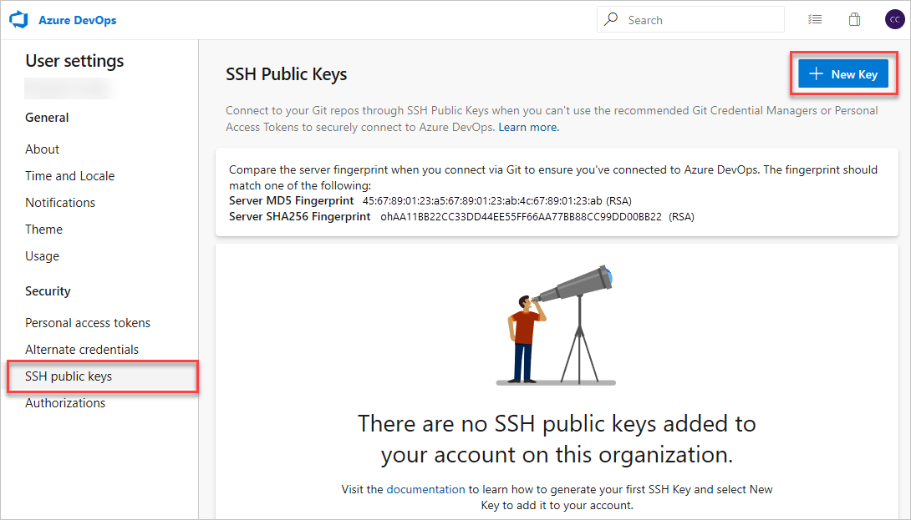
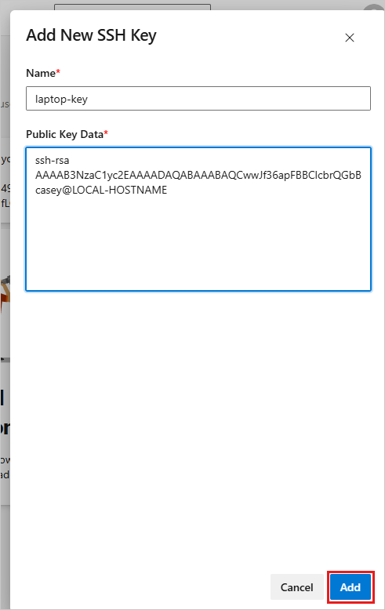
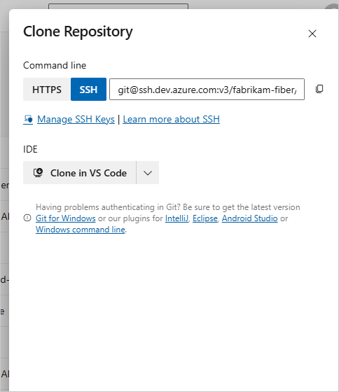
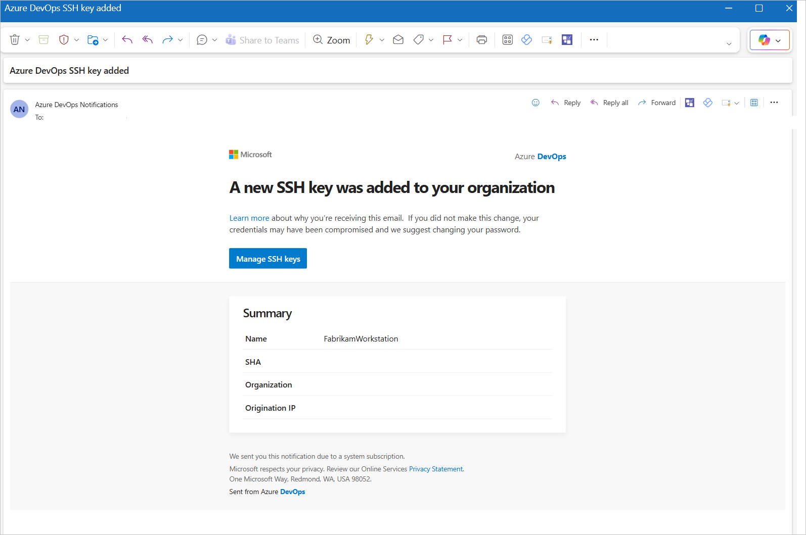

# Use SSH key authentication

[!INCLUDE [version-lt-eq-azure-devops](../../includes/version-lt-eq-azure-devops.md)]

Use SSH on macOS, Linux, or Windows to securely authenticate to Azure Repos Git repositories in Azure DevOps.

This article shows how to create an RSA key pair, add the public key to your profile, and clone repositories by using SSH.

> [!IMPORTANT]
> SSH URLs changed, but old SSH URLs continue to work. If you already set up SSH, update your remote URLs to the new format:
>
> Up-to-date SSH URLs start with `ssh.dev.azure.com`. The previous URLs use `vs-ssh.visualstudio.com`.
>
> - Verify which remotes use SSH. Run `git remote -v` in your shell or use a GUI client instead.
> - Visit your repository on the web and select **Clone**.
> - Select **SSH** and copy the new SSH URL.
> - In your shell, run `git remote set-url <remote name> <new SSH URL>` for each remote of a repository you want to update. Alternatively, use a GUI client to update the remote URLs.

## Prerequisites

| Category | Requirements |
|--------------|-------------|
|**Permissions**| [Access to clone the repository](set-git-repository-permissions.md#default-repository-permissions)|
|**Policies**| [SSH authentication enabled](../../organizations/accounts/change-application-access-policies.md)|
|**Local tools**| Git and an OpenSSH client available from a terminal or shell |
|**Windows environment**| If you use Windows, [Git for Windows](https://www.git-scm.com/download/win) or another environment where `git`, `ssh`, and `ssh-keygen` are available |
|**Local access**| Access to your local `.ssh` folder and permission to create key files |


## How SSH key authentication works

SSH public key authentication works with an asymmetric pair of generated encryption keys. You share the _public_ key with Azure DevOps to verify the initial SSH connection. Keep the _private_ key safe and secure on your system.

## Set up SSH key authentication

To use SSH with Azure Repos, generate an RSA key pair, add the public key to your Azure DevOps profile, verify the server fingerprint, and then clone or update your repository to use the SSH URL.

If you only need the fastest path, complete Step 1, Step 2, and Step 3 in order, and then use [Troubleshoot SSH authentication](#questions-and-troubleshooting) only if a command fails.

The following steps cover configuration of SSH key authentication on the following platforms by using the command line (also called `shell`):

- Linux
- macOS
- Windows systems running [Git for Windows](https://www.git-scm.com/download/win)

> [!TIP]
> On Windows, use [Git Credential Manager](set-up-credential-managers.md) instead of SSH.

### Step 1: Create your SSH keys

>[!NOTE]
> If you already created RSA SSH keys on your system, skip this step and go to Step 2.
> To verify this, go to your home directory and look in the `.ssh` folder (`%UserProfile%\.ssh\` on Windows or `~/.ssh/` on Linux, macOS, and Windows with Git Bash). If you see two files named `id_rsa` and `id_rsa.pub`, continue to Step 2.

To use key-based authentication, you first need to generate a public/private key pair for your client. OpenSSH can generate several key types, but Azure DevOps supports RSA keys for SSH authentication.

>[!NOTE]
> Azure DevOps supports RSA keys and uses RSA-SHA2 signature algorithms during authentication. Generate an RSA key, and let your SSH client negotiate the supported RSA-SHA2 signature when it connects.

To generate an RSA key pair for Azure DevOps, run the following command from PowerShell or another shell such as `bash` on your client:

```powershell
ssh-keygen -t rsa -b 3072
```


The output from the command should display the following output (where `username` is your username):

```Output
Generating public/private rsa key pair.
Enter file in which to save the key (C:\Users\username/.ssh/id_rsa):
```

Press **Enter** to accept the default, or specify a path and/or filename where you want your keys to be generated.
At this point, you're prompted to use a passphrase to encrypt your private key files. The passphrase can be empty but isn't recommended.
The passphrase adds another layer of protection for your private key if the file is exposed.

```Output
Enter passphrase (empty for no passphrase):
Enter same passphrase again:
Your identification has been saved in C:\Users\username/.ssh/id_rsa.
Your public key has been saved in C:\Users\username/.ssh/id_rsa.pub.
The key fingerprint is:
SHA256:FHK6WjcUkcfQjdorarzlak1Ob/x7AmqQmmx5ryYYV+8 username@LOCAL-HOSTNAME
The key's randomart image is:
+---[RSA 3072]----+
|      . ** o     |
|       +.o= .    |
|      . o+       |
|      .+. .      |
|     .ooS  .     |
|  . .oo.=.o      |
|   =.= O.= .     |
|  . B BoE + . .  |
|   . *+*o. .o+   |
+----[SHA256]-----+
```

Now you have a public/private RSA key pair in the location you specified. The `.pub` files are public keys, and files without an extension are private keys:

```Output
Mode                 LastWriteTime         Length Name
----                 -------------         ------ ----
-a----        10/11/2022   6:29 PM           2610 id_rsa
-a----        10/11/2022   6:29 PM            578 id_rsa.pub
```

> [!IMPORTANT]
> Never share the contents of your private key. If the private key is compromised, attackers can use it to trick servers into thinking the connection is coming from you. Private key files are the equivalent of a password and should be protected the same way.

<a name="configuration"></a>


### Step 2: Add the public key to Azure DevOps

Associate the public key generated in the previous step with your user ID.

>[!NOTE]
> The SSH public key is associated with your user profile. In most cases, you can use one key across organizations for the same identity. Add a separate key only when you use a different identity or account.

1. Open your security settings by browsing to the web portal and selecting the icon next to the avatar in the upper right of the user interface. Select **SSH public keys** in the menu that appears.

   
   
1. Select **+ New Key**.

   
   
1. Copy the contents of the public key (for example, `id_rsa.pub`) that you generated into the **Public Key Data** field.

      > [!IMPORTANT]
   > Avoid adding extra spaces or line breaks in the middle of the key value, because they can make the key invalid. If paste adds formatting artifacts, remove them before you save.

   
   
1. Give the key a useful description (this description is displayed on the **SSH public keys** page for your profile) so that you can remember it later. Select **Save** to store the public key.
   Once saved, you can't change the key. You can delete the key or create a new entry for another key. There are no restrictions on how many keys you can add to your user profile. 
   
   >[!NOTE]
   > Organization policy can enforce SSH key expiration. For more information, see [Change application connection and security policies for your organization](../../organizations/accounts/change-application-access-policies.md#ssh-key-policies).

1. On the **SSH Public Keys** overview page, the server fingerprints are displayed. Make note of the SHA256 fingerprint to use when you first connect to Azure DevOps via SSH.

   
   
1. Test the connection by running the following command:

   ```powershell
   ssh -T git@ssh.dev.azure.com
   ```

   If you're connecting for the first time, you should receive the following output:

   ```Output
   The authenticity of host 'ssh.dev.azure.com (<IP>)' can't be established.
   RSA key fingerprint is SHA256:ohD8VZEXGWo6Ez8GSEJQ9WpafgLFsOfLOtGGQCQo6Og.
   This key is not known by any other names
   Are you sure you want to continue connecting (yes/no/[fingerprint])?
   ```

   Compare that fingerprint with the SHA256 fingerprint shown on the **SSH public keys** page. Continue only if the values match.

1. Enter `yes` to continue. If everything is configured correctly, the output should look like this:

   ```Output
    Warning: Permanently added 'ssh.dev.azure.com' (RSA) to the list of known hosts.
    remote: Shell access is not supported.
    shell request failed on channel 0
   ```

   If not, see the section on [Questions and troubleshooting](#questions-and-troubleshooting).


### Step 3: Clone the Git repository by using SSH

>[!NOTE]
> To use SSH with a repository you previously cloned by using HTTPS, see [How can I start using SSH in a repository where I'm currently using HTTPS?](#q-how-can-i-start-using-ssh-in-a-repository-where-im-currently-using-https)

1. Copy the SSH clone URL from the web portal. In this example, the SSH clone URL is for a repo in an organization named **fabrikam-fiber**, as indicated by the first part of the URL after `dev.azure.com`.

   
   
   [!INCLUDE [project-urls](../../includes/project-urls.md)]

1. Run `git clone` from the command prompt.

   ```bash
   git clone git@ssh.dev.azure.com:v3/fabrikam-fiber/FabrikamFiber/FabrikamFiber
   ```

   If you aren't using an SSH Agent, you're prompted to enter your passphrase:

   ```Output
   Cloning into 'FabrikamFiber'...
   Enter passphrase for key '/c/Users/username/.ssh/id_rsa':
   remote: Azure Repos
   remote: Found 127 objects to send. (50 ms)
   Receiving objects: 100% (127/127), 56.67 KiB | 2.58 MiB/s, done.
   Resolving deltas: 100% (15/15), done.
   ```

   If you're instead prompted to verify a fingerprint, read [Step 2: Add the public key to Azure DevOps](use-ssh-keys-to-authenticate.md#step-2-add-the-public-key-to-azure-devops) again. For other problems, read the section on [Questions and troubleshooting](use-ssh-keys-to-authenticate.md#questions-and-troubleshooting).

> [!TIP]
> To make the most of SSH, use an SSH Agent to manage your SSH keys. Setting up an agent is beyond the scope of this article.

<a id="use-ai-assistance"></a>

## Use AI to work with SSH-authenticated repositories

If you use Git repositories with GitHub Copilot or the [Azure DevOps MCP Server](../../mcp-server/mcp-server-overview.md), you can use natural language prompts to validate your SSH setup and diagnose authentication issues.

| Task | Example prompt |
|------|----------------|
| Check which remote a repo uses | `Check whether this repository uses SSH or HTTPS for origin, and show me how to switch it to SSH if needed.` |
| Verify SSH setup | `Review my Git remote configuration and explain whether it matches the Azure Repos SSH format.` |
| Diagnose an auth failure | `Help me troubleshoot this Azure Repos SSH error: remote: Public key authentication failed.` |
| Check which key SSH is using | `Explain how to tell which SSH key my client is offering to ssh.dev.azure.com and what to change if it is the wrong one.` |

> [!TIP]
> In Visual Studio Code, [agent mode](/visualstudio/ide/copilot-agent-mode?view=visualstudio&preserve-view=true) is useful for checking remotes, reviewing SSH configuration, and suggesting next troubleshooting steps from terminal output.

<a id="questions-and-troubleshooting"></a>

## Troubleshooting and common questions

Use the following sections to find the issue that matches your SSH setup problem.

- If your key expired or is invalid, start with [Expired or invalid keys](#expired-or-invalid-keys).
- If SSH fails to connect, start with [Common connection failures](#common-connection-failures).
- If you're repeatedly prompted for a passphrase, start with [SSH agent and passphrase issues](#ssh-agent-and-passphrase-issues).
- If you're using multiple keys or organizations, go to [Managing multiple keys and organizations](#managing-multiple-keys-and-organizations).
- If you need notification or account guidance, go to [Notifications and account issues](#notifications-and-account-issues).

### Expired or invalid keys

### Q: My SSH key expired. What should I do?

**A:** Follow the preceding steps to [create and upload a new SSH key](use-ssh-keys-to-authenticate.md#step-1-create-your-ssh-keys). 

**As an alternative option**, a Project Collection Admin can disable the policy that validates the SSH key expiration date. **By default, the Validate SSH key expiration policy is enabled.** For more information, see [SSH key policies](../../organizations/accounts/change-application-access-policies.md#ssh-key-policies).

You automatically receive a notification seven days prior and when your key expires. 
Along with these notifications, you see the following messaging:

```
remote: Authentication failed: your SSH key has expired. To restore access, visit https://aka.ms/ado-ssh-public-key-expired for guidance.
remote: Public key authentication failed.
fatal:  Could not read from remote repository.
```


### Common connection failures

### Q: I see ssh-rsa related warnings. What should I do?

**A:** You might see one of the following warning messages:

```output
ssh-rsa is about to be deprecated and your request has been throttled. Please use rsa-sha2-256 or rsa-sha2-512 instead. Your session will continue automatically. For more details see https://devblogs.microsoft.com/devops/ssh-rsa-deprecation.
```

Or

```output
You’re using ssh-rsa that is about to be deprecated and your request has been blocked intentionally. Any SSH session using ssh-rsa is subject to brown out (failure during random time periods). Please use rsa-sha2-256 or rsa-sha2-512 instead. For more details see https://devblogs.microsoft.com/devops/ssh-rsa-deprecation.
```

If you modified your SSH config to downgrade your security settings for Azure DevOps by adding the following to your `~/.ssh/config` (`%UserProfile%\.ssh\config` on Windows) file:

```
Host ssh.dev.azure.com vs-ssh.visualstudio.com
  HostkeyAlgorithms +ssh-rsa
```

Remove these lines now and make sure `rsa-sha2-256` and `rsa-sha2-512` are allowed. 

For more information, see the [blog post](https://devblogs.microsoft.com/devops/ssh-rsa-deprecation/).

This remediation is the canonical fix for deprecated `ssh-rsa` warnings and unsupported `ssh-rsa` errors. Use it as your first step for those scenarios.

### Q: SSH can't establish a connection. What should I do?

**A:** You might encounter several different problems:

- **Use of unsupported ssh-rsa**

   ```output
   You’re using ssh-rsa that is unsupported. Please use rsa-sha2-256 or rsa-sha2-512 instead. For more details see https://devblogs.microsoft.com/devops/ssh-rsa-deprecation.
   ```

   Apply the same remediation described in the previous question about `ssh-rsa` warnings: remove any `HostkeyAlgorithms +ssh-rsa` override and use `rsa-sha2-256` and/or `rsa-sha2-512`.

- **No matching host key**

   This problem shouldn't happen on Azure DevOps Service or on more recent Azure DevOps Server versions as mentioned in the [blog post](https://devblogs.microsoft.com/devops/ssh-rsa-deprecation/).

   ```Output
   Unable to negotiate with <IP> port 22: no matching host key type found. Their offer: ssh-rsa
   ```

   Modify your SSH config to downgrade your security settings for Azure DevOps by adding the following to your `~/.ssh/config` (`%UserProfile%\.ssh\config` on Windows) file:

   ```
   Host ssh.dev.azure.com vs-ssh.visualstudio.com
     HostkeyAlgorithms +ssh-rsa
   ```

   Use this workaround only for legacy compatibility scenarios, typically for older self-hosted Azure DevOps Server configurations. For Azure DevOps Services, keep secure defaults and avoid persistent `ssh-rsa` overrides.

  > [!IMPORTANT]
  > OpenSSH deprecated the `ssh-rsa` public key signature algorithm in [version 8.2](https://www.openssh.com/txt/release-8.2) and disabled it by default in [version 8.8](https://www.openssh.com/txt/release-8.8).

- **No matching MAC**

   ```Output
   Unable to negotiate with <IP> port 22: no matching MAC found. Their offer: hmac-sha2-256,hmac-sha2-512
   ```

   Modify your SSH config to downgrade your security settings for Azure DevOps by adding the following to your `~/.ssh/config` (`%UserProfile%\.ssh\config` on Windows) file:

   ```
   Host ssh.dev.azure.com vs-ssh.visualstudio.com
     MACs +hmac-sha2-512,+hmac-sha2-256
   ```

- **No matching key exchange method**

   ```Output
   Unable to negotiate with <IP> 22: no matching key exchange method found. Their offer: diffie-hellman-group1-sha1,diffie-hellman-group14-sha1,diffie-hellman-group-exchange-sha256
   ```

   Modify your SSH config to downgrade your security settings for Azure DevOps by adding the following to your `~/.ssh/config` (`%UserProfile%\.ssh\config` on Windows) file:

   ```
   Host ssh.dev.azure.com vs-ssh.visualstudio.com
     KexAlgorithms +diffie-hellman-group-exchange-sha256,+diffie-hellman-group14-sha1,+diffie-hellman-group1-sha1
   ```

  > [!IMPORTANT]
  > The key exchange algorithm `diffie-hellman-group1-sha1` is disabled by default in [version 6.9](https://www.openssh.com/txt/release-6.9) of OpenSSH and `diffie-hellman-group14-sha1` in [version 8.2](https://www.openssh.com/txt/release-8.2).

> [!TIP]
> For self-hosted instances of Azure DevOps Server, use the appropriate hostname in the `Host` line instead of `ssh.dev.azure.com` or `vs-ssh.visualstudio.com`.

### SSH agent and passphrase issues

### Q: The SSH agent isn't running, or my key isn't loaded. What should I do?

**A:** If your key exists but SSH still prompts for a passphrase every time, or if cloning fails after the key is created successfully, check whether the SSH agent is running and whether your key is loaded.

Use the following command to see which identities the agent currently has loaded:

```bash
ssh-add -l
```

If the output says that the agent has no identities, add your private key to the agent:

```bash
ssh-add ~/.ssh/id_rsa
```

On Windows, if you're using PowerShell with the built-in OpenSSH agent, make sure the `ssh-agent` service is running before you add the key. If you use Git Bash or another SSH client, consult that client's documentation for starting its agent and loading keys.

If you prefer not to use an agent, SSH can still work, but you're prompted for the key passphrase more often.

### Q: How can I have Git remember the passphrase for my key?

**A:** Use an SSH Agent. Linux, macOS, and Windows (starting with [Windows 10 (build 1809)](/windows-server/administration/openssh/openssh_install_firstuse?tabs=gui&pivots=windows-10) or by using Git for Windows with Git Bash) all ship with an SSH Agent. The SSH Agent can cache your SSH keys for repeated use. Consult your SSH vendor's manual for details on how to use it.

### Q: I use [PuTTY](https://www.putty.org/) as my SSH client and generated my keys with PuTTYgen. Can I use these keys with Azure DevOps Services?

**A:** Yes. Load the private key with PuTTYgen, go to **Conversions** menu, and select **Export OpenSSH key**.
Save the private key file and then follow the later question in this article about using a nondefault key location.
Copy your public key directly from the PuTTYgen window and paste into the **Key Data** field in your security settings.

### Q: How can I verify that the public key I uploaded is the same key as my local key?

**A:** Verify the fingerprint of the public key you uploaded by comparing it with the one displayed in your profile. Run the following `ssh-keygen` command against your public key using
  the command line. You need to change the path and the public key filename if you aren't using the defaults.

>[!NOTE]
> Prefer SHA-256 fingerprints. Use MD5 only when you need to compare against a legacy fingerprint format.

```powershell
ssh-keygen -l -E md5 -f <path_to_your_public_key>
```

```powershell
ssh-keygen -l -E sha256 -f <path_to_your_public_key>
```

Then compare the signature to the one in your profile. This check is useful if you have connection problems or have concerns about incorrectly
pasting the public key into the **Key Data** field when adding the key to Azure DevOps.

<a name="migrate"></a>

### Q: How can I start using SSH in a repository where I'm currently using HTTPS?

**A:** Update the `origin` remote in Git to change from an HTTPS to SSH URL. After you get the [SSH clone URL](#step-3-clone-the-git-repository-by-using-ssh), run the following command:

```
git remote set-url origin <SSH URL to your repository>
```

Git commands that access the remote called `origin` use SSH.

### Managing multiple keys and organizations

<a name="newkeys"></a> 

### Q: I'm using Git LFS with Azure DevOps Services and I get errors when pulling files tracked by Git LFS.

**A:** Azure DevOps Services currently doesn't support LFS over SSH. Use HTTPS to connect to repos with Git LFS tracked files.

<a name="non-default-keys"></a>

### Q: How can I use a nondefault key location, that is, not ~/.ssh/id_rsa and ~/.ssh/id_rsa.pub?

**A:** To use a key stored in a different place than the default, perform these two tasks:

1. The keys must be in a folder that only you can read or edit. If the folder has wider permissions, SSH doesn't use the keys.
1. You must let SSH know the location of the key, for example, by specifying it as an "Identity" in the SSH config:

   ```
   Host ssh.dev.azure.com
     IdentityFile ~/.ssh/id_rsa_azure
     IdentitiesOnly yes
   ```

The `IdentitiesOnly yes` setting ensures that SSH doesn't use any other available identity to authenticate. This setting is particularly important if more than one identity is available.

### Q: I have multiple SSH keys. How do I use the correct SSH key for Azure DevOps?

**A:** Generally, when you configure multiple keys for an SSH client, the client attempts to authenticate with each key sequentially until the SSH server accepts one.

However, this approach doesn't work with Azure DevOps due to technical constraints related to the SSH protocol and the structure of our Git SSH URLs. Azure DevOps accepts the first key provided by the client during authentication. If this key is invalid for the requested repository, the request fails without attempting any other available keys, resulting in the following error:

```
remote: Public key authentication failed.
fatal: Could not read from remote repository.
```

For Azure DevOps, you need to configure SSH to explicitly use a specific key file. The procedure is the same as when using a key stored in a nondefault location. Tell SSH to use the correct SSH key for the Azure DevOps host.

### Q: How do I use different SSH keys for different organizations on Azure DevOps?

**A:** Azure DevOps accepts the first key that the client provides during authentication. If that key is invalid for the requested repository, the request fails with the following error:

```
remote: Public key authentication failed.
fatal: Could not read from remote repository.
```

This failure occurs because all Azure DevOps URLs share the same hostname (`ssh.dev.azure.com`), making it impossible for SSH to distinguish between them by default. However, you can modify your SSH configuration to differentiate between different organizations by providing distinct keys for each. Use host aliases to create separate `Host` sections in your SSH configuration file. 

```
# The settings in each Host section are applied to any Git SSH remote URL with a
# matching hostname.
# Generally:
# * SSH uses the first matching line for each parameter name, e.g. if there's
#   multiple values for a parameter across multiple matching Host sections
# * "IdentitiesOnly yes" prevents keys cached in ssh-agent from being tried before
#   the IdentityFile values we explicitly set.
# * On Windows, ~/.ssh/your_private_key maps to %USERPROFILE%\.ssh\your_private_key,
#   e.g. C:\Users\<username>\.ssh\your_private_key.

# Imagine that we have the following two SSH URLs:
# * git@ssh.dev.azure.com:v3/Fabrikam/Project1/fab_repo
#   * For this, we want to use `fabrikamkey`, so we'll create `devops_fabrikam` as
#     a Host alias and tell SSH to use `fabrikamkey`.
# * git@ssh.dev.azure.com:v3/Contoso/Project2/con_repo
#   * For this, we want to use `contosokey`, so we'll create `devops_contoso` as
#     a Host alias and tell SSH to use `contosokey`.
#
# To set explicit keys for the two host aliases and to tell SSH to use the correct
# actual hostname, add the next two Host sections:
Host devops_fabrikam
  HostName ssh.dev.azure.com
  IdentityFile ~/.ssh/private_key_for_fabrikam
  IdentitiesOnly yes

Host devops_contoso
  HostName ssh.dev.azure.com
  IdentityFile ~/.ssh/private_key_for_contoso
  IdentitiesOnly yes
```

Afterwards, instead of using the real URLs, tell Git you want to use these URLs for each repository as remote by replacing the hostname in the existing remotes with `devops_fabrikam` and `devops_contoso` respectively. For example, `git@ssh.dev.azure.com:v3/Fabrikam/Project1/fab_repo` becomes `git@devops_fabrikam:v3/Fabrikam/Project1/fab_repo`.

### Notifications and account issues

### Q: What notifications might I receive about my SSH keys?

**A:** You might receive a few notifications regarding your SSH keys.
- A new SSH key was added to your organization.
- An SSH key associated with your account expires in 7 days and isn't valid for authentication. 
- An SSH key associated with your account expired and is no longer valid for authentication.

   **<u>Example notification</u>**
  
   
  
  
### Q: What do I do if I believe that someone other than me is adding SSH keys on my account?

**A:** If you receive an SSH key registration notification you didn't initiate, your credentials might be compromised.

The next step is to investigate whether your password is compromised. Changing your password is always a good first step to defend against this attack vector. If you're a Microsoft Entra user, talk with your administrator to check if your account was used from an unknown source or location.

### Q: What do I do if I'm still prompted for my password and `GIT_SSH_COMMAND="ssh -v" git fetch` shows `no mutual signature algorithm` or `corresponding algo not in PubkeyAcceptedAlgorithms`?

**A:** Some Linux distributions, such as Fedora Linux, enforce crypto policies that require stronger SSH signature algorithms than your current Azure DevOps SSH configuration allows.

To work around the issue, add the following code to your SSH configuration (`~/.ssh/config`):

```
Host ssh.dev.azure.com vs-ssh.visualstudio.com
   PubkeyAcceptedAlgorithms +ssh-rsa
```

If your OpenSSH version only supports the older setting name, use `PubkeyAcceptedKeyTypes` instead.

Use this code as a temporary compatibility workaround. If possible, upgrade your SSH client or server configuration and remove this override after testing.

### General questions

### Q: Can I use SSH with Azure DevOps Server?

**A:** Yes. For self-hosted Azure DevOps Server instances, use your server hostname in SSH configuration and remote URLs instead of `ssh.dev.azure.com`. Where this article shows `ssh.dev.azure.com` or `vs-ssh.visualstudio.com`, substitute the hostname for your server.

### Q: Why did my Azure DevOps Services SSH key stop working?

**A:** SSH key authentication requires you to regularly sign in to Azure DevOps Services by using the full authentication flow (web). Signing in once every 30 days is sufficient for many users, but you might need to sign in more frequently depending on your Microsoft Entra configuration. If your SSH key stops working, first try signing in to your organization and completing the full authentication prompt. If your SSH key still doesn't work, check if it expired.

> [!TIP]
> For self-hosted instances of Azure DevOps Server, use the appropriate hostname in the `Host` line instead of `ssh.dev.azure.com` or `vs-ssh.visualstudio.com`.

## Related content

- [Set up credential managers](set-up-credential-managers.md)
- [Azure DevOps MCP Server overview](../../mcp-server/mcp-server-overview.md)
- [Manage large files](manage-large-files.md)
- [Set Git repository permissions](set-git-repository-permissions.md)
