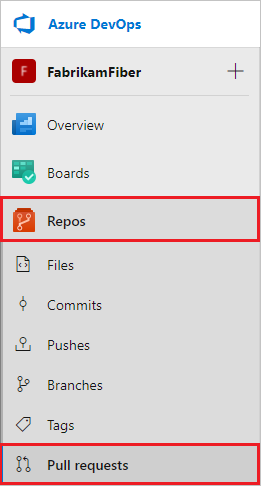
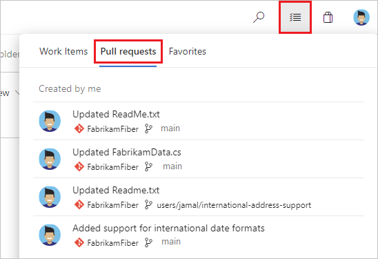
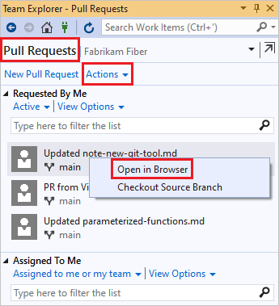
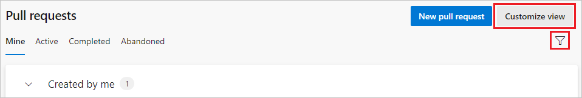
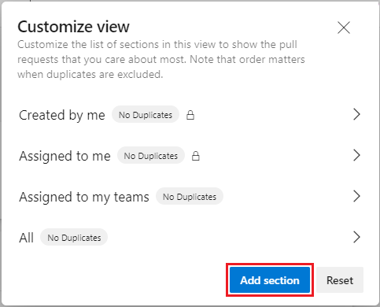
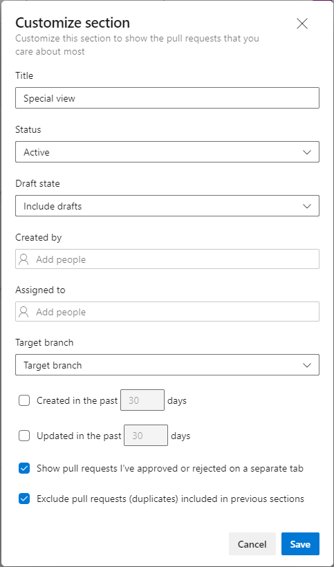
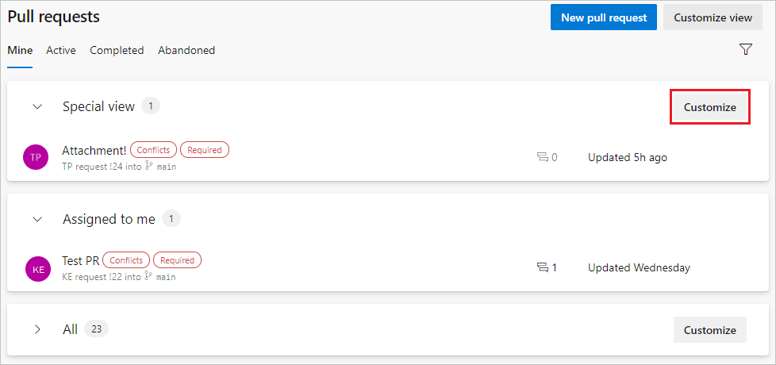
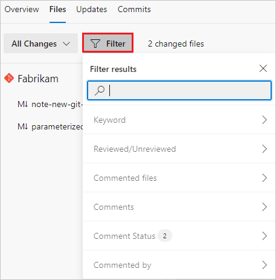
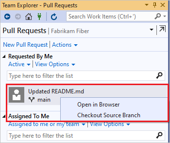
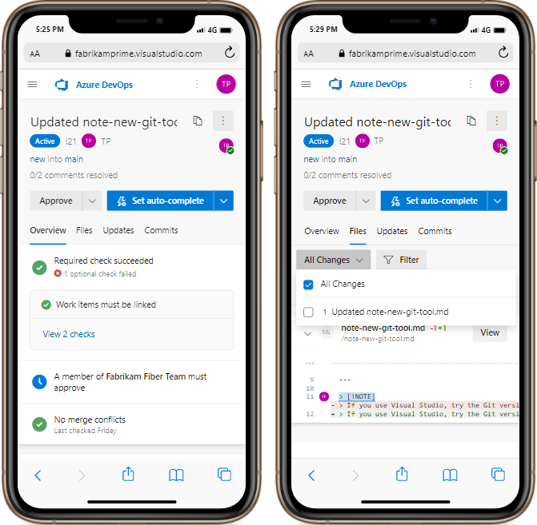

# View, filter, and open pull requests

[!INCLUDE [version-lt-eq-azure-devops](../../includes/version-lt-eq-azure-devops.md)]
[!INCLUDE [version-vs-gt-eq-2019](../../includes/version-vs-gt-eq-2019.md)]

You create pull requests (PRs) to [review](review-pull-requests.md) and [merge](complete-pull-requests.md) code changes in a [Git repository on Azure Repos](../../organizations/projects/create-project.md#add-a-repository-to-your-project). Team members and stakeholders can review changes and give feedback before merging the code into the target branch. Reviewers can also comment on changes and vote to approve or reject the code.

Teams can require PRs for any changes on protected branches, and set [branch policies](branch-policies.md) to require certain PRs to meet specific criteria. 

There are several ways to list, filter, view, and open PRs for a project.

## Prerequisites

::: moniker range="azure-devops"
- **Repos** must be enabled on your project. If the **Repos** hub and associated pages don't display, see [Turn an Azure DevOps service on or off](../../organizations/settings/set-services.md) to reenable Repos.
 
- To view PRs, you must be a member of the Azure DevOps project the PR is in, with **Basic** access or higher. If you aren't a project member, [get added](../../organizations/accounts/add-organization-users.md).

  > [!NOTE]
  > For public projects, users granted **Stakeholder** access have full access to Azure Repos.
::: moniker-end

::: moniker range=">= azure-devops-2019 < azure-devops"
- **Repos** must be enabled on your project. If the **Repos** hub and associated pages don't display, see [Turn an Azure DevOps service on or off](../../organizations/settings/set-services.md) to reenable Repos.
- To view PRs, you must be a member of the Azure DevOps project with **Basic** access or higher. If you aren't a project member, [get added](../../organizations/security/add-users-team-project.md).
::: moniker-end

::: moniker range="< azure-devops-2019"
- To view or review PRs, you must be a member of the Azure DevOps project with **Basic** access or higher. If you aren't a project member, [get added](../../organizations/security/add-users-team-project.md).

::: moniker-end

- To learn more about permissions and access, see [Default Git repository and branch permissions](../../organizations/security/default-git-permissions.md) and [About access levels](../../organizations/security/access-levels.md).

::: moniker range=">= azure-devops-2020"

- In Azure DevOps Services, you can manage PRs and other resources from the [Azure command-line interface (CLI)](/cli/azure/) with the `azure-devops` extension. To learn how to work with the Azure DevOps Services CLI, see [Get started with Azure DevOps CLI](../../cli/index.md). Azure Repos CLI commands for PRs use [az repos pr](/cli/azure/repos/pr).

::: moniker-end

## List pull requests

You can list PRs by using the Azure DevOps project website, Visual Studio, or the Azure DevOps command line.

# [Browser](#tab/browser)

::: moniker range=">= azure-devops-2019"

1. To list PRs in a specific repository in a project, [go to that project](../../project/navigation/go-to-project-repo.md) in the web portal and select **Repos** > **Pull requests**.

   

1. Verify that you selected the correct repository.

   

1. The default view shows your PRs under the **Mine** tab. Select **Active** to show all active PRs for the current repository. Select **Completed** or **Abandoned** to bring up lists of closed PRs.

   Select any PR in the list to go to that PR's **Overview** page.

   

1. You can list all of your PRs across different projects in your organization by choosing **Pull requests** in the **My Work** view.

   

::: moniker-end

::: moniker range="tfs-2018"

Manage PRs you own or are assigned to with the **Pull Requests** tab in the **Code** page on the web.


::: moniker-end 


::: moniker range="tfs-2018"

You can view all of your PRs in your organization, across all projects, by choosing **My pull requests** from the **Projects** page.


::: moniker-end 

# [Visual Studio](#tab/visual-studio)

To list pull requests from Visual Studio, in the **Git** menu, select **\<your Git service>** > **View Pull Requests**.

Visual Studio 2019 version 16.8 and later versions provides a Git version control experience while maintaining the **Team Explorer** Git user interface. To use **Team Explorer**, uncheck **Tools** > **Options** > **Preview Features** > **New Git user experience** from the menu bar. You can exercise Git features from either interface interchangeably.

To access PRs from Visual Studio Team Explorer:

1. [Connect to your project from Visual Studio](../../organizations/projects/connect-to-projects.md).

1. Select **View** > **Team Explorer** to open Team Explorer. You can also press **Ctrl**+**\\**, **Ctrl**+**M**.

1. From **Home**, select **Pull Requests** to view lists of PRs opened by you or assigned to you.

1. To view the PR list in the Azure DevOps web portal, select **Actions** and then select **Open in browser**.

   

# [Azure DevOps CLI](#tab/azure-devops-cli)

::: moniker range="azure-devops"

To list active PRs in your project with their details, use [az repos pr list](/cli/azure/repos/pr#az-repos-pr-list).

```azurecli
az repos pr list [--creator]
                 [--detect {false, true}]
                 [--include-links]
                 [--org]
                 [--project]
                 [--query-examples]
                 [--repository]
                 [--reviewer]
                 [--skip]
                 [--source-branch]
                 [--status {abandoned, active, all, completed}]
                 [--subscription]
                 [--target-branch]
                 [--top]
```

### Parameters

|Parameter|Description|
|---------|-----------|
|`--creator`|Limit results to pull requests created by this user.|
|`--detect`|Automatically detect organization. Accepted values: `false`, `true`.|
|`--include-links`|Include _links for each pull request.|
|`--org` `--organization`|Azure DevOps organization URL. You can configure the default organization by using `az devops configure -d organization=<ORG_URL>`. **Required** if not configured as default or picked up via git config. Example: `https://dev.azure.com/MyOrganizationName/`.|
|`--project` `-p`|Name or ID of the project. You can configure the default project by using `az devops configure -d project=<NAME_OR_ID>`. **Required** if not configured as default or picked up via git config.|
|`--query-examples`|Recommended JMESPath string. You can copy one of the queries and paste it after the `--query` parameter in double quotation marks to see the results. You can add one or more positional keywords so suggestions are based on these keywords.|
|`--repository` `-r`|Name or ID of the repository.|
|`--reviewer`|Limit results to pull requests where this user is a reviewer.|
|`--skip`|Number of pull requests to skip.|
|`--source-branch` `-s`|Limit results to pull requests that originate from this source branch.|
|`--status`|Limit results to pull requests with this status. Accepted values: `abandoned`, `active`, `all`, `completed`.|
|`--subscription`|Name or ID of Azure subscription. You can configure the default subscription by using `az account set -s <NAME_OR_ID>`.|
|`--target-branch` `-t`|Limit results to pull requests that target this branch.|
|`--top`|Maximum number of pull requests to list.|

### Example

The following command lists all PRs in the repository, regardless of status, and shows the output in a table. The example uses the default configuration `az devops configure --defaults organization=https://dev.azure.com/fabrikamprime project="Fabrikam Fiber"`.


```azurecli
az repos pr list --status all --output table

ID    Created     Creator              Title                                           Status     IsDraft    Repository
----  ----------  -------------------  ----------------------------------------------  ---------  ---------  ------------
11    2021-10-04  jamalh@fabrikam.com  Revert 'Updated parameterized-functions.md'     Completed  False      Fabrikam
10    2021-10-04  jamalh@fabrikam.com  Updated parameterized-functions.md              Completed  False      Fabrikam
9     2021-10-04  ke@fabrikam.com      New pull request                                Completed  False      Fabrikam
8     2021-10-04  jamalh@fabrikam.com  Updated parameterized-functions.md              Abandoned  False      Fabrikam
7     2021-09-30  jamalh@fabrikam.com  Added note-new-git-tool.md to /                 Completed  False      Fabrikam
6     2021-09-29  jamalh@fabrikam.com  Revert 'Added parameterized-functions.md to /'  Abandoned  False      Fabrikam
5     2021-09-29  jamalh@fabrikam.com  Updated README.md                               Completed  False      Fabrikam
4     2021-09-29  jamalh@fabrikam.com  Added parameterized-functions.md to /           Completed  False      Fabrikam
3     2021-09-28  jamalh@fabrikam.com  WIP New file                                    Abandoned  False      Fabrikam
2     2021-09-28  jamalh@fabrikam.com  Update README.md                                Abandoned  False      Fabrikam
1     2021-09-28  jamalh@fabrikam.com  Edit README.md                                  Completed  False      Fabrikam
```

::: moniker-end

[!INCLUDE [temp](../../includes/note-cli-not-supported.md)]

***

<a id="define-custom-pr-view" />

## Define a custom pull request view

Filtering the PR list helps you find and organize PRs to prioritize the most important files in your workflow.

# [Browser](#tab/browser)

::: moniker range=">= azure-devops-2019"

To filter the PR list, on the **Pull requests** page, select the **Filter** icon at upper right. Then select **Target branch** or other column header, and select the branch or other value you want to filter on.

To further customize your view of the PR list, select **Customize view** at upper right on the **Pull requests** page.



On the **Customize view** page, you can rearrange the current view sections, edit them, or remove them. To create a new section, select **Add section**.



On the **Customize section** page, enter and select values to filter the section by parameters like draft state or updated date. You can choose whether to **Show pull requests I've approved or rejected on a separate tab**, or **Exclude pull requests (duplicates) included in previous sections**. When you finish customizing the view, select **Save**.



These customized views create separate, collapsible sections on the pull request page. These custom queries also work across repositories on the **My pull requests** tab of the organization home page.


To change the parameters of the customized views, select the **Customize** button next to the view. Or select **Customize view**, and on the **Customize view** screen, select the view you want to change. Some views, like **Assigned to me**, can't be customized, but they can be rearranged or removed.

::: moniker-end

::: moniker range=">= azure-devops-2020"

On a PR **Files** tab, you can use several filters to select files and comments for faster reviews. Select **Filter**, and then select among the options.



- Keyword: Enter a keyword.
- Reviewed/Unreviewed: **All** (default), **Pending**, **Reviewed**.
- Commented files: **All files** (default), **Files with comments**.
- Comments: **Show** (default), **What's new**, **Hide**.
- Comment status: **Active** (default), **Pending**, **Resolved**, **As designed**, **Won't fix**, **Closed**.
- Commented by: **All comments** (default), or a specific person.

You can also type a string into the Search field to show matching results from the preceding options.

::: moniker-end

# [Visual Studio](#tab/visual-studio)

To filter pull requests from Visual Studio:

1. In the **Git** menu, select **\<your Git service>** > **View Pull Requests**.

1. Filter by **Author**, **Label**, or other attributes.

From the Team Explorer **Pull Requests** view:
- Select **Active**, or **Assigned to me or my team**, to filter the PR lists by PR status or assignment.
- Or, type in the **Type here to filter the list** fields to filter the PR lists by date, author, branch, or other attributes.

# [Azure DevOps CLI](#tab/azure-devops-cli)

::: moniker range="azure-devops"

You can use several [az repos pr list](/cli/azure/repos/pr#az-repos-pr-list) parameters to filter the list of PRs, such as `--creator`, `--project`, `--repository`, `--reviewer`, `--source-branch`, `--status`, `--target-branch`, and `--top`.

The `--creator` and `--reviewer` values can be display names or email addresses. The `--top` parameter defines the maximum number of PRs to list.

For example, to list details about the last PR you created, regardless of its status, use:

```azurecli
az repos pr list --creator "My Name" --status all --top 1
```

::: moniker-end

[!INCLUDE [temp](../../includes/note-cli-not-supported.md)]


***

<a id="open-pr" />

## Open a pull request

When you open a PR from the browser, from Visual Studio, or from Azure CLI, the PR **Overview** page opens in the browser. 

# [Browser](#tab/browser)

To open a PR in the browser, select the PR from the list on the **Pull requests** page. The PR opens to its **Overview** tab. The **Overview** tab shows the PR title, description, reviewers, linked worked items, history, and status. You can see a summary of branch policies that are passing or failing, and see comments reviewers have made.

:::image type="content" source="media/view-pull-requests/pull-request-overview-2020.png" alt-text="Screenshot that shows the P R Overview tab.":::

On the PR **Files** tab, you can review the actual changes in the PR files. On the **Updates** and **Commits** tabs, you can see changes the author has made to update the PR branch.

# [Visual Studio](#tab/visual-studio)

To open a pull request from Visual Studio, in the **Git** menu, select **\<your Git service>** > **View Pull Requests**, then select a pull request to open it.

Or, from the Team Explorer **Pull Requests** view, right-click the PR and select **Open in browser** to open the PR in the web portal.

### Check out a branch

In Visual Studio 2019, you can check out a PR's source branch directly from the **Pull Requests** view. Right-click a PR, and choose **Checkout Source Branch**.




[!INCLUDE [temp](includes/note-new-git-tool.md)]


# [Azure DevOps CLI](#tab/azure-devops-cli)

::: moniker range="azure-devops"

To show the details for a single PR, use [az repos pr show](/cli/azure/repos/pr#az-repos-pr-show) with the required `--id` parameter. To open the PR in your browser, use `--open`.

```azurecli
az repos pr show --id
                 [--detect {false, true}]
                 [--open]
                 [--org]
                 [--query-examples]
                 [--subscription]
```

### Parameters

|Parameter|Description|
|---------|-----------|
|`--id`|ID of the pull request. **Required**.|
|`--detect`|Automatically detect organization. Accepted values: `false`, `true`.|
|`--open`|Open the pull request in your web browser.|
|`--org` `--organization`|Azure DevOps organization URL. You can configure the default organization by using `az devops configure -d organization=<ORG_URL>`. **Required** if not configured as default or picked up via git config. Example: `https://dev.azure.com/MyOrganizationName/`.|
|`--query-examples`|Recommended JMESPath string. You can copy one of the queries and paste it after the `--query` parameter in double quotation marks to see the results. You can add one or more positional keywords so suggestions are based on these keywords.|
|`--subscription`|Name or ID of Azure subscription. You can configure the default subscription by using `az account set -s <NAME_OR_ID>`.|

### Example

The following example shows the details for PR #21, shows the command output as a table, and opens the PR in the browser:

```azurecli
az repos pr show --id 21 --open --output table

ID    Created     Creator              Title                         Status    IsDraft    Repository
----  ----------  -------------------  ----------------------------  --------  ---------  ------------
21    2021-10-31  jamalh@fabrikam.com  Updated note-new-git-tool.md  Active    False      Fabrikam
```

### Check out a branch

Use [az repos pr checkout](/cli/azure/repos/pr#az-repos-pr-checkout) with the required `--id` parameter to check out a PR branch locally, as long as there are no local changes.

```azurecli
az repos pr checkout --id
                     [--remote-name]
                     [--subscription]
```

#### Parameters

|Parameter|Description|
|---------|-----------|
|`--id`|ID of the pull request.|
|`--remote-name`|Name of git remote against which PR is raised. Default value: `origin`.|
|`--subscription`|Name or ID of Azure subscription. You can configure the default subscription by using `az account set -s <NAME_OR_ID>`.|

#### Example

For example, to check out the branch for PR #21 locally, use:

```azurecli
az repos pr checkout --id 21
```

::: moniker-end

[!INCLUDE [temp](../../includes/note-cli-not-supported.md)]

***


To review changes, make comments or suggestions, or approve or vote on the PR, see [Review pull requests](review-pull-requests.md).

## View and update pull requests from a mobile device

You can use mobile devices to view all Azure Repos PR screens and take actions.



## Next steps

> [!div class="nextstepaction"]
> [Review pull requests](review-pull-requests.md)
 
## Related articles 

- [Create a pull request](pull-requests.md)
- [Pull request update notifications](pull-request-notifications.md)
- [Complete a pull request](complete-pull-requests.md)
- [Change the default branch](change-default-branch.md)
- [Copy changes with cherry-pick](cherry-pick.md)
- [About pull requests and permissions](about-pull-requests.md)
