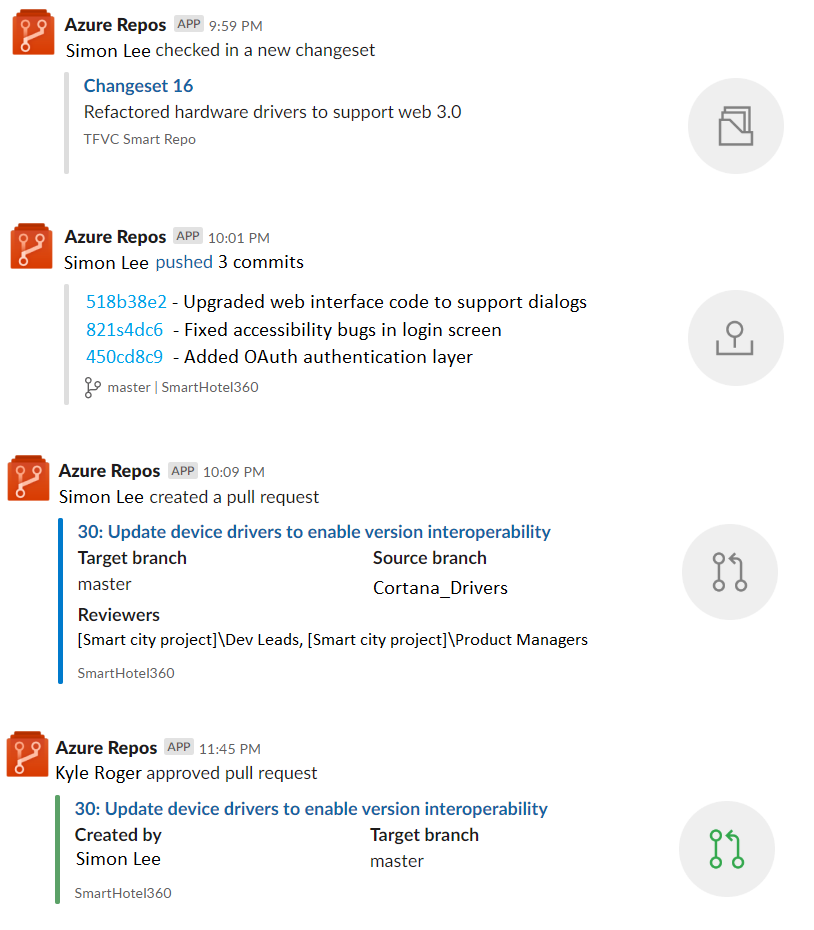
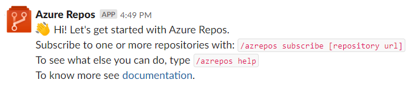
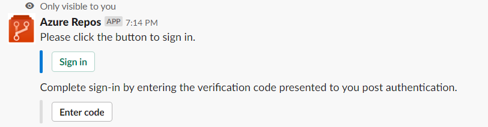
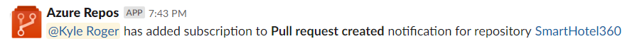
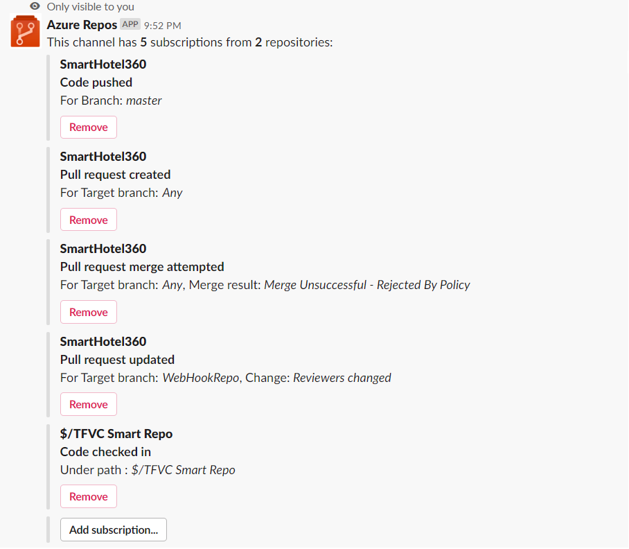
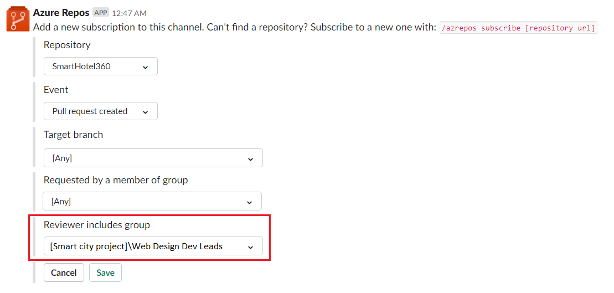
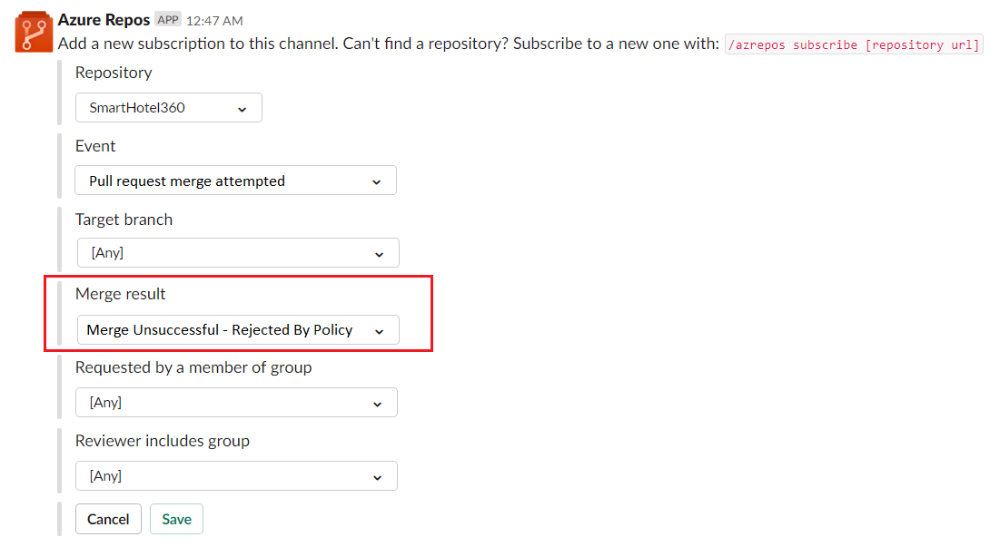
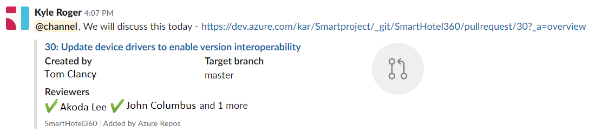
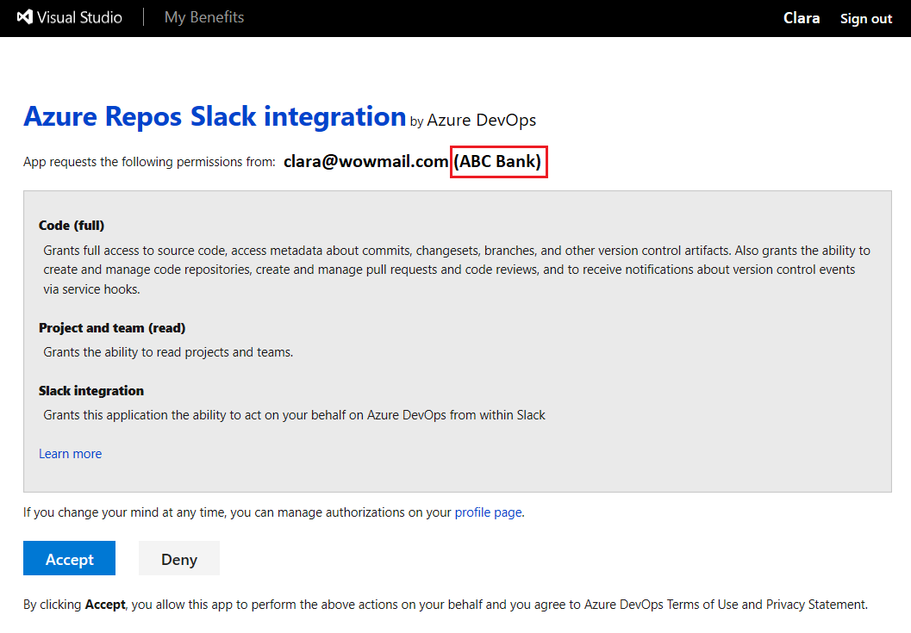

# Azure Repos with Slack

If you use [Slack](https://slack.com), you can use the [Azure Repos app for Slack](https://azchatopprodcus1.azchatops.visualstudio.com/_slack/installreposapp) to easily monitor your Azure repositories. You 
can set up and manage subscriptions to receive notifications in your channel whenever code is pushed/checked 
in and whenever a pull request (PR) is created, updated or a merge is attempted. This app supports both Git and 
Team Foundation Version Control (TFVC) events.

> [!div class="mx-imgBorder"]
> 

Read this article to learn how to: 

> [!div class="checklist"]  
> * Add the Azure Repos app to your Slack workspace
> * Connect Azure Repos app to your repositories
> * Manage subscriptions to repository related events in your Slack channel
> * Using filters effectively to customize subscriptions
> * Get notifications in private Slack channels


## Prerequisites

- To create subscriptions in a Slack channel for repository-related events, you must be a member of the Azure Project Administrators group. 
To get added, see [Set permissions at the project or collection level](../../organizations/security/set-project-collection-level-permissions.md).
- To receive notifications, the **Third-party application access via OAuth** setting must be enabled for the organization. See [Change application 
access policies for your organization](../../organizations/accounts/change-application-access-policies.md).

> [!NOTE]
> * Notifications are currently not supported inside direct messages.
> * You can only link the Azure Repos app for Slack to a project hosted on Azure DevOps Services at this time.

## Add the Azure Repos app to your Slack workspace

1.	Navigate to the [Azure Repos Slack app](https://azchatopprodcus1.azchatops.visualstudio.com/_slack/installreposapp) to install the Azure Repos app to your Slack workspace. 

2.	Once added, you'll see a welcome message from the app as shown in the following image.
   
    > [!div class="mx-imgBorder"]
    > 

3.	Use the `/azrepos` Slack handle to interact with the app. A full list of commands is provided in the [Command reference](#command-reference) section of this article.


## Connect the Azure Repos app to your repositories

1.	Once the app has been installed in your Slack workspace, connect and authenticate yourself to Azure Repos using `/azrepos signin` command.
   
    > [!div class="mx-imgBorder"]
    > 

2.	To start monitoring a repository, use the following slash command inside a channel:

    ```
    /azrepos subscribe [repository url]
    ```

    The repository URL can be to any page within your repository that has your repository name.

    For example, for Git repositories, use:

    ```
    /azrepos subscribe https://dev.azure.com/myorg/myproject/_git/myrepository
    ```

    For TFVC repositories, use:

    ```
    /azrepos subscribe https://dev.azure.com/myorg/myproject/_versionControl
    ```

3. The subscribe command gets you started with a default subscription. For Git repositories, the channel is subscribed to the **Pull request created** 
event, and for TFVC repositories, the channel is subscribed to the **Code checked in** event.

    > [!div class="mx-imgBorder"]
    > 


## Manage subscriptions

To view, add and remove subscriptions for a channel, use the `subscriptions` command:

```
/azrepos subscriptions    
```

This command lists all the current subscriptions for the channel and allows you to add new subscriptions or remove existing ones. 
When adding subscriptions, you can customize the notifications you get by using various filters, as described in the following section.

> [!div class="mx-imgBorder"]
> 

## Using filters effectively to customize subscriptions

When a user subscribes to a repository using `/azrepos subscribe` command, a default subscription is created. Often, users have the need 
to customize these subscriptions. For example, users may want to get notified only when PRs have a specific reviewer. 

The following steps demonstrate how to customize subscriptions.

1.	Run the `/azrepos subscriptions` command.
2.	In the list of subscriptions, if there is a subscription that is unwanted or must be modified (Example: creating noise in the channel), select the **Remove** button.
3.	Select the **Add subscription** button.
4.	Select the required repository and the desired event.
5.	Select the appropriate filters to customize your subscription.

### Example: Get notifications only when my team is in the reviewer list for a PR

> [!div class="mx-imgBorder"]
> 

### Example: Tell me when merge attempts fail due to a policy violation

> [!div class="mx-imgBorder"]
> 

> [!NOTE]
>* All the filters are typically drop-downs. However if the drop-down were to have greater than 100 items, then users are asked to enter the values manually.
>* For the TFVC **Code Checked in** event, the filter **Under path** must be of the format `$/myproject/path`.

## Previews of pull request URLs

When a user pastes the URL of a PR, a preview is shown like the one in the following image. This helps to keep PR-related conversations contextual and accurate.

> [!div class="mx-imgBorder"]
> 

## Command reference

The following table lists all the `/azrepos commands` you can use in your Slack channel

|Slash command	| Functionality |
| -------------------- |----------------|
| /azrepos subscribe [repository url]	| Subscribe to a repository to receive notifications |
| /azrepos subscriptions	| Add or remove subscriptions for this channel |
| /azrepos signin	| Sign in to your Azure Repos organization |
| /azrepos signout	| Sign out from your Azure Repos organization |
| /azrepos feedback	| Report a problem or suggest a feature |

### Notifications in Private channels

The Azure Repos app can help you monitor the repository events in your private channels as well. You will need to invite the bot to your private channel by 
using `/invite @azrepos`. Post that, you can set up and manage your notifications the same way as you would for a public channel.


## Troubleshooting

If you are experiencing the following errors when using the [Azure Repos App for Slack](https://azchatopprodcus1.azchatops.visualstudio.com/_slack/installreposapp), follow the procedures in this section. 

[!INCLUDE [troubleshooting](./_shared/repos-troubleshoot-authentication.md)]

In the **same browser**, start a new tab, navigate to `https://slack.com`, and sign in to your work space (**use web client**). Run the `/azrepos signout` command followed by the `/azrepos signin` command. 

Select the `Sign in` button and you'll be redirected to a consent page like the one in the following example. Ensure that the directory shown beside the email is same as what was chosen in the previous step. Accept and complete the sign in process.

> [!div class="mx-imgBorder"]
> 

If these steps don't resolve your authentication issue, contact us at `AzureDevOpsSlackApps@microsoft.com`.

## Related articles

- [Azure Boards with Slack](https://aka.ms/AzureBoardsSlackIntegration)
- [Azure Pipelines with Slack](https://aka.ms/AzurePipelinesSlackIntegration)
- [Create a service hook for Azure DevOps with Slack](../../service-hooks/services/slack.md)

