# Azure Repos with Microsoft Teams

If you use [Microsoft Teams](https://products.office.com/microsoft-teams/group-chat-software), you can use the 
[Azure Repos app for Teams](URL TBD - link to come once app is live) to easily monitor your repositories. 
Set up and manage subscriptions to receive notifications in your channel whenever code is pushed/checked 
in or when a pull request (PR) is created, updated or merged. The app supports monitoring both Git and 
Team Foundation Version Control (TFVC) repositories.

> [!div class="mx-imgBorder"]
> 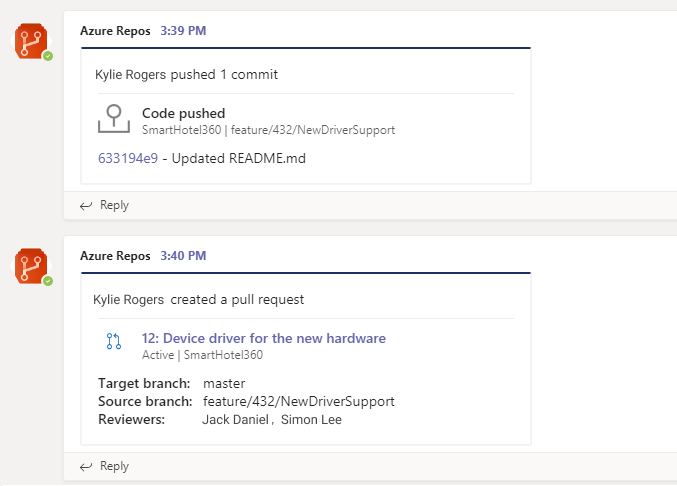

Read this article to learn how to: 

> [!div class="checklist"]  
> * Add the Azure Repos app to your team in Microsoft Teams
> * Connect Azure Repos app to your repositories
> * Manage subscriptions to repository related events in your channel
> * Using filters effectively to customize subscriptions


## Prerequisites

- To create subscriptions for repository-related events, you must be a member of the Azure DevOps Project Administrators group. 
To get added, see [Set permissions at the project or collection level](../../organizations/security/set-project-collection-level-permissions.md).
- To receive notifications, the **Third-party application access via OAuth** setting must be enabled for the Azure DevOps organization. See [Change application 
access policies for your organization](../../organizations/accounts/change-application-access-policies.md).

> [!NOTE]
> * Notifications are currently not supported inside direct messages.
> * You can only link the Azure Repos app for Microsoft Teams to a project hosted on Azure DevOps Services at this time.

## Add the Azure Repos app to your team in Microsoft Teams

Visit the App store in Microsoft Teams and search for the Azure Repos app. Upon installing, a welcome message from the app 
displays as shown in the following image. Use the `@azure repos` handle to start interacting with the app.
   
> [!div class="mx-imgBorder"]
> 


## Connect the Azure Repos app to your repositories

1. Once the app has been installed in your team, authenticate yourself to Azure Repos using `@azure repos signin` command.
   
   > [!div class="mx-imgBorder"]
   > 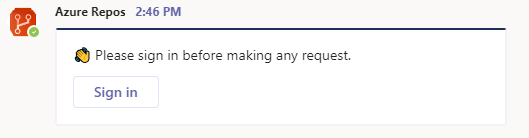

   > [!div class="mx-imgBorder"]
   > 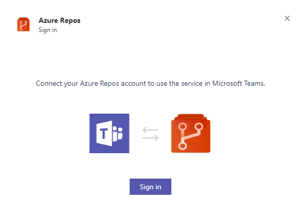

   > [!div class="mx-imgBorder"]
   > 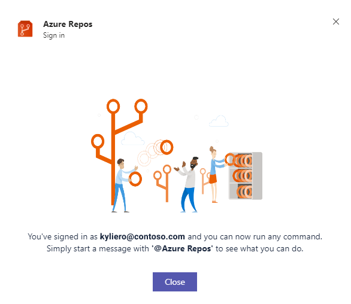


2. To start monitoring a repository, use the following command inside a channel:

   ```
   @azure repos subscribe [repository url]
   ```

   The repository URL can be to any page within your repository that has your repository name.

   For example, for Git repositories, use:

   ```
   @azure repos subscribe https://dev.azure.com/myorg/myproject/_git/myrepository
   ```

   For TFVC repositories, use:

   ```
   @azure repos subscribe https://dev.azure.com/myorg/myproject/_versionControl
   ```

3. The subscribe command gets you started with a default subscription. For Git repositories, the channel gets subscribed to 
**Pull request created** event. For TFVC repositories, the channel is subscribed to **Code checked in** event.

   > [!div class="mx-imgBorder"]
   > 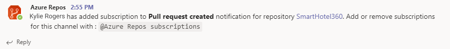


## Manage subscriptions

To view, add and remove subscriptions for a channel, use the `subscriptions` command:

```
@azure repos subscriptions    
```

This command lists all the current subscriptions for the channel and allows you to add new subscriptions or remove existing ones. 
When adding subscriptions, you can customize the notifications you get by using various filters, as described in the following section.

> [!div class="mx-imgBorder"]
> 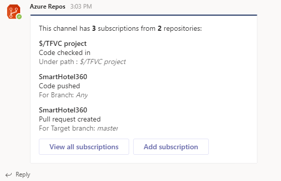

## Using filters to only get notifications that you want

When a user subscribes to a repository using `@azure repos subscribe` command, a default subscription is created with no filters applied.
Often, users need to customize these subscriptions to only be notified when certain conditions are met. 
For example, users may want to get notified only when PRs have a particular group added as reviewer. 

The following steps demonstrate how to customize subscriptions.

1.	Run the `@azure repos subscriptions` command.
2.	In the list of subscriptions, if there is a subscription that is unwanted or must be modified, select **Remove** to delete it.
3.	Select the **Add subscription** button.
4.	Select the required repository and the desired event.
5.	Select the appropriate filters to customize your subscription.

### Example: Get notifications only when my team is in the reviewer list for a PR

> [!div class="mx-imgBorder"]
> 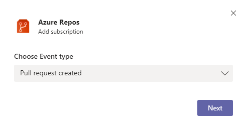

> [!div class="mx-imgBorder"]
> 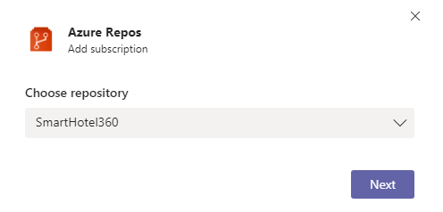

> [!div class="mx-imgBorder"]
> 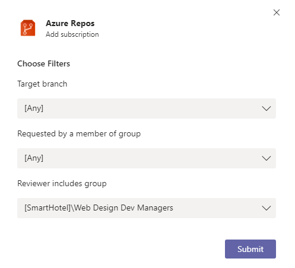
    
    
> [!NOTE]
> * All the filters are typically drop-downs. However if the drop-down were to have greater than 100 items, then you will need to enter the values manually.
> * For the TFVC **Code Checked in** event, the filter **Under path** must be of the format `$/myproject/path`.

## Previews of pull request URLs

When a user pastes the URL of a PR, a preview is shown like the one in the following image. This helps to keep PR-related conversations contextual and accurate.

> [!div class="mx-imgBorder"]
> 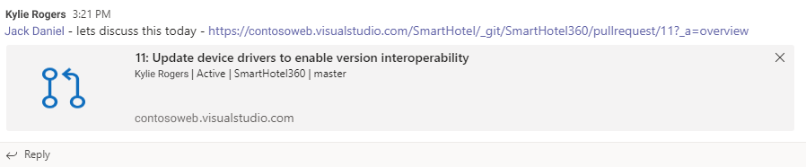

## Command reference

The following table lists all the Azure repos commands you can use in your Teams channel

|Command	| Functionality |
| -------------------- |----------------|
| @azure repos subscribe [repository url]	| Subscribe to a repository to receive notifications |
| @azure repos subscriptions	| Add or remove subscriptions for this channel |
| @azure repos signin	| Sign in to your Azure Repos organization |
| @azure repos signout	| Sign out from your Azure Repos organization |
| @azure repos feedback	| Report a problem or suggest a feature |

## Troubleshooting

If you are experiencing the following errors when using the Azure Repos App, follow the procedures in this section. 

[!INCLUDE [troubleshooting](./_shared/repos-troubleshoot-authentication.md)]

In the **same browser**, start a new tab and sign in to `https://teams.microsoft.com/`. Run the `@Azure Repos signout` command and then run the `@Azure Repos signin` command in the channel where the Azure Repos app for Microsoft Teams is installed.

Select the `Sign in` button and you'll be redirected to a consent page like the one in the following example. Ensure that the directory shown beside the email is same as what was chosen in the previous step. Accept and complete the sign-in process.

> [!div class="mx-imgBorder"]
> 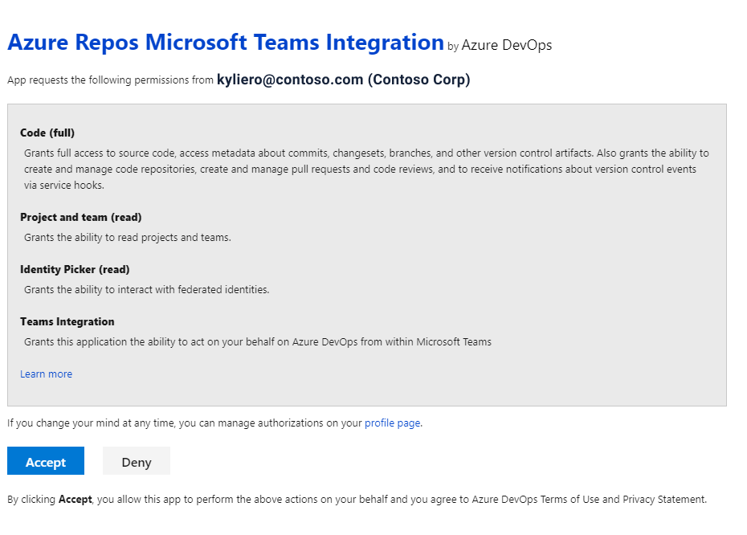

If these steps don't resolve your authentication issue, please reach out to us at `AzureDevOpsTeamsApps@microsoft.com`.

## Related articles

- [Azure Boards with Teams](https://aka.ms/AzureBoardsTeamsIntegration)
- [Azure Pipelines with Teams](https://aka.ms/AzurePipelinesTeamsIntegration)
