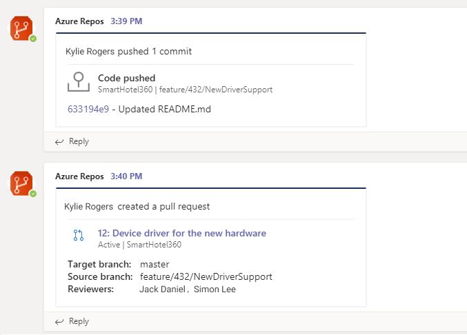
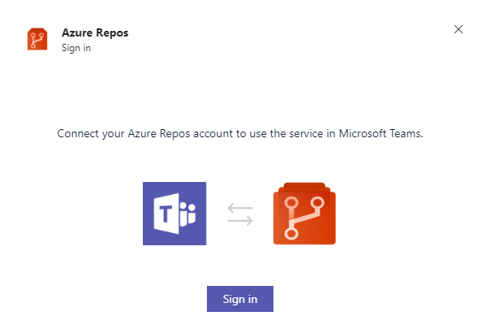
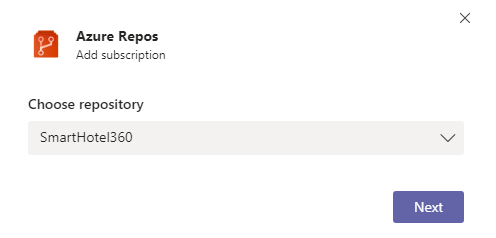
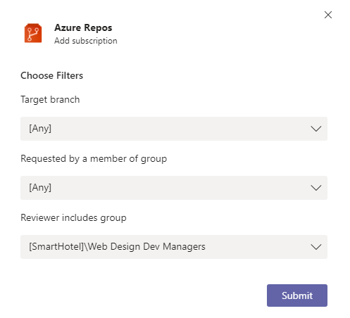
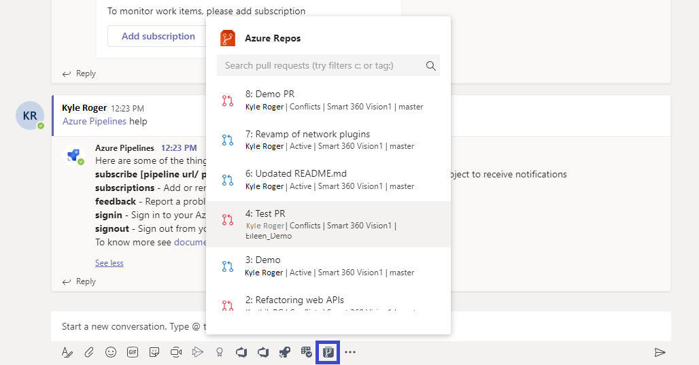
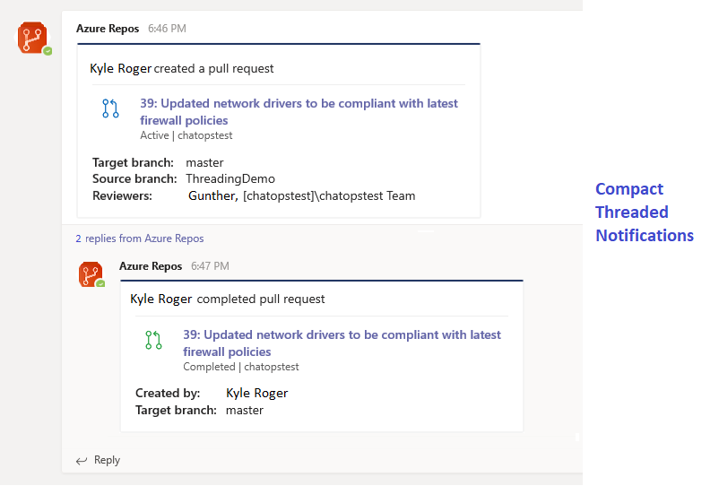
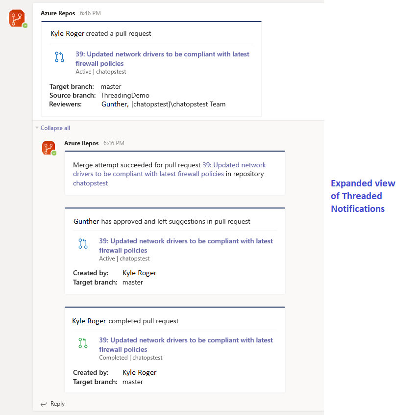
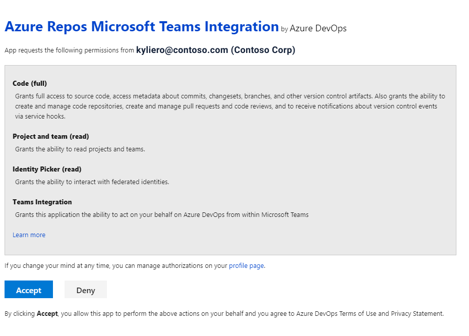

# Azure Repos with Microsoft Teams

If you use [Microsoft Teams](https://products.office.com/microsoft-teams/group-chat-software), you can use the 
[Azure Repos app for Teams](https://appsource.microsoft.com/product/office/WA200000643) to easily monitor your repositories. 
Set up and manage subscriptions to receive notifications in your channel whenever code is pushed/checked 
in or when a pull request (PR) is created, updated or merged. The app supports monitoring both Git and 
Team Foundation Version Control (TFVC) repositories.

> [!div class="mx-imgBorder"]
> 

Read this article to learn how to: 

> [!div class="checklist"]  
> * Add the Azure Repos app to your team in Microsoft Teams
> * Connect the Azure Repos app to your repositories
> * Manage subscriptions to repository related events in your channel
> * Using filters effectively to customize subscriptions


## Prerequisites

- To create subscriptions for repository-related events, you must be a member of the Azure DevOps Project Administrators group or Team Administrators group. To get added, see [Set permissions at the project- or collection-level](../../organizations/security/set-project-collection-level-permissions.md) or [Add Team Administrator](../../organizations/settings/add-team-administrator.md). 
To get added, see [Set permissions at the project or collection level](../../organizations/security/set-project-collection-level-permissions.md).
- To receive notifications, the **Third-party application access via OAuth** setting must be enabled for the Azure DevOps organization, see [Change application 
access policies for your organization](../../organizations/accounts/change-application-access-policies.md).

> [!NOTE]
> * Notifications are currently not supported inside direct messages.
> * You can only link the Azure Repos app for Microsoft Teams to a project hosted on Azure DevOps Services at this time.

## Add the Azure Repos app to your team in Microsoft Teams

Visit the App store in Microsoft Teams and search for the Azure Repos app. Upon installing, a welcome message from the app 
displays as shown in the following image. Use the `@azure repos` handle to start interacting with the app.
   
> [!div class="mx-imgBorder"]
> 


## Connect the Azure Repos app to your repositories

1. Once the app has been installed in your team, authenticate yourself to Azure Repos using the `@azure repos signin` command. Use **Sign in with different email** if your Microsoft Teams and Azure Boards are in different tenants. 
   
   > [!div class="mx-imgBorder"]
   > 

   > [!div class="mx-imgBorder"]
   > 

   > [!div class="mx-imgBorder"]
   > 


2. To start monitoring all Git repositories in a project, use the following slash command inside a channel:

   ```
   @azure repos subscribe [project url]
   ```
   The project URL can be to any page within your project (except URLs to repositories).

   For example:

   ```
   @azure repos subscribe https://dev.azure.com/myorg/myproject/
   ```

   You can also monitor a specific repository using the following command:

   ```
   @azure repos subscribe [repository url]
   ```

   The repository URL can be to any page within your repository that has your repository name.

   For example, for Git repositories, use:

   ```
   @azure repos subscribe https://dev.azure.com/myorg/myproject/_git/myrepository
   ```

   For TFVC repositories, use:

   ```
   @azure repos subscribe https://dev.azure.com/myorg/myproject/_versionControl
   ```
   
   > [!NOTE]
   > You can subscribe only to public repositories. 

3. The `subscribe` command gets you started with a default subscription. For Git repositories, the channel gets subscribed to the **Pull request created** event (with target branch = master). For TFVC repositories, the channel is subscribed to the **Code checked in** event.

   > [!div class="mx-imgBorder"]
   > 


## Manage subscriptions

To view, add, and remove subscriptions for a channel, use the `subscriptions` command:

```
@azure repos subscriptions    
```

The `subscription` command lists all the current subscriptions for the channel and allows you to add new subscriptions or remove existing ones. 
When adding subscriptions, you can customize the notifications you get by using various filters, as described in the following section.

[!NOTE]
Team administrators aren't able to remove or modify subscriptions created by Project administrators.

> [!div class="mx-imgBorder"]
> 

## Using filters to get only notifications that you want

When a user subscribes to a repository using the `@azure repos subscribe` command, a default subscription is created with no filters applied.
Often, users need to customize these subscriptions to be notified only when certain conditions are met. 
For example, users may want to get notified only when PRs have a particular group added as reviewer. 

The following steps demonstrate how to customize subscriptions.

1.	Run the `@azure repos subscriptions` command.
2.	In the list of subscriptions, if there is a subscription that is unwanted or must be modified, select **Remove** to delete it.
3.	Select the **Add subscription** button.
4.	Select the required repository and the desired event.
5.	Select the appropriate filters to customize your subscription.

### Example: Get notifications only when my team is in the reviewer list for a PR

> [!div class="mx-imgBorder"]
> 

> [!div class="mx-imgBorder"]
> 

> [!div class="mx-imgBorder"]
> 
    
    
> [!NOTE]
> * All the filters are typically drop-downs. However if the drop-down were to have greater than 100 items, then you will need to enter the values manually.
> * For the TFVC **Code Checked in** event, the filter **Under path** must be of the format `$/myproject/path`.

## Search and share pull request information using compose extension

To help users search and share information about pull requests, Azure Repos app for Microsoft Teams supports compose extension. You can now search for pull requests by ID or name. For compose extension to work, users will have to sign into Azure Repos project that they are interested in either by running `@azure repos signin` command or by signing into the compose extension directly.

> [!div class="mx-imgBorder"]
> 

## Previews of pull request URLs

When a user pastes the URL of a PR, a preview is shown like the one in the following image. This helps to keep PR-related conversations contextual and accurate.

> [!div class="mx-imgBorder"]
> 

For this feature to work, users have to be signed-in. Once they are signed in, this feature will work for all channels in a Team.

## Remove subscriptions and repositories from a channel

- Many a time, users want to clean up their channel by removing repositories and subscriptions. Use the below command to achieve the same.

	```
	@azure repos unsubscribe all [project url]
	```

	For example:

	```
	@azure repos unsubscribe all https://dev.azure.com/myorg/myproject
	```
This command will delete all the subscriptions related to any repository in the project and removes the repositories from the channel. Only project admins can run this command.

## Threaded notifications

- To logically link a set of related notifications and also to reduce the space occupied by notifications in a channel, notifications are threaded. All notifications linked to a particular pull request will be linked together.

### Compact view of threaded notifications

> [!div class="mx-imgBorder"]
> 

### Expanded view of threaded notifications
> [!div class="mx-imgBorder"]
> 

## Command reference

The following table lists all the `azure repos` commands you can use in your Teams channel.

|Command	| Functionality |
| -------------------- |----------------|
| @azure repos subscribe [repository url/ project url]	| Subscribe to a repository or all repositories in a project to receive notifications |
| @azure repos subscriptions	| Add or remove subscriptions for this channel |
| @azure repos signin	| Sign in to your Azure Repos organization |
| @azure repos signout	| Sign out from your Azure Repos organization |
| @azure repos feedback	| Report a problem or suggest a feature |
| @azure repos unsubscribe all [project url] | Remove all repositories (belonging to a project) and their associated subscriptions from a channel |

 ## Multi-tenant support

In your organization if you are using a different email or tenant for Microsoft Teams and Azure DevOps, perform the following steps to sign in and connect based on your use case. 
 
 <table>
  <tr>
   <td>
       <strong>Case</strong>
   </td>
   <td>
        <strong>Email ID and tenant in Microsoft Teams</strong>
   </td>
   <td>
        <strong>Email ID and tenant in Azure DevOps</strong>
   </td>
   <td>
        <strong>Steps to take </strong>
   </td>
  </tr>
  <tr>
   <td>
        1
   </td>
   <td>
        <u>email1@abc.com</u> (tenant 1)
   </td>
   <td>
        <u>email1@abc.com</u> (tenant 1)
   </td>
   <td>
        Sign in using <strong>Sign in</strong> button.
   </td>
  </tr>
  <tr>
   <td>
        2
   </td>
   <td>
        <u>email1@abc.com</u> (tenant 1)
   </td>
   <td>
        <u>email1@abc.com</u> (tenant 2)
   </td>
   <td>
    <ul>
	<li>Sign in the Azure DevOps account</li> 
	<li>In the same browser, start a new tab, navigate to https://teams.microsoft.com/</li> 
	<li>Run the <code>signin</code> command and choose the <strong>Sign in</strong> button. </li>
    </ul>
   </td>
  </tr>
  <tr>
   <td>
        3
   </td>
   <td>
        <u>email1@abc.com</u> (tenant 1) 
   </td>
   <td>
        <u>email2@pqr.com</u> (tenant 2) 
   </td>
   <td>
        Sign in using <strong>Sign in with different email address</strong>, in the email id picker use the email2 to sign in to Azure DevOps.
   </td>
  </tr>
  <tr>
   <td>
        4
   </td>
   <td>
        <u>email1@abc.com</u> (tenant 1) 
   </td>
   <td>
        <u>email2@pqr.com</u> (non default tenant 3)
   </td>
   <td>
    This scenario is not supported today.
   </td>
  </tr>
</table>

## Troubleshooting

If you are experiencing the following errors when using the Azure Repos App, follow the procedures in this section. 

[!INCLUDE [troubleshooting](./includes/repos-troubleshoot-authentication.md)]

In the **same browser**, start a new tab and sign in to `https://teams.microsoft.com/`. Run the `@Azure Repos signout` command and then run the `@Azure Repos signin` command in the channel where the Azure Repos app for Microsoft Teams is installed.

Select the `Sign in` button and you'll be redirected to a consent page like the one in the following example. Ensure that the directory shown beside the email is same as what was chosen in the previous step. Accept and complete the sign-in process.

> [!div class="mx-imgBorder"]
> 

If these steps don't resolve your authentication issue, please out to us at [Developer Community](https://developercommunity.visualstudio.com/spaces/21/index.html).

## Related articles

- [Azure Boards with Teams](../../boards/integrations/boards-teams.md)
- [Azure Pipelines with Teams](../../pipelines/integrations/microsoft-teams.md)
