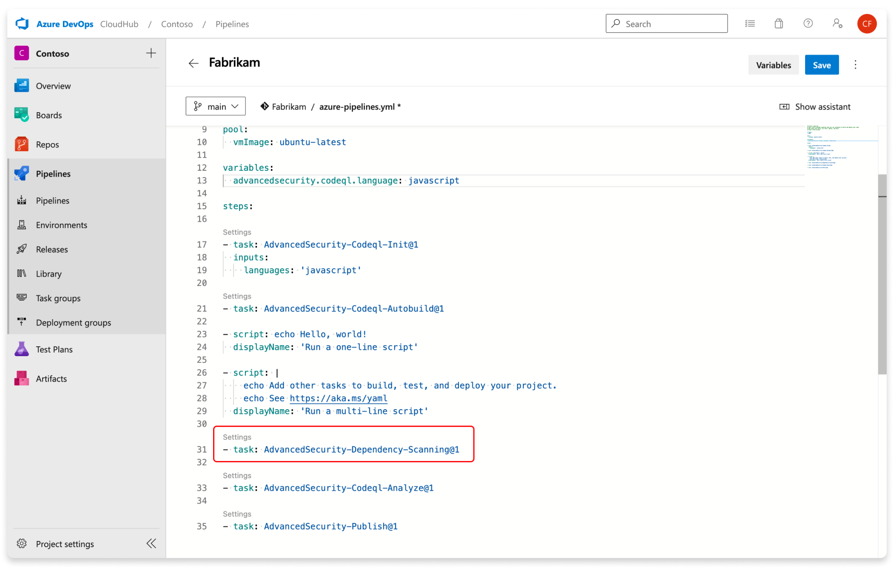
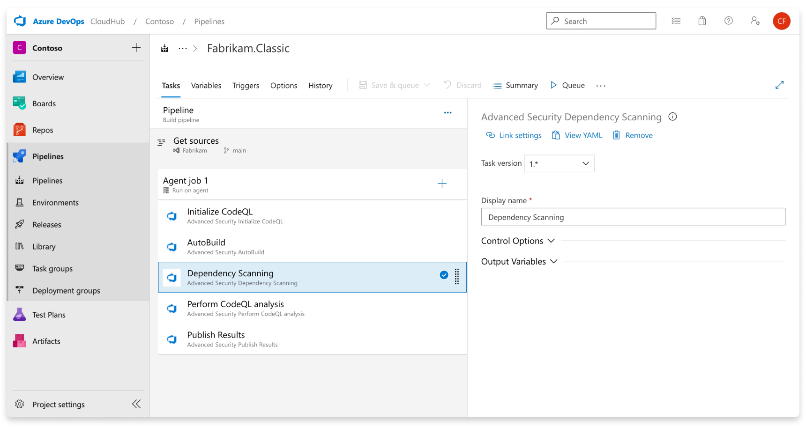
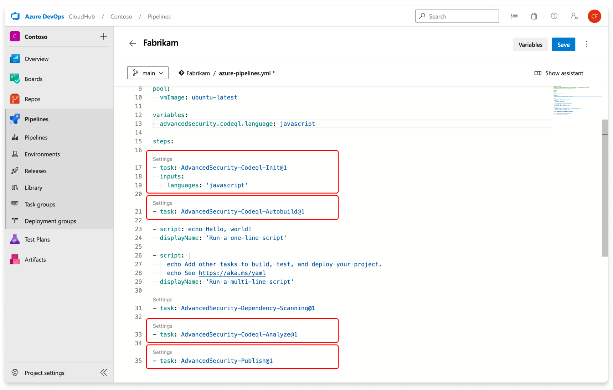
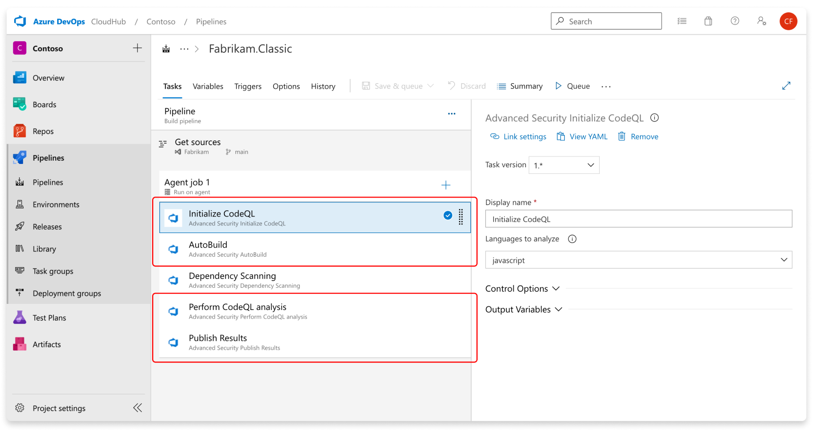

# Configure GitHub Advanced Security for Azure DevOps

[!INCLUDE [github-advanced-security-preview](includes/github-advanced-security-preview.md)]

GitHub Advanced Security for Azure DevOps adds GitHub Advanced Security's suite of security features to Azure Repos. 

GitHub Advanced Security for Azure includes:
* Secret Scanning push protection: check if code pushes include commits that expose secrets such as credentials  
* Secret Scanning repo scanning: scan your repository and look for exposed secrets that were committed accidentally
* Dependency Scanning – search for known vulnerabilities in open source dependencies (direct and transitive)
* Code Scanning – use CodeQL static analysis engine to identify code-level application vulnerabilities such as SQL injection and authentication bypass 

At this time, GitHub Advanced Security for Azure DevOps is only available for Azure DevOps service and there are no plans to bring this product to Azure DevOps Server. 

[!INCLUDE [GitHub Advanced Security for Azure DevOps is different from GitHub Advanced Security.](includes/github-advanced-security.md)]

## Prerequisites

You have permissions allocated as a member of the Project Collection Administrators group.  To add members to the Project Collection Administrators group or change a project collection-level permission see [Change project collection-level permissions](../../organizations/security/change-organization-collection-level-permissions.md).

### Extra prerequisites for self-hosted agents

If your organization uses self-hosted agents, there are more requirements: 

* Add these URLs to your Allowlist to allow for the dependency scanning task to fetch vulnerability advisory data. Learn more about [Allowed IP addresses and domain URLs](../../organizations/security/allow-list-ip-url.md). 

| Domain URL  | Description |
| ----------- | ----------- |
| `https://governance.dev.azure.com/{organization_name}` | For organizations using the dev.azure.com domain to access their DevOps instance  |
| `https://dev.azure.com/{organization_name}` | For organizations using the dev.azure.com domain to access their DevOps instance |
| `https://{organization_name}.governance.visualstudio.com/` | For organizations using the {organization_name}.visualstudio.com domain to access their DevOps instance   |
| `https://{organization_name}.visualstudio.com`  | For organizations using the {organization_name}.visualstudio.com domain to access their DevOps instance | 

* Run a compatible version of the .NET runtime (currently .NET 6.0.x). If a compatible version isn't present on the agent, the dependency scanning build task downloads [.NET](https://visualstudio.microsoft.com/downloads/). 

* Install the CodeQL bundle to the agent tool cache: 
    1.	Pick the latest CodeQL release bundle from [GitHub](https://github.com/github/codeql-action/releases).
    2.	Download and unzip the bundle to the following directory inside the agent tools directory, typically located under `_work/_tools`: `./CodeQL/0.0.0-[codeql-release-bundle-tag (i.e. codeql-bundle-20221105)]/x64/`. Learn more about the [agent tools directory](https://github.com/microsoft/azure-pipelines-tool-lib/blob/master/docs/overview.md#tool-cache). 
    3.	Create an empty file at `./CodeQL/0.0.0-[codeql-release-bundle-tag (i.e. codeql-bundle-20221105)]/x64.complete`

## Enable GitHub Advanced Security

To access each of the scanning tools and results, you need to first enable Advanced Security for your repository. Once you enable Advanced Security, any future pushes containing secrets to a repository with this policy enabled are blocked, and repository secret scanning happens in the background.

1. Go to your **Project settings** for your Azure DevOps project. 
1. Select **Repos** > **Repositories**. 
1. Select the repository you want to enable Advanced Security for. 
1. Select **Enable** and **Begin billing to activate Advanced Security**. A shield icon now appears in the repository view for any repository with Advanced Security enabled.  

 

## Set up secret scanning

Secret scanning push protection and repository scanning are automatically enabled when you turn on Advanced Security. You can enable or disable secret push protection from the repository settings page. 

As mentioned, secret scanning repository scanning is automatically kicked off upon enabling Advanced Security for a selected repository.
## Set up dependency scanning

Dependency scanning is a pipeline-based scanning tool. Results are aggregated per repository. It's recommended that you add the dependency scanning task to all the pipelines you'd like to be scanned. 

>[!TIP] 
> For the most accurate scanning results, be sure to add the dependency scanning task following the build steps of a pipeline that builds the code you wish to scan.

#### [YAML](#tab/yaml)

Add the task Advanced Security Dependency Scanning (`AdvancedSecurity-Dependency-Scanning@1`) directly to your YAML pipeline file or select the Advanced Security Dependency Scanning task from the Tasks assistant.

#### [Classic](#tab/classic)

Add the `Advanced Security Dependency Scanning` task to your pipeline. 

To generate alerts, run your first scan with a pipeline with the dependency scanning task included.

--- 

## Set up code scanning

Code scanning is also a pipeline-based scanning tool where results are aggregated per repository. 

>[!TIP] 
> It's recommended to add the code scanning task to a separate, cloned pipeline of your main production pipeline or create a new pipeline. This is because code scanning can be a more time-intensive build task.

#### [YAML](#tab/yaml)

Add the tasks in the following order: 
1. Advanced Security Initialize CodeQL (`AdvancedSecurity-Codeql-Init@1`)
1. Advanced Security AutoBuild (language-dependent) (`AdvancedSecurity-Codeql-Autobuild@1`)   
1. Advanced Security Perform CodeQL Analysis (`AdvancedSecurity-Codeql-Analyze@1`)
1. Advanced Security Publish Results (`AdvancedSecurity-Publish@1`) 

Additionally, add two build variables:
1. `advancedsecurity.codeql.language` and set it for the languages you wish to analyze. A comma separated list can be used to analyze multiple languages at once. The supported languages are `csharp, cpp, go, java, javascript, python, ruby`.  

    > [!TIP]
    > CodeQL analysis for Kotlin is currently in beta. During the beta, analysis of Kotlin will be less comprehensive than CodeQL analysis of other languages.
    > Use `java` to analyze code written in Java, Kotlin or both.
    > Use `javascript` to analyze code written in JavaScript, TypeScript or both.

1. `advancedsecurity.submittoadvancedsecurity: true` to submit the results to Advanced Security

If the language specified is `cpp, java,` or `csharp` either custom or `AutoBuild` build steps are required. For other languages, if AutoBuild is included the step completes successfully without performing any action.

#### [Classic](#tab/classic)

Add the tasks in the following order: 
1. `Advanced Security Initialize CodeQL`
1. `Advanced Security AutoBuild` (language-dependent) 
1. `Advanced Security Perform CodeQL Analysis`
1. `Advanced Security Publish Results`

Additionally, add two build variables:
1. `advancedsecurity.codeql.language` and set it for the languages you wish to analyze. A comma separated list can be used to analyze multiple languages at once. The supported languages are `csharp, cpp, go, java, javascript, python, ruby`. 
1. `advancedsecurity.submittoadvancedsecurity: true` to submit the results to Advanced Security

If the language specified is `cpp, java,` or `csharp,` either custom or `AutoBuild` build steps are required. For other languages, if AutoBuild is included the step completes successfully without performing any action. 

To generate alerts, run your first scan with a pipeline with the code scanning tasks included.

--- 

If, for whatever reason, you need to disable Advanced Security, any alerts and state of alerts will be retained for the next time you re-enable Advanced Security for your repository.

## Next steps

* [Code scanning alerts for GitHub Advanced Security for Azure DevOps](github-advanced-security-code-scanning.md)
* [Dependency scanning alerts for GitHub Advanced Security for Azure DevOps](github-advanced-security-dependency-scanning.md)
* [Secret scanning alerts for GitHub Advanced Security for Azure DevOps](github-advanced-security-secret-scanning.md)
* [Permissions for GitHub Advanced Security for Azure DevOps](github-advanced-security-permissions.md)
* [Billing for GitHub Advanced Security for Azure DevOps](github-advanced-security-billing.md)
