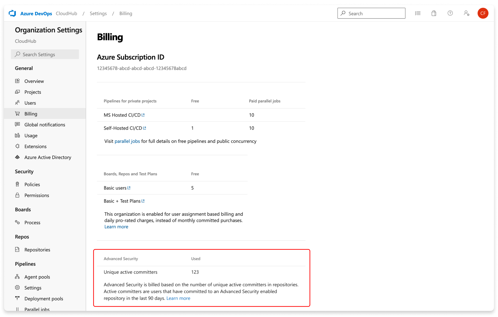

#  Advanced Security billing

:::zone pivot="bundled-ghazdo"
To access results and use [GitHub Advanced Security for Azure DevOps](configure-github-advanced-security-features.md) features, you need a license. Each active committer to at least one repository with Advanced Security enabled consumes one license. For more information on pricing, see [GitHub Advanced Security pricing](https://azure.microsoft.com/products/devops/github-advanced-security#pricing). A committer is considered active if they're present in a push made within the last 90 days, regardless of when they originally committed. 

Advanced Security gets billed monthly and directly to the Azure subscription associated with your Azure DevOps organization. Daily charges emit to your Azure subscription based off of the total number of active committers per day across your organizations.

Active committers are deduplicated across an Azure subscription. Users can contribute to multiple repositories or organizations and only get counted once, as long as those organizations are associated with the same Azure subscription. 

[!INCLUDE [GitHub Advanced Security for Azure DevOps is different from GitHub Advanced Security.](includes/github-advanced-security.md)]

### Active committer count for Advanced Security 

Total active committers are the number of committers who contributed to at least one repository with Advanced Security enabled. For each pushed change, any valid identity that contributed to that change is considered an active committer, even if the commit was made before the 90-day span. Regardless of their Azure DevOps access level, they must be a member of your Azure DevOps organization.

Before you enable Advanced Security for your organization, project, or repository, you can see an estimate of the number of active committers you may be charged for. 

> [!div class="mx-imgBorder"]  
> 

You can find the exact number of consumed licenses (active committer count in Advanced Security-enabled repositories) for Advanced Security under **Organization settings > Billing**. This number represents active committers as measured for the previous day.

> [!div class="mx-imgBorder"]  
> 

If you disable Advanced Security for all repositories in your organization, the active committer estimate disappears but you can watch your billing on your Azure subscription in the Azure portal.

### Understanding active committer count 
Use the following table for an example of how active committers and your potential bill might change over time.

| Date | Events during the month | Total active committers |
| ---------- | ----------- | ------ |
| March 1 | A project collection administrator (PCA) enables Advanced Security for the Fabrikam repository. Fabrikam has 30 active committers over the past 90 days. | **30** |
| March 19 | A PCA disables Advanced Security for the Fabrikam repository. The active committers from Fabrikam don't get counted.| 30 - 30 = **0** |
| July 15 | A PCA re-enables Advanced Security for Fabrikam. Fabrikam has 20 active committers over the past 90 days. | **20** |
| August 1 | A PCA enables Advanced Security for a second repository, AdventureWorks. In the last 90 days, 30 developers committed to that repository. 10 of those developers also committed to Fabrikam and don't consume more licenses. | 20 + 20 = **40** | 

### Migrating to standalone experiences 
For existing customers, there is no disruption to your current Advanced Security experience. If you're interested in moving to the Secret Protection and Code Security products, contact Azure DevOps support via the **Azure Portal**. File a support ticket for the GitHub Advanced Security for Azure DevOps service and select "Billing migration from bundled to standalone products" as the problem type. 

In your support request, include all Azure subscriptions that may be linked to your Azure DevOps organizations to be migrated.
:::zone-end 

:::zone pivot="standalone-ghazdo"
To access results and use [GitHub Advanced Security for Azure DevOps](configure-github-advanced-security-features.md) features, you need a license. Costs differ depending on which product you have enabled. For more information on pricing, see [GitHub Advanced Security pricing](https://azure.microsoft.com/products/devops/github-advanced-security#pricing). A committer is considered active if they're present in a push made within the last 90 days, regardless of when they originally committed. 

Secret Protection and Code Security are billed monthly and directly to the Azure subscription associated with your Azure DevOps organization. Daily charges emit to your Azure subscription based off of the total number of active committers per product per day across your organizations.

Active committers are deduplicated across an Azure subscription per product. Users can contribute to multiple repositories or organizations and only get counted once, as long as those organizations are associated with the same Azure subscription and for the same product (i.e.: Secret Protection or Code Security). 

[!INCLUDE [GitHub Advanced Security for Azure DevOps is different from GitHub Advanced Security.](includes/github-advanced-security.md)]

### Active committer count for Advanced Security 

Total active committers are the number of committers who contributed per product to at least one repository with Secret Protection or Code Security enabled. For each pushed change, any valid identity that contributed to that change is considered an active committer, even if the commit was made before the 90-day span. Regardless of their Azure DevOps access level, they must be a member of your Azure DevOps organization.

Before you enable Advanced Security for your organization, project, or repository, you can see an estimate of the number of active committers you may be charged for. 

> [!div class="mx-imgBorder"]  
> 

You can find the exact number of consumed licenses per product (active committer count in Advanced Security-enabled repositories) for Advanced Security under **Organization settings > Billing**. This number represents active committers as measured for the previous day.

> [!div class="mx-imgBorder"]  
> 

If you disable Secret Protection or Code Security for all repositories in your organization, the active committer estimate disappears. You can see your billing on your Azure subscription in the Azure portal.

### Understanding active committer count 
Use the following table for an example of how active committers and your potential bill might change over time.

| Date | Events during the month | Total active committers |
| ---------- | ----------- | ------ |
| March 1 | A project collection administrator (PCA) enables Secret Protection for the Fabrikam repository. Fabrikam has 30 active committers over the past 90 days. | **30** |
| March 19 | A PCA disables Secret Protection for the Fabrikam repository. The active committers from Fabrikam don't get counted.| 30 - 30 = **0** |
| July 15 | A PCA re-enables Secret Protection for Fabrikam. Fabrikam has 20 active committers over the past 90 days. | **20** |
| August 1 | A PCA enables Secret Protection for a second repository, AdventureWorks. In the last 90 days, 30 developers committed to that repository. 10 of those developers also committed to Fabrikam and don't consume more licenses. | 20 + 20 = **40** |
:::zone-end

## Related articles

- [Set up code scanning](github-advanced-security-code-scanning.md)
- [Set up dependency scanning](github-advanced-security-dependency-scanning.md)
- [Set up secret scanning](github-advanced-security-secret-scanning.md)
- [Learn about GitHub Advanced Security for Azure DevOps](github-advanced-security-security-overview.md)
