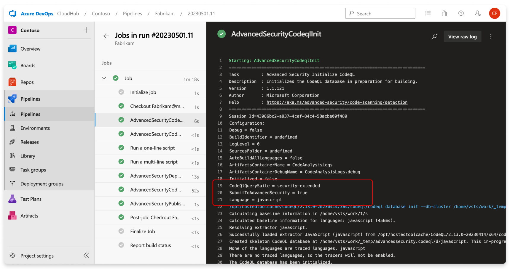
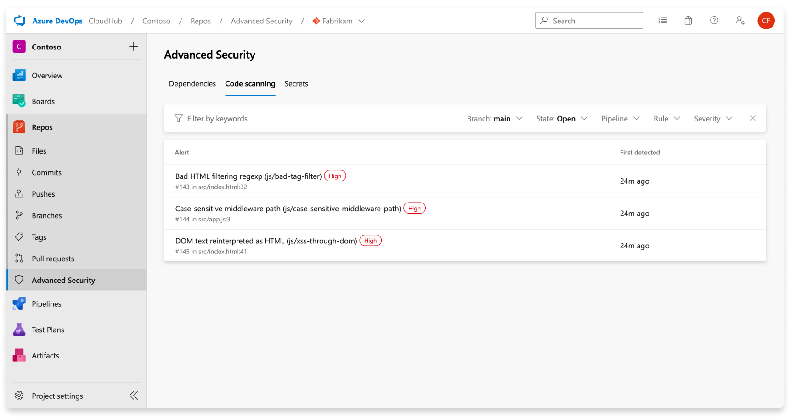
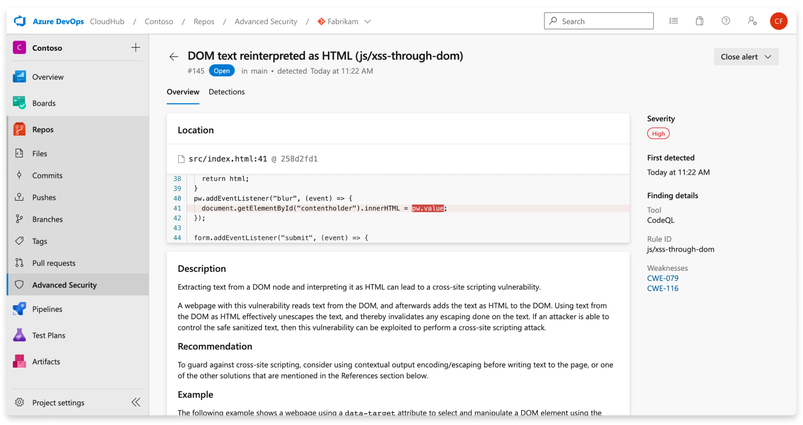
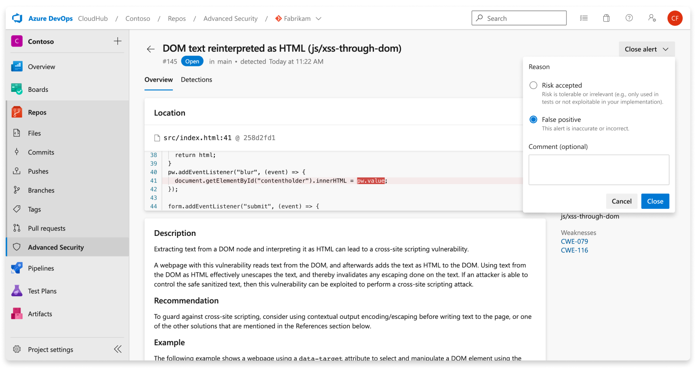

# Code scanning 

[!INCLUDE [github-advanced-security-preview](includes/github-advanced-security-preview.md)]

Code scanning in [GitHub Advanced Security for Azure DevOps](configure-github-advanced-security-features.md) let's you analyze the code in an Azure DevOps repository to find security vulnerabilities and coding errors. Any problems identified by the analysis are raised as an alert. Code scanning uses CodeQL to identify vulnerabilities.  

CodeQL is the code analysis engine developed by GitHub to automate security checks. You can analyze your code using CodeQL and display the results as code scanning alerts.  

[!INCLUDE [GitHub Advanced Security for Azure DevOps is different from GitHub Advanced Security.](includes/github-advanced-security.md)]

## CodeQL alerts

GitHub experts, security researchers, and community contributors write and maintain the default CodeQL queries used for code scanning. The queries are regularly updated to improve analysis and reduce any false positive results. The queries are open source, so you can view and contribute to the queries in the [github/codeql](https://github.com/github/codeql) repository. 

For more specific documentation about CodeQL, visit the [CodeQL documentation on GitHub](https://codeql.github.com/docs/).

CodeQL supports both compiled and interpreted languages and can find vulnerabilities and errors in code that's written in the supported languages. 

* C/C++ 
* C# 
* Go 
* Java 
* JavaScript/TypeScript 
* Kotlin (beta)
* Python 
* Ruby 

For more information, see the documentation on the CodeQL website on [Supported languages and frameworks](https://codeql.github.com/docs/codeql-overview/supported-languages-and-frameworks/).

You can view the specific queries and task details used by CodeQL by looking through the build log, similar to dependency scanning. 

## Code scanning alerts

[GitHub Advanced Security for Azure DevOps](configure-github-advanced-security-features.md) code scanning alerts include code scanning flags by repository that alert of code-level application vulnerabilities. 

To use code scanning, you need to first configure [GitHub Advanced Security for Azure DevOps](configure-github-advanced-security-features.md). 

The Advanced Security tab under Repos in Azure DevOps is the hub to view your code scanning alerts. 
Select the **Code scanning** tab to view scanning alerts. You can filter by branch, state, pipeline, rule type, and severity. 

There's no effect to results if pipelines or branches are renamed - it may take up to 24 hours before the new name is displayed.

 

If for whatever reason, you turn off Advanced Security for your repository, you'll lose access to the results in the Advanced Security tab and build task. The build task won't fail, but any results from builds run with the task while Advanced Security is disabled are hidden and unretained. 

### Alert details 

Select an alert for more details, including remediation guidance. Each alert includes  a location, description, example, and severity. 

| Section  | Explanation  |
|---|---|
|  Location | The **Locations** section details a specific instance where CodeQL has detected a vulnerability. If there are multiple instances of your code violating the same rule, a new alert is generated for each distinct location. The Locations card contains a direct link to the affected code snippet so you can select the snippet to be directed to the Azure DevOps web UI for editing.  |
| Description | The description is provided by the CodeQL tool based off of the problem. |
| Recommendation | The recommendation is the suggested fix for a given code scanning alert. |
| Example | The example section shows a simplified example of the identified weakness in your code. |
| Severity | Severity levels can be low, medium, high, or critical. The severity score is based off of the given Common Vulnerability Scoring System (CVSS) score for the identified Common Weakness Enumeration (CWE). Learn more about how severity is scored at this [GitHub blog post](https://github.blog/changelog/2021-07-19-codeql-code-scanning-new-severity-levels-for-security-alerts/). |

## Manage code scanning alerts 

### Viewing alerts for a repository 

Anyone with contributor permissions for a repository can view a summary of all alerts for a repository in the Advanced Security tab under Repos. Select the **Code scanning** tab to view all secret scanning alerts.

To display results, code scanning tasks need to run first. Once the first scan finishes, any detected vulnerabilities are displayed in the Advanced Security tab. 

By default, the alerts page shows dependency scanning results for the default branch of the repository. 

The status of a given alert reflects the state for the default branch and latest run pipeline, even if the alert exists on other branches and pipelines. 

### Dismissing code scanning alerts

To dismiss alerts, you need appropriate permissions. By default, only project administrators can dismiss Advanced Security alerts. 

To dismiss an alert: 

1. Navigate to the alert you wish to close and select on the alert.
1. Select the **Close alert** drop-down.
1. If not already selected, select either **Risk accepted** or **False positive** as the closure reason.
1. Add an optional comment into the **Comment** text box.
1. Select **Close** to submit and close the alert.
1. The alert state changes from **Open** to **Closed** and your dismissal reason displays.

This only dismisses the alert for your selected branch. Other branches that contain the same vulnerability stay active until dismissed. Any alert that has been previously dismissed can be manually reopened.

