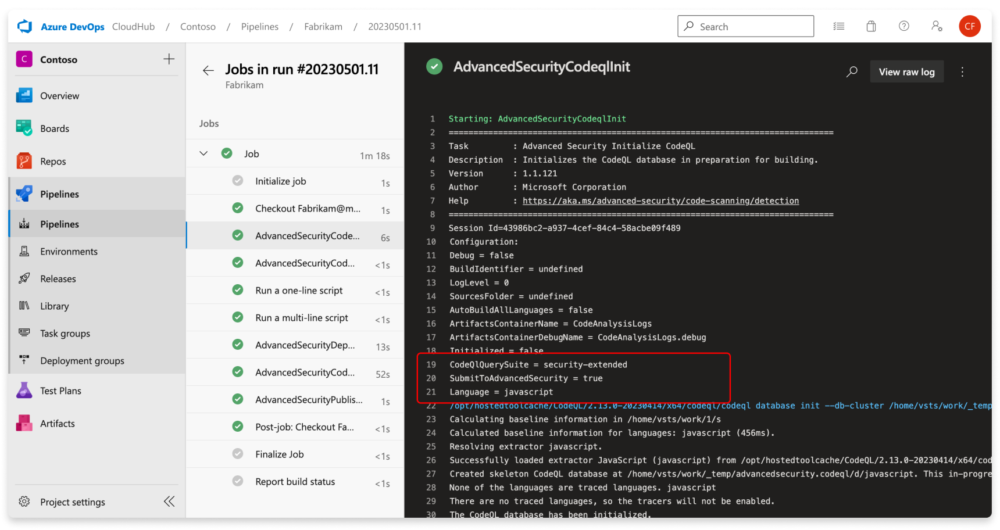
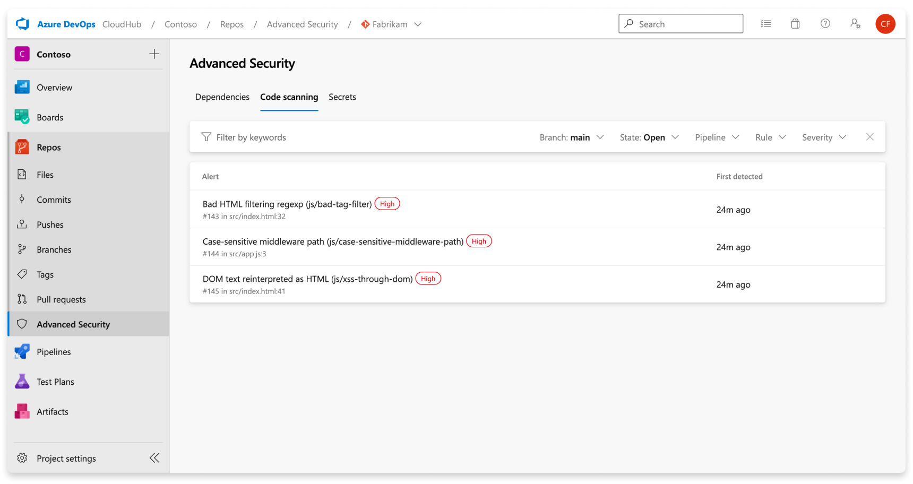
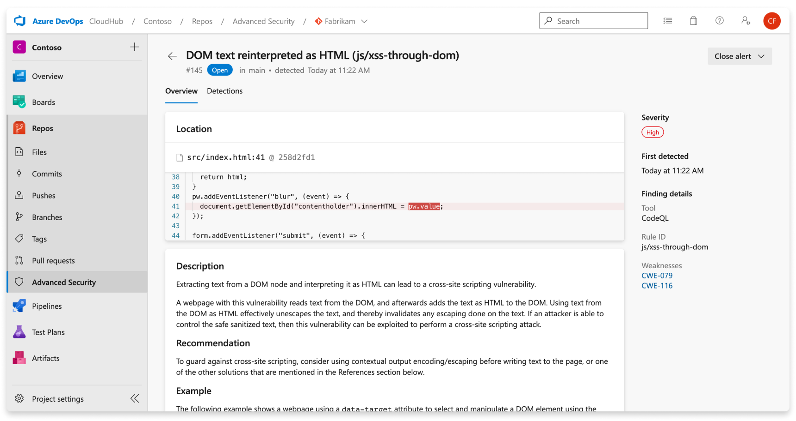
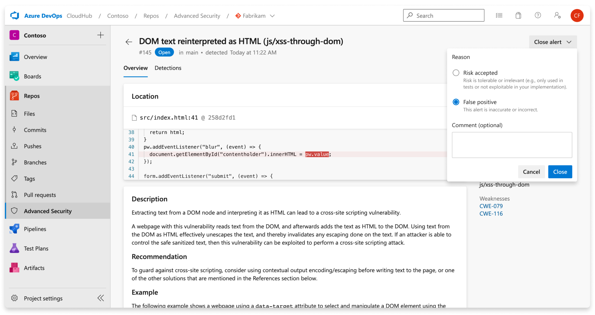
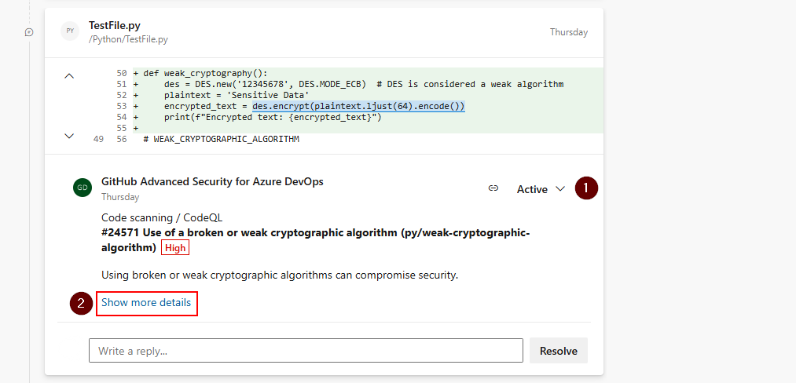
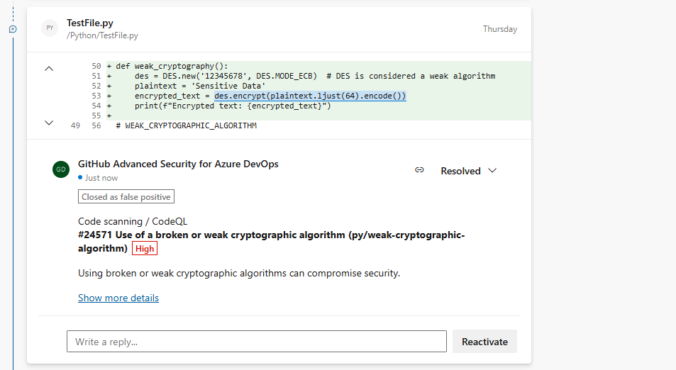

# Set up code scanning 

Code scanning in GitHub Advanced Security for Azure DevOps lets you analyze the code in an Azure DevOps repository to find security vulnerabilities and coding errors. You'll need either GitHub Advanced Security for Azure DevOps or, if you're using the standalone experience, GitHub Code Security for Azure DevOps enabled. Any problems identified by the analysis are raised as an alert. Code scanning uses CodeQL to identify vulnerabilities. 

CodeQL is the code analysis engine developed by GitHub to automate security checks. You can analyze your code using CodeQL and display the results as code scanning alerts. For more specific documentation about CodeQL, see [CodeQL documentation](https://codeql.github.com/docs/).

[!INCLUDE [GitHub Advanced Security for Azure DevOps is different from GitHub Advanced Security.](includes/github-advanced-security.md)]

## Prerequisites

[!INCLUDE [github-advanced-security-prerequisites](includes/github-advanced-security-prerequisites.md)]

## About code scanning setup types

There are two main ways to set up code scanning for your repository: **default setup** and **advanced setup**. 

| | Default setup | Advanced setup |
|---|---|---|
| **Configuration** | Automatic — no pipeline configuration required | Manual — requires adding CodeQL tasks to a pipeline |
| **Language detection** | Automatically detects and scans CodeQL-supported languages | You specify languages in the pipeline task |
| **Branch coverage** | Scans default branch and pull requests targeting the default branch | Scans any branch that triggers the pipeline |
| **Build customization** | No custom build steps — uses `none` build mode | Full control over build steps for compiled languages |
| **Best for** | Quick enablement, interpreted languages, standard scanning needs | Compiled languages needing custom builds, multi-branch scanning, advanced configuration |

**Default setup** is the quickest way to enable code scanning. It creates a managed scanning configuration behind the scenes and requires no pipeline changes. We recommend starting with default setup for most repositories.

**Advanced setup** gives you full control by adding CodeQL tasks directly to your Azure Pipelines. Use advanced setup when you need to:
- Manage specific agent pools for different languages or compute needs
- Customize build steps for compiled languages 
- Scan branches beyond the default branch
- Integrate code scanning into an existing CI/CD pipeline
- Use a specific CodeQL query suite or custom queries

> [!TIP]
> You can start with default setup and switch to advanced setup later if you need more control. For information on configuring default setup, see [Configure GitHub Advanced Security features](configure-github-advanced-security-features.md#set-up-code-scanning).

## Configure default setup options

After you enable CodeQL default setup, you can configure the **agent pool** and **scan schedule** from your organization settings. These options apply to all repositories in the organization that use default setup.

To access the configurable options, go to **Organization settings** > **Repositories** and expand the **CodeQL default setup configurable options** dropdown.

:::image type="content" source="media/advanced-security-codeql-default-setup-options.png" lightbox="media/advanced-security-codeql-default-setup-options.png" alt-text="Screenshot of expanded CodeQL default setup configurable options showing agent pool and scan schedule settings.":::

### Agent pool

Select the agent pool used to run CodeQL default setup scans across all repositories in the organization. You can choose from:

- **Azure Pipelines** — uses Microsoft-hosted agents. Using the Azure Pipelines agent pool consumes pipeline concurrency.
- **Self-hosted agent pools** — uses your own agents. Select a self-hosted pool if your repositories require access to private networks, specific build tools, or other resources not available on hosted agents.
- **Managed DevOps Pools** — uses Azure-managed pools with custom VM images.

### Scan schedule

Select when CodeQL default setup scans run for all repositories in the organization. You can choose a specific day of the week for weekly scans. The next scheduled run date is displayed below the dropdown.

### Cancel running or queued scans

If you need to stop any actively running or queued default setup scans, you can manually cancel them through **Organization settings** > **Repositories**. Users with the **Manage settings** permission on the repository can cancel running or queued default setup runs.

## Advanced setup for code scanning

CodeQL is a pipeline-based tool, where results are aggregated per repository. 

>[!TIP] 
> Code scanning can be a more time-intensive build task, so we recommend that you add the code scanning task to a separate, cloned pipeline of your main production pipeline or create a new pipeline.

#### [YAML](#tab/yaml)

Add the tasks in the following order: 
1. Advanced Security Initialize CodeQL ([AdvancedSecurity-Codeql-Init@1](/azure/devops/pipelines/tasks/reference/advanced-security-codeql-init-v1))
1. Your custom build steps
1. Advanced Security Perform CodeQL Analysis ([AdvancedSecurity-Codeql-Analyze@1](/azure/devops/pipelines/tasks/reference/advanced-security-codeql-analyze-v1))

:::image type="content" source="media/code-scanning-config-yaml-tasks.png" lightbox="media/code-scanning-config-yaml-tasks.png" alt-text="Screenshot of code scanning pipeline setup for YAML.":::

Also, specify which language you're analyzing in the `Initialize CodeQL` task. You can use a comma separated list to analyze multiple languages at once. The supported languages are `csharp, cpp, go, java, javascript, python, ruby, swift`. If you're utilizing self-hosted agents, you might also add the `enableAutomaticCodeQLInstall: true` variable to automatically install the latest CodeQL bits for your agent.

Here's an example starter pipeline:

>[!div class="tabbedCodeSnippets"]
```yaml
trigger:
  - main

pool:
  # Additional hosted image options are available: https://learn.microsoft.com/en-us/azure/devops/pipelines/agents/hosted#software
  vmImage: ubuntu-latest

steps:

  - task: AdvancedSecurity-Codeql-Init@1
    inputs:
      languages: "java"
      # Supported languages: csharp, cpp, go, java, javascript, python, ruby, swift
      # You can customize the initialize task: https://learn.microsoft.com/en-us/azure/devops/pipelines/tasks/reference/advanced-security-codeql-init-v1?view=azure-pipelines
      # If you're using a self-hosted agent to run CodeQL, use `enableAutomaticCodeQLInstall` to automatically use the latest CodeQL bits on your agent:
      enableAutomaticCodeQLInstall: true

#   Add your custom build steps here
# - Ensure that all code to be scanned is compiled (often using a `clean` command to ensure you're building from a clean state).
# - Disable the use of any build caching mechanisms as this can interfere with CodeQL's ability to capture all the necessary data during the build.
# - Disable the use of any distributed/multithreaded/incremental builds as CodeQL needs to monitor executions of the compiler to construct an accurate representation of the application.
# - For dependency scanning, ensure you have a package restore step for more accurate results.

# If you had a Maven app:
#   - task: Maven@4
#     inputs:
#       mavenPomFile: 'pom.xml'
#       goals: 'clean package'
#       publishJUnitResults: true
#       testResultsFiles: '**/TEST-*.xml'
#       javaHomeOption: 'JDKVersion'
#       jdkVersionOption: '1.17'
#       mavenVersionOption: 'Default'

# Or a general script:
#   - script: |
#       echo "Run, Build Application using script"
#       ./location_of_script_within_repo/buildscript.sh

  - task: AdvancedSecurity-Dependency-Scanning@1 # More details on this task: https://learn.microsoft.com/en-us/azure/devops/pipelines/tasks/reference/advanced-security-dependency-scanning-v1?view=azure-pipelines

  - task: AdvancedSecurity-Codeql-Analyze@1 # More details on this task: https://learn.microsoft.com/en-us/azure/devops/pipelines/tasks/reference/advanced-security-codeql-analyze-v1?view=azure-pipelines

```

#### [Classic](#tab/classic)

Add the tasks in the following order: 
1. `Advanced Security Initialize CodeQL` ([AdvancedSecurity-Codeql-Init@1](/azure/devops/pipelines/tasks/reference/advanced-security-codeql-init-v1))
1. Add your own custom build steps
1. `Advanced Security Perform CodeQL Analysis` ([AdvancedSecurity-Codeql-Analyze@1](/azure/devops/pipelines/tasks/reference/advanced-security-codeql-analyze-v1))

:::image type="content" source="media/code-scanning-config-classic-tasks.png" alt-text="Screenshot of code scanning pipeline setup for classic pipelines." lightbox="media/code-scanning-config-classic-tasks.png" :::

---

Also, specify which language you're analyzing in the `Initialize CodeQL` task. If the language specified is `swift`, custom build steps are required.

> [!TIP]
> - Use `java` to analyze code written in Java, Kotlin or both.
> - Use `javascript` to analyze code written in JavaScript, TypeScript, or both. 

If you're running on a self-hosted agent, select the `Enable automatic CodeQL detection and installation` to automatically use the latest CodeQL bits on your agent if you didn't manually install the latest CodeQL bundle to your agent tool cache.

To generate alerts, run your first scan with a pipeline with the code scanning tasks included.

## More configurations for code scanning

### Language and query support

GitHub experts, security researchers, and community contributors write and maintain the default CodeQL queries used for code scanning. The queries are regularly updated to improve analysis and reduce any false positive results. The queries are open source, so you can view and contribute to the queries in the [github/codeql](https://github.com/github/codeql) repository. 

CodeQL supports and uses the following language identifiers:

| Language               | Identifier            |
|------------------------|-----------------------|
| C/C++                  | `cpp`                 |
| C#                     | `csharp`                |
| Go                     | `go`                    |
| Java/Kotlin            | `java`           |
| JavaScript/TypeScript  | `javascript`            |
| Python                 | `python`                | 
| Ruby                   | `ruby`                  | 
| Swift                  | `swift`                 | 

> [!TIP]
> * Use `cpp` to analyze code written in C, C++ or both.
> * Use `java` to analyze code written in Java, Kotlin or both.
> * Use `javascript` to analyze code written in JavaScript, TypeScript or both.

For more information, see [Supported languages and frameworks](https://codeql.github.com/docs/codeql-overview/supported-languages-and-frameworks/). 

You can view the specific queries and task details executed by CodeQL in the build log. 

[](./media/code-scanning-build-log.png#lightbox)

### Code scanning build mode customization
Code scanning supports two build modes when setting up a pipeline for scanning:
* `none` - the CodeQL database is created directly from the codebase without building the codebase (supported for all interpreted languages, and additionally supported for `cpp`, `java`, and `csharp`).
* `manual` - you define the build steps to use for the codebase in the workflow (supported for all compiled languages).

For more information on the different build modes including a comparison on the benefits of each build mode, see [CodeQL code scanning for compiled languages](https://docs.github.com/en/code-security/code-scanning/creating-an-advanced-setup-for-code-scanning/codeql-code-scanning-for-compiled-languages#about-the-codeql-analysis-workflow-and-compiled-languages). 

> [!TIP]
> Build mode `none` is useable with other interpreted languages, for example, JavaScript, Python, Ruby.
> If build mode `none` is specified for C# or Java with other compiled languages that don't support build mode `none`, the pipeline task fails.

The following code shows an example of a valid configuration with multiple languages and `none` build mode:

>[!div class="tabbedCodeSnippets"]
```yaml
trigger: none
 
pool:
  vmImage: windows-latest

steps:
- task: AdvancedSecurity-Codeql-Init@1
  displayName: Initialize CodeQL
  inputs:
# build mode `none` is supported for C# and Java, and JavaScript is an interpreted language
# and build mode `none` has no impact on JavaScript analysis
    languages: 'csharp, java, javascript' 
    buildtype: 'none'

- task: AdvancedSecurity-Codeql-Analyze@1
  displayName: Perform CodeQL Analysis
 ```

The following code shows an example of an invalid configuration with multiple languages and `none` build mode:

>[!div class="tabbedCodeSnippets"]
```yaml
trigger: none
 
pool:
  vmImage: windows-latest

steps:
- task: AdvancedSecurity-Codeql-Init@1
  displayName: Initialize CodeQL
  inputs:
# build mode `none` is supported for C# but build mode `none` is NOT supported for Swift
# so this pipeline definition will result in a failed run
    languages: 'csharp, swift'
    buildtype: 'none'

- task: AdvancedSecurity-Codeql-Analyze@1
  displayName: Perform CodeQL Analysis
 ```

## Code scanning alerts

[GitHub Advanced Security for Azure DevOps](configure-github-advanced-security-features.md) code scanning alerts include code scanning flags by repository that alert of code-level application vulnerabilities. 

To use code scanning, you need to first configure [GitHub Advanced Security for Azure DevOps](configure-github-advanced-security-features.md). 

The Advanced Security tab under Repos in Azure DevOps is the hub to view your code scanning alerts. Select the **Code scanning** tab to view scanning alerts. You can filter by branch, state, pipeline, rule type, and severity. At this time, the alerts hub doesn't display alerts for scanning completed on PR branches.

There's no effect to results if pipelines or branches are renamed - it may take up to 24 hours before the new name is displayed. 

If you choose to run custom CodeQL queries, there isn't by default a separate filter for alerts generated from different query packs. You can filter by rule, which is distinct for each query. 

[](./media/code-scanning-alerts.png#lightbox) 

If you turn off Advanced Security for your repository, you lose access to the results in the Advanced Security tab and build task. The build task doesn't fail, but any results from builds run with the task while Advanced Security is disabled are hidden and not retained. 

### Alert details 

Select an alert for more details, including remediation guidance. Each alert includes  a location, description, example, and severity. 


[](./media/code-scanning-detail.png#lightbox)

| Section  | Explanation  |
|---|---|
|  Location | The **Locations** section details a specific instance where CodeQL detected a vulnerability. If there are multiple instances of your code violating the same rule, a new alert is generated for each distinct location. The Locations card contains a direct link to the affected code snippet so you can select the snippet to be directed to the Azure DevOps web UI for editing.  |
| Description | The description is provided by the CodeQL tool based off of the problem. |
| Recommendation | The recommendation is the suggested fix for a given code scanning alert. |
| Example | The example section shows a simplified example of the identified weakness in your code. |
| Severity | Severity levels can be low, medium, high, or critical. The severity score is based off of the given Common Vulnerability Scoring System (CVSS) score for the identified Common Weakness Enumeration (CWE). Learn more about how severity is scored at this [GitHub blog post](https://github.blog/changelog/2021-07-19-codeql-code-scanning-new-severity-levels-for-security-alerts/). |

### Viewing alerts for a repository 

Anyone with contributor permissions for a repository can view a summary of all alerts for a repository in the Advanced Security tab under Repos. Select the **Code scanning** tab to view all secret scanning alerts.

To display results, code scanning tasks need to run first. Once the first scan finishes, any detected vulnerabilities are displayed in the Advanced Security tab. 

By default, the alerts page shows code scanning results for the default branch of the repository. 

The status of a given alert reflects the state for the default branch and latest run pipeline, even if the alert exists on other branches and pipelines. 

### Dismissing code scanning alerts

To dismiss alerts, you need appropriate permissions. By default, only project administrators can dismiss Advanced Security alerts. 

To dismiss an alert: 

1. Navigate to the alert you wish to close and select on the alert.
1. Select the **Close alert** drop-down.
1. If not already selected, select either **Risk accepted** or **False positive** as the closure reason.
1. Add an optional comment into the **Comment** text box.
1. Select **Close** to submit and close the alert.
1. The alert state changes from **Open** to **Closed** and your dismissal reason displays.

[](./media/code-scanning-dismiss-alert.png#lightbox)

This action dismisses the alert across all branches. Other branches that contain the same vulnerability will also be dismissed. Any alert previously dismissed can be manually reopened. 

### Managing code scanning alerts on pull requests 

If alerts are created for new code changes in a pull request, the alert is reported as an annotation in the Overview tab's comment section of the pull request and as an alert in the Advanced Security repository tab. There is a new branch picker entry for the pull request branch. 

You can review the affected lines of code, see a summary of the finding, and resolve the annotation in the Overview section.

[](./media/pull-request-annotation-code-scanning.png#lightbox)

To dismiss pull request alerts, you must navigate to the alert detail view to close both the alert and resolve the annotation. Otherwise, simply changing the comment status (1) resolves the annotation but doesn't close or fix the underlying alert. 

[](./media/pull-request-annotation-code-scanning-closed.png#lightbox)

To see the entire set of results for your pull request branch, navigate to **Repos** > **Advanced Security** and select your pull request branch. Selecting **Show more details** (2) on the annotation directs you to the alert detail view in the Advanced Security tab.

> [!TIP]
> Annotations only get created when the affected lines of code are entirely unique to the pull request difference compared to the target branch of the pull request.

## Related articles

- [Troubleshoot code scanning](github-advanced-security-code-scanning-troubleshoot.md)
- [Set up dependency scanning](github-advanced-security-dependency-scanning.md)
- [Set up secret scanning](github-advanced-security-secret-scanning.md)
- [Learn about GitHub Advanced Security for Azure DevOps](github-advanced-security-security-overview.md)
