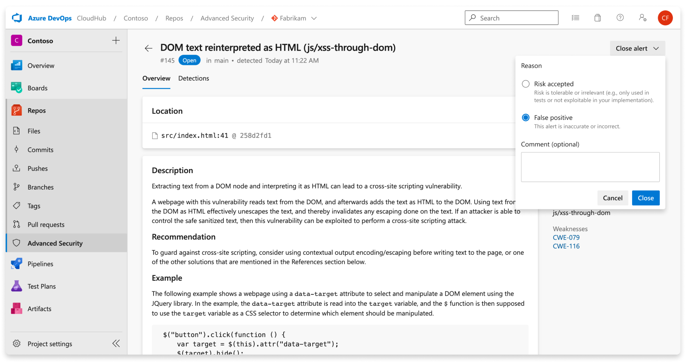

# Code scanning 

Code scanning in [GitHub Advanced Security for Azure DevOps](configure-github-advanced-security-features.md) lets you analyze the code in an Azure DevOps repository to find security vulnerabilities and coding errors. Any problems identified by the analysis are raised as an alert. Code scanning uses CodeQL to identify vulnerabilities.  

CodeQL is the code analysis engine developed by GitHub to automate security checks. You can analyze your code using CodeQL and display the results as code scanning alerts. For more specific documentation about CodeQL, see [CodeQL documentation](https://codeql.github.com/docs/).

[!INCLUDE [GitHub Advanced Security for Azure DevOps is different from GitHub Advanced Security.](includes/github-advanced-security.md)]

## Additional configurations for code scanning

### Language and query support

GitHub experts, security researchers, and community contributors write and maintain the default CodeQL queries used for code scanning. The queries are regularly updated to improve analysis and reduce any false positive results. The queries are open source, so you can view and contribute to the queries in the [github/codeql](https://github.com/github/codeql) repository. 

CodeQL supports and uses the following language identifiers:

| Language               | Identifier            | Optional alternative identifiers (if any) |
|------------------------|-----------------------|-------------------------------------------|
| C/C++                  | `c-cpp`                 | `c` or `cpp`                                  |
| C#                     | `csharp`                |                                           |
| Go                     | `go`                    |                                           |
| Java/Kotlin            | `java-kotlin`           |                           |
| JavaScript/TypeScript  | `javascript`            |                                           |
| Python                 | `python`                |                                           |
| Ruby                   | `ruby`                  |                                           |
| Swift                  | `swift`                 |                                           |

> [!TIP]
> * Use `c-cpp` to analyze code written in C, C++ or both.
> * Use `java-kotlin` to analyze code written in Java, Kotlin or both.
> * Use `javascript` to analyze code written in JavaScript, TypeScript or both.

For more information, see [Supported languages and frameworks](https://codeql.github.com/docs/codeql-overview/supported-languages-and-frameworks/). 

You can view the specific queries and task details executed by CodeQL in the build log. 

[](./media/code-scanning-build-log.png#lightbox)

### Code scanning build mode customization
Code scanning supports two build modes when setting up a pipeline for scanning:
* `none` - the CodeQL database is created directly from the codebase without building the codebase (supported for all interpreted languages, and additionally supported for C# and Java).
* `manual` - you define the build steps to use for the codebase in the workflow (supported for all compiled languages).

For more information on the different build modes including a comparison on the benefits of each build mode, see [CodeQL code scanning for compiled languages](https://docs.github.com/en/code-security/code-scanning/creating-an-advanced-setup-for-code-scanning/codeql-code-scanning-for-compiled-languages#about-the-codeql-analysis-workflow-and-compiled-languages). 

For running code scanning analysis through GitHub Advanced Security for Azure DevOps, the `autobuild` build mode is instead a separate build task, [`AdvancedSecurity-CodeQL-Autobuild@1`](/azure/devops/pipelines/tasks/reference/advanced-security-codeql-autobuild-v1).

> [!TIP]
> Build mode `none` is useable in conjunction with other interpreted languages (e.g., JavaScript, Python, Ruby).
> If build mode `none` is specified for C# or Java in conjunction with other compiled languages that do not support build mode `none`, the pipeline task will fail.

Here is an example of a valid configuration with multiple languages and `none` build mode:
>[!div class="tabbedCodeSnippets"]
```yaml
trigger: none
 
pool:
  vmImage: windows-latest

steps:
- task: AdvancedSecurity-Codeql-Init@1
  displayName: Initialize CodeQL
  inputs:
# build mode `none` is supported for C# and Java, and JavaScript is an interpreted language
# and build mode `none` has no impact on JavaScript analysis
    languages: 'csharp, java, javascript' 
    buildtype: 'none'

- task: AdvancedSecurity-Codeql-Analyze@1
  displayName: Perform CodeQL Analysis
 ```

Here is an example of an invalid configuration with multiple languages and `none` build mode:
>[!div class="tabbedCodeSnippets"]
```yaml
trigger: none
 
pool:
  vmImage: windows-latest

steps:
- task: AdvancedSecurity-Codeql-Init@1
  displayName: Initialize CodeQL
  inputs:
# build mode `none` is supported for C# but build mode `none` is NOT supported for Swift
# so this pipeline definition will result in a failed run
    languages: 'csharp, swift'
    buildtype: 'none'

- task: AdvancedSecurity-Codeql-Analyze@1
  displayName: Perform CodeQL Analysis
 ```

## Code scanning alerts

[GitHub Advanced Security for Azure DevOps](configure-github-advanced-security-features.md) code scanning alerts include code scanning flags by repository that alert of code-level application vulnerabilities. 

To use code scanning, you need to first configure [GitHub Advanced Security for Azure DevOps](configure-github-advanced-security-features.md). 

The Advanced Security tab under Repos in Azure DevOps is the hub to view your code scanning alerts. Select the **Code scanning** tab to view scanning alerts. You can filter by branch, state, pipeline, rule type, and severity. At this time, the alerts hub doesn't display alerts for scanning completed on PR branches.

There's no effect to results if pipelines or branches are renamed - it may take up to 24 hours before the new name is displayed. 

If you choose to run custom CodeQL queries, there isn't by default a separate filter for alerts generated from different query packs. You can filter by rule, which is distinct for each query. 

[](./media/code-scanning-alerts.png#lightbox) 

If you turn off Advanced Security for your repository, you lose access to the results in the Advanced Security tab and build task. The build task doesn't fail, but any results from builds run with the task while Advanced Security is disabled are hidden and not retained. 

### Alert details 

Select an alert for more details, including remediation guidance. Each alert includes  a location, description, example, and severity. 


[](./media/code-scanning-detail.png#lightbox)

| Section  | Explanation  |
|---|---|
|  Location | The **Locations** section details a specific instance where CodeQL detected a vulnerability. If there are multiple instances of your code violating the same rule, a new alert is generated for each distinct location. The Locations card contains a direct link to the affected code snippet so you can select the snippet to be directed to the Azure DevOps web UI for editing.  |
| Description | The description is provided by the CodeQL tool based off of the problem. |
| Recommendation | The recommendation is the suggested fix for a given code scanning alert. |
| Example | The example section shows a simplified example of the identified weakness in your code. |
| Severity | Severity levels can be low, medium, high, or critical. The severity score is based off of the given Common Vulnerability Scoring System (CVSS) score for the identified Common Weakness Enumeration (CWE). Learn more about how severity is scored at this [GitHub blog post](https://github.blog/changelog/2021-07-19-codeql-code-scanning-new-severity-levels-for-security-alerts/). |

### Viewing alerts for a repository 

Anyone with contributor permissions for a repository can view a summary of all alerts for a repository in the Advanced Security tab under Repos. Select the **Code scanning** tab to view all secret scanning alerts.

To display results, code scanning tasks need to run first. Once the first scan finishes, any detected vulnerabilities are displayed in the Advanced Security tab. 

By default, the alerts page shows dependency scanning results for the default branch of the repository. 

The status of a given alert reflects the state for the default branch and latest run pipeline, even if the alert exists on other branches and pipelines. 

### Dismissing code scanning alerts

To dismiss alerts, you need appropriate permissions. By default, only project administrators can dismiss Advanced Security alerts. 

To dismiss an alert: 

1. Navigate to the alert you wish to close and select on the alert.
1. Select the **Close alert** drop-down.
1. If not already selected, select either **Risk accepted** or **False positive** as the closure reason.
1. Add an optional comment into the **Comment** text box.
1. Select **Close** to submit and close the alert.
1. The alert state changes from **Open** to **Closed** and your dismissal reason displays.

[](./media/code-scanning-dismiss-alert.png#lightbox)

This action dismisses the alert across all branches. Other branches that contain the same vulnerability will also be dismissed. Any alert previously dismissed can be manually reopened. 

### Managing code scanning alerts on pull requests 

If alerts are created for new code changes in a pull request, the alert is reported as an annotation in the Overview tab's comment section of the pull request and as an alert in the Advanced Security repository tab. There is a new branch picker entry for the pull request branch. 

You can review the affected lines of code, see a summary of the finding, and resolve the annotation in the Overview section.

[](./media/pull-request-annotation-code-scanning.png#lightbox)

To dismiss pull request alerts, you must navigate to the alert detail view to close both the alert and resolve the annotation. Otherwise, simply changing the comment status (1) resolves the annotation but doesn't close or fix the underlying alert. 

[](./media/pull-request-annotation-code-scanning-closed.png#lightbox)

To see the entire set of results for your pull request branch, navigate to **Repos** > **Advanced Security** and select your pull request branch. Selecting **Show more details** (2) on the annotation directs you to the alert detail view in the Advanced Security tab.

> [!TIP]
> Annotations will only be created when the affected lines of code are entirely unique to the pull request difference compared to the target branch of the pull request.
