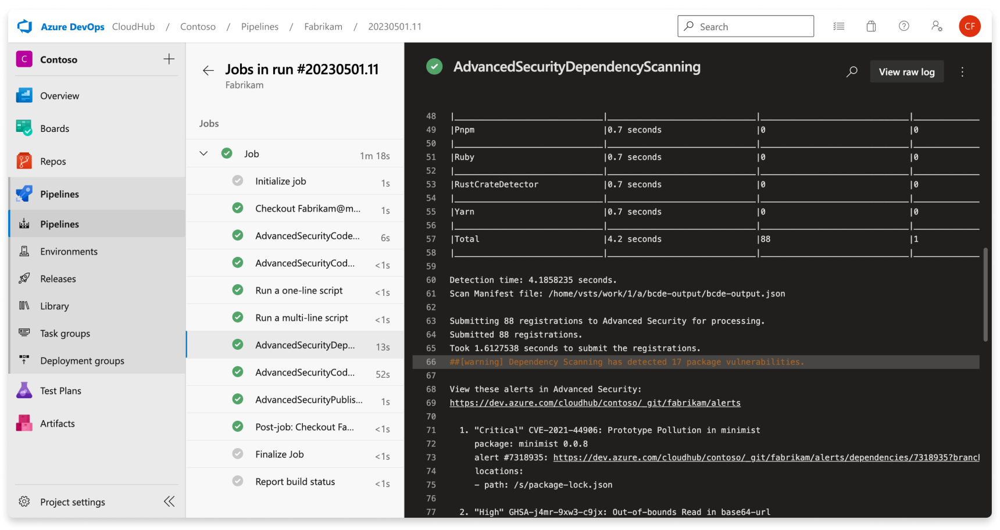
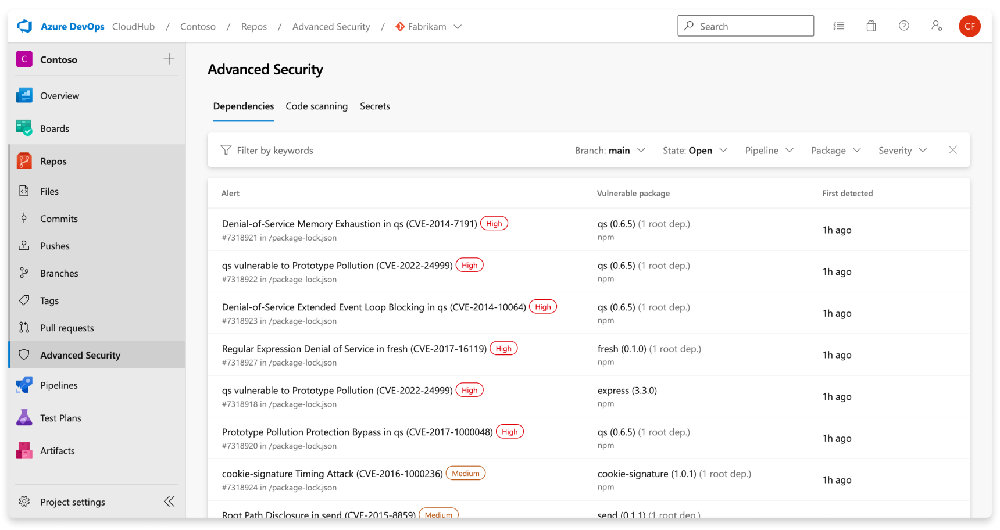
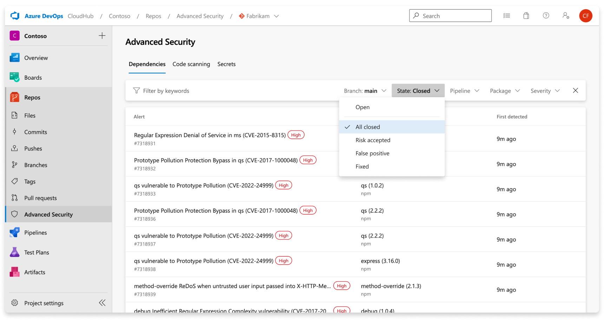
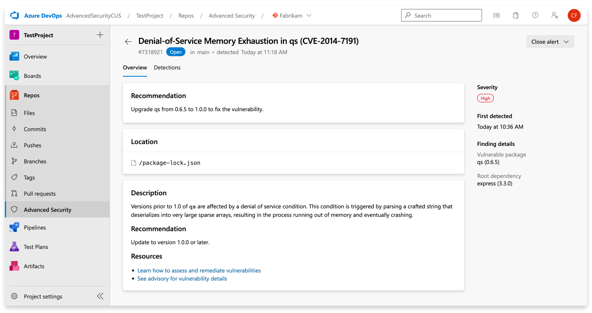
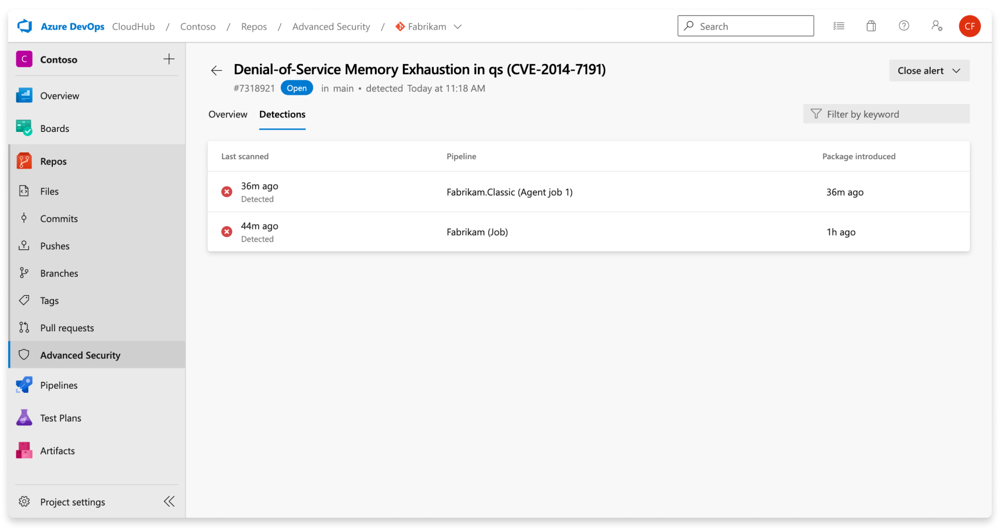
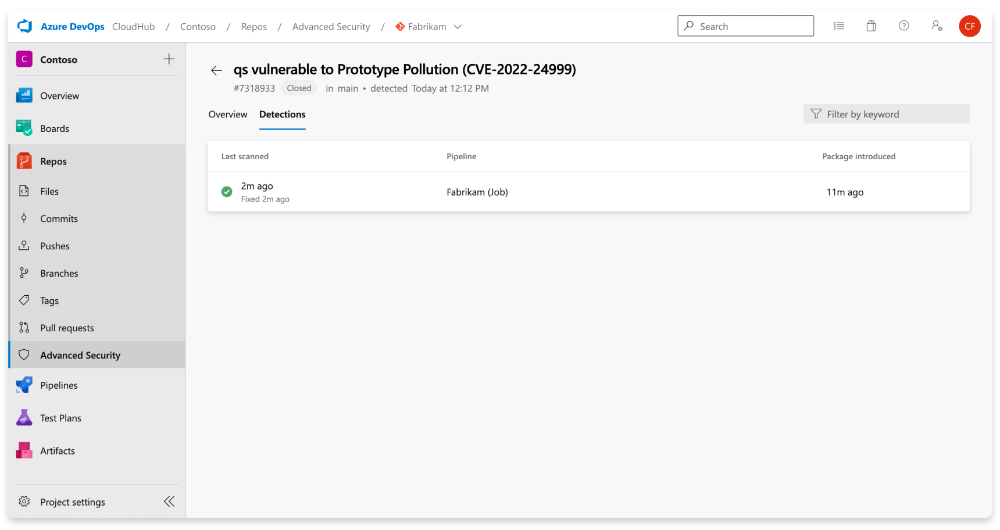
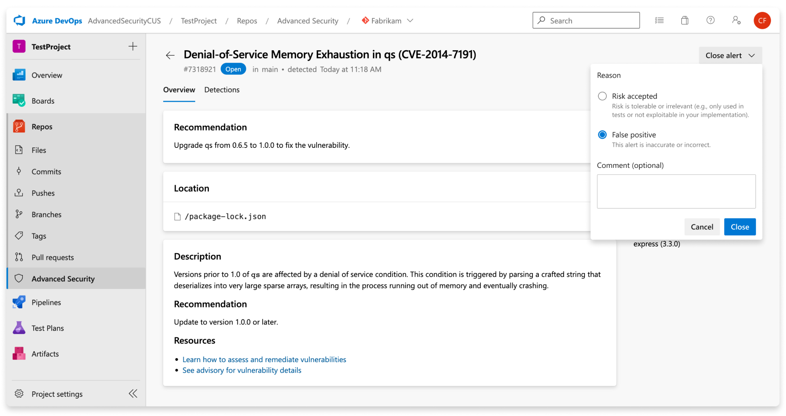

# Dependency scanning 

[!INCLUDE [github-advanced-security-preview](includes/github-advanced-security-preview.md)]

Dependency scanning in [GitHub Advanced Security for Azure DevOps](configure-github-advanced-security-features.md) detects the open source components used in your source code and detects if there are any associated vulnerabilities. Any found vulnerabilities from open source components get flagged as an alert. 

[!INCLUDE [GitHub Advanced Security for Azure DevOps is different from GitHub Advanced Security.](includes/github-advanced-security.md)]

## About dependency scanning  

Dependency scanning generates an alert for any open-source component, direct or transitive, found to be vulnerable that your code depends upon. Direct vulnerabilities are the libraries your code directly uses. Transitive dependencies are the libraries or other software that direct dependencies use. 

### About dependency scanning detection 

A new snapshot of your components is stored whenever the dependency graph for a repository changes and after, a pipeline that contains the dependency scanning task building new code is executed. Dependency scanning generates security alerts for Go, Maven, npm (including Yarn and pnpm), NuGet, Pip, Ruby, and Rust.

For every vulnerable component detected in use, the component and vulnerability are listed in the build log and displayed as an alert in the Advanced Security tab. Only advisories that reviewed by GitHub and added to the [GitHub Advisory Database](https://docs.github.com/en/code-security/dependabot/dependabot-alerts/browsing-security-advisories-in-the-github-advisory-database) create a dependency scanning alert. The build log includes a link to the individual alert for further investigation. For more information on the alert detail, view Fixing dependency scanning alerts.  

The build log also contains basic information about each detected vulnerability. These details include the severity, the affected component, the title of the vulnerability, and the associated CVE.  



### About dependency scanning alerts 

The Advanced Security tab in Repos in Azure DevOps is the hub to view your security alerts, which by default shows dependency scanning alerts. You can filter by branch, pipeline, package, and severity. You can select into an alert for more details, including remediation guidance.  

When a vulnerable package is detected in your repository, fixing dependency scanning alerts typically involves upgrading to a higher package version or removing an offending package. This advice holds true for both direct and transitive (or indirect) dependencies. The default view in your Advanced Security tab is active alerts for the default branch for your repository.

There's no effect to results if pipelines or branches are renamed - it may take up to 24 hours before the new name is displayed.




An alert’s state is automatically updated to `Closed` when the vulnerable component is no longer detected in the latest build for any pipelines where the dependency scanning task is installed. To view your resolved alerts, utilize the `State` filter in the main toolbar and select `Closed`.



If for whatever reason, you turn off Advanced Security for your repository, you'll lose access to the results in the Advanced Security tab and build task. The build task won't fail, but any results from builds run with the task while Advanced Security is disabled are hidden and unretained. 

### Alert details

You can also drill into details about an alert by clicking into a specific alert, and remediation guidance. 



| Section  | Explanation  |
|---|---|
| Recommendation | The recommendation text comes directly from our vulnerability data provider, the GitHub Advisory Database. Typically, the guidance suggests upgrading the identified component to a nonvulnerable version. |
| Location | The **Locations** section details the path(s) where the dependency scanning task has discovered the vulnerable component in use. If the file can be resolved from the underlying build scan to a committed file in source, the Locations card appears as a clickable link. If a file was produced as part of a build (for example, a build artifact), the link isn't clickable. Review the build logs to better understand how the component was brought into the build. |
| Description | The description is provided by the GitHub Advisory description. |

#### Detections  

The pipelines listed under the **Detections** tab are the pipelines where the vulnerable component was found. Each row details the latest build of the affected pipeline and the date when the package was first introduced. If the vulnerable package has been fixed in some pipelines but not all, you see partially fixed rows.   




Once an alert has been resolved, the alert automatically moves to the `Closed` state and the latest run pipeline under the Detections tab displays a green checkmark, meaning that code containing the updated component was run in that pipeline: 




#### Severity 

The GitHub Advisory Database provides a CVSS score, which is then translated into a low, medium, high, or critical severity for an alert through the following guidelines:  

| CVSS Score  |	Severity |
| ----------- | -----------|
| 1.0 < Score < 4.0	| Low |
|4.0 < Score < 7.0	| Medium |
|7.0 < Score < 9.0 | High |
|Score >= 9.0	| Critical |


#### Finding details 

Two sections are commonly found under **Finding details**: vulnerable package and root dependency. The vulnerable package is the potentially vulnerable component. The root dependency section contains top level components that are responsible for the dependency chain that lead to a vulnerability. 

If the vulnerable package is only referenced as a direct dependency, you only see the ”vulnerable package” section.  

If the vulnerable package is referenced both as a direct and transitive dependency, the package is shown in both the “vulnerable package” and “root dependency” section.  

If the vulnerable package is only referenced as a transitive dependency, the package is shown in the “vulnerable package” section, and the root dependencies referencing the vulnerable package are shown in the “root dependency” section. 


## Manage dependency scanning alerts 

### Viewing alerts for a repository 

Anyone with contributor permissions for a repository can view a summary of all alerts for a repository in **Repos** >  **Advanced Security**. 

By default, the alerts page shows dependency scanning results for the default branch of the repository. 

The status of an alert reflects the state for the default branch and latest run pipeline, even if the alert exists on other branches and pipelines. 

### Fixing dependency scanning alerts 
A direct dependency is a component that you have explicitly included in your repository. A transitive or indirect dependency is a component that utilized by a direct dependency. Regardless of whether the vulnerability is found in a direct or transitive dependency, your project is still vulnerable.  

A direct dependency is a component that you have in your repository. A transitive or indirect dependency is a component that gets used by a direct dependency. Your project is still vulnerable regardless of whether the vulnerability is found in a direct or transitive dependency.

Fixing a vulnerable transitive dependency usually takes the form of explicitly overriding the version of the vulnerable component used for each identified direct dependency. Once the root dependencies have upgraded their use of the vulnerable component to a safe version, you can upgrade each root dependency rather than multiple individual overrides.  

To fix a vulnerable transitive dependency, override the version of the vulnerable component used for each identified direct dependency. Once the root dependencies upgrade their use of the vulnerable component to a safe version, you can upgrade each root dependency rather than have multiple individual overrides.  

#### Updating dependencies for Yarn/Npm 

Hypothetically, say this package has two vulnerabilities. One is for `axios`, a direct dependency, and one is for `acorn`, a transitive dependency (also known as an indirect dependency or dependency of dependency). 

>[!div class="tabbedCodeSnippets"]
```javascript
{
 "name": "my-package",
 "version": "1.0.0",
 "dependencies": {
   "axios": "0.18.0",
   "eslint": "5.16.0",
 }
}
```

The current version of `axios` has a [denial of service (DoS) vulnerability](https://github.com/advisories/GHSA-42xw-2xvc-qx8m) with a recommendation to update to v0.18.1 or higher. Because it’s a direct dependency, you have control over the version of `axios` that you use; all you need to do is to update the version of `axios` that you pull in. The updated `package.json` looks similar to:

>[!div class="tabbedCodeSnippets"]
```javascript
{
  "name": "my-package",
  "version": "1.0.0",
  "dependencies": {
    "axios": "0.19.2",
    "eslint": "5.16.0",
  }
}
```

Now, the version of `eslint` in the `package.json` shown depends on a version of `acorn` that is a regular expression denial of service (ReDoS) vulnerability with a recommendation to update to version `5.7.4, 6.4.1, 7.1.1` or higher. If you get an alert from the dependency scanning tool, it should tell you the root dependency that requires the vulnerable dependency.

#### Yarn

If you’re using Yarn, you can use yarn why to find the complete dependency chain.

>[!div class="tabbedCodeSnippets"]
```console
> $ yarn why acorn
 yarn why v1.22.4
 [1/4] Why do we have the module "acorn"...?
 [2/4] Initialising dependency graph...
 [3/4] Finding dependency...
 [4/4] Calculating file sizes...
 => Found "acorn@6.4.0"
 info Reasons this module exists
   - "eslint#espree" depends on it
   - Hoisted from "eslint#espree#acorn"
 info Disk size without dependencies: "1.09MB"
 info Disk size with unique dependencies: "1.09MB"
 info Disk size with transitive dependencies: "1.09MB"
 info Number of shared dependencies: 0
 Done in 0.30s.
```

The full dependency chain is `eslint` > `espree` > `acorn`. Once you know the dependency chain, you can use another feature of Yarn, selective dependency resolutions, to override the version of acorn that gets used.

Use the resolutions field in `package.json` to define a version override. Three different methods to override a package are shown, in order of worst to best:

>[!div class="tabbedCodeSnippets"]
```javascript
{
  "name": "yarn-resolutions",
  "version": "1.0.0",
  "license": "MIT",
  "dependencies": {
    "axios": "0.19.2",
    "eslint": "5.16.0"
  },
  "resolutions": {
    // DO NOT USE!
    "**/acorn": "6.4.1",
    // BETTER
    "eslint/**/acorn": "6.4.1",
    // BEST
    "eslint/espree/acorn": "6.4.1"
  }
}
```

Using the`**/acorn` pattern overrides all usages of the acorn package across all dependencies. It's dangerous, and break at runtime. As a result, it has been removed in Yarn v2.

Using the `eslint/**/acorn` pattern overrides all usages of the acorn package under the eslint package, and in any packages it depends on. It's safer than overriding the package for all dependencies, but it still has some risks if the dependency graph for a package is large. This pattern is recommended when there are many subpackages that use a vulnerable package and defining overrides for individual subpackages would be impractical.

Using the pattern `eslint/espree/acorn` overrides only the usage of `acorn` in the `espree` package in the `eslint` package. It specifically targets the vulnerable dependency chain, and is the recommended way to override package versions.

#### npm

If you’re using npm 8.3 or higher, you can use the [**overrides**](https://docs.npmjs.com/cli/v8/configuring-npm/package-json#overrides) field in your package.json

Add an override if you need to make specific changes to transitive dependencies. For example, you may need to add an override to replace the version of a dependency with a known security issue, replace an existing dependency with a fork, or make sure that the same version of a package is used everywhere. 

>[!div class="tabbedCodeSnippets"]
```javascript
{
  "name": "npm-overrides",
  "version": "1.0.0",
  "license": "MIT",
  "dependencies": {
    "axios": "0.19.2",
    "eslint": "5.16.0"
  },
   "overrides":{
       "eslint": {
        "espree": {
          "acorn": "6.4.1"
        }
    }
   }
}
```

The override example shown demonstrates npm's way of saying “override only the usage of `acorn` in the `espree` package in the `eslint` package." It specifically targets the vulnerable dependency chain, and is the recommended way to override package versions. Overrides are a native feature of npm. It provides a way to replace a package in your dependency tree with another version, or another package entirely. 

After setting your overrides, you must delete your `package-lock.json` and `node_modules` and run `npm install` again.

You may not set an override for a package that you directly depend on unless both the dependency and the override itself share the exact same spec. For example, let’s say `axios: "0.18.0"` is vulnerable and we're looking to upgrade to `axios: "0.19.2"`. Directly change the dependency version instead of using override.

>[!div class="tabbedCodeSnippets"]
```javascript
{
  "name": "npm-overrides",
  "version": "1.0.0",
  "license": "MIT",
  "dependencies": {
    "axios": "0.18.0"
  },
  "overrides": {
    // BAD, will throw an EOVERRIDE error
    // "axios": "0.19.2",
  }
}
```

Update the dependency's version without setting an override:

>[!div class="tabbedCodeSnippets"]
```javascript
{
  "name": "npm-overrides",
  "version": "1.0.0",
  "license": "MIT",
  "dependencies": {
    "axios": "0.19.2"
  }
}
```

#### Updating dependencies for Maven

The dependency resolution mechanism isn't as sophisticated as the one used in Yarn. As a result, you can only have a single version of a dependency in a project. In order to resolve this issue, Maven uses a “nearest wins” algorithm. That is, it uses the version of the closest dependency to your project in the tree of dependencies.

For example, you have the following dependency graph:

>[!div class="tabbedCodeSnippets"]
```console
your-project --- A:1.0.0 --- B:2.0.0
      \
       \__ B:1.0.0
```

`your-project` depends on `A:1.0.0`, which in turn depends on `B:2.0.0` but your project also has a direct dependency on `B:1.0.0`. So, you have two different versions of dependency B in your dependency graph, but version 1.0.0 of dependency B wins as it is ‘nearest’ to your project.

In some cases, this scenario might work if the versions are compatible. However, if `A:1.0.0` depends on some feature of B that is only available in version `2.0.0` then this behavior doesn't work. In a worst case scenario, this project may still compile but fails at runtime.

Let’s take a look at a real world example.

>[!div class="tabbedCodeSnippets"]
```java
<project>
  <modelVersion>4.0.0</modelVersion>
  <groupId>com.microsoft.customer360</groupId>
  <artifactId>maven-dependencies</artifactId>
  <packaging>jar</packaging>
  <version>1.0-SNAPSHOT</version>
  <name>maven-dependencies</name>
  <url>http://maven.apache.org</url>
  <dependencies>
    <dependency>
      <groupId>com.fasterxml.jackson.jaxrs</groupId>
      <artifactId>jackson-jaxrs-json-provider</artifactId>
      <version>2.10.3</version>
    </dependency>
</project>
```

Say that the version of `com.fasterxml.jackson.jaxrs:jackson-jaxrs-json-provider` you depend on depends on a version of `com.fasterxml.jackson.core:jackson-databind` that has a [deserialization of untrusted data vulnerability](https://github.com/advisories/GHSA-27xj-rqx5-2255).

You can verify this dependency by using the [Maven dependency plugin](https://maven.apache.org/plugins/maven-dependency-plugin/index.html). In this case you’d run `mvn dependency:tree -Dincludes=com.fasterxml.jackson.core:jackson-databind` and get the following output:

>[!div class="tabbedCodeSnippets"]
```console
> $ mvn dependency:tree -Dincludes=com.fasterxml.jackson.core:jackson-databind
 [INFO] Scanning for projects...
 [INFO]
 [INFO] ------------< com.microsoft.customer360:maven-dependencies >------------
 [INFO] Building maven-dependencies 1.0-SNAPSHOT
 [INFO] --------------------------------[ jar ]---------------------------------
 [INFO]
 [INFO] --- maven-dependency-plugin:2.8:tree (default-cli) @ maven-dependencies ---
 [INFO] com.microsoft.customer360:maven-dependencies:jar:1.0-SNAPSHOT
 [INFO] \- com.fasterxml.jackson.jaxrs:jackson-jaxrs-json-provider:jar:2.10.3:compile
 [INFO]    \- com.fasterxml.jackson.jaxrs:jackson-jaxrs-base:jar:2.10.3:compile
 [INFO]       \- com.fasterxml.jackson.core:jackson-databind:jar:2.10.3:compile
 [INFO] ------------------------------------------------------------------------
 [INFO] BUILD SUCCESS
 [INFO] ------------------------------------------------------------------------
 [INFO] Total time:  0.928 s
 [INFO] Finished at: 2020-04-27T14:30:55+02:00
 [INFO] ------------------------------------------------------------------------
```

First, check if there's a new version of `com.fasterxml.jackson.jaxrs:jackson-jaxrs-json-provider` that doesn’t depend on a vulnerable version of `com.fasterxml.jackson.core:jackson-databind`. If so, you can upgrade `com.fasterxml.jackson.jaxrs:jackson-jaxrs-json-provider` and stop there. If not, override the version of `com.fasterxml.jackson.core:jackson-databind`.

As shown in the code snippet, when using Maven the “nearest wins”, so the resolution is to add a direct dependency to `com.fasterxml.jackson.core:jackson-databind` that fixes the vulnerability.

>[!div class="tabbedCodeSnippets"]
```java
<project>
  <modelVersion>4.0.0</modelVersion>
  <groupId>com.microsoft.customer360</groupId>
  <artifactId>maven-dependencies</artifactId>
  <packaging>jar</packaging>
  <version>1.0-SNAPSHOT</version>
  <name>maven-dependencies</name>
  <url>http://maven.apache.org</url>
  <dependencies>
    <dependency>
      <groupId>com.fasterxml.jackson.jaxrs</groupId>
      <artifactId>jackson-jaxrs-json-provider</artifactId>
      <version>2.10.3</version>
    </dependency>
    <!-- Dependency resolutions -->
    <!-- jackson-jaxrs-json-provider -->
    <dependency>
      <groupId>com.fasterxml.jackson.core</groupId>
      <artifactId>jackson-databind</artifactId>
      <version>2.9.10.4</version>
    </dependency>
  </dependencies>
</project>
```

You can verify that the resolution works by running `mvn dependency:tree -Dincludes=com.fasterxml.jackson.core:jackson-databind` again.

>[!div class="tabbedCodeSnippets"]
```console
$ mvn dependency:tree -Dincludes=com.fasterxml.jackson.core:jackson-databind
[INFO] Scanning for projects...
[INFO]
[INFO] ------------< com.microsoft.customer360:maven-dependencies >------------
[INFO] Building maven-dependencies 1.0-SNAPSHOT
[INFO] --------------------------------[ jar ]---------------------------------
[INFO]
[INFO] --- maven-dependency-plugin:2.8:tree (default-cli) @ maven-dependencies ---
[INFO] com.microsoft.customer360:maven-dependencies:jar:1.0-SNAPSHOT
[INFO] \- com.fasterxml.jackson.core:jackson-databind:jar:2.9.10.4:compile
[INFO] ------------------------------------------------------------------------
[INFO] BUILD SUCCESS
[INFO] ------------------------------------------------------------------------
[INFO] Total time:  0.827 s
[INFO] Finished at: 2020-04-27T14:32:42+02:00
[INFO] ------------------------------------------------------------------------
```

It's recommended to add a comment near the dependency resolution, so that anyone coming later knows why the dependency is there. It can be removed once the root dependency uses the new version; otherwise, you accumulate dependencies.

In a real project, add the dependency as high up the chain as possible. For example, you could add the resolution in the parent POM file, instead of individually in every project POM file.

#### Updating dependencies for NuGet

The dependency resolution algorithm used in NuGet is similar to Maven, in that only a single version of a dependency can be used. However, NuGet doesn't pin dependency versions.

For example, if you have a dependency `<PackageReference Include="A" Version="1.2.3" />`, you might expect this package to be equivalent to `= 1.2.3`, but it actually means `>= 1.2.3`. In order to pin an exact version, you should use `Version="[1.2.3]"`. For more information, see the NuGet [version ranges documentation](/nuget/concepts/package-versioning#version-ranges).

In addition to the default range behavior, NuGet restores the lowest applicable version to satisfy a range. This behavior means that in many cases you have to define a range.

Let’s take a look at this sample project, which has a dependency on `Microsoft.AspNetCore.App`:

>[!div class="tabbedCodeSnippets"]
```csharp
<Project Sdk="Microsoft.NET.Sdk.Web">
  <PropertyGroup>
    <TargetFramework>netcoreapp3.1</TargetFramework>
    <RootNamespace>NuGet.Dependencies</RootNamespace>
  </PropertyGroup>
  <ItemGroup>
    <PackageReference Include="Microsoft.AspNetCore.App" Version="2.1.14" />
  </ItemGroup>
</Project>
```

It depends on a version of `Microsoft.AspNetCore.Http.Connections` that is vulnerable to a [remote code execution (RCE) vulnerability](https://github.com/advisories/GHSA-655q-9gvg-q4cm).

First, you should check to see if there's an updated version of `Microsoft.AspNetCore.App` that depends on a newer version of `Microsoft.AspNetCore.Http.Connections`. If so, you can upgrade `Microsoft.AspNetCore.App` and stop here. If not, you have to override the version of `Microsoft.AspNetCore.Http.Connections` it depends on.

NuGet doesn’t have an equivalent of yarn why or mvn dependency:tree built-in, so the easiest way to see the dependency tree is often to visit [nuget.org](https://nuget.org/). If you visit the [NuGet page for `Microsoft.AspNetCore.App`](https://www.nuget.org/packages/Microsoft.AspNetCore.App/2.1.14), you see that it depends on `Microsoft.AspNetCore.Http.Connections` `version >= 1.0.4 && < 1.1.0`. Or, in a NuGet version range, the representative syntax is `[1.0.4,1.1.0)`.

The RCE vulnerability in `Microsoft.AspNetCore.Http.Connections` was fixed in version `1.0.15`, so you need to override the version range to be`[1.0.15, 1.1.0)`.

>[!div class="tabbedCodeSnippets"]
```csharp
<Project Sdk="Microsoft.NET.Sdk.Web">
  <PropertyGroup>
    <TargetFramework>netcoreapp3.1</TargetFramework>
    <RootNamespace>NuGet.Dependencies</RootNamespace>
  </PropertyGroup>
  <ItemGroup>
    <PackageReference Include="Microsoft.AspNetCore.App" Version="2.2.8" />
  </ItemGroup>

  <ItemGroup Label="Dependency Resolutions">
    <!-- Microsoft.AspNetCore.App -->
    <PackageReference Include="Microsoft.AspNetCore.Http.Connections" Version="[1.0.15,1.1.0)" />
  </ItemGroup>
</Project>
```

It's recommended to add a comment near the dependency resolution so that anyone coming later knows why the dependency is there. It can be removed once the root dependency uses the new version. Otherwise, you accumulate dependencies.

### What if there's no fix available?

When no known fix is available, the following options are available as other methods of remediation until an upgraded component is available: 
* Stop using the component and remove it from your code - this removal will be detected upon your next build with the dependency scanning task installed 
* Contribute a fix to the component itself. If your organization has specific guidelines around open-source contributions, follow those guidelines.
* Dismissing the alert. However, alerts with no known fix still can pose a security threat to your organization. We recommend that you don't dismiss an alert just because there's no known fix. 

### Dismiss dependency scanning alerts

To dismiss alerts in Advanced Security, you need the appropriate permissions. By default, only project administrators are provided with the ability to dismiss Advanced Security alerts. 

To dismiss an alert: 

1. Go to the alert you wish to close and select on the alert 
1. Select the **Close alert** drop-down 
1. If not already selected, select either **Risk accepted** or **False positive** as the closure reason
1. Add an optional comment into the **Comment** text box 
1. Select **Close** to submit and close the alert 
1. The alert state changes from **Open** to **Closed** and displays your dismissal reason



This action only dismisses the alert for your selected branch. Other branches that may contain the same vulnerability stays active until otherwise acted upon. Any alert that has been previously dismissed can be manually re-opened.

## Troubleshooting dependency scanning 

### Break-glass scenario for build task

If the dependency scanning build task is blocking a successful execution of your pipeline and you need to urgently skip the build task, you can set a pipeline variable `DependencyScanning.Skip: false`.  