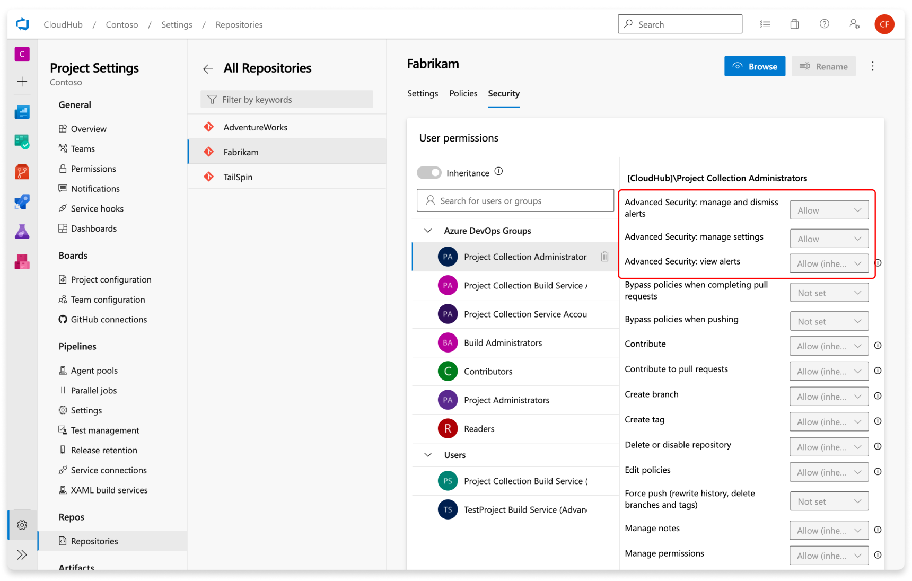
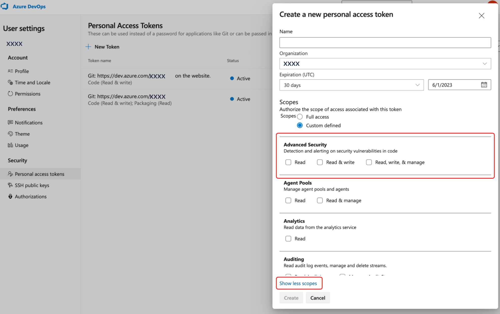

#  Advanced Security permissions

[!INCLUDE [github-advanced-security-preview](includes/github-advanced-security-preview.md)]

[GitHub Advanced Security for Azure DevOps](configure-github-advanced-security-features.md) includes extra permissions for more levels of control around Advanced Security results and management. There are three new permissions added through Advanced Security: read alerts, dismiss and manage alerts, and manage settings.

[!INCLUDE [GitHub Advanced Security for Azure DevOps is different from GitHub Advanced Security.](includes/github-advanced-security.md)]

### Default permissions and access levels 

| Azure DevOps group  | Default permissions |
| ----------- | ----------- |
| Contributors | Advanced Security: read alerts |
| Project administrator | Advanced Security: read alerts, manage and dismiss alerts |
| Project collection administrator | Advanced Security: read alerts, manage and dismiss alerts, manage settings |

## Manage Advanced Security permissions

If you're running into an error when viewing Advanced Security alerts, you can adjust individual permissions for your repository.

If the dropdowns are disabled, contact your administrator for the necessary permissions. 

To adjust permissions for a specific repository:

1. Go to **Project Settings** > **Repositories**.
1. Select the specific repository you wish to adjust permissions for.
1. Select **Security**.
1. Select the security group you wish to adjust permissions for.
1. Select the permission bit to change. If successful, a green checkmark appears next to the selected permission. 
 

### Use personal access tokens (PATs)

You can use a personal access token to use the Advanced Security APIs. To learn more about PATs on Azure DevOps and how to create them, refer to [About PATs](../../organizations/accounts/use-personal-access-tokens-to-authenticate.md).

Advanced Security offers three extra scopes for a PAT: `read`, `read and write`, and `read, write, and manage`. 

