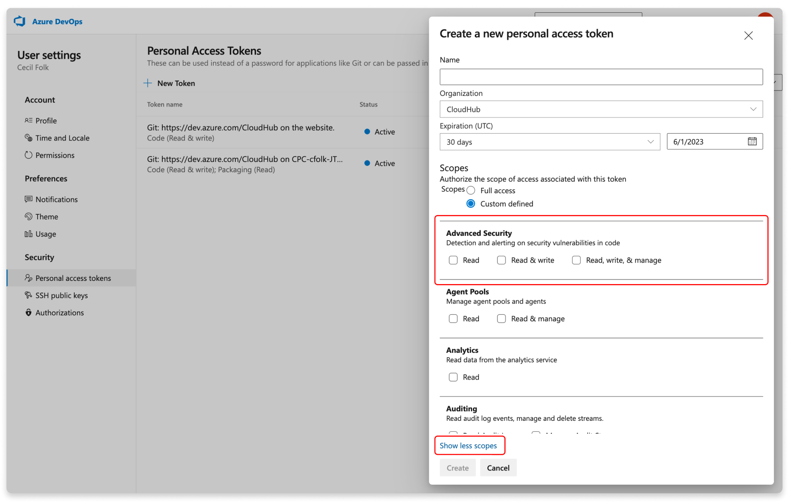

#  Manage Advanced Security permissions

GitHub Advanced Security for Azure DevOps includes extra permissions for more levels of control around Advanced Security results and management. There are three new permissions added through Advanced Security: read alerts, dismiss and manage alerts, and manage settings.

[!INCLUDE [GitHub Advanced Security for Azure DevOps is different from GitHub Advanced Security.](includes/github-advanced-security.md)]

## Prerequisites

[!INCLUDE [github-advanced-security-prerequisites](includes/github-advanced-security-prerequisites.md)]

### Default permissions and access levels 

* Advanced Security: Read alerts grants permission to view security alerts for the repository.
* Advanced Security: Manage and dismiss alerts grants permission to dismiss alerts for the repository.
* Advanced Security: Manage settings grants permission to enable Advanced Security, which is a billable action. 

| Azure DevOps group  | Default permissions |
| ----------- | ----------- |
| Contributors | Advanced Security: Read alerts |
| Project administrator | Advanced Security: Read alerts, manage and dismiss alerts |
| Project collection administrator | Advanced Security: Read alerts, manage and dismiss alerts, manage settings |

## Manage Advanced Security permissions

If you're running into an error when viewing Advanced Security alerts, you can adjust individual permissions for your repository.

If the dropdowns are disabled, contact your administrator for the necessary permissions. 
 
To adjust permissions for a specific repository, do the following steps:

1. Select **Project settings** > **Repositories**.
1. Select the specific repository you wish to adjust permissions for.
1. Select **Security**.
1. Select the security group you wish to adjust permissions for.
2. Change a permission. When successful, a checkmark displays next to the selected permission. 
 
   

### Use personal access tokens (PATs)

[!INCLUDE [use-microsoft-entra-reduce-pats](../../includes/use-microsoft-entra-reduce-pats.md)]

You can use a personal access token to use the Advanced Security APIs. For more information about PATs on Azure DevOps and how to create them, see [About PATs](../../organizations/accounts/use-personal-access-tokens-to-authenticate.md).

Advanced Security offers three extra scopes for a PAT: `read`, `read and write`, and `read, write, and manage`. 

## Related articles

- [Set up code scanning](github-advanced-security-code-scanning.md)
- [Set up dependency scanning](github-advanced-security-dependency-scanning.md)
- [Set up secret scanning](github-advanced-security-secret-scanning.md)
- [Learn about GitHub Advanced Security for Azure DevOps](github-advanced-security-security-overview.md)
