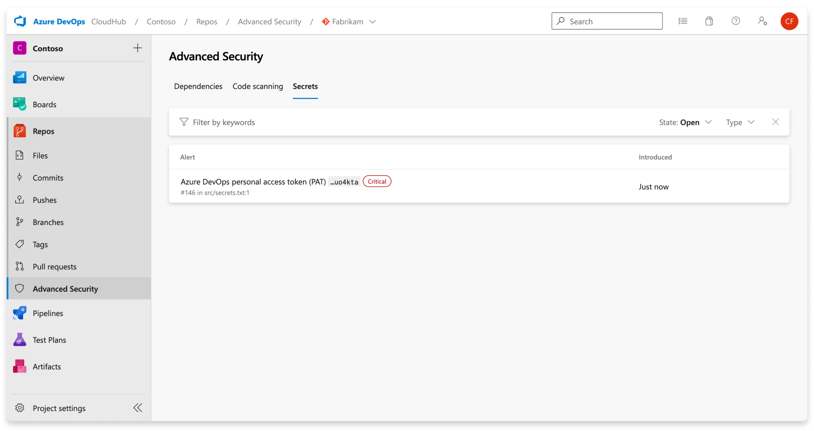
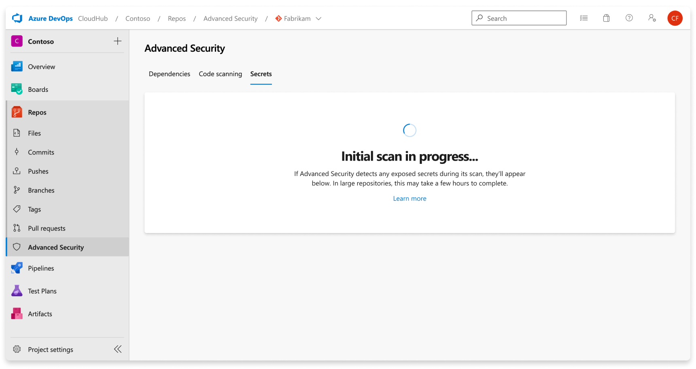
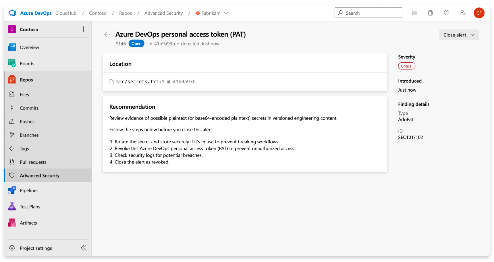
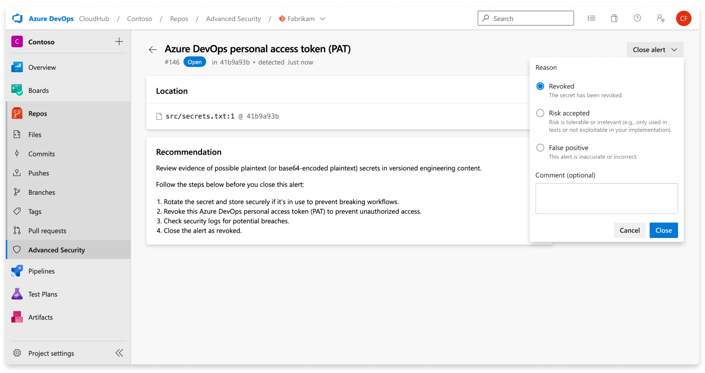
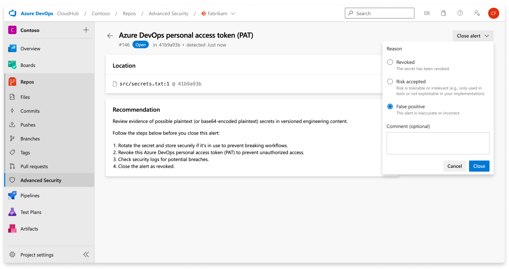

# Set up secret scanning 

Exposed credentials in engineering systems provide easily exploitable opportunities for attackers. To defend against this threat, GitHub Advanced Security for Azure DevOps scans for credentials and other sensitive content in your source code. Push protection also prevents any credentials from being leaked in the first place. You need either GitHub Advanced Security for Azure DevOps or, if you're using the standalone experience, GitHub Secret Protection for Azure DevOps enabled. 

Secret scanning for your repository scans for any secrets that might already exist in your source code across history and push protection prevents any new secrets from being exposed in source code. 

[!INCLUDE [GitHub Advanced Security for Azure DevOps is different from GitHub Advanced Security.](includes/github-advanced-security.md)]

## Prerequisites

[!INCLUDE [github-advanced-security-prerequisites](includes/github-advanced-security-prerequisites.md)]

## About secret scanning alerts

When you enable Advanced Security or Secret Protection specifically, it scans repositories for secrets issued by various service providers and generates secret scanning alerts.

If access to a resource requires paired credentials, secret scanning creates an alert only when both parts of the pair are detected in the same file. Pairing ensures that the most critical leaks aren't hidden behind information about partial leaks. Pair matching also helps reduce false positives since both elements of a pair must be used together to access the provider's resource.

The Advanced Security tab at **Repos** > **Advanced Security** in Azure DevOps is the hub to view your security alerts. Select the **Secrets** tab to view secret scanning alerts. You can filter by state and secret type. Navigate into an alert for more details, including remediation guidance. After you enable Advanced Security, a scan kicks off for the selected repository, including all historical commits. Over time, alerts will start to appear as the scan progresses.

Renaming branches doesn't affect the results. However, it might take up to 24 hours for the new name to display.

To remediate exposed secrets, invalidate the exposed credential and create a new one in its place. The newly created secret should then be stored securely in a way that doesn't directly push it back into the code. For example, the secret could be stored in Azure Key Vault. Most resources have both a primary and secondary credential. The method to roll a primary credential over versus a secondary credential are identical, unless otherwise noted.  

## Manage secret scanning alerts

### Viewing alerts for a repository 

Select the **Secrets** tab to view all secret scanning alerts.

If Advanced Security was recently enabled for your repository, you might see a card indicating that Advanced Security is still scanning your repository. 

Once the scan is complete, any results are displayed. A single alert gets generated for each detected unique credential, across all branches and history of your repository. There are no branch filters as they're rolled up into one alert. 

Nonprovider secrets are viewable by selecting "Other" from the confidence dropdown on the secret scanning tab. 

:::image type="content" source="media/secret-scanning-confidence-filter.png" lightbox="media/secret-scanning-confidence-filter.png" alt-text="Screenshot of GitHub Advanced Security secret scanning confidence filter."::: 

### Alert details 

When you navigate into an alert, a detailed alert view appears and reveals more details about the finding and provide specific remediation guidance to resolve the alert.

| Section  | Explanation  |
|---|---|
|  Location | The **Locations** section details the paths where secret scanning discovered the leaked credential. There might be multiple locations or multiple commits in history that contain the leaked credential. All of these locations and commits are displayed under the **Locations** with a direct link to the code snippet and commit it was identified in. |
| Recommendation | The recommendation section contains remediation guidance or link to non-Microsoft documentation remediation guidance for the identified credential. |
| Close alert | There's no autofix behavior for secret scanning alerts. All secret scanning alerts must be manually attested as fixed through the alert detail page. Select the **Close** button to verify that the secret is revoked. |
| Severity | All secret scanning alerts are set as critical. Any exposed credential is potentially an opportunity for a malicious actor. |
| Finding details | The type of credential and rule used to find the credential are listed under the **Finding details** on the sidebar of the alert details page. |

With nonprovider secrets, the **Confidence: other** tag also appears by the severity badge in the alert detail view. 

:::image type="content" source="media/secret-scanning-detail-confidence-other.png" lightbox="media/secret-scanning-detail-confidence-other.png" alt-text="Screenshot of GitHub Advanced Security secret scanning generic alert detail.":::

### Fixing secret scanning alerts

Each secret has unique remediation steps to guide you through how to revoke and regenerate a new secret in its place. The alert detail shares specific steps or documentation for each alert.

A secret scanning alert stays open until closed. To attest that a secret scanning alert is fixed: 

1. Navigate to the alert you wish to close and select the alert.
1. Select the **Close alert** drop-down.
1. If not already selected, select **Fixed**.
1. Select **Close** to submit and close the alert.

### Dismissing secret scanning alerts 

To dismiss an alert, do the following steps: 

1. Navigate to the alert you wish to close and select on the alert.
1. Select the **Close alert** drop-down.
1. If not already selected, select either **Risk accepted** or **False positive** as the closure reason.
1. Add an optional comment into the **Comment** text box. 
1. Select **Close** to submit and close the alert. 
1. The alert state changes from **Open** to **Closed** and displays your dismissal reason.

 

You can manually open any previously dismissed alert.

### Make compromised secrets secure 

Once a secret gets committed to a repository, the secret is compromised. Microsoft recommends the following actions for compromised secrets:

[!INCLUDE [use-microsoft-entra-reduce-pats](../../includes/use-microsoft-entra-reduce-pats.md)]

* For a compromised Azure DevOps personal access token, delete the compromised token, create a new token, and update any services that use the old token.
* For all other secrets, first verify that the secret committed to Azure Repos is valid. If so, create a new secret, update any services that use the old secret, and then delete the old secret.
* Identify any actions taken by the compromised token on your enterprise's resources. 

When you update a secret, store the new secret securely and ensure that it never gets stored as plaintext. One option is to use Azure Key Vault or other secret management solutions.

## Secret push protection 

Push protection checks any incoming pushes for high-confidence secrets and prevent the push from going through. An error message displays all identified secrets for you to remove them or continue to push the secrets if needed. 

### About push protection alerts

Push protection alerts are user alerts that reported by push protection. Secret scanning as a push protection currently scans repositories for secrets issued by some service providers.

If access to a resource requires paired credentials, then secret scanning might create an alert only when both parts of the pair are detected in the same file. The pairing ensures that the most critical leaks aren't hidden behind information about partial leaks. Pair matching also helps reduce false positives since both elements of a pair must be used together to access the provider's resource.

Push protection might not block older versions of certain tokens as these tokens might generate a higher number of false positives than their most recent version. Push protection might also not block legacy tokens. For tokens such as Azure Storage Keys, Advanced Security only supports recently created tokens, not tokens that match the legacy patterns. 

### Push protection from the command line 

Push protection is built natively into Azure DevOps Git. If your commits contain an identified secret, the following error displays that your push was rejected.

 

### Push protection from the web interface 

Push protection also works from the web interface. If a secret is identified in a commit, the following error block displays, which stops you from pushing your changes:

  

### What to do if your push was blocked 

Push protection blocks secrets found in plain text files that are usually (but not limited to) text files such as source code or JSON configuration files. These secrets are stored in plaintext. If a bad actor gains access to the files and they get published to a public repository, the secrets are usable by anyone. 

Remove the secret from the flagged file, and then remove the secret from the commit history. If the flagged secret is a placeholder or example secret, update the fake secret to prepend the string `Placeholder` in front of the fake secret.

If the secret was added in your immediate previous commit, amend the commit and create a new commit:  
1. Remove the secret from your code.
2. Commit the changes by using `git commit --amend`
3. Push your changes again.

If the secret was added further back in history, edit your commits using an interactive rebase:  
1. Use `git log` to determine which commit you first committed the secret.
1. Perform an interactive rebase:
`git rebase -i [commit ID before credential introduction]~1`
1. Identify your commit to edit by changing `pick` to `edit` on the first line of the text that appears in the editor.
1. Remove the secret from your code.
1. Commit the change with `git commit --amend`.
1. Finish the rebase by running `git rebase --continue`.

### Push a blocked secret

Don't bypass flagged secrets because doing so can put your company’s security at risk. If you confirm that an identified secret isn't a false positive, remove the secret from your entire branch history before you attempt to push your changes again.

If you believe a blocked secret is a false positive or safe to push, you can bypass push protection. Include the string `skip-secret-scanning:true` in your commit message. Even if you bypass push protection, a secret scanning alert is generated in the alert UX once the secret gets pushed.

## Related articles

- [Troubleshoot secret scanning](github-advanced-security-secret-scanning-troubleshoot.md)
- [Learn about secret scanning patterns](github-advanced-security-secret-scan-patterns.md)
- [Set up code scanning](github-advanced-security-code-scanning.md)
- [Set up dependency scanning](github-advanced-security-dependency-scanning.md)
- [Learn about GitHub Advanced Security for Azure DevOps](github-advanced-security-security-overview.md)
