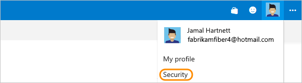

1.  Sign in to your organization in Azure DevOps
(```http://{your organization}.visualstudio.com```).

0.  From your home page, open your profile. Go to your security details.

	

0. Enable alternate authentication credentials for this account. 
Then provide a secondary username and password.

   

