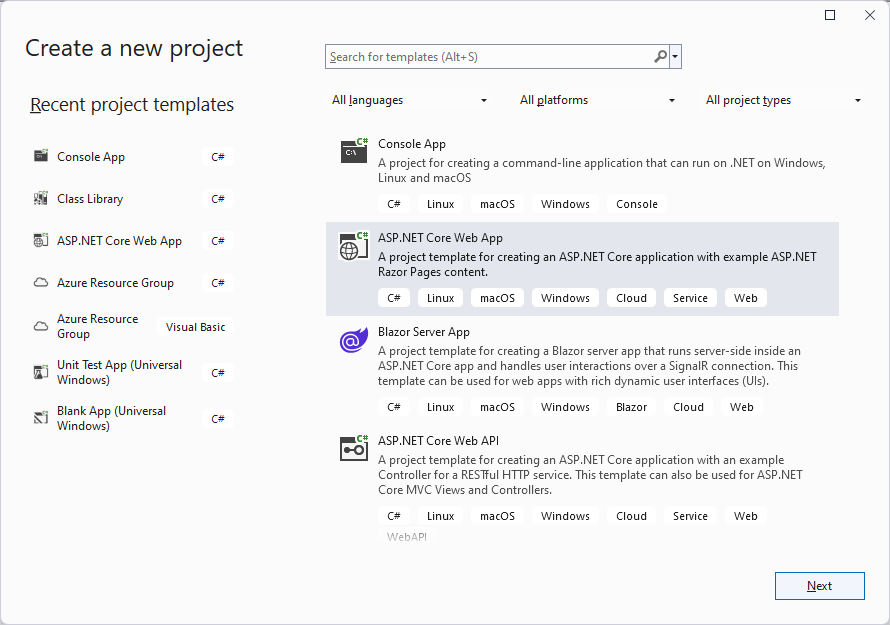
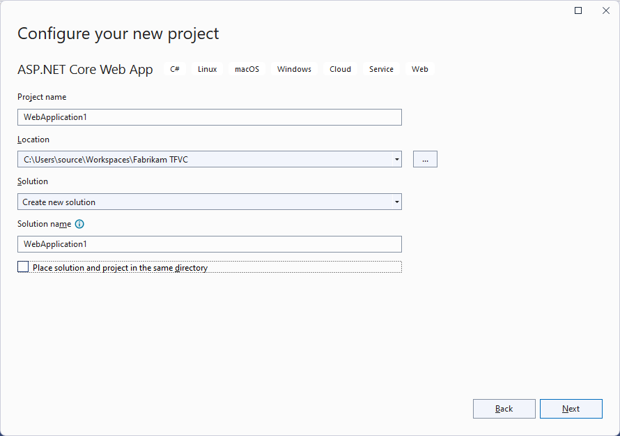
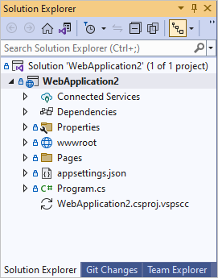
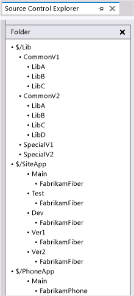
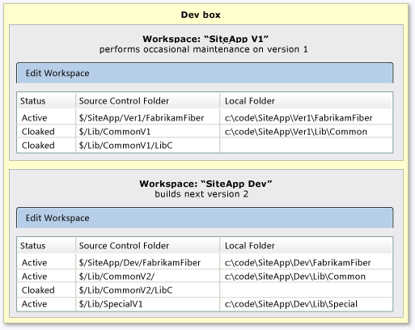

# Add files to the version control server

[!INCLUDE [version-lt-eq-azure-devops](../../includes/version-lt-eq-azure-devops.md)]
[!INCLUDE [version-vs-gt-eq-2019](../../includes/version-vs-gt-eq-2019.md)]

Adding files to version control is often automatic when you use Visual Studio **Solution Explorer** and your project is under version control. However, in some cases, you have to take extra steps to add files and projects to version control.

## Prerequisite

Before you can add files to version control in Visual Studio, [set up the workspace on your dev machine](set-up-team-foundation-version-control-your-dev-machine.md).

> [!IMPORTANT]
> These procedures apply only when you use a [local workspace](decide-between-using-local-server-workspace.md). When you use a local workspace, new files are automatically detected as pending changes. Conversely, files you save in a server workspace add and check in without showing as pending changes.

## Create a new code project and solution under version control

You can create a new Visual Studio project and add it to version control so that you and your team can immediately enjoy all the benefits of version control beginning from the first line of code you write.

1. In Visual Studio, [connect to your Azure DevOps project](../../organizations/projects/connect-to-projects.md).
1. Select **File** > **New Project**, or press Ctrl+Shift+N.
1. On the **Create a new project** screen, select the type of code project you want to create, and then select **Next**.

   

1. On the **Configure your new project** screen, under **Project name**, enter a name for the project.
1. Under **Location**, specify the path to a [local working folder](optimize-your-workspace.md), such as *c:\\code\\SiteApp\\Main\\*, in the workspace you created when you [set up your dev machine](set-up-team-foundation-version-control-your-dev-machine.md).
1. Leave the rest of the settings as they are, and select **Next**.

   

1. On the **Additional information** screen, change any settings as needed, and then select **Create**.
1. Once the project is created, view it in **Solution Explorer**, which you can open by pressing Ctrl+Alt+L.

   

1. Right-click the solution name in **Solution Explorer**, and select **Add Solution to Source Control** from the context menu.
1. Switch to the **Team Explorer** window and select **Check in** to [check in the project to source control](check-your-work-team-codebase.md).

## Place existing solutions and code projects under version control

To add an existing solution to version control, move all the solution files into your workspace, and then add them in Visual Studio.

1. In Visual Studio, [connect to your Azure DevOps project](../../organizations/projects/connect-to-projects.md).

1. Choose **View** > **Other Windows** > **Source Control Explorer**.

1. In **Source Control Explorer**, navigate to a logical parent folder for your solution, such as *$/SiteApp/Main*, where SiteApp is the name of your project. To find out more about naming local folders, see [Optimize your folder names](optimize-your-workspace.md#optimize-your-folder-names).

1. Select the link at the top of the window next to **Local Path** to open the parent folder in Windows File Explorer. If the link says **Not mapped**, see [Create and work with workspaces](create-work-workspaces.md) for information about mapping your workspace.

1. In File Explorer, move the folder that contains your solution into the parent folder.

1. In Visual Studio, choose **File** > **Open Project**, and navigate to and open the solution.

1. In **Solution Explorer**, right-click the solution name, and then select **Add Solution to Source Control** from the context menu.

1. Right-click the solution name again and select **Check In** from the context menu.

1. On the **Pending Changes** page in **Team Explorer**, if you see a **Detected** link in the **Excluded Changes** section, select the link.

1. The **Promote Candidate Changes** dialog box lists files that aren't referenced by any code projects in your solution. Select any of these files that you want to check in, deselect any of the files that you don't want to check in, and then select **Promote** to move the selected files into **Included Changes**. If you don't want to check in any of the listed files, select **Cancel** to close the dialog box.

1. Select **Check In**.

For more information, see [submit your pending changes](check-your-work-team-codebase.md).

## Add one or more files to version control

When you add a file to your code project in Visual Studio **Solution Explorer**, the system automatically adds the file to version control. You can also add files that aren't referenced by your code projects.

### Automatically add one or more files to version control

1. In Visual Studio, [connect to your Azure DevOps project](../../organizations/projects/connect-to-projects.md).

1. Choose **View** > **Other Windows** > **Source Control Explorer**.

1. In **Source Control Explorer**, navigate to the folder where you want to add the files or folder.

1. Select the link next to **Local Path** at the top of the **Source Control Explorer** window to open the target folder in Windows File Explorer. If the link says **Not mapped**, see [Create and work with workspaces](create-work-workspaces.md) and map your workspace.

1. In File Explorer, move your files or folders into the target folder.

1. In Visual Studio **Team Explorer**, on the **Pending Changes** page, if you see a **Detected** link under **Excluded Changes**, select the link.

1. In the **Promote Candidate Changes** dialog box, select only files that you want to check in, and then select **Promote**. Select **Cancel** if you don't want to check in any of the listed files.

1. Select **Check In**.

For more information, see [submit your pending changes](check-your-work-team-codebase.md).

### Manually add files to version control

You can also manually add files to version control.

1. In Visual Studio, choose **View** > **Other Windows** > **Source Control Explorer**.
1. In **Source Control Explorer**, navigate to the folder where you want to add the files.

   > [!IMPORTANT]
   > Make sure this folder is checked in. If you create a new folder, right-click it and select **Check In**, then check in the new folder before proceeding.

1. Drag the files from Windows File Explorer into the Visual Studio **Source Control Explorer** window.
1. On the **Pending Changes** page in **Team Explorer**, make sure that **Included items** lists all the files you want to add, and then select **Check In**.

## Use binaries that your code doesn't include

Many teams depend on binaries that exist outside of their code solutions. Typically these binaries are part of a library that the team has licensed from a third party, or the binaries come from another team in the same company. For example, Team A depends on binaries that Team B produces, and each team works in different project collections. Team B delivers binaries to Team A, which checks them into version control.

> [!TIP]
> [NuGet](https://www.nuget.org/) packages can make it easier for your team to manage dependencies and keep binaries up to date. You can store NuGet packages in Azure DevOps Server or Azure DevOps Services by using [Azure Artifacts](../../artifacts/index.yml).

The folder and workspace structure you should use to store external binaries depends on the way your solutions depend on these libraries.

### Add the binaries in your folder or branch structure

If you place external binaries in the same parent folder that contains your solution folders, then all your code projects in all solutions can reference the libraries with the same relative path. For example, a team can use the following folder structure:


Every code project can then reference the libraries folder by using the relative path `../../Lib`.

If your team needs to isolate separate efforts that require different versions of the binaries, you can branch the library folder along with your solution folder. For example, Version 1 of an app leverages Version 1 of a library. As some developers work on the next version, they use Version 2, but other developers aren't ready to upgrade. You can use branches to manage these situations.


### Use a workspace to map the binaries

Some companies must manage more complicated dependencies on external libraries. For example, multiple projects might contain solutions that have different dependencies on a common set of libraries. In these cases, you can store external libraries in a dedicated project. Contributors to the various projects map in the folders that contain the libraries they need.

For example, FabrikamFiber puts the following project, branch, and folder structure in place:

  

Developers can set up dev machines with two workspaces for two different efforts, each of which maps in the libraries it needs:



<a name="tfignore"></a>
## Customize which files version control ignores

By default, version control ignores certain types of files, such as *.dll* files. When you add ignored files to folders that are mapped in a [local workspace](decide-between-using-local-server-workspace.md), or you drag ignored files into **Source Control Explorer**, the files appear under **Excluded Items** on the **Pending Changes** page in **Team Explorer**.

You can configure which kinds of files to ignore by placing a *.tfignore* text file in the folder where you want the configuration to apply. The *.tfignore* file effects are recursive, but *.tfignore* files in subfolders override *.tfignore* files in parent folders.

### Rules for .tfignore files

The following rules apply to *.tfignore* files:

- `#` begins a comment line.
- `*` and `?` wildcards are supported.
- A filespec is recursive unless prefixed by the `\` character.
- `!` negates a filespec, so files that match the pattern aren't ignored.

### Example .tfignore file

```
######################################
# Ignore .cpp files in the ProjA subfolder and all its subfolders
ProjA\*.cpp
#
# Ignore .txt files in this folder
\*.txt
#
# Ignore .xml files in this folder and all its sub-folders
*.xml
#
# Ignore all files in the Temp sub-folder
\Temp
#
# Don't ignore .dll files in this folder nor in any of its subfolders
!*.dll
```

### Create and use a .tfignore file

You can manually create a *.tfignore* text file that uses the preceding rules, or you can automatically generate a *.tfignore* file when the **Pending Changes** page detects an excluded change.

1. In **Team Explorer**, on the **Pending Changes** page, select the **Detected** link in the **Excluded Changes** section.
1. In the **Promote Candidate Changes** dialog box, right-click a file you want to ignore and select **Ignore this local item**, **Ignore by extension**, **Ignore by file name**, or **Ignore by folder** from the context menu.
1. Select **Cancel** to close the dialog box.
1. A *.tfignore* file appears in the **Included Changes** section of the **Pending Changes** page. You can open this file and modify it to meet your needs.

The *.tfignore* file is added as an included pending change, so the rules you create automatically apply for whoever gets the file.

## Work from the command prompt

For automated processes or if you want to use a command prompt, you can use the tf.exe [add command](add-command.md) instead of the procedures in this article. The `add` command uploads files from a workspace on a local machine to the server.

## Related articles

- [Decide between using a local or a server workspace](decide-between-using-local-server-workspace.md)
