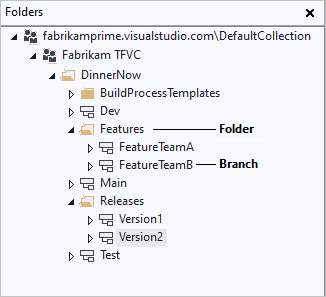

# Branch folders and files

[!INCLUDE [version-lt-eq-azure-devops](../../includes/version-lt-eq-azure-devops.md)]
[!INCLUDE [version-vs-gt-eq-2019](../../includes/version-vs-gt-eq-2019.md)]

You can use branches to accomplish the following goals:  
-   Manage concurrent work by multiple teams on the same codebase.
-   Isolate risks that are introduced by different sets of changes to the codebase.
-   Take snapshots and then support subsequent isolated changes (for example, to create a release branch).

For example, the following illustration shows the branch structure that the DinnerNow company developed to meet its business needs.

  

Feature Team A and Feature Team B each do their work in separate branches. When the teams are ready to integrate their work, they merge their branches into the Dev branch. When the builds from the Dev branch are stable and ready to test, the teams merge the Dev branch into the Test branch.

As each version is released, the Main branch is branched into a new version branch, such as the Version1 branch and the Version2 branch. By following this strategy, the company can enhance or fix each past version of the product separately if necessary.

You can perform a branching operation by using either Visual Studio **Source Control Explorer**, as this article demonstrates, or the `branch` command at a command prompt. For more information, see [Branch Command](branch-command.md).

> [!TIP]
> Branching is an important and powerful technique for creating a parallel set of versions of your files. However, using branches can add complexity and cost to your project. For example, when you merge two branches, you may have to resolve conflicts.  
>
> Before you create a branch, you should consider whether you can better meet your needs by applying a label. By applying a label, you can quickly and easily take a snapshot of the state of your files so that you can then later retrieve or build the files in that state. For more information, see [Use labels to take a snapshot of your files](use-labels-take-snapshot-your-files.md).
 
## Prerequisites  

- To convert a folder to a branch, your **Manage branch** permission must be set to **Allow**.  
- To branch a branch, your **Manage branch** permission must be set to **Allow** for the paths to the source and target branches. Your **Merge** permission for the path of target branch must set to **Allow**.  
- To branch a folder or file, your **Check out** permission and your **Merge** permission for the target path must be set to **Allow**. 

For more information, see [Default TFVC permissions](../../organizations/security/default-tfvc-permissions.md).

## Convert a folder to a branch

Branches are different from folders. The following illustration shows the top level of the DinnerNow folder structure in Visual Studio **Source Control Explorer**.

  

As the illustration shows, you can still use folders to organize branches within a project's version control hierarchy. However, folders and branches have a different appearance and different capabilities. When you right-click a folder or branch and select **Advanced** > **Properties**, you display different information and different functionality.

When you perform branch operations, branches have important advantages over folders. Branches support version control features that provide extra visibility into your branch structure and into where your changesets have merged.
Although you can still branch and merge among folders, the best practice for your team is to branch and merge only among branches. The following procedure explains how to convert a folder to a branch.

> [!IMPORTANT]
> Make sure the folder you want to convert exists on the server. If the pending addition icon  appears next to the folder in **Source Control Explorer**, right-click the folder and select **Check In Pending Changes**.

1. In **Source Control Explorer**, right-click the folder you want to convert and select **Branching and Merging** > **Convert to Branch**.

1. In the **Convert Folder to Branch** dialog box:

   - In the **Owner** field, optionally enter the name of the person who owns this branch. This field is for information only and grants no permissions.
   - In the **Description** field, optionally type information to help other team members use this branch or understand its purpose.
   - If you're converting a folder that you already branched, select the **Recursively perform this conversion for all branched child folders** checkbox. This option converts all folders that were branched from this one folder to branches.

1. Select **Convert**.

> [!IMPORTANT]  
> You can't nest branches. Therefore, you can't convert a folder to a branch if it either contains or is contained by a branch. For example, the following illustration shows that neither the parent nor the child of the **FeatureTeamA** branch can be converted to a branch.
> 
> 

After you convert a folder to a branch, you can convert it back to a folder if your team decides to change your branch structure.

## Convert a branch to a folder

1. In **Source Control Explorer**, select the branch that you want to convert.
1. In the Visual Studio **File** menu, select **Source Control** > **Branching and Merging** > **Convert to Folder**, and then select **Yes**.

## Branch a branch

After you convert a folder to a branch, you can then create other branches from that branch. The following procedure shows how you can use Visual Studio to branch a branch. To do this task at the command prompt, see [Branch Command](branch-command.md).

1. In **Source Control Explorer**, right-click the branch that you want to branch and select **Branching and Merging** > **Branch**.

1. In the **Branch from \<Branch name>** dialog box, under **Branch from Version**, optionally drop down and select an option from the **By** list:

   - **Latest Version** creates the branch for the most recent version in version control.
   - **Changeset** lets you enter the number of a changeset in the **Changeset** box, or select the ellipsis **...** to open the **Find Changesets** dialog box. For more information, see [Find and view changesets](find-view-changesets.md).
   - **Date** lets you enter or select a date in the **Date** box.
   - **Label** lets you enter or find a label. For more information, see [Use labels to take a snapshot of your files](use-labels-take-snapshot-your-files.md).
   - **Workspace Version** lets you create the branch for a version in a different workspace.

1. Under **Target Branch Name**, specify or browse to and select the path of the new branch.

1. Select **Branch**. The branch is created and appears in **Source Control Explorer**.

> [!NOTE]
> Unlike most version control operations, this operation doesn't generate a pending change. Rather, the operation is completed immediately and you can't undo it.

## Branch a folder or file

Although you can branch a folder or file directly, we recommend that you avoid doing so. If you branch a file or folder directly, you won't be able to [view your branch hierarchy](view-branch-hierarchy-team-project.md) or [track your changesets](view-where-when-changesets-have-been-merged.md). The best practice is to branch and merge only among branches, as described earlier in this article.

But if you have a special need to branch a folder or file, you can use the following procedure. To do this task at the command prompt, see [Branch Command](branch-command.md).

1. In **Source Control Explorer**, right-click the folder or file that you want to branch and select **Branching and Merging** > **Branch**.

1. In the **Branch** dialog box, under **Target** box, modify the location and name for the new branch, or select **Browse** to browse to and select a target.

1. Under **Branch from version**, optionally drop down and select an option from the **By** list:

   - **Latest Version** creates the branch for the most recent version in version control.
   - **Changeset** lets you enter the number of a changeset in the **Changeset** box, or select the ellipsis **...** to open the **Find Changesets** dialog box. For more information, see [Find and view changesets](find-view-changesets.md).
   - **Date** lets you enter or select a date in the **Date** box.
   - **Label** lets you enter or find a label. For more information, see [Use labels to take a snapshot of your files](use-labels-take-snapshot-your-files.md).
   - **Workspace Version** lets you create the branch for a version in a different workspace.

1. Optionally select **Download the target item to your workspace** to create a copy of the version-controlled item on the local workspace. Clear the checkbox if you don't need a local copy and you want to improve performance by not downloading many items to your computer.

1. Select **OK**. The branch is created and appears in **Source Control Explorer**.

    > [!NOTE]  
    > A **Browse For Folder** window appears if you selected **Download the target item to your workspace** and the local folder that you specified isn't mapped in the current workspace. Browse for a folder, or select **Make New Folder**, specify a folder to synchronize to the version-controlled items, and then select **OK**.

## Related articles

- [Use Source Control Explorer to manage files under version control](use-source-control-explorer-manage-files-under-version-control.md)
- [View where and when changesets have been merged](view-where-when-changesets-have-been-merged.md)
- [View the branch hierarchy of a project](view-branch-hierarchy-team-project.md)
- [Branch Command](branch-command.md)
- [Branches Command](branches-command.md)
- [Branch strategically](branch-strategically.md)
- [Visual Studio TFS Branching Guide](branching-strategies-with-tfvc.md)
