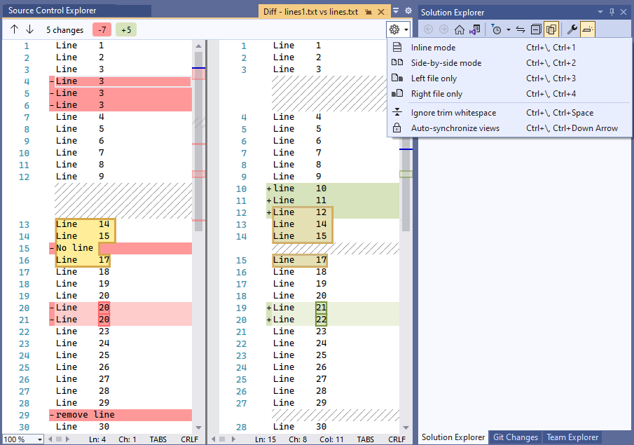
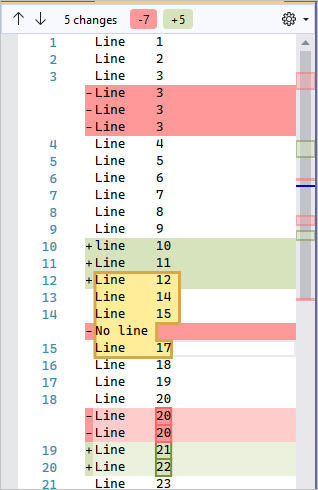

# Compare files using Team Foundation Version Control

[!INCLUDE [version-lt-eq-azure-devops](../../includes/version-lt-eq-azure-devops.md)]
[!INCLUDE [version-vs-gt-eq-2019](../../includes/version-vs-gt-eq-2019.md)]

This article provides a guide for comparing files when using Team Foundation Version Control (TFVC). If you're using Git for version control, see [Compare files](../../repos/git/review-history.md#compare-files).

You can compare server folders and local folders to each other, and view the differences between the contents of each folder. You can compare two server files, two local files, or a server file against a local file, and view the differences between the files.

You can merge changes between two versions by copying and pasting changes from the diff view into your workspace version to quickly bring in updates from one version to another.

> [!NOTE]
> Even if you're not using version control, you can use the **Diff** window in Visual Studio to compare any two files on your computer. Use the [devenv.exe tool with the /diff option](/visualstudio/ide/reference/diff) from the Developer Command Prompt to open the Visual Studio **Diff** window to compare the files.

## Compare any two files using the Compare dialog box

You can compare any two files using the Visual Studio **Compare** dialog box. The files can both reside on the local system, both on Azure DevOps Server, or one on each.

1. On the menu bar, choose **View** > **Other Windows** > **Source Control Explorer**.

1. In **Source Control Explorer**, right-click a file and select **Compare**.

1. In the **Compare** dialog box, select the files to compare. Enter a path and filename under both **Source path** and **Target path**, or select the arrow next to **Browse**, choose **Local Path** or **Server Path**, and then browse to choose the file.

   > [!TIP]
   > To compare any two local files, select **Local Path** from both **Browse** dropdown menus.

1. Under **Source version**, next to **Type**, select **Changeset**, **Date**, **Label**, **Latest Version**, or **Workspace Version**, and specify the details.

1. Select **OK**.

## Compare files in your workspace with the most recent version

Compare your work with the latest version on Azure DevOps Server while continuing to make changes.

1. If you aren't already connected to the project that you want to work in, [connect to the project](../../organizations/projects/connect-to-projects.md).

1. From **Team Explorer**, open the **Pending Changes** page.

1. On the **Pending Changes** page, locate the file in the **Included Changes** list.

1. Right-click the file and select **Compare with Workspace Version** to see the local changes you've made to the version you checked out.

     > [!TIP]
     >  You can also press **Shift** and then double-click the file.

   Or, right-click the file and select **Compare with Latest Version** to compare your changes to the latest version of the file on Azure DevOps Server.

   The **Diff** window appears. You can continue to make changes to the file in this window.

> [!TIP]
> You can also use **Solution Explorer** or **Source Control Explorer** to compare a file in your workspace with a version of the file on the server. Right-click a file and select **Compare**. When the **Compare** dialog box appears, select **OK**.

## Compare two versions of a file in your TFVC history

Compare two versions of a file already checked into Team Foundation Version Control:

1. On the Visual Studio menu bar, select **View** > **Other Windows** > **Source Control Explorer**.

1. In **Source Control Explorer**, right-click a file and select **View History**.

1. In the **History** window, select two versions of the file, right-click and select **Compare**.

## Use the Diff window

When you compare files using the instructions in the previous sections, Visual Studio displays the files in the **Diff** window. The **Diff** window shows the difference between two files. If one of the files is checked out in your workspace, you can modify the file as you run the comparison.

In the **Diff** window:

- Lines that are being deleted have a red background in the source, and are replaced by shading in the changed version.
- Lines that are being added appear as shading in the source, and have a green background in the changed version.
- Lines that are being changed have a red background in the source and a green background in the changed version.
- Lines that have code review comments are outlined and have a yellow background.
- The scroll bars next to each version show a visual summary of the differences between the files.



- Select the arrow icons at the upper-left of the **Diff** window, or press F8, to skip back and forth between diffs.
- To go back and forth in the files, select places on the visual summary scroll bars.
- Select the arrow next to the **Settings** icon at the top of the **Diff** window to change the view. **Side-by-side mode** is more effective in most cases, but you can also use **Inline mode**, or view the **Left file only** or **Right file only**.

  The following screenshot shows inline view:
  
  

When you participate in a [code review](day-life-alm-developer-suspend-work-fix-bug-conduct-code-review.md), you use the **Diff** window to see the code changes that are the subject of the review. For more information, see [Suspend work, fix a bug, and conduct a code review](day-life-alm-developer-suspend-work-fix-bug-conduct-code-review.md).

## Merge changes between versions

You can copy and paste changes from the diff view into your workspace version to quickly bring in updates from one version to another. Merge more complex changes between two versions when you [resolve merge conflicts in TFVC](resolve-team-foundation-version-control-conflicts.md) before you check in changes.

If you need to merge two files with significant differences outside of TFVC conflict resolution, use the [vsdiffmerge](https://roadtoalm.com/2013/10/22/use-visual-studio-as-your-diff-and-merging-tool-for-local-files) command line tool. The `vsdiffmerge` tool allows you to merge changes side-by-side and pick which contents you want to keep for each difference between the files.

Run the command from the Visual Studio Developer Command Prompt with four file parameters followed by the `/m` flag to bring up the merge tool directly against any two files. The basic syntax for `vsdiffmerge.exe` is:

```cmd
vsdiffmerge.exe "File1" "File2" "Base file" "Result file" /m
```

`File1` and `File2` are the full path to the files you want to merge. The `Base file` is the full path to the file both files are based off, and the `Result file` is the full path where you want to write the merged results.

## Next steps

- [Compare folders](compare-folders.md)
- [Difference command](difference-command.md) 
