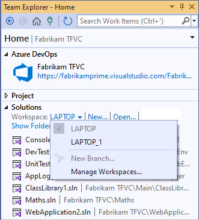

# Create and work with workspaces

[!INCLUDE [version-lt-eq-azure-devops](../../includes/version-lt-eq-azure-devops.md)]
[!INCLUDE [version-vs-gt-eq-2019](../../includes/version-vs-gt-eq-2019.md)]

Your workspace is your local copy of the team's codebase. This is where you develop and test your code in isolation until you're ready to check in your work. In most cases the only workspace you need is created automatically for you and you don't have to edit it.

In some cases, you might want to modify your workspace or create multiple workspaces to isolate and switch among the changes you're making in different [branches](./branching-strategies-with-tfvc.md).

## Add, edit, or remove a workspace

In Visual Studio, after you [connect to your project](../../organizations/projects/connect-to-projects.md) or press Ctrl+0, C, you can manage your workspaces.

From the **Home** page in **Team Explorer** or Ctrl+0, H, select the arrow next to **Workspace**, and select **Manage workspaces**.

Or, from [Source Control Explorer](use-source-control-explorer-manage-files-under-version-control.md), select the arrow next to **Workspace**, and select **Workspaces**.

In the **Manage Workspaces** dialog box, select **Show remote workspaces** if you want to view all the workspaces you own, including those on other computers.

Select **Add** or **Edit** to modify working folders in a new or existing workspace.

If you want to remove a workspace, before you do so, open the **Pending Changes** page in **Team Explorer**, or press Ctrl+0, P, to make sure there are no pending changes. If you have pending changes, you can either [check them in](check-your-work-team-codebase.md) or [shelve them](suspend-your-work-manage-your-shelvesets.md).

## Switch workspaces

When you switch from one workspace to another, to avoid confusion, make sure to switch to the same workspace in both **Team Explorer** and **Source Control Explorer**.

1. [Connect to the project](../../organizations/projects/connect-to-projects.md), or press Ctrl+0, C.
1. From the **Home** page in **Team Explorer** or Ctrl+0, H, select the arrow next to **Workspace** and then select the workspace you want to use.
1. In [Source Control Explorer](use-source-control-explorer-manage-files-under-version-control.md), select the arrow next to **Workspace**, and choose the workspace you want to work in.

## Work from the command prompt

You can create and manage your workspaces from the command prompt. You can also perform some tasks that aren't possible in Visual Studio. For example, you can delete another user's workspace if you have [sufficient permissions](../../organizations/security/permissions.md#tfvc). See [Workspace Command](workspace-command.md), [Workspaces Command](workspaces-command.md), and [Workfold Command](workfold-command.md).

## Q & A

 
#### Q: Why would I need to change the working folders? How should I do it?

**A:** In general, you should map your entire project to a single local folder under *c:\\Users\\\<YourName>\\Source\\Workspaces\\\<ProjectName>*.

Some tips on effective folder names:

- Keep all folder, subfolder, and filenames short to simplify your work and avoid potential long-path issues that can occur with some types of code projects.
- Avoid whitespace if you want to make command-line operations a little easier to perform.

If your team has a large and complex codebase or if you want your workspace to contain only the files you need to improve performance, you can [optimize your workspace](optimize-your-workspace.md).

#### Q: Can I reuse and share folder mappings?

**A:** Yes. If you want to reuse or share folder mappings with other team members, you can copy the folder mappings. Simply open the shortcut menu in the **Working folders** list and choose **Copy**. To reuse the folder mappings, paste them into another version control workspace or a [build definition workspace](../../pipelines/repos/index.md). To share the folder mappings with your teammates, paste them into a text file and then share the file.

#### Q: What does "Cloaked" mean?

**A:** Choose **Cloaked** to exclude that folder from your workspace. For details and examples, see [Optimize your workspace](optimize-your-workspace.md).

#### Q: How do I add a folder non-recursively?

**A:** See [Optimize your workspace](optimize-your-workspace.md).

#### Q: How do I choose advanced workspace options?

**A:** When you select **Advanced** in the **Edit Workspace** dialog box, more options appear.

- **Owner**: Only the owner of a workspace can use it.

  > [!TIP]
  > Instead of changing the owner of your workspace when someone else needs to continue your work, you can [suspend (or shelve)](suspend-your-work-manage-your-shelvesets.md) your work and then share the shelveset with them.

- **Computer**: This field identifies the dev machine where the workspace exists, and it's read-only. You can't move a workspace from one computer to another. However, if the name of your dev machine has changed and you want that change to appear in this field, run [tf workspaces /updatecomputername](workspaces-command.md).

- **Location**: **Local** is the best choice in most cases. See [Decide between using a local or a server workspace](decide-between-using-local-server-workspace.md).

- **File Time**:

  - Choose **Checkin** if you want the date and time stamp of each file to generally match the stamp of the changeset of the version in your workspace. A few issues and exceptions are:

    - When you modify the local file, the date and time stamp will match the date and time when you modified the file.
    - The setting only applies to folders if there's a pending add or delete operation to a file contained by the folder.
    - You might not be able to build your code project incrementally. Instead, you'll have to rebuild.

  - Choose **Current** if you want the date and time stamp to match the date and time when you last modified the local file. For example, a team member checked in the latest change to the file on Monday. On Tuesday, you perform a get operation to update your copy of the file. The date and time stamp is set to Tuesday.

-   **Permissions**: For a workspace you're using on a dev machine for a single developer, select **Private workspace**. Choose **Public workspace** if you want to use a single computer for a team to collaborate on an effort such as resolving a large number of conflicts. If you want any team member to be able to use a workspace but not check in their work, choose **Public workspace (limited)**. This option reserves check-in permission for the owner.

#### Q: Can I use the same workspace in multiple instances of Visual Studio?

**A:** Although Visual Studio doesn't block you from running multiple instances against the same workspace, this usage isn't supported. Also, working this way is more likely to cause problems if you're using a local workspace.

#### Q: How do I add code, get code, develop my app, and check in?

**A:** [Add files to the server](add-files-server.md), [download files from the server](develop-your-app-team-foundation-version-control.md), [develop your app](develop-your-app-team-foundation-version-control.md), and [check in](check-your-work-team-codebase.md).

#### Q: I work at a remote site. Is there any way I can save bandwidth?

**A:** [Install Team Foundation Proxy and set up a remote site](/azure/devops/server/install/install-proxy-setup-remote).
