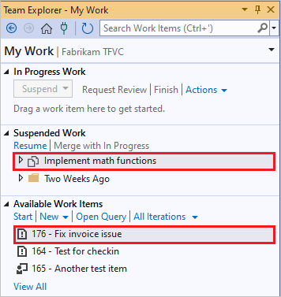
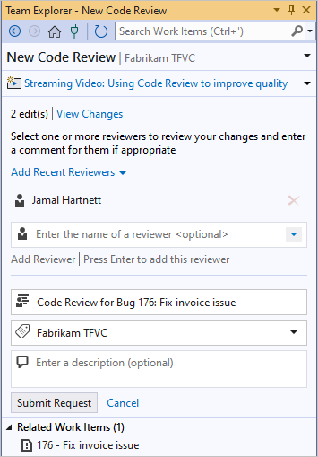
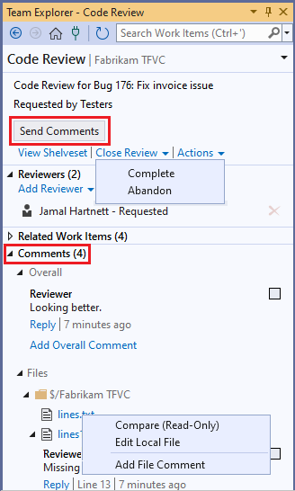
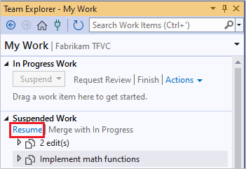

# Day in the life of a devops developer: Suspend work, fix a bug, and conduct a code review

[!INCLUDE [version-lt-eq-azure-devops](../../includes/version-lt-eq-azure-devops.md)] 
[!INCLUDE [version-vs-gt-eq-2019](../../includes/version-vs-gt-eq-2019.md)]

The Visual Studio **My Work** and **Code Review** features support context switching from one thread of work to another. Also, team members can easily exchange messages about proposed changes to the code. This article illustrates these features, continuing the tutorial from [Day in the life of a devops developer: Write new code for a user story](day-life-alm-developer-write-new-code-user-story.md).

[!INCLUDE [temp](includes/note-my-work-code-review-support.md)]

This tutorial describes how you can suspend work on a current task to immediately fix a bug that's blocking teammates in another work item. After fixing the bug, you can ask colleagues to review the fix, and after the review passes, check in the fix and resume work on the original task.

## Suspend current work

While you're working on a backlog item, you might find out about a bug in another item that's blocking teammates. If it's an area you're familiar with, you can create a task to fix the bug and assign it to yourself to work on immediately.

Before you start work on the new bug, you want to make sure that your current work is set aside in a safe place on the team's server. In Visual Studio **Team Explorer**, on the **My Work** page, choose **Suspend** to save on the server:

-   All the work you've done, including changes to code, tests, and other files.

-   Open solutions, windows, breakpoints, watch window variables, and other bits of Visual Studio state.

Now that your workspace is clean, drag the new task from **Available Work Items** to **In Progress Work**. You're ready to research and write the fix.

> [!NOTE]
> Your working context is linked to the work items that show as **In Progress** on the **My Work** page. By using **Suspend** and **Resume**, you can quickly switch between different tasks. Your open solutions and files, code changes, and Visual Studio layout are all switched together.

### To suspend current work and begin work on a different task

Switch your work context:

1. If you're not already connected to the project that you want to work in, [connect to the project](../../organizations/projects/connect-to-projects.md).

1. From the **Home** page of **Team Explorer**, choose **My Work**.

1. On the **My Work** page, in the **In Progress Work** section, choose **Suspend**.

1. In the box that appears, optionally change the name that you want to give this set of suspended work, and then select **Suspend**. The item appears under **Suspended Work**.

   

1. Drag a work item from **Available Work Items** to **In Progress Work**. Or, you can switch to a work item that you previously suspended by dragging it from **Suspended Work**.

   If the work item you want to assign yourself doesn't appear under **Available Work Items**, you can:

   - Create a new task or other work item by choosing **New**.
   - Select a different query by selecting **Open Query**.

> [!TIP]
> The **In Progress Work** items link to your current code changes and Visual Studio state. To allow Visual Studio to help you organize your work, make sure that the appropriate items are in the **In Progress Work** state when you switch from one task to another.

## Investigate the bug

Open the new bug and read the description. In this example, the description by a member of the test team states that a paid invoice is sometimes incorrectly flagged as unpaid. A lab environment snapshot is attached to the bug work item. You open the virtual machine (VM) on which the test was run, see the incorrect invoice, and step back through the IntelliTrace log. You can trace the fault to the following method:

```csharp
public class LocalMath
{
    public static bool EqualTo(double a, double b)
    {
        return a == b;
    }
```

From the IntelliTrace log, you see that sometimes the method returns false because the parameters differ by an extremely small amount. You know that rounding errors of this kind are unavoidable in floating point arithmetic, and that it's bad practice to test floating point numbers for equality.

## Augment the tests to show the error

When a bug is found, it shows that there was a gap in the unit tests, or that the test didn't match the users' actual needs. Therefore, before fixing the bug, add a test that demonstrates the presence of this error:

```csharp
// Added 2022-02-02 for bug 654321:
/// <summary>
/// Make sure that number equality test allows for 
/// small rounding errors.
/// </summary>
[TestMethod]
public void TestDoublesEqual()
{
    // Allow a rounding error of 1 in 1000000:
    TestEqual(1, 1e-7, true); // Less than allowed error
    TestEqual(1, 1e-5, false); // More than allowed error
    TestEqual(1000, 1e-7, true); // Less than allowed error
    TestEqual(1000, 1e-5, false); // More than allowed error
}
private void TestEqual(double value, double error, bool result)
{
    // Try different combinations of error and value:
    Assert.IsTrue(result == LocalMath.EqualTo(value + error, value));
    Assert.IsTrue(result == LocalMath.EqualTo(value, value + error));
    Assert.IsTrue(result == LocalMath.EqualTo(value - error, value));
    Assert.IsTrue(result == LocalMath.EqualTo(value, value - error));
}
```

Run the test, and it fails as expected.


## Make the tests pass

Fix the code:

```csharp
public static bool EqualTo(double a, double b)
{
    // Allow for rounding errors.
    // For example, a == 2.0 and b = 1.99999999999

    const double allowedError = 1/1000000;
    return System.Math.Abs(a - b) < allowedError;
}
```

The test now passes:


## Request a code review

When you're satisfied with your fix for the bug, don't check in your work yet. Teams use code reviews to increase overall code quality and reduce the risk of creating more bugs. Use **Team Explorer** to request code reviews from teammates.

### To request a code review

1. In **Team Explorer**, on the **My Work** page under **In Progress Work**, choose **Request Review**.

   The **New Code Review** page appears.

   

   - In the **Enter the name of a reviewer** field, specify one or more reviewers, and press Enter after each selection.
   - In the next field, change the name of the review if you want to.
   - In the next field, make sure the correct area path appears.
   - In the next field, type an optional description.
   
1. Choose **Submit Request**.

The reviewers are notified of the request by email.

You can also request a code review of suspended work, a shelveset, or a changeset. To see a list of changesets, open **Source Control Explorer** and choose the **History** button.

## Do a code review

A reviewer can accept the code review request. The reviewer reviews the code, writes some comments at the file- and code-block levels, and then sends the code review back to you. A requested reviewer who's too busy to review the code can decline the review.

In the comments, the reviewer points out that the test is wrong. The allowable error should be a specified fraction of the input values, not a constant quantity. So the test should multiply the error by the value.

```csharp
// We allow a rounding error of 1 in 1000000
// as a fraction of the value:
TestEqual(1, 1e-7, true); // Less than allowed error
TestEqual(1, 1e-5, false); // More than allowed error
TestEqual(1000, 1000*1e-7, true); // Less than allowed error
TestEqual(1000, 1000*1e-5, false); // More than allowed error
```

> [!TIP]
> The team members use the tests as a focus for discussion. If the tests are correct and sufficient, the code will be also. Unlike the code, each test represents a separate case. For this reason, the tests are often easier to discuss than the code.

### To do a code review  

1. On the **My Work** page in **Team Explorer**, right-click the code review in the **Code Reviews** section and select **Open**.

   The **Code Review** page appears.

   

1. On the **Code Review** page, you can:

   - Choose **Add Reviewer** to add other reviewers to the code review request.
   - Select each file link to see the changes to the files that were updated for this work item.
   - Use **Comments** to discuss the changes with the author and other reviewers.

     To add comments:

     - Choose **Add Overall Comment** to add an overall comment to the review.
     - When viewing a file, select a line or block of code, right-click, and select **Add comment**.

     After adding each comment, select **Save** or press Ctrl+Enter.

1. When you're finished entering comments, select **Send Comments** to make your contributions visible to the author and other reviewers.

## Respond to a code review

You receive and respond to the code review from the reviewers. You and the reviewers can exchange comments as often as you like. The review ends when you close it.

### To respond to a code review

1. In **Team Explorer**, on the **My Work** page, go to the **Code Reviews** section and double-click the request, or right-click the request and choose **Open**.

   The **Code Review** page appears.

   

1. Under the **Comments** section, read the comments and reply to them as needed. To reply to a comment, choose **Reply**, enter your comment in the box that appears, and then choose **OK**.

1. To view a file and see the code blocks that have comments, or to edit or comment on a file, go to the **Files** subsection. Right-click the file, and choose either:

   - **Compare (Read-Only)**
   - **Edit Local File**, or
   - **Add File Comment**
   
   You can also select the checkbox next to a comment to indicate that the comment has been addressed.

1. To send your comments, choose **Send Comments**. 

1. When you and the other reviewers finish responding to each other's comments and you're ready to close the review, select **Close Review**, and then select:

   - **Complete** to indicate that the review is finished, or
   - **Abandon** to indicate you're canceling the review.

## Fix the test and the code

After reading the review comments, you can fix your unit test as suggested. The test now fails. This shows that the code isn't yet correct.

You fix the code:

```csharp
/// <summary>
/// Returns true if two numbers are equal.
/// </summary>
public static bool EqualTo(double a, double b)
{
    // Allow for rounding errors.
    const double allowedErrorMultiple = 1/1000000;
    double allowedError = (System.Math.Abs(a) + System.Math.Abs(b)) * allowedErrorMultiple/2;
    return System.Math.Abs(a - b) < allowedError;
}
```

The test passes once again.

> [!TIP]
> To fix a bug, follow the same practice as in code development. Write a test that fails and then make the test pass. Check in the code and the tests only when the tests pass.

You now turn your attention to the test case in which the bug was discovered. The steps to reproduce the bug are clearly described in the test case work item. You follow the steps and discover that the invoices are correctly listed.

## Check in the fix

You check in the fixed code and the unit tests. The state of the bug is automatically set to **Resolved**, and the **Assigned To** value is automatically reassigned to the member of the test team who discovered the bug. That team member will verify that the bug has been fixed and close the work item.

### To check in the fix

1. In **Team Explorer**, on the **My Work** page, choose **Check In** to open the **Pending Changes** page.

   

1. On the **Pending Changes** page, make sure that:

   - All relevant changes are listed in **Included Changes**

   - All relevant work items are listed in **Related Work Items**.

1. Enter a **Comment** to help your team understand the purpose of these changes when they look at the version control history of the changed files and folders.

1. Select **Check In**.

## Resume work on a task

Resume work on your original task. You can get back to work quickly because all your code changes are restored to your workspace along with important bits of state such as open windows, breakpoints, and watch window variables.

### To resume work on a task

- In **Team Explorer**, on the **My Work** page, select your original work item under **Suspended Work** and select **Resume**.

  

  Or, if you want to merge your suspended work with pending changes in your workspace, choose **Merge with In Progress**.

When you resume your work, Visual Studio restores:
-   Your open solution
-   Your code changes
-   The state and position of open windows
-   Breakpoints
-   Watch window variables and expressions
-   Bookmarks
