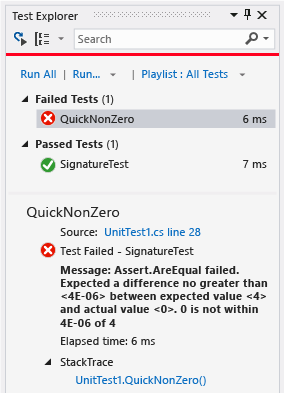
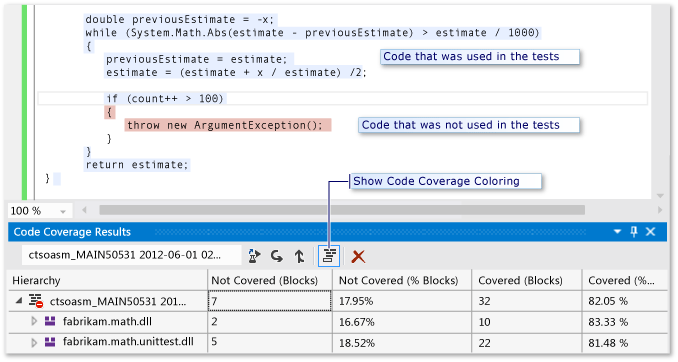

# Day in the life of a devops developer: write new code for a user story

#### Azure Repos | TFS 2018 | TFS 2017 | TFS 2015 | VS 2017 | VS 2015 | VS 2013

Are you a new user of Visual Studio and Team Foundation Server (TFS)? Are you wondering how you and your team can get maximum benefit from the most recent version of these tools to build your app?

Then take a few minutes to walk step-by step through this two-chapter tutorial and follow a day in the lives of Peter and Julia, two developers at Fabrikam Fiber-a fictitious company that provides cable television and related services. You'll see examples of how you can use Visual Studio and TFS to check out and update code, suspend work when you're interrupted, request a code review, check in your changes, and perform other tasks.

**The story so far**  
The team recently began [adopting Visual Studio and Team Foundation Server for devops](https://msdn.microsoft.com/library/dd286491). They set up their server and client machines, created a backlog, planned an iteration, and completed other planning necessary to begin developing their app.

**Overview of this chapter**  
Peter briefly reviews his backlog and selects the task he will work on today. He writes unit tests for the code he plans to develop. Typically, he runs the tests several times in an hour, gradually writing more detailed tests and then writing the code that makes them pass. He often discusses the interface of his code with colleagues who will use the method he is writing.

>**Note:**  
>The My Work and Code Coverage features that are discussed in this topic are available only in Visual Studio Premium and Visual Studio Ultimate.

## Review personal backlog and prepare tasks to begin work

In **Team Explorer**, Peter opens the **My Work** page. The team has agreed that, during the current sprint, Peter will work on **Evaluate invoice status**, a top-priority item in the product backlog. Peter decides to start with **Implement math functions**, a child task of the top-priority backlog item. He drags this task from the **Available Work Items** list into the **In Progress Work Items & Changes** list.

### To review personal backlog and prepare tasks to begin work
  
   

1.  In **Team Explorer**:  
    1.  If you are not already connected to the project that you want to work in, then [connect to the project](../../organizations/projects/connect-to-projects.md).  
    2.  Choose  **Home**, and then choose  **My Work**.  
2.  On the **My Work** page, drag the task from the **Available Work Items** list to the **In Progress Work Items** section.

    You can also select a task in the **Available Work Items** list and then choose **Start**.

### Draft Incremental Work Plan
  
Peter usually develops code in a series of small steps. Each step typically takes no longer than an hour, and might take as little as ten minutes. In each step, he writes a new unit test and changes the code that he is developing so that it passes the new test, in addition to the tests he has already written. Sometimes he writes the new test before changing the code, and sometimes he changes the code before writing the test. Sometimes he refactors. That is, he just improves the code without adding new tests. He never changes a test that passes, unless he decides that it did not correctly represent a requirement.

At the end of every small step, he runs all the unit tests that are relevant to this area of the code. He does not consider the step complete until every test passes.

However, he will not check the code into Team Foundation Server until he has finished the entire task.

Peter writes down a rough plan for this sequence of small steps. He knows that the exact details and order of the later ones will probably change as he works. Here is his initial list of steps for this particular task:  
1.  Create test method stub-that is, just the signature of the method.  
2.  Satisfy one specific typical case.  
3.  Test broad range. Make sure that the code responds correctly to a large range of values.  
4.  Exception on negative. Deal gracefully with incorrect parameters.  
5.  [Code coverage](day-life-alm-developer-write-new-code-user-story.md#coverage). Make sure that at least 80% of the code is exercised by the unit tests.

Some of his colleagues write this kind of plan in comments in their test code. Others just memorize their plan. Peter finds it useful to write his list of steps in the Description field of the Task work item. If he should have to switch temporarily to a more urgent task, he knows where to find the list when he is able to return to it.

## Create the first unit test

Peter begins by creating a unit test. He begins with the unit test because he wants to write an example of code that uses his new class.

This is the first unit test for the class library that he is testing, so he creates a new unit test project. He opens the **New Project** dialog box and chooses **Visual C\#**, **Test**, and then **Unit Test Project**.

  

The unit test project provides a C\# file into which he can write his example. At this stage, he just wants to illustrate how one of his new methods will be invoked:

**C\#**

    using System;
    using Microsoft.VisualStudio.TestTools.UnitTesting;

    namespace Fabrikam.Math.UnitTest
    {
        [TestClass]
        public class UnitTest1
        {
            [TestMethod]
            // Demonstrates how to call the method.
            public void SignatureTest()
            {
                // Create an instance:
                var math = new Fabrikam.Math.LocalMath();

                // Get a value to calculate:
                double input = 0.0;

                // Call the method:
                double actualResult = math.SquareRoot(input);

                // Use the result:
                Assert.AreEqual(0.0, actualResult);
            }
        }
    }

He writes the example in a test method because, by the time he has written his code, he wants the example to work.

### To create a unit test project and methods

Usually you would create a new test project for each project that is being tested. If a test project already exists, you can just add new test methods and classes.

This procedure uses the Visual Studio Unit Test Framework, but you can also use frameworks from other providers. Test Explorer works equally well with other frameworks, provided you install the appropriate adapter.

-   Create a Test project, if it does not already exist.  
    -   In the **New Project** dialog box, choose a language such as **Visual Basic**, **Visual C++** or **Visual C\#**. Choose **Test** and then **Unit Test Project**.  
-   Add your tests to the test class that is provided. Each unit test is one method.

    Each unit test must be prefixed by the `TestMethod` attribute, and the unit test method should have no parameters. You can use any name that you want for a unit test method:

    **C\#**

                [TestMethod]
                public void SignatureTest()
                {...}

	**VB**

				<TestMethod()>
    			Public Sub SignatureTest()
    			...
    			End Sub

-   Each test method should call a method of the `Assert` class, to indicate whether it has passed or failed. Typically, you verify that the expected and actual results of an operation are equal:

	**C\#**

        Assert.AreEqual(expectedResult, actualResult);

	**VB**

		Assert.AreEqual(expectedResult, actualResult)

-   Your test methods can call other ordinary methods that do not have the `TestMethod` attribute.  
-   You can organize your tests into more than one class. Each class must be prefixed by the `TestClass` attribute.

    **C\#**

        [TestClass]
        public class UnitTest1
        { ... }

	**VB**

		<TestClass()>
		Public Class UnitTest1
		...
		End Class

For more information about how to write unit tests in C++, see [Writing Unit tests for C/C++ with the Microsoft Unit Testing Framework for C++](https://msdn.microsoft.com/library/hh598953).

## Create a stub for the new code

Next, Peter creates a class library project for his new code. There is now a project for the code under development and a project for the unit tests. He adds a project Reference from the test project to the code under development.

  

In the new project, he adds the new class and a minimal version of the method that will at least allow the test to build successfully. The quickest way to do that is to generate a class and method stub from the invocation in the test.

**C\#**

            public double SquareRoot(double p)
            {
                throw new NotImplementedException();
            }

### To generate classes and methods from tests

First, create the project where you want to add the new class, unless it already exists.

#### To generate a class

1.  Place the cursor on an example of the class you want to generate, for example, `LocalMath`. On the shortcut menu, choose **Generate Code**, **New Type**.  
2.  In the **New Type** dialog box, set **Project** to the class library project. In this example, it is **Fabrikam.Math**.

#### To generate a method

-   Place the cursor on a call to the method, for example, `SquareRoot`. On the shortcut menu, choose **Generate Code**, **Method Stub**.

## Run the first test

Peter builds and runs the test by pressing CTRL+R, T. The test result shows a red Failed indicator and the test appears under the list of **Failed Tests**.

  

He makes a simple change to the code:

**C\#**

           public double SquareRoot(double p)
            {
                return 0.0;
            }

He runs the test again and it passes:

  

### To run unit tests

  

-   On the **Test** menu, choose **Run**, **All Tests**.  
    - - or -  
-   If Test Explorer is open, choose **Run All**.  
    - - or -  
-   Place the cursor in a test code file and press **CTRL+R, T**.  
-   If a test appears under **Failed Tests**:

    Open the test, for example, by double-clicking the name.

    The point at which the test failed is displayed.

**To see a full list of tests,** choose **Show All**. To return to the summary, choose the **HOME** view.

**To see the details of a test result,** select the test in Test Explorer.

**To navigate to the code of a test,** double-click the test in Test Explorer, or choose **Open Test** on the shortcut menu.

**To debug a test,** open the shortcut menu for one or more tests, and then choose **Debug Selected Tests**.

**To run tests in the background whenever you build the solution,** toggle **Run Tests after Build**. Tests that previously failed are run first.

## Agree the Interface

Peter calls his colleague Julia on Lync, and shares his screen. She will be using his component. He shows his initial example.

Julia thinks the example is OK, but comments, "A lot of functions would pass that test."

Peter replies, "The first test is just to make sure that the name and parameters of the function are correct. Now we can write a test that captures the main requirement of this function."

Together they write the following test:

**C\#**
      
          [TestMethod]
            public void QuickNonZero()
            {
                // Create an instance to test:
                LocalMath math = new LocalMath();

                // Create a test input and expected value:
                var expectedResult = 4.0;
                var inputValue = expectedResult * expectedResult;

                // Run the method:
                var actualResult = math.SquareRoot(inputValue);

                // Validate the result:
                var allowableError = expectedResult/1e6;
                Assert.AreEqual(expectedResult, actualResult, allowableError,
                    "{0} is not within {1} of {2}", actualResult, allowableError, expectedResult);
            }

>**Tip:**  
>For this function, Peter is using Test First Development, in which he first writes the unit test for a feature, and then writes code that satisfies the test. In other cases, he finds that this practice is not realistic, so instead, he writes the tests after he writes the code. But he considers it very important to write unit tests-whether before or after the code-because they keep the code stable.

## Red, Green, Refactor...

Peter follows a cycle in which he repeatedly writes a test and confirms that it fails, writes code to make the test pass, and then considers refactoring-that is, improving the code without changing the tests.

### Red
  
Peter presses CTRL+R, T to run the new test that he created with Julia. After he writes any test, he always runs it to make sure that it fails before he writes the code that makes it pass. This is a practice he learned after he forgot to place assertions in some tests he'd written. Seeing the Fail result gives him confidence that when he makes it pass, the test result correctly indicates that a requirement has been satisfied.

Another useful practice is to set **Run Tests after Build**. This option runs the tests in the background every time you build the solution, so that you have a continual report of the test status of your code. Peter was at first suspicious that it might make Visual Studio slow to respond, but he finds that this rarely happens.

### Green
  
Peter writes his first attempt at the code of the method that he is developing:

**C\#**

        public class LocalMath
        {
            public double SquareRoot(double x)
            {
                double estimate = x;
                double previousEstimate = -x;
                while (System.Math.Abs(estimate - previousEstimate) > estimate / 1000)
                {
                    previousEstimate = estimate;
                    estimate = (estimate * estimate - x) / (2 * estimate);
                }
                return estimate;
            }
            

Peter runs the tests again and all the tests pass:

### Refactor
  
Now that the code performs its main function, Peter looks at the code to find ways of making it perform better, or to make it easier to change in the future. He realizes that he can reduce the number of calculations performed in the loop:

    public class LocalMath
        {
            public double SquareRoot(double x)
            {
                double estimate = x;
                double previousEstimate = -x;
                while (System.Math.Abs(estimate - previousEstimate) > estimate / 1000)
                {
                    previousEstimate = estimate; 
                    estimate = (estimate + x / estimate) / 2;
                    //was: estimate = (estimate * estimate - x) / (2 * estimate);
                }
                return estimate;
            }

He verifies that the tests still pass:

>**Tip:**  
>Every change you make while you are developing the code should be either a refactoring or an extension:  
><ul><li>Refactoring means that you do not change the tests because you are not adding new functionality.</li>  
><li>Extension means adding tests and making the code changes that are necessary to pass both existing and new tests.</li></ul>
>
>If you are updating existing code to requirements that have changed, you will also delete old tests that no longer represent the current requirements.  
>
>Avoid changing tests that have already passed. Instead, add new tests. Only write tests that represent a real requirement.  
>
>Run the tests after every change.

### ... and repeat
  
Peter continues his series of extension and refactoring steps, using his list of small steps as a rough guide. He doesn't always perform a refactoring step after each extension, and he sometimes performs more than one refactoring step in succession. But he always runs the unit tests after each change to the code.

Sometimes he adds a test that requires no change to the code, but that adds to his confidence that his code works correctly. For example, he wants to make sure that the function works over a broad range of inputs. He writes more tests, such as this one:

**C\#**

            [TestMethod]
            public void SqRtValueRange()
            {
                LocalMath math = new LocalMath();
                for (double expectedResult = 1e-8;
                    expectedResult < 1e+8;
                    expectedResult = expectedResult * 3.2)
                {
                    VerifyOneRootValue(math, expectedResult);
                }
            }
            private void VerifyOneRootValue(LocalMath math, double expectedResult)
            {
                double input = expectedResult * expectedResult;
                double actualResult = math.SquareRoot(input);
                Assert.AreEqual(expectedResult, actualResult, expectedResult / 1e6);
            }

This test passes the first time it runs:

  

Just to make sure this result is not a mistake, he temporarily introduces a small error into his test to make it fail. After seeing the failure, he fixes it again.

>**Tip:**  
>Always make a test fail before you make it pass.

### Exceptions
  
Peter now moves on to writing tests for exceptional inputs:

    [TestMethod]
            public void RootTestNegativeInput()
            {
                LocalMath math = new LocalMath();
                try
                {
                    math.SquareRoot(-10.0);
                }
                catch (ArgumentOutOfRangeException)
                {
                    return;
                }
                catch
                {
                    Assert.Fail("Wrong exception on negative input");
                    return;
                }
                Assert.Fail("No exception on negative input");
            }

This test puts the code into a loop. He has to use the **Cancel** button in Test Explorer. This terminates the code within 10 seconds.

Peter wants to make sure that an endless loop could not happen on the build server. Although the server imposes a timeout on a complete run, it is a very long timeout, and would cause substantial delay. Therefore, he adds an explicit timeout to this test:

**C\#**

            [TestMethod, Timeout(1000)]
            public void RootTestNegativeInput()
            {...

The explicit timeout makes the test fail.

Peter then updates the code to deal with this exceptional case:

**C\#**

           public double SquareRoot(double x)
            {
                if (x <= 0.0) 
                {
                    throw new ArgumentOutOfRangeException();
                }

### Regression
  
The new test passes, but there is a regression. A test that used to pass now fails:

  

Peter finds and fixes the mistake:

**C\#**

          public double SquareRoot(double x)
            {
                if (x < 0.0)  // not <=
                {
                    throw new ArgumentOutOfRangeException();
                }

After it is fixed, all the tests pass:

>**Tip:**  
>Make sure every tests passes after every change that you make to the code.

## Code coverage

At intervals during his work, and finally before he checks in the code, Peter obtains a Code Coverage report. This shows how much of the code has been exercised by his tests.

Peter's team aims for coverage of at least 80%. They relax this requirement for generated code, because it can be difficult to achieve a high coverage for this type of code.

Good coverage is not a guarantee that the full functionality of the component has been tested, and it does not guarantee that the code will work for every range of input values. Nevertheless, there is a fairly close correlation between coverage of code lines and coverage of the behavioral space of a component. Therefore, good coverage strengthens the team's confidence that they are testing most of the behavior that they should.

To get a code coverage report, on the **Tests** menu, choose **Run**, **Analyze Code Coverage for All Tests**. Then run all the tests again.

  

Peter gets a total coverage of 86%. When he expands the total in the report, it shows that the code he is developing has coverage of 100%. This is very satisfactory, because the important score is for the code under test. The uncovered sections are actually in the tests themselves. By toggling the **Show Code Coverage Coloring** button, Peter can see which parts of the test code have not been exercised. However, he decides that these sections are unimportant for coverage because they are in the test code and would only be used if an error is detected.

To verify that a specific test reaches into specific branches of the code, you can set **Show Code Coverage Coloring** and then run the single test by using the **Run** command on its shortcut menu.

## When are we done?

Peter continues to update the code in small steps until he is satisfied that:  
-   All the available unit tests pass.

    In a project with a very large set of unit tests, it can be impractical for a developer to wait for them all to run. Instead, the project operates a gated check-in service, in which all the automated tests are run for each checked-in shelveset before it is merged into the source tree. The check-in is rejected if the run fails. This allows the developer to run a minimal set of unit tests on his own machine, and then proceed with other work, without running the risk of breaking the build. For more information, see [Use a gated check-in build process to validate changes](../../pipelines/build/repository.md).  
-   Code coverage meets the team's standard. 75% is a typical project requirement.  
-   His unit tests simulate every aspect of the behavior that is required, including both typical and exceptional inputs.  
-   His code is easy to understand and extend.

When all these criteria are met, Peter is ready to check his code into source control.

### Principles of code development with unit tests
  
Peter applies the following principles while developing code:  
-   Develop unit tests along with the code, and run them frequently during development. The unit tests represent the specification of your component.  
-   Don't change unit tests, unless the requirements have changed or the tests were wrong. Add new tests gradually as you extend the functionality of the code.  
-   Aim for at least 75% of your code to be covered by the tests. Look at the code coverage results at intervals, and before you check in source code.  
-   Check in your unit tests along with the code, so that they will be run by the continuous or regular server builds.  
-   Where practical, for each piece of functionality, write the unit test first. Do this before you develop the code that satisfies it.

## Check in the changes

Before checking in his changes, Peter again uses Lync to share his screen with his colleague Julia so she can informally and interactively review with him what he has created. The tests continue to be the focus of their discussion because Julia is primarily interested in what the code does, not how it works. Julia agrees that what Peter has written meets her needs.

Peter checks in all changes he has made, including the both the tests and the code, and associates them with the task he has completed. The check-in queues the team's automated team build system to validate his changes using the team's **CI Build** build process. This build process helps the team minimize errors in their codebase by building and testing-in a clean environment separate from their development computers-every change the team makes.

Peter is notified when the build is completed. In the build results window, he sees that the build succeeded and all the tests passed.

### To check in the changes
  
   

1.  On the menu bar, choose **View**, **Team Explorer**.

2.  In **Team Explorer**, choose **Home** , and then choose **My Work**.

3.  On the **My Work** page, choose **Check In**.

4.  Review the contents of the **Pending Changes** page to make sure that:

    -   All relevant changes are listed in **Included Changes**

    -   All relevant work items are listed in **Related Work Items**.

5.  Specify a **Comment** to help your team understand the purpose of these changes when they look at the version control history of the changed files and folders.

6.  Choose **Check In**.

### To continuously integrate the code

For more information about how to define a continuous integration build process, see [Set up a CI build](../../pipelines/build/triggers.md). After you have set up this build process, you can choose to be notified about the results of team builds.

  

For more information, see [Run, monitor, and manage builds](../../pipelines/overview.md).
 
[Next (Suspend work, fix a bug, and conduct a code review)](day-life-alm-developer-suspend-work-fix-bug-conduct-code-review.md)
