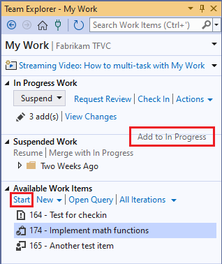
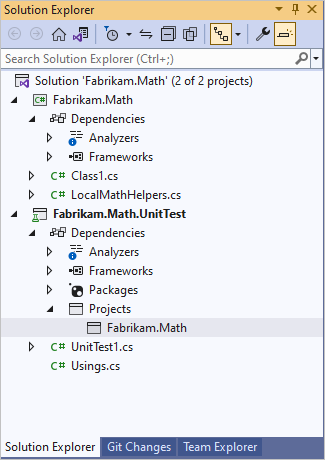

# Day in the life of a devops developer: Write new code for a user story

[!INCLUDE [version-lt-eq-azure-devops](../../includes/version-lt-eq-azure-devops.md)]
[!INCLUDE [version-vs-gt-eq-2019](../../includes/version-vs-gt-eq-2019.md)]

This tutorial walks through how you and your team can get maximum benefit from the most recent versions of Team Foundation Version Control (TFVC) and Visual Studio to build your app. The tutorial provides examples of how you can use Visual Studio and TFVC to check out and update code, suspend work when you're interrupted, request a code review, check in your changes, and do other tasks.

When a team adopts Visual Studio and TFVC to manage their code, they set up their server and client machines, create a backlog, plan an iteration, and complete other planning necessary to begin developing their app.

Developers review their backlogs to select tasks to work on. They write unit tests for the code they plan to develop. Typically, they run the tests several times in an hour, gradually writing more detailed tests and then writing the code that makes them pass. Developers often discuss their code interfaces with colleagues who will use the method they're writing.

The Visual Studio **My Work** and **Code Review** tools help developers manage their work and collaborate with colleagues.

[!INCLUDE [temp](includes/note-my-work-code-review-support.md)]

## Review work items and prepare to begin work

The team has agreed that, during the current sprint, you'll work on **Evaluate invoice status**, a top-priority item in the product backlog. You decide to start with **Implement math functions**, a child task of the top-priority backlog item.

In Visual Studio **Team Explorer**, on the **My Work** page, you drag this task from the **Available Work Items** list into the **In Progress Work** list.

### To review your backlog and prepare tasks to begin work
  
   

1. In **Team Explorer**, if you aren't already connected to the project that you want to work in, [connect to the project](../../organizations/projects/connect-to-projects.md).
1. From the **Home** page, select **My Work**.
1. On the **My Work** page, drag the task from the **Available Work Items** list to the **In Progress Work** section.

   You can also select the task in the **Available Work Items** list and then select **Start**.

### Draft incremental work plan

You develop code in a series of small steps. Each step typically takes no longer than an hour, and might take as little as 10 minutes. In each step, you write a new unit test and change the code you're developing so that it passes the new test, in addition to the tests you've already written. Sometimes you write the new test before changing the code, and sometimes you change the code before writing the test. Sometimes you refactor. That is, you just improve the code without adding new tests. You never change a test that passes, unless you decide that it didn't correctly represent a requirement.

At the end of every small step, you run all the unit tests that are relevant to this area of the code. You don't consider the step complete until every test passes.

You don't check in the code to Azure DevOps Server until you finish the entire task.

You can write down a rough plan for this sequence of small steps. You know that the exact details and order of the later ones will probably change as you work. Here's the initial list of steps for this particular task:

1.  Create test method stub-that is, just the signature of the method.
2.  Satisfy one specific typical case.
3.  Test a broad range. Make sure that the code responds correctly to a large range of values.
4.  Exception on negative. Deal gracefully with incorrect parameters.
5.  [Code coverage](day-life-alm-developer-write-new-code-user-story.md#coverage). Make sure that at least 80% of the code is exercised by the unit tests.

Some developers write this kind of plan in comments in their test code. Others just memorize their plan. It can be useful to write your list of steps in the **Description** field of the Task work item. If you have to switch temporarily to a more urgent task, you know where to find the list when you're able to return to it.

## Create the first unit test

Begin by creating a unit test. Begin with the unit test because you want to write an example of code that uses your new class.

This is the first unit test for the class library that you're testing, so you create a new unit test project.

1. Select **File** > **New Project**.
1. In the **Create a new project** dialog box, select the arrow next to **All languages** and select **C#**, select the arrow next to **All project types** and choose **Test**, and then select **MSTest Test Project**.
1. Select **Next**, and then select **Create**.

  

In the code editor, replace the contents of *UnitTest1.cs* with the following code. At this stage, you just want to illustrate how one of your new methods will be invoked:

```csharp
using System;
using Microsoft.VisualStudio.TestTools.UnitTesting;

namespace Fabrikam.Math.UnitTest
{
    [TestClass]
    public class UnitTest1
    {
        [TestMethod]
        // Demonstrates how to call the method.
        public void SignatureTest()
        {
            // Create an instance:
            var math = new Fabrikam.Math.LocalMath();

            // Get a value to calculate:
            double input = 0.0;

            // Call the method:
            double actualResult = math.SquareRoot(input);

            // Use the result:
            Assert.AreEqual(0.0, actualResult);
        }
    }
}
```

You write the example in a test method because, by the time you write your code, you want the example to work.

### To create a unit test project and methods

Usually you create a new test project for each project that's being tested. If a test project already exists, you can just add new test methods and classes.

This tutorial uses the Visual Studio Unit Test Framework, but you can also use frameworks from other providers. Test Explorer works equally well with other frameworks, provided you install the appropriate adapter.

1. Create a Test project by using the preceding steps. You can choose languages such as **C#**, **F#**, and **Visual Basic**.
2. Add your tests to the test class that is provided. Each unit test is one method.

   - Each unit test must be prefixed by the `TestMethod` attribute, and the unit test method should have no parameters. You can use any name that you want for a unit test method:

     ```csharp
     [TestMethod]
     public void SignatureTest()
     {...}
     ```

     ```vb
     <TestMethod()>
     Public Sub SignatureTest()
     ...
     End Sub
     ```

   - Each test method should call a method of the `Assert` class, to indicate whether it has passed or failed. Typically, you verify that the expected and actual results of an operation are equal:

     ```csharp
     Assert.AreEqual(expectedResult, actualResult);
     ```

     ```vb
     Assert.AreEqual(expectedResult, actualResult)
     ```

   - Your test methods can call other ordinary methods that don't have the `TestMethod` attribute.  
   - You can organize your tests into more than one class. Each class must be prefixed by the `TestClass` attribute.

     ```csharp
     [TestClass]
     public class UnitTest1
     { ... }
     ```

     ```vb
     <TestClass()>
     Public Class UnitTest1
     ...
     End Class
     ```

For information about how to write unit tests in C++, see [Writing Unit tests for C/C++ with the Microsoft Unit Testing Framework for C++](/visualstudio/test/writing-unit-tests-for-c-cpp-with-the-microsoft-unit-testing-framework-for-cpp).

## Create a stub for the new code

Next, create a class library project for your new code. There's now a project for the code under development and a project for the unit tests. Add a project reference from the test project to the code under development.



In the new project, you add the new class and a minimal version of the method that will at least allow the test to build successfully. The quickest way to do that is to generate a class and method stub from the invocation in the test.

```csharp
public double SquareRoot(double p)
{
    throw new NotImplementedException();
}
```

### To generate classes and methods from tests

First, create the project where you want to add the new class, unless it already exists.

#### To generate a class

1. Place the cursor on an example of the class you want to generate, for example, `LocalMath`, and select **Quick Actions and Refactorings**.
1. On the shortcut menu, choose **Generate new type**.  
2. In the **Generate Type** dialog box, set **Project** to the class library project. In this example, it's **Fabrikam.Math**.

#### To generate a method

1. Place the cursor on a call to the method, for example, `SquareRoot`, and select **Quick Actions and Refactorings**.
1. On the shortcut menu, choose **Generate method 'SquareRoot'**.

## Run the first test

Build and run the test. The test result shows a red **Failed** indicator and the test appears under the list of **Failed Tests**.

  

Make a simple change to the code:

```csharp
public double SquareRoot(double p)
{
    return 0.0;
}
```

Run the test again and it passes.

  

### To run unit tests

To run unit tests:

- Select **Test** > **Run All Tests**
- Or, if **Test Explorer** is open, choose **Run** or **Run All Tests In View**.

  

If a test appears under **Failed Tests**, open the test, for example, by double-clicking the name. The point at which the test failed is displayed in the code editor.

- To see a full list of tests, choose **Show All**.

- To see the details of a test result, select the test in **Test Explorer**.

- To navigate to the code of a test, double-click the test in **Test Explorer**, or choose **Open Test** on the shortcut menu.

- To debug a test, open the shortcut menu for one or more tests, and then choose **Debug**.

- To run tests in the background whenever you build the solution, select the arrow next to the **Settings** icon, and then select **Run Tests After Build**. Tests that previously failed are run first.

## Agree on the interface

You can collaborate with colleagues who will use your component by sharing your screen. A colleague might comment that a lot of functions would pass the previous test. Explain that this test was just to make sure that the name and parameters of the function are correct, and now you can write a test that captures the main requirement of this function.

You collaborate with colleagues to write the following test:

```csharp
[TestMethod]
public void QuickNonZero()
{
    // Create an instance to test:
    LocalMath math = new LocalMath();

    // Create a test input and expected value:
    var expectedResult = 4.0;
    var inputValue = expectedResult * expectedResult;

    // Run the method:
    var actualResult = math.SquareRoot(inputValue);

    // Validate the result:
    var allowableError = expectedResult/1e6;
    Assert.AreEqual(expectedResult, actualResult, allowableError,
        "{0} is not within {1} of {2}", actualResult, allowableError, expectedResult);
}
```

> [!TIP]
> For this function, you use *test first development*, in which you first write the unit test for a feature, and then write code that satisfies the test. In other cases, this practice isn't realistic, so you write the tests after you write the code. But it's very important to write unit tests, whether before or after the code, because they keep the code stable.

## Red, Green, Refactor...

Follow a cycle in which you repeatedly write a test and confirm that it fails, write code to make the test pass, and then consider refactoring, that is improving the code without changing the tests.

### Red

Run all tests, including the new test that you created. After you write any test, always run it to make sure that it fails before you write the code that makes it pass. For example, if you forget to place assertions in some tests you write, seeing the **Fail** result gives you confidence that when you make it pass, the test result correctly indicates that a requirement has been satisfied.

Another useful practice is to set **Run Tests After Build**. This option runs the tests in the background every time you build the solution, so that you have a continual report of the test status of your code. You might be concerned that this practice might make Visual Studio slow to respond, but this rarely happens.


### Green
  
Writes your first attempt at the code of the method that you're developing:

```csharp
public class LocalMath
{
    public double SquareRoot(double x)
    {
        double estimate = x;
        double previousEstimate = -x;
        while (System.Math.Abs(estimate - previousEstimate) > estimate / 1000)
        {
            previousEstimate = estimate;
            estimate = (estimate * estimate - x) / (2 * estimate);
        }
        return estimate;
    }
```

Run the tests again, and all the tests pass.


### Refactor
  
Now that the code performs its main function, look at the code to find ways of making it perform better, or to make it easier to change in the future. You can reduce the number of calculations performed in the loop:

```csharp
public class LocalMath
{
    public double SquareRoot(double x)
    {
        double estimate = x;
        double previousEstimate = -x;
        while (System.Math.Abs(estimate - previousEstimate) > estimate / 1000)
        {
            previousEstimate = estimate; 
            estimate = (estimate + x / estimate) / 2;
            //was: estimate = (estimate * estimate - x) / (2 * estimate);
        }
        return estimate;
    }
```

Verify that the tests still pass.

#### Tips

- Every change you make while you are developing the code should be either a refactoring or an extension:

  - Refactoring means that you don't change the tests because you're not adding new functionality.
  - Extension means adding tests and making the code changes that are necessary to pass both existing and new tests.

- If you're updating existing code to requirements that have changed, you also delete old tests that no longer represent the current requirements.

- Avoid changing tests that have already passed. Instead, add new tests. Only write tests that represent a real requirement.

- Run the tests after every change.

### ... and repeat
  
Continue your series of extension and refactoring steps, using your list of small steps as a rough guide. You don't always do a refactoring step after each extension, and you sometimes do more than one refactoring step in succession. But you always run the unit tests after each change to the code.

Sometimes you add a test that requires no change to the code, but that adds to your confidence that the code works correctly. For example, you want to make sure that the function works over a broad range of inputs. You write more tests, such as this one:

```csharp
[TestMethod]
public void SqRtValueRange()
{
    LocalMath math = new LocalMath();
    for (double expectedResult = 1e-8;
        expectedResult < 1e+8;
        expectedResult = expectedResult * 3.2)
    {
        VerifyOneRootValue(math, expectedResult);
    }
}
private void VerifyOneRootValue(LocalMath math, double expectedResult)
{
    double input = expectedResult * expectedResult;
    double actualResult = math.SquareRoot(input);
    Assert.AreEqual(expectedResult, actualResult, expectedResult / 1e6);
}
```

This test passes the first time it runs.


Just to make sure this result isn't a mistake, you can temporarily introduce a small error into your test to make it fail. After seeing the failure, you can fix it again.

> [!TIP]
> Always make a test fail before you make it pass.

### Exceptions
  
Now move on to writing tests for exceptional inputs:

```csharp
[TestMethod]
public void RootTestNegativeInput()
{
    LocalMath math = new LocalMath();
    try
    {
        math.SquareRoot(-10.0);
    }
    catch (ArgumentOutOfRangeException)
    {
        return;
    }
    catch
    {
        Assert.Fail("Wrong exception on negative input");
        return;
    }
    Assert.Fail("No exception on negative input");
}
```

This test puts the code into a loop. You have to use the **Cancel** button in **Test Explorer**. This terminates the code within 10 seconds.

You want to make sure that an endless loop couldn't happen on the build server. Although the server imposes a timeout on a complete run, it's a very long timeout, and would cause substantial delay. Therefore, you can add an explicit timeout to this test:

```csharp
[TestMethod, Timeout(1000)]
public void RootTestNegativeInput()
{...
```

The explicit timeout makes the test fail.

Update the code to deal with this exceptional case:

```csharp
public double SquareRoot(double x)
{
    if (x <= 0.0) 
    {
        throw new ArgumentOutOfRangeException();
    }
```

### Regression
  
The new test passes, but there's a regression. A test that used to pass now fails:

  

Find and fix the mistake:

```csharp
public double SquareRoot(double x)
{
    if (x < 0.0)  // not <=
    {
        throw new ArgumentOutOfRangeException();
    }
```

After it's fixed, all the tests pass:


> [!TIP]
> Make sure every tests passes after every change that you make to the code.

<a name="coverage"></a>

## Code coverage

At intervals during your work, and finally before you check in the code, get a code coverage report. This shows how much of the code has been exercised by your tests.

Your team aims for coverage of at least 80%. They relax this requirement for generated code, because it can be difficult to achieve a high coverage for this type of code.

Good coverage isn't a guarantee that the full functionality of the component has been tested, and it doesn't guarantee that the code will work for every range of input values. Nevertheless, there's a fairly close correlation between coverage of code lines and coverage of the behavioral space of a component. Therefore, good coverage strengthens the team's confidence that they're testing most of the behavior that they should.

To get a code coverage report, in the Visual Studio **Test** menu, select **Analyze Code Coverage for All Tests**. All the tests run again.

[  ](media/day-life-alm-developer-write-new-code-user-story/code-coverage.png#lightbox)

When you expand the total in the report, it shows that the code you're developing has complete coverage. This is very satisfactory, because the important score is for the code under test. The uncovered sections are actually in the tests themselves.

By toggling the **Show Code Coverage Coloring** button, you can see which parts of the test code haven't been exercised. Code that wasn't used in the tests is highlighted in orange. However, these sections are unimportant for coverage because they're in the test code and would be used only if an error is detected.

To verify that a specific test reaches into specific branches of the code, you can set **Show Code Coverage Coloring** and then run the single test by using the **Run** command on its shortcut menu.

## When are you done?

You continue to update the code in small steps until you're satisfied that:
- All the available unit tests pass.

  In a project with a very large set of unit tests, it can be impractical for a developer to wait for them all to run. Instead, the project operates a gated check-in service, in which all the automated tests are run for each checked-in shelveset before it's merged into the source tree. The check-in is rejected if the run fails. This allows developers to run a minimal set of unit tests on their own machines, and then proceed with other work, without running the risk of breaking the build. For more information, see [Use a gated check-in build process to validate changes](../../pipelines/repos/index.md).
-   Code coverage meets the team's standard. 75% is a typical project requirement.
-   Your unit tests simulate every aspect of the behavior that's required, including both typical and exceptional inputs.
-   Your code is easy to understand and extend.

When all these criteria are met, you're ready to check your code into source control.

### Principles of code development with unit tests
  
Apply the following principles while developing code:

- Develop unit tests along with the code, and run them frequently during development. The unit tests represent the specification of your component.
- Don't change unit tests, unless the requirements have changed or the tests were wrong. Add new tests gradually as you extend the functionality of the code.
- Aim for at least 75% of your code to be covered by the tests. Look at the code coverage results at intervals, and before you check in source code.
- Check in your unit tests along with the code, so that they'll be run by the continuous or regular server builds.
- Where practical, for each piece of functionality, write the unit test first. Do this before you develop the code that satisfies it.

## Check in the changes

Before checking in changes, again share your screen with colleagues so they can informally and interactively review with you what you've created. The tests continue to be the focus of your discussion with colleagues who are primarily interested in what the code does, not how it works. These colleagues should agree that what you've written meets their needs.

Check in all changes you've made, including both the tests and the code, and associate them with the tasks you've completed. The check-in queues the team's automated team build system to validate your changes using the team's **CI Build** build process. This build process helps the team minimize errors in their codebase by building and testing, in a clean environment separate from their development computers, every change the team makes.

You're notified when the build is completed. In the build results window, you see that the build succeeded and all the tests passed.

### To check in the changes

1. On the **My Work** page in **Team Explorer**, select **Check in**.

     

1. On the **Pending Changes** page, make sure that:

   - All relevant changes are listed in **Included Changes**.
   - All relevant work items are listed in **Related Work Items**.

1. Enter a **Comment** to help your team understand the purpose of these changes when they look at the version control history of the changed files and folders.

1. Choose **Check In**.

     

### To continuously integrate the code

For more information about how to define a continuous integration build process, see [Set up a CI build](../../pipelines/build/triggers.md). After you set up this build process, you can choose to be notified about the results of team builds.

  

For more information, see [Run, monitor, and manage builds](../../pipelines/get-started/what-is-azure-pipelines.md).

## Next steps

> [!div class="nextstepaction"]
> [Suspend work, fix a bug, and conduct a code review](day-life-alm-developer-suspend-work-fix-bug-conduct-code-review.md)
