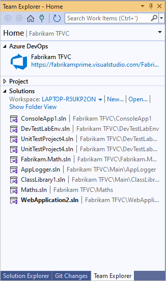
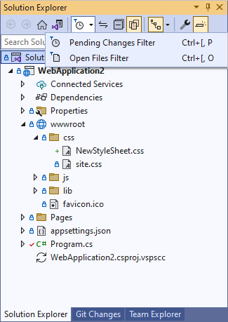
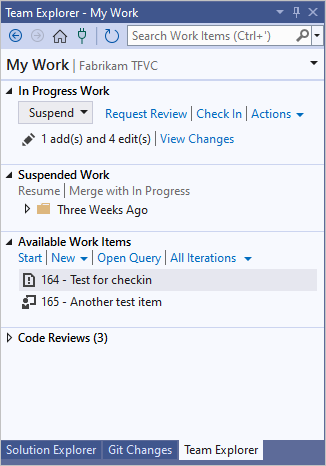
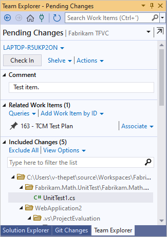

# Develop code and manage pending changes

[!INCLUDE [version-lt-eq-azure-devops](../../includes/version-lt-eq-azure-devops.md)]
[!INCLUDE [version-vs-gt-eq-2019](../../includes/version-vs-gt-eq-2019.md)]

Most changes that you make to your files are queued as pending changes. As you work, you can organize, manage, and get details about what you've changed.

## Work in Visual Studio

From the Visual Studio **Team Explorer** home page, which you can open by pressing Ctrl+0, H, you can begin coding in a new or existing solution.

After you open a solution, you can open **Solution Explorer** by pressing Ctrl+Alt+L.

When you use **Solution Explorer** to open and modify a file that's under source control, the file is automatically checked out for you. Icons appear to indicate which files you haven't changed , those you have checked out , and those you've added to the solution .

If you're working in a solution that contains a lot of files, you'll probably find it convenient to filter the **Solution Explorer** view to show only the files you've changed , or press Ctrl+\[, P.

## Use the My Work page to manage work

You can open the **My Work** page in **Team Explorer** or press Ctrl+0, M to manage your work.

[!INCLUDE [temp](includes/note-my-work-code-review-support.md)]
 

  

You can use **My Work** to: 
- Assign work to yourself.
- Track your work against [work items](../../boards/queries/link-work-items-support-traceability.md).
- Suspend and later resume your work, including file changes, associated work items, and Visual Studio state such as window positions and breakpoints.
- Request a code review.

For step-by-step examples, see [Day in the life of a DevOps developer: Write new code for a user story](day-life-alm-developer-write-new-code-user-story.md) and [Day in the life of a DevOps developer: Suspend work, fix a bug, and conduct a code review](day-life-alm-developer-suspend-work-fix-bug-conduct-code-review.md).

### Tips

- You can control the kinds of work items that appear in the **Available Work Items** section. Choose one of the default options or any queries that are contained in the root **Shared Queries** folder. To work with these queries, use the **Work Items** page in **Team Explorer**.

- When you move a work item to **Available Work Items**, **In Progress Work**, or **Suspended Work**, the work item state or comments update so your team can be automatically advised on the status of your work. For example, the task board for your team updates to show your status. See [Track work with Visual Studio](/previous-versions/visualstudio/visual-studio-2013/dd286619(v=vs.120)).

- If your project contains customized work item type definitions, you might have problems using **My Work**, unless an administrator for your project has taken certain steps. See [Configure and customize Agile planning tools for a project](../../boards/work-items/guidance/agile-process.md) and [Update a customized process template to access new features](/previous-versions/azure/devops/reference/upgrade/update-customized-process-template).

## Use the Pending Changes page to manage work

You can use the **Pending Changes** page in **Team Explorer** to manage your work. To open **Pending Changes**, select **Check In** under **In Progress Work** on the **My Work** page, or press Ctrl+0, P.

> [!TIP]
> -  You can undock :::image type="content" source="media/develop-code-manage-pending-changes/IC667296.png" alt-text="Undock"::: the **Pending Changes** page from **Team Explorer** to open it in a new window.
> -  You can toggle between list and tree views from the **View Options** link under **Included Changes**.

Almost every change that you make to the files on your dev machine is stored in your workspace as a pending change until you check it in. Changes include:  
-   [add](add-files-server.md)  
-   [branch](branch-folders-files.md)  
-   [delete](delete-restore-files-folders.md)  
-   [edit](check-out-edit-files.md)  
-   [rename](rename-move-files-folders.md), including moving items 
-   [properties](/visualstudio/ide/managing-project-and-solution-properties)
-   [rollback](roll-back-changesets.md)  
-   [type](/azure/devops/server/admin/manage-file-types#config-file-encodings), or file encoding  
-   [undelete](delete-restore-files-folders.md)

### Work with automatically detected changes

If you're working in a [local workspace](decide-between-using-local-server-workspace.md), Visual Studio can detect changes that you make outside the system. If you edit a file outside Visual Studio, for example in Notepad, the change automatically appears under **Included Changes** on the **Pending Changes** page.

If you add or remove a file outside Visual Studio, for example in File Explorer, the file appears under the **Detected** link in the **Excluded Changes** section. If you want to include these changes, select the **Detected** link.

The **Promote Candidate Changes** dialog box appears. You can right-click items and choose **Browse in Windows Explorer** to display them, or **Delete from disk** to delete them. Select items and then select **Promote** to add the items to **Included Changes**.

> [!NOTE]
> Empty folders won't appear.

If items that you don't need to check in appear regularly in the **Promote Candidate Changes** dialog box, you can right-click the item and choose **Ignore this local item** to ignore the item. You can also choose **Ignore by extension**, **Ignore by file name**, or **Ignore by folder** to create a file that will cause Visual Studio to systematically ignore this kind of file. For more information on *.tfignore* files, see [Add files to the server](add-files-server.md).

To exclude changes, see [Choose the files you want to check in](check-your-work-team-codebase.md#include_exclude).

### Associate work items

It's a best practice to associate [work items](../../boards/queries/link-work-items-support-traceability.md), such as tasks or bugs, with your changes. Under **Related Work Items**, drag work items from a [query](../../boards/queries/using-queries.md) or add a work item by ID.

## See what you changed

You can review what you've changed in a file.

### Use Pending Changes to view what you changed

On the **Pending Changes** page, right-click the item and choose:

-   **Compare with Workspace Version** to see what you've changed from the version in your workspace.
-   **Compare with Latest Version** to see how your changes compare to the latest version of the file in your team's codebase.

### Use Solution Explorer or Source Control Explorer to view what you changed

1.  Locate and select the item in **Solution Explorer** or in **Source Control Explorer**.  
2.  Right-click the item, and then choose **Compare**.  
3.  In the **Compare** dialog box, from the **Type** menu, choose:  
    -   **Workspace Version** to see what you've changed from the version in your workspace.  
    -   **Latest Version** to see how your changes compare to the latest version of the file in your team's codebase.  
    -   One of the other options: **Changeset**, **Date**, or **Label**.  
4.  Choose **OK**.

The **Diff** window appears. To use this window, see [Compare files](compare-files.md).

## Undo your pending changes

You can discard one, some, or all of the pending changes in your workspace.

> [!NOTE]
> Other options:
>
> - You can first [put the changes away in a shelveset on your server](suspend-your-work-manage-your-shelvesets.md) before removing them from your workspace.  
> - If you've already checked in the change and want to revert it, see [Roll back changesets](roll-back-changesets.md).

### To undo some of your pending changes

1. Open the **Undo Pending Changes** dialog box:

   - In **Solution Explorer**, right-click the items and choose **Source Control** > **Undo Pending Changes**.
   - In the **Pending Changes** page of **Team Explorer**, right-click the items and choose **Undo**.
   - In **Source Control Explorer**, right-click the items and choose **Undo Pending Changes**.

   > [!TIP]
   > To undo all changes you've made in your solution or a code project, right-click the solution or project, and then choose **Undo Pending Changes**.

1. In the **Undo Pending Changes** dialog box, make sure the changes you want to undo are selected, and then choose **Undo Changes**.

### To undo all your pending changes

On the **Pending Changes** page in **Team Explorer**, select the **Actions** link, and then choose **Undo All**.

## Use the command prompt

- The [Status command](status-command.md) displays pending changes in the command prompt.
- The [Checkin command](checkin-command.md) opens pending changes in the **Check In** dialog box.
- The [Undo command](undo-command.md) undoes pending changes.

  > [!TIP]
  > You can use the `Undo` command to undo another user's check-out if you have sufficient permissions.

- The [Difference command](difference-command.md) shows what you've changed in a file.

## Next steps

When you're finished making your changes:

- To request a code review of your pending changes, on the **Pending Changes** page, under **Actions**, choose **Request Review**. For more information, see [Day in the life of a DevOps developer: Suspend work, fix a bug, and conduct a code review](day-life-alm-developer-suspend-work-fix-bug-conduct-code-review.md).

- If you need to set aside your changes, see [Suspend your work and manage your shelvesets](suspend-your-work-manage-your-shelvesets.md).

- To check in and add your changes to the team's codebase, see [Check in your work to the team's codebase](check-your-work-team-codebase.md).

## Tips

- If you're new to developing an app with Visual Studio and TFVC, see [Day in the life of a DevOps developer: Write new code for a user story](day-life-alm-developer-write-new-code-user-story.md).

- When you begin a new work item, it's a good idea to [download the latest files from the server](download-get-files-from-server.md) before you check out files and begin your work.

- Use [Source Control Explorer](use-source-control-explorer-manage-files-under-version-control.md) to manage your files in version control.
