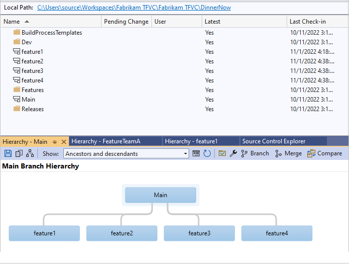
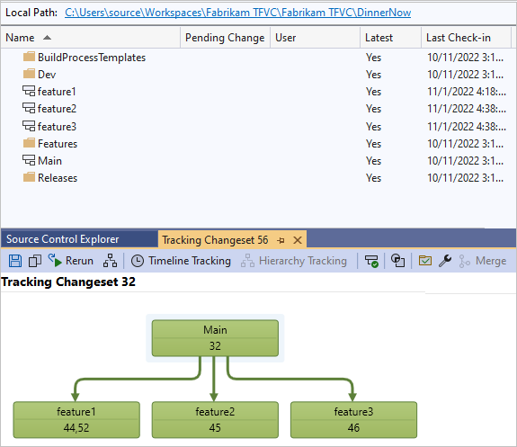
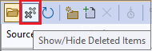
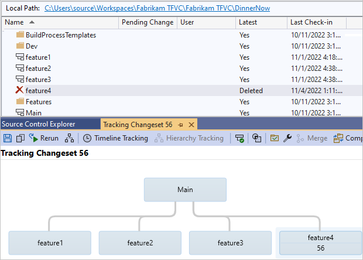

# Explore the feature isolation strategy

[!INCLUDE [version-lt-eq-azure-devops](../../includes/version-lt-eq-azure-devops.md)]
[!INCLUDE [version-vs-gt-eq-2019](../../includes/version-vs-gt-eq-2019.md)]

Are you planning to implement the [Team Foundation Version Control (TFVC)](./what-is-tfvc.md) feature isolation strategy in Azure DevOps? You probably have a few questions, such as:

- Is it practical with large development teams?
- Does it align well with your agile process(es)?
- What's the proper lifetime of isolated feature branches? 

This article aims to answer those questions, and give you a clear perspective on feature isolation in TFVC. For guidance on TFVC branch strategies overall, read [Branching strategies with TFVC](effective-tfvc-branching-strategies-for-devops.md).

> [!NOTE]
> 
> This article covers TFVC. For Git, refer to [adopt a Git branching strategy](../git/git-branching-guidance.md). 

## What's feature isolation?

The feature isolation strategy allows you to work on features or fix bugs in *feature* branches, also known as *topic branches*, based off a parent branch. This strategy isolates your changes from the rest of your team to:
- Experiment with a feature.
- Roll back your changes easily.
- Merge your changes with your parent branch.

> [!NOTE]
> 
> This use of *feature* is unrelated to the Feature work item type. This strategy can be used with Epic, Feature, Program Backlog Item, User Story, or whatever work item type you've defined in your process. 

It's typical to create one feature branch per feature or bug, but in this strategy, you can create a miscellaneous feature branch to isolate a couple of low-risk features. 

Unlike Git branches, which are repository-scoped, TFVC branches are path-scoped and therefore not as lightweight. To work around this, limit the number and the lifetime of your TFVC feature branches. [Optimize your workspace](optimize-your-workspace.md) by using explicit, implicit, cloaked, and non-recursive folder mappings, to improve performance and to reduce required disk space on your machine.

> [!TIP]
> 
> Your workspace should contain only the files you need. Consider creating multiple workspaces to isolate and switch among multiple feature branches. To avoid confusing yourself, use a consistent naming convention for both your workspace and feature branch.

## Naming convention is important

Use a consistent naming convention for your feature branches. Branches should be self-describing and easily identified by your users. Some suggestions:

- features/username/description for work performed by an individual. For example, *features/pat/sdk-java*.
- features/workitem for feature work associated with a specific work item. For example, *features/115673*.
- sprint/username/description for work done by an individual in a specific sprint. For example, *S53/pat/dictionary-refactor*.
- bugfix/username/bugid for work done specific to an engineering bug. For example, *bugfix/pat/707*. 

## Creating feature branches

Create a feature branch when you need to work on a feature, typically within the context of a sprint or iteration.

To protect your parent branch and minimize merge conflicts, regularly forward integrate (FI) changes from the parent branch to your feature branch. FI ensures that you resolve merge conflicts on your feature branch, not the parent branch.

This strategy also keeps features from getting out of sync with the parent branch. Remember to FI before you reverse integrate (RI) your changes back to the parent branch.

> [!TIP]
>
> Keep your feature branches short-lived.
> 
> Unlike main or other central branches, feature branches have a limited lifetime. They're scoped to features, bugs, and hot fixes, which are typically developed within a sprint or iteration. Consider removing your feature branch once your feature has met your team's definition of done ([DoD](/archive/blogs/visualstudioalmrangers/?p=2395)) and changes have been merged with the parent branch.

As the number of your feature branches increases, your storage requirements and branch hierarchy visualization noise increases. With only five feature branches, the diagram is already noisy and rapidly losing its monitoring qualities. Can you imagine the impact of your team creating hundreds of feature branches?
 

Similarly, the Visual Studio **Source Control Explorer** view becomes noisy and impractical as the number of branches increases. Unless you have a consistent naming convention, finding a specific feature branch among hundreds of feature branches is challenging.

> [!TIP]
>
> Delete your feature branches when you're done.

## Impact of deleting a feature branch

By [deleting](delete-restore-files-folders.md#delete-an-item) feature branches, you minimize noise and focus on active feature development. 

Remember it's a soft delete and your history isn't lost. Deleted branches can be unhidden.

1. Select **Tools** > **Options** > **Visual Studio Team Foundation Server**.
1. Select **Show deleted items in the Source Control Explorer**.

Or, toggle the **Show/Hide Deleted Items** icon in the **Source Control Explorer** menu bar.

If needed, you can also [restore](delete-restore-files-folders.md#restore-items-deleted-from-visual-studio) deleted branches and associated items. 

If no one in your team has destroyed a branch by using the [destroy](destroy-command-team-foundation-version-control.md) command, you'll have the complete history needed for auditing and migration tools that rely on replaying history.

> [!NOTE]
>
> Use the `destroy` command with caution. It's a permanent deletion.

By keeping your branches short-lived and adopting a consistent naming convention, you can keep the feature isolation strategy effective for small and large teams. 

Now that you're using feature isolation, you should explore continuous integration, feature toggles, and other complementary strategies.

## Related resources

* [Branching strategies with TFVC](./effective-tfvc-branching-strategies-for-devops.md)
* [Classic branching and merging guidance (PDF)](https://vsardata.blob.core.windows.net/projects/TFS%20Version%20Control%20Part%201%20-%20Branching%20Strategies.pdf)
* [Continuous integration](/devops/develop/what-is-continuous-integration)
* [Feature toggles](/archive/msdn-magazine/2014/may/alm-rangers-software-development-with-feature-toggles)
* [Team Foundation Version Control (TFVC)](./what-is-tfvc.md)
* [DevOps Rangers Guidance](https://github.com/ALM-Rangers/Guidance/blob/master/README.md)
