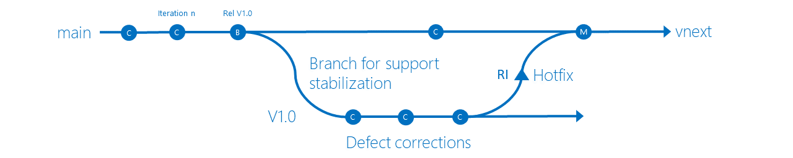
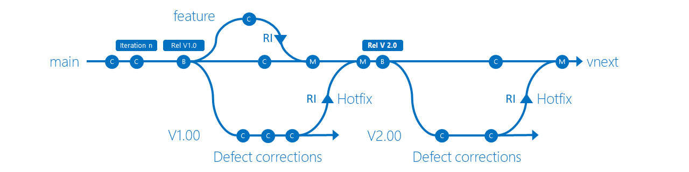

# Explore how to manage branching strategies with a DevOps mindset in Team Foundation Version Control (TFVC)

Are you planning to embrace [DevOps](http://donovanbrown.com/post/what-is-devops) using the Team Foundation Version Control ([TFVC](index.md)) with Team Foundation Server (TFS) or Azure DevOps Services? You probably have a few questions, such as:

- How do I decide on the right branching strategy? 
- Is there an effective strategy for DevOps?
- How do I support applications with single or multiple versions?

> [!VIDEO https://channel9.msdn.com/Blogs/DevOps-Interviews/Interview-with-Abel-Wang-and-Steven-St-Jean/player]

TFVC is a centralized version control system to maintain code and make teams more effective. It provides collaboration and consistent code sharing, publishing, and review features. 

## Keep it simple!

By adopting an effective branching strategy, you'll:
- Foster a *DevOps culture*
- Promote collaboration flow and increased productivity
- Enable teams to spend more time developing and less time managing code

To embrace DevOps, it's important to keep your branch strategy simple and strive for high quality. Some suggestions:

- Start with a simple strategy and evolve as needed
- Use consistent naming conventions for branches
	- features/username/description for work performed by an individual - example, *features/sandra/sdk-java*
	- bugfix/username/bugid for work done specific to an engineering bug - example, *bugfix/takashi/707*
	- releases/version for planned releases - example, *releases/V1.00*
- Frequently reverse integrate (RI) and merge into your main branch
- Encourage consistent code reviews - garbage in, garbage out
- Implement a CI/CD pipeline, using:
	- [Gated](/azure/devops/repos/tfvc/check-folder-controlled-by-gated-check-build-process) checkins
	- Automated testing

## Start with a simple branching strategy

Create a source control structure that identifies *shippable* release units. The concept of *releasable units* is a foundational piece of this strategy, which Steve St Jean describes as follows:
- The physical unit of versioning and delivery.
- The primary unit to support the branching and release models.
- Can be at the Suite-, Application-, or Component-level.
- For Suites, all applications must version and patch together. For example, Microsoft Word and Excel are part of the Microsoft Office Suite. Visio is not, as it may release or patch independent of the rest of the Microsoft Office Suite.
- In TFVC, this would be the root node under the team project node.
- Can be equated to a repo in Git

You typically start with having to support only one production version, with parallel defect corrections and development of new features. Typical examples include web sites, corporate line-of-business applications, and interim tools.

Start with the simple **main-only** branching strategy.

Automate your build to trigger with every checkin to the main branch, run automated tests, and if successful, deploy the release to a development (dev) environment.

|Branch|Build|Environments|Notes|
|------|-----|---------|-----|
|Main|CI_Bld|Dev|Triggered with every checkin to main|

When you complete a release cycle, create a **release** branch. Use the release branch to stabilize the release, and continue development for your next version in main. Reverse integrate (RI) and merge validated bug fixes with your main branch frequently, to minimize your overall technical debt.

Automate your build and release to:
- Trigger with every checkin to the release branch 
- Run automated tests
- Deploy to your development and other environments

|Branch|Build|Pipelines|Notes|
|------|-----|---------|-----|
|Main|CI_Bld|Dev|Triggered with every checkin to main|
|V1.00|RC_Bld|Dev -> QA -> UAT -> Staging -> Prod|Triggered with every checkin to release|

When version 2 becomes the Release Candidate, you can update your existing RC build pipeline to point to the V2.00 branch. It will now build and release just as V1.00 did when it was the current version.

|Branch|Build|Pipelines|Notes|
|------|-----|---------|-----|
|Main|CI_Bld|Dev|Triggered with every checkin to main|
|V2.00|RC_Bld|Dev -> QA -> UAT -> Staging -> Prod|Triggered with every checkin to release|
|V1.00|Hotfix_Bld|Hotfix -> Staging -> Prod|Triggered with every checkin to hotfix|

## Expand branching strategy as needed

When the need arises to support more than one production version, for example a commercial solution such as Word, you can expand your branching strategy. 

For every completed release cycle you need to support, create a new release branch and continue next version development in main, using [feature isolation](./effective-feature-isolation-on-tfvc.md). Note the reverse integration (RI) merges from v1.0 and v2.0 to **main**. They represent bug fixes that are released to production.

By using a **simple** branching strategy and adopting a **consistent naming convention**, you'll be able to support:
- Applications that have one or more supported releases
- Continuous development of new features
- Continuous delivery of value to your users

## Checklist and lessons from the field

**Checklist**

- Keep it simple and expand branching complexity as needed
- Organize your code into shippable units
- Use a consistent naming strategy for your branches
- Build with every check-in
- Create a CI/CD pipeline using gated checkins and automated testing

**Lessons from the field - things to avoid**

- Avoid going branch crazy!
	- **merging** changes comes with complexity and a cost
	- there's no need to have a separate branch per environment
- Avoid using **cherry-picking** to get your code to production
- Do not attempt to solve **people** or **process** problems with tools

#Reference information
- [Continuous Integration](/azure/devops/learn/what-is-continuous-integration)
- [Interview with Abel Wang and Steve St Jean](https://channel9.msdn.com/Blogs/DevOps-Interviews/Interview-with-Abel-Wang-and-Steven-St-Jean)
- [Team Foundation Version Control (TFVC)](overview.md)
- [What is DevOps - Definition](http://donovanbrown.com/post/what-is-devops)
- [What is DevOps - Sticker](https://www.stickermule.com/marketplace/9107-devops-donovan-brown)

> Authors: Sergio A Romero | Find the origin of this article and connect with the ALM | DevOps Rangers [here](https://github.com/ALM-Rangers/Guidance/blob/master/README.md)
 
*(c) 2017 Microsoft Corporation. All rights reserved. This document is
provided "as-is." Information and views expressed in this document,
including URL and other Internet Web site references, may change without
notice. You bear the risk of using it.*

*This document does not provide you with any legal rights to any
intellectual property in any Microsoft product. You may copy and use
this document for your internal, reference purposes.*
