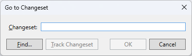
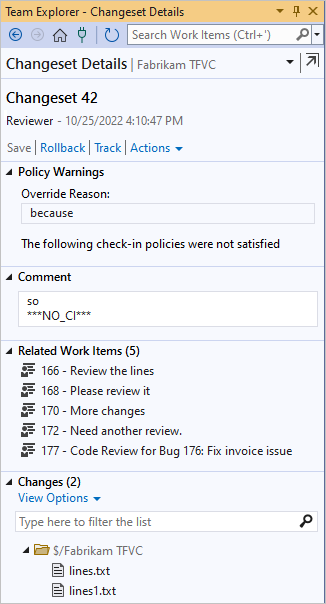
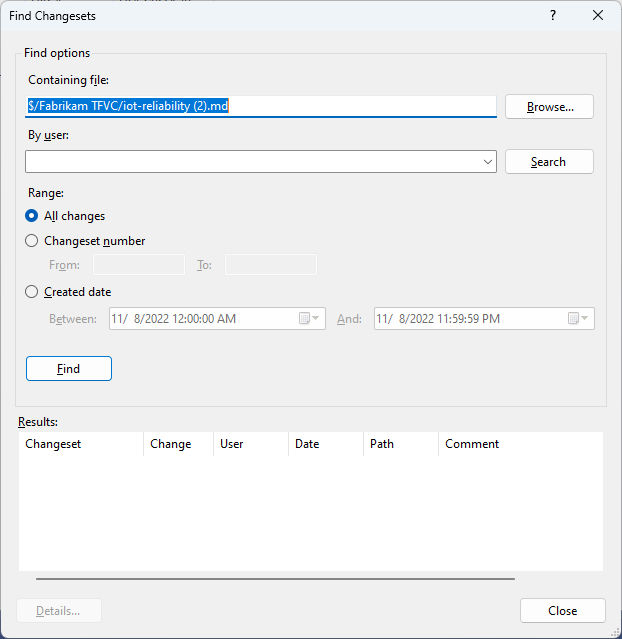
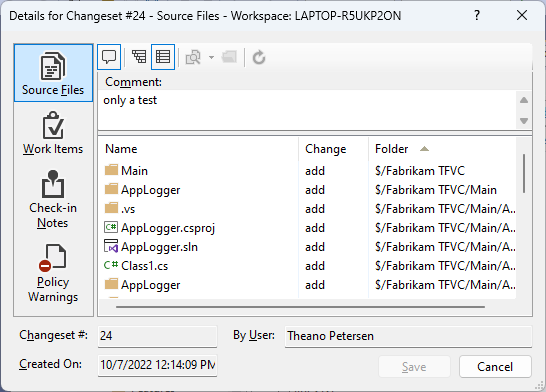

# Find and view changesets

[!INCLUDE [version-lt-eq-azure-devops](../../includes/version-lt-eq-azure-devops.md)]
[!INCLUDE [version-vs-gt-eq-2019](../../includes/version-vs-gt-eq-2019.md)]

When you [check in your changes](check-your-work-team-codebase.md) in Team Foundation Version Control (TFVC), they're stored on the server as a changeset. Changesets contain the history of each item in version control.

   

You can view a changeset to see what the exact file changes were, discover the owner's comments, find linked work items, and see if any policy warnings were triggered.

## Prerequisites

You must be one of the **Contributors** for your project. To learn more, see [Default TFVC permissions](../../organizations/security/default-tfvc-permissions.md).

## Find a changeset by ID

1. In Visual Studio [Source Control Explorer](use-source-control-explorer-manage-files-under-version-control.md), press Ctrl+G. The **Go to Changeset** dialog box appears.

   

1. Type the number of a changeset and select **OK**. The changeset details appear on the **Changeset Details** page in **Team Explorer**.

   If you don't know the changeset number, choose **Find**. See [Find a changeset](find-view-changesets.md#find).

## Find changesets that update a specific file or folder

1. In Visual Studio **Solution Explorer** or **Source Control Explorer**, right-click the folder or file and choose **View History**.

1. In the [History window](get-history-item.md), right-click the changeset for which you want to view details, and choose **Changeset Details**.

   The changeset details appear on the **Changeset Details** page in **Team Explorer**.

   

> [!TIP]
> - You can  undock the **Changeset Details** page from **Team Explorer** and open it in its own window.
> 
> - You can toggle between tree and list view by selecting **View Options** in the **Changes** section.

## Work with changesets

The **Changeset Details** page in **Team Explorer** has links to do the following tasks:

- **Rollback** removes the effects of the changeset. See [Roll back changesets](roll-back-changesets.md).

- **Track** determines which branches have and haven't received a set of changes. See [View where and when changesets have been merged](view-where-when-changesets-have-been-merged.md).

- **Request Review** under **Actions** requests a code review.

- **Open in Browser** under **Actions** opens the changeset in your browser. For example, you could copy the URL into an email to discuss the change with your team.

## Search for changesets

1. On the Visual Studio menu bar, choose **File** > **Source Control** > **Find** > **Find Changesets**.

   The **Find Changesets** dialog box appears.

   

1. In the **Find Changesets** dialog box, enter a file or folder name in **Containing file**, or:

   - Select **Browse** to find and select a file or folder.

   - In the **By user** box, optionally enter a user name or select **Search** to select a project team member who's associated with the changeset.

   - Under **Range**, optionally choose one of the following ranges:

     - **All changes** retrieves all changesets that were applied to that file or folder.

     - **Changeset number** retrieves changesets from a range of numbers. In the **From** and **To** boxes, type the range.

     - **Created date** retrieves changesets from a range of dates. In the **Between** and **And** boxes, specify start and end dates.

1. Select **Find**. Changesets that match your criteria appear in the **Results** list.

1. Select a changeset and then select **Details**, or right-click the changeset and select **Changeset Details**.

   The **Details for Changeset** dialog box appears.

   

   In the **Details for Changeset** dialog box, you can view the changes and change types, and any comments, work items, check-in notes, and policy warnings that are associated with the changeset.

1. Close the **Details for Changeset** and **Find Changesets** dialog boxes.

## Work from the command prompt

To find a changeset from the [command prompt](use-team-foundation-version-control-commands.md), enter `tf changeset`. For more information, see [Changeset command](changeset-command.md).

## Next steps

- To download the version of a file in a changeset, see [Download (get) files from the server](download-get-files-from-server.md).

- To add a link between a changeset and one or more work items, see [Use links to view dependencies and track related work](../../boards/queries/link-work-items-support-traceability.md).
