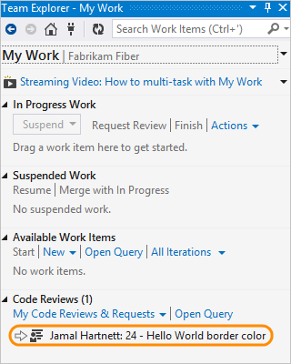

# Get your code reviewed with Visual Studio

#### Azure Repos | TFS 2018 | TFS 2017 | TFS 2015 | VS 2017 | VS 2015 | VS 2013

Before you check in your code, you can use Visual Studio to ask someone else from your team to review it. Your request will show up in his team explorer, in the my work page.

To ask for a code review, make sure you have [shared your code in TFVC](share-your-code-in-tfvc-vs.md).

(Are you using Git to share your code? If so, then use a [pull request](../../repos/git/pull-requests.md).)

## Request a code review

Jamal has changed the border color in the Hello World app, and he asks Johnnie to review the change.

0. Before he checks in the change, Jamal goes to the my work page.

  

0. He requests a review.

 

0. He submits a request to Johnnie.

 

0. Jamal suspends his work on Hello World so that he can work on something else while he waits to hear back from Johnnie.

 

## Respond to the code review request

Johnnie will see the code review request in the team explorer, look at the changes, and give Jamal his feedback.

0. Johnnie opens the my work page.

 

0. He sees Jamal's code review request.

 

 You can get email alerts for code reviews, too. 
If you aren't getting them, you can sign up in the team explorer settings page.

 

0. Johnnie opens the code review request.

 

0. He accepts the review.

 

0. He opens the file that Jamal changed.

 

0. Johnnie sees that Jamal changed the color to #ddd. He selects the code in the difference window and adds a comment (Keyboard: Ctrl + Shift + K).

 

0. He suggests a different color instead and sends the comment to Jamal.

 

## Update the code based on the review feedback

0. When Jamal gets a response from Johnnie, he resumes the work on Hello World.

 

0. His changes are unshelved and the windows he had opened are restored, so he can incorporate the review feedback.

 

## Next steps

> [!div class="nextstepaction"]
> [Create your backlog](../../boards/backlogs/create-your-backlog.md)
