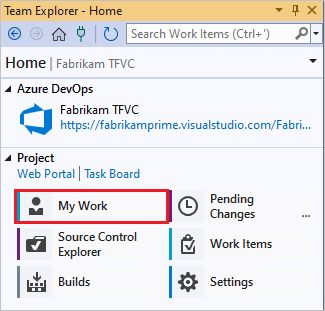
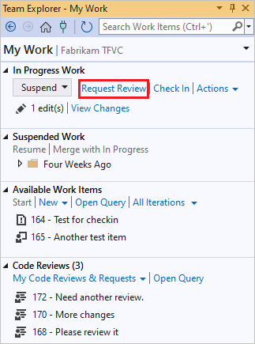
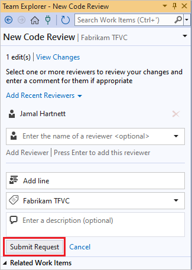
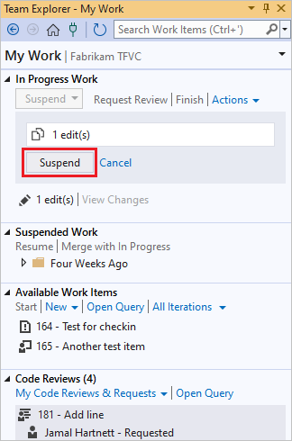
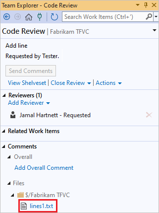
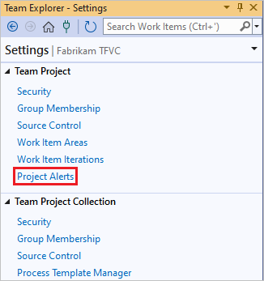
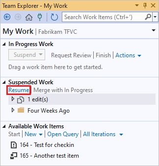

# TFVC code review in Visual Studio

[!INCLUDE [version-lt-eq-azure-devops](../../includes/version-lt-eq-azure-devops.md)]
[!INCLUDE [version-vs-gt-eq-2019](../../includes/version-vs-gt-eq-2019.md)]

You can use Visual Studio to request code reviews, respond to review requests, and suspend and resume work for Team Foundation Version Control (TFVC). 

If you're using Git source control instead of TFVC, use a [pull request](../../repos/git/pull-requests.md) for code reviews.

[!INCLUDE [temp](includes/note-my-work-code-review-support.md)]

## Prerequisites

Before you ask for a code review, make sure you've [shared your code in TFVC](share-your-code-in-tfvc-vs.md).

## Request a code review

Before you check in code, you can use Visual Studio to ask someone else from your team to review it. Your request appears in the recipient's **Team Explorer** window on the **My Work** page.

To request a code review, before you check in a change:

1. Go to the **My Work** page in **Team Explorer**.

    

1. On the **My Work** page, select **Request Review**.

   

1. On the **New Code Review** page, enter the reviewer name or names and a subject for the code review, and then select **Submit Request**.

   

1. You can suspend your work so you can work on something else while you wait to hear back from the code review. On the **My Work** page of **Team Explorer**, select **Suspend** in the **In Progress Work** section, optionally enter a different name for the suspended work, and then select **Suspend**.

   

## Respond to the code review request

Requested reviewers see the code review request in **Team Explorer**, look at the changes, and give their feedback. To respond to a review request:

1. On the **My Work** page of **Team Explorer**, locate the review request.

   

1. To open the code review, double-click the request, or right-click it and select **Open**.

1. From the **Code Review** page, you can select the changed files to review the differences.

   

1. To add comments, in the difference window, select the code to comment on, right-click, and select **Add comment**. You can also press Ctrl+Shift+K.

   

1. Select **Send Comments** to send the comments.

You can get email alerts for code reviews, too. To sign up, select **Project Alerts** under **Team Project** on the **Settings** page in **Team Explorer**.

## Update the code based on the review feedback

When you get the code review results, you can resume work on the project.

1. On the **My Work** page in **Team Explorer**, select **Resume** under **Suspended Work**.

   

   Your changes are unshelved and the windows you had opened are restored, so you can incorporate the review feedback.

1. On the **Code Review** page, you can close the review by selecting **Close Review** and then selecting **Complete** if the review is finished, or **Abandon** if you don't plan to finish it.

## Next steps

- [Create your backlog](../../boards/backlogs/create-your-backlog.md)
